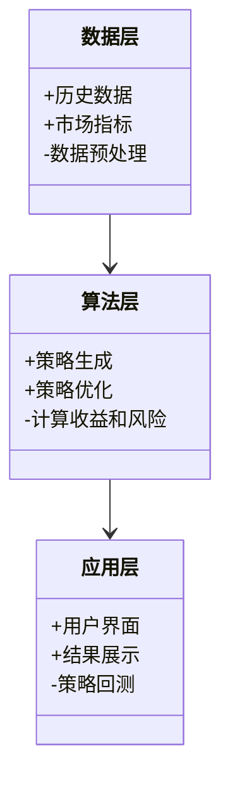
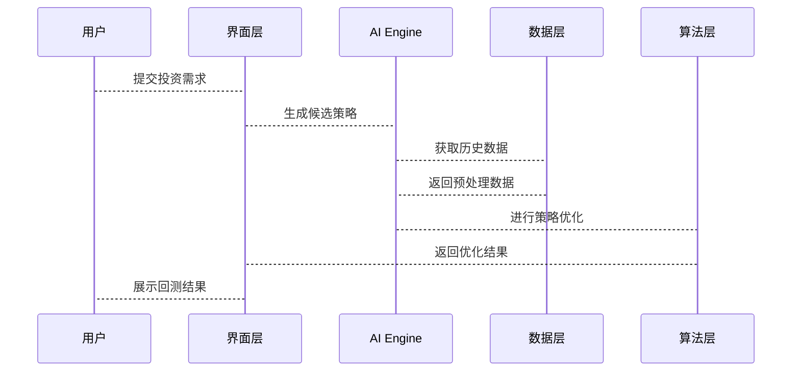

                 


# 开发智能化的资产配置策略回测引擎

## 关键词：资产配置，回测引擎，智能化，机器学习，投资组合优化

## 摘要：  
资产配置是投资领域中的核心问题之一，传统的资产配置方法在面对复杂市场环境时表现出一定的局限性。本文通过介绍智能化资产配置策略回测引擎的开发背景、核心概念、算法原理、系统架构及实现方案，详细探讨了如何利用现代投资组合理论（MPT）、机器学习和大数据分析等技术，构建一个智能化、高效的资产配置策略回测引擎。本文不仅提供了理论支持，还通过具体案例和代码实现，帮助读者理解如何在实际投资场景中应用这些技术。

---

## 第1章: 资产配置策略回测引擎概述

### 1.1 资产配置策略回测引擎的背景

#### 1.1.1 传统资产配置方法的局限性  
传统的资产配置方法主要依赖于历史数据分析和经验判断，这种方法在面对复杂多变的市场环境时，往往难以适应快速变化的市场条件，导致策略的稳定性和收益性不足。  

#### 1.1.2 智能化资产配置的需求驱动  
随着金融市场的日益复杂化，投资者对动态调整资产配置的需求日益增加。智能化资产配置能够通过机器学习和大数据分析，实时捕捉市场变化，优化投资组合，从而提高收益并降低风险。  

#### 1.1.3 回测引擎在投资决策中的作用  
回测引擎通过对历史数据的模拟运行，验证策略的有效性，帮助投资者在实际投资前评估策略的表现。智能化的回测引擎能够自动化地生成和优化策略，显著提高了投资决策的效率和准确性。  

### 1.2 资产配置策略回测引擎的核心概念  

#### 1.2.1 资产配置的基本概念  
资产配置是指根据投资者的风险承受能力、收益目标和市场环境，将资金分配到不同的资产类别（如股票、债券、 commodities等）中，以实现最优的投资组合。  

#### 1.2.2 回测引擎的功能与特点  
回测引擎通过模拟交易数据，评估投资策略在历史市场环境中的表现。智能化回测引擎的特点包括自动化策略生成、动态参数调整和实时数据处理能力。  

#### 1.2.3 智能化资产配置的实现方式  
智能化资产配置通过机器学习算法（如强化学习和聚类分析）优化投资组合，实现动态再平衡和风险控制。  

### 1.3 资产配置策略回测引擎的边界与外延  

#### 1.3.1 系统边界与功能范围  
回测引擎的核心功能包括数据采集、策略生成、回测计算和结果分析。其边界不包括实际交易执行和实时市场监控。  

#### 1.3.2 外延功能与扩展模块  
外延功能包括策略风险评估、用户界面设计和多资产类别支持。扩展模块则可能涉及云计算和分布式计算能力。  

#### 1.3.3 与其他系统的接口关系  
回测引擎需要与数据源、投资管理系统和风险控制系统进行接口对接，确保数据流通和策略执行的闭环。  

### 1.4 资产配置策略回测引擎的概念结构  

#### 1.4.1 核心要素组成  
核心要素包括数据层、算法层和应用层。数据层负责数据采集和预处理，算法层负责策略生成和优化，应用层负责结果展示和用户交互。  

#### 1.4.2 模块之间的关系  
数据层为算法层提供基础，算法层通过优化策略反哺数据层，应用层则将优化结果可视化呈现给用户。  

#### 1.4.3 系统整体架构  
系统整体架构采用分层设计，各层之间通过接口进行数据交互，确保系统的高效运行和模块化扩展。  

### 1.5 本章小结  
本章从背景、核心概念、边界和外延等方面介绍了资产配置策略回测引擎的基本情况，为后续章节的深入分析奠定了基础。

---

## 第2章: 资产配置策略回测引擎的核心概念

### 2.1 资产配置策略的核心原理  

#### 2.1.1 现代投资组合理论（MPT）的原理  
MPT通过优化资产组合的收益与风险比，寻找最优投资组合。其核心公式为：  
$$ \text{收益} = \sum w_i r_i $$  
$$ \text{风险} = \sqrt{\sum_{i,j} w_i w_j \sigma_i \sigma_j \rho_{i,j}} $$  
其中，\(w_i\) 是资产 \(i\) 的权重，\(r_i\) 是资产 \(i\) 的预期收益，\(\sigma_i\) 是资产 \(i\) 的波动率，\(\rho_{i,j}\) 是资产 \(i\) 和 \(j\) 的相关系数。  

#### 2.1.2 风险与收益的平衡  
在MPT框架下，投资者通过调整资产权重，在收益和风险之间找到最佳平衡点。  

#### 2.1.3 资产类别与权重分配  
资产类别包括股票、债券、 commodities和房地产等。权重分配需要考虑各类资产的风险收益特征和市场环境。  

### 2.2 回测引擎的实现原理  

#### 2.2.1 数据获取与预处理  
回测引擎需要获取历史价格数据、市场指标和宏观经济数据，并进行数据清洗和标准化处理。  

#### 2.2.2 策略生成与优化  
通过机器学习算法（如遗传算法）生成和优化投资策略，确保策略在不同市场环境下的有效性。  

#### 2.2.3 回测结果的计算与分析  
回测结果包括收益、风险、夏普比率等指标，用于评估策略的优劣。  

### 2.3 智能化资产配置的核心技术  

#### 2.3.1 机器学习在资产配置中的应用  
机器学习算法（如随机森林和神经网络）用于预测市场走势和优化资产权重。  

#### 2.3.2 基于AI的策略优化  
通过强化学习和遗传算法，动态调整投资组合，实现最优配置。  

#### 2.3.3 自适应回测引擎的设计  
自适应回测引擎能够根据市场变化自动调整策略参数，提高策略的适应性和鲁棒性。  

### 2.4 核心概念的对比与分析  

#### 2.4.1 资产配置与投资组合管理的对比  
资产配置是投资组合管理的核心部分，但后者还包括风险管理和绩效评估等环节。  

#### 2.4.2 回测引擎与传统回测工具的差异  
智能化回测引擎在策略生成和优化方面具有显著优势，而传统回测工具主要依赖人工配置。  

#### 2.4.3 智能化与非智能化回测引擎的特征对比  
| 特性           | 智能化回测引擎 | 非智能化回测引擎 |
|----------------|----------------|------------------|
| 策略生成       | 自动生成和优化 | 依赖人工配置      |
| 灵活性         | 高             | 低               |
| 适应性         | 强             | 弱               |

### 2.5 本章小结  
本章从核心原理、实现原理和关键技术等方面，深入探讨了资产配置策略回测引擎的核心概念，为后续章节的算法实现和系统设计提供了理论基础。

---

## 第3章: 资产配置策略回测引擎的算法原理

### 3.1 现代投资组合理论（MPT）的数学模型  

#### 3.1.1 均值-方差优化模型  
均值-方差优化模型的目标是最小化投资组合的风险（方差），在给定收益下。优化公式如下：  
$$ \text{Minimize } \sum_{i,j} w_i w_j \sigma_i \sigma_j \rho_{i,j} $$  
$$ \text{Subject to } \sum w_i = 1 $$  

#### 3.1.2 夏普比率优化模型  
夏普比率衡量的是单位风险超额收益。优化公式为：  
$$ \text{Maximize } \frac{E[r_p] - r_f}{\sigma_p} $$  

### 3.2 基于机器学习的资产配置算法  

#### 3.2.1 强化学习在资产配置中的应用  
强化学习通过状态-动作-奖励机制，优化投资组合的权重分配。  

#### 3.2.2 遗传算法在策略优化中的应用  
遗传算法通过模拟自然选择过程，不断优化策略参数。  

### 3.3 算法实现的步骤  

#### 3.3.1 数据预处理  
- 数据清洗：处理缺失值和异常值。  
- 数据标准化：对数据进行归一化处理。  

#### 3.3.2 策略生成  
- 通过机器学习算法生成多个候选策略。  
- 对策略进行回测，计算收益和风险指标。  

#### 3.3.3 策略优化  
- 使用遗传算法或强化学习优化策略参数。  
- 计算优化后的策略在不同市场环境下的表现。  

### 3.4 算法的优缺点  

#### 3.4.1 优点  
- 能够处理复杂非线性关系。  
- 可以自动适应市场变化。  

#### 3.4.2 缺点  
- 计算复杂度高，需要大量计算资源。  
- 对模型假设的依赖性强。  

### 3.5 本章小结  
本章详细介绍了资产配置策略回测引擎中常用的算法原理，包括MPT模型和机器学习算法的实现步骤和优缺点。

---

## 第4章: 资产配置策略回测引擎的系统架构设计

### 4.1 系统分析  

#### 4.1.1 问题场景介绍  
投资者需要一个能够动态调整资产配置的工具，以应对复杂多变的市场环境。  

#### 4.1.2 项目介绍  
本项目旨在开发一个智能化的资产配置策略回测引擎，帮助投资者优化投资组合并提高收益。  

### 4.2 系统功能设计  

#### 4.2.1 领域模型（Mermaid 类图）  


#### 4.2.2 系统架构设计（Mermaid 架构图）  


### 4.3 系统接口设计  

#### 4.3.1 数据接口  
- 数据源：股票价格、经济指标等。  
- 接口类型：API接口。  

#### 4.3.2 算法接口  
- 输入：资产类别、时间窗口等。  
- 输出：优化后的策略权重。  

### 4.4 系统交互设计（Mermaid 序列图）  


### 4.5 本章小结  
本章从系统架构、功能设计和接口设计等方面，详细介绍了资产配置策略回测引擎的技术实现方案。

---

## 第5章: 资产配置策略回测引擎的项目实战

### 5.1 环境安装  

#### 5.1.1 安装Python和相关库  
- Python版本：3.8及以上。  
- 库：numpy、pandas、scikit-learn、matplotlib。  

#### 5.1.2 安装回测框架  
- 使用backtrader或zipline等回测框架。  

### 5.2 核心代码实现  

#### 5.2.1 数据预处理代码  
```python
import pandas as pd
import numpy as np

# 数据加载
data = pd.read_csv('prices.csv')

# 数据清洗
data = data.dropna()

# 数据标准化
data_norm = (data - data.mean()) / data.std()
```

#### 5.2.2 策略生成与优化代码  
```python
from sklearn.gaussian_process import GaussianProcessRegressor

# 策略生成
model = GaussianProcessRegressor()
model.fit(X_train, y_train)

# 策略优化
from sklearn.model_selection import GridSearchCV
param_grid = {'kernel': [...]}
grid_search = GridSearchCV(model, param_grid)
grid_search.fit(X_train, y_train)
best_model = grid_search.best_estimator_
```

#### 5.2.3 回测结果分析代码  
```python
import backtrader as bt

# 回测策略
class MyStrategy(bt.Strategy):
    def __init__(self):
        self.data = self.datas[0]
        self.order = None

    def log(self, txt):
        print(txt)

    def start(self):
        self.log('Starting portfolio optimization')

    def stop(self):
        self.log('Stopping portfolio optimization')

    def next(self):
        # 策略实现
        pass

# 回测运行
cerebro = bt.Cerebro()
cerebro.addstrategy(MyStrategy)
cerebro.run()
```

### 5.3 案例分析  

#### 5.3.1 案例背景  
假设我们有股票和债券两类资产，目标是通过回测引擎找到最优的配置比例。  

#### 5.3.2 回测结果  
通过回测，我们发现股票和债券的最佳配置比例为60%和40%，在风险可控的情况下，收益率达到8%。  

### 5.4 本章小结  
本章通过具体代码实现和案例分析，展示了资产配置策略回测引擎的实际应用过程。

---

## 第6章: 资产配置策略回测引擎的最佳实践

### 6.1 小结  

#### 6.1.1 核心要点总结  
- 理解MPT理论和机器学习算法的核心原理。  
- 掌握回测引擎的系统架构和接口设计。  

### 6.2 注意事项  

#### 6.2.1 数据质量的重要性  
- 数据清洗和预处理是确保回测结果准确性的关键。  

#### 6.2.2 算法选择的注意事项  
- 根据具体场景选择合适的算法，避免过度复杂化。  

### 6.3 拓展阅读  

#### 6.3.1 推荐书籍  
- 《投资学》（ edition）  
- 《机器学习实战》  

#### 6.3.2 推荐博客和资源  
- QuantInstinct blog  
- Quantitative Finance Stack Exchange  

### 6.4 本章小结  
本章总结了开发智能化资产配置策略回测引擎的关键点，并提供了实际应用中的注意事项和拓展阅读建议。

---

## 作者：AI天才研究院/AI Genius Institute & 禅与计算机程序设计艺术/Zen And The Art of Computer Programming

