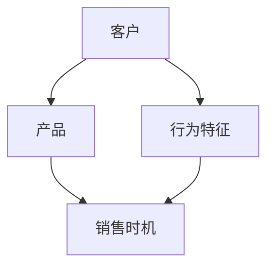
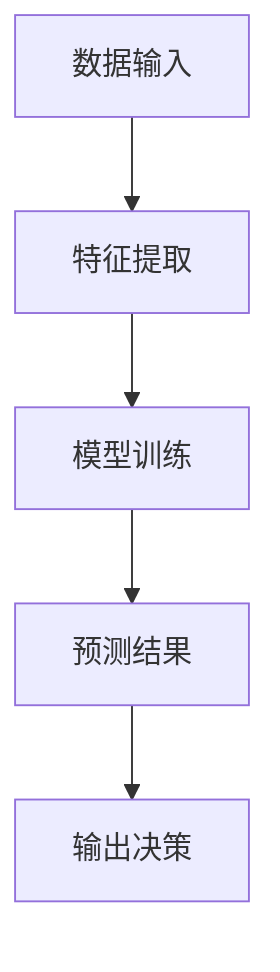
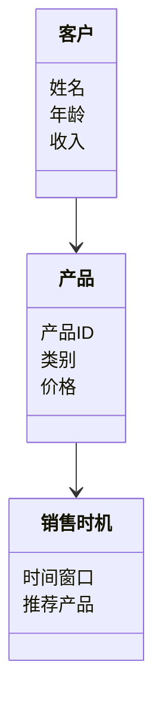
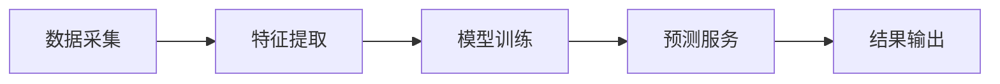
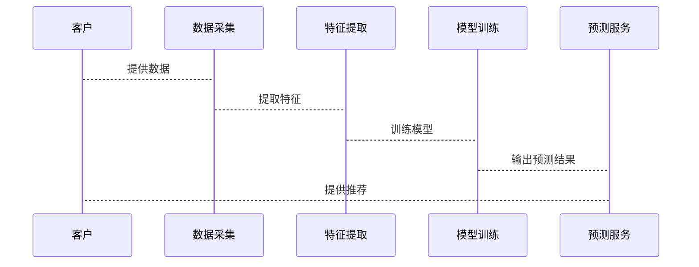

                 


# 开发智能化的金融产品交叉销售时机预测引擎

## 关键词：人工智能、金融销售、时机预测、机器学习、深度学习

## 摘要：  
本文详细探讨了开发智能化金融产品交叉销售时机预测引擎的核心概念、算法原理、系统架构及实战应用。通过分析交叉销售的背景与重要性，结合机器学习和深度学习技术，构建了预测模型，并通过Mermaid图和Python代码展示了系统的实现过程。文章还总结了最佳实践和未来发展建议，为金融机构优化销售策略提供了理论与实践指导。

---

# 第一部分: 开发智能化的金融产品交叉销售时机预测引擎背景介绍

## 第1章: 金融产品交叉销售时机预测引擎的背景与问题描述

### 1.1 金融产品交叉销售的定义与重要性

#### 1.1.1 金融产品交叉销售的定义  
金融产品交叉销售是指在同一客户购买多个金融产品时，通过合理的产品组合，提升客户满意度和金融机构收入的过程。例如，银行在为客户办理贷款时，可能会推荐信用卡或保险产品。

#### 1.1.2 交叉销售在金融业务中的重要性  
交叉销售能够帮助金融机构提高客户忠诚度，降低获客成本，同时增加单个客户的收入贡献。通过交叉销售，金融机构可以优化资源分配，提升整体业务效率。

#### 1.1.3 交叉销售对金融机构的价值  
通过交叉销售，金融机构能够实现客户生命周期管理，增强客户黏性，同时挖掘潜在客户的需求，从而在竞争激烈的市场中获得优势。

### 1.2 时机预测的核心问题

#### 1.2.1 交叉销售时机预测的定义  
时机预测是指在合适的时机向客户推荐合适的产品，从而提高销售的成功率和客户满意度。

#### 1.2.2 时机预测在交叉销售中的关键作用  
时机预测能够帮助金融机构在客户最可能接受推荐的时间点进行销售，减少客户流失，提高销售转化率。

#### 1.2.3 时机预测面临的挑战与难点  
数据质量、模型选择、实时性要求高是时机预测的主要挑战。此外，客户行为的复杂性和不确定性也增加了预测的难度。

### 1.3 智能化预测引擎的必要性

#### 1.3.1 传统交叉销售的局限性  
传统交叉销售依赖人工经验，难以大规模应用，且效率较低。

#### 1.3.2 智能化预测引擎的优势  
智能化预测引擎能够通过机器学习和大数据分析，实时预测最佳销售时机，显著提高销售效率和客户满意度。

#### 1.3.3 人工智能在金融销售中的应用前景  
人工智能技术的快速发展为金融产品的交叉销售提供了新的可能性，未来将成为金融机构的重要工具。

### 1.4 本章小结  
本章介绍了金融产品交叉销售的定义、重要性以及时机预测的核心问题，强调了智能化预测引擎的必要性和优势。

---

# 第二部分: 智能化金融产品交叉销售时机预测引擎的核心概念与联系

## 第2章: 智能化预测引擎的核心概念与联系

### 2.1 引擎的核心概念

#### 2.1.1 数据特征提取  
数据特征是预测模型的基础，包括客户的基本信息、行为特征、交易记录等。例如，客户年龄、收入水平、购买历史等数据。

#### 2.1.2 模型算法选择  
模型算法是预测引擎的核心，常用算法包括逻辑回归、随机森林、神经网络等。选择合适的算法能够提高预测的准确性和效率。

#### 2.1.3 业务规则与策略  
业务规则与策略是根据金融机构的业务需求制定的，例如推荐的产品类型、销售时机窗口等。这些规则能够帮助模型更好地适应实际业务场景。

### 2.2 核心概念的属性对比

#### 2.2.1 数据特征与模型算法的对比分析  
数据特征影响模型的输入，而模型算法决定了预测的准确性。例如，使用决策树模型时，特征选择会影响树的深度和准确性。

#### 2.2.2 业务规则与预测结果的关系  
业务规则指导模型输出的结果是否符合实际业务需求，例如在特定时间窗口内推荐特定产品类型。

### 2.3 ER实体关系图架构



### 2.4 本章小结  
本章详细分析了智能化预测引擎的核心概念，包括数据特征、模型算法和业务规则，并通过ER实体关系图展示了各概念之间的联系。

---

# 第三部分: 智能化预测引擎的算法原理与数学模型

## 第3章: 算法原理与数学模型

### 3.1 算法原理

#### 3.1.1 基于机器学习的特征工程  
特征工程是提高模型性能的关键步骤，包括数据清洗、特征选择和特征变换。例如，使用主成分分析（PCA）进行降维。

#### 3.1.2 深度学习模型的应用  
深度学习模型，如LSTM和GRU，能够捕捉时间序列数据中的复杂模式，适用于销售时机的预测。

#### 3.1.3 模型调优与优化  
模型调优包括参数优化、模型集成等方法，能够显著提高预测的准确性和稳定性。

### 3.2 算法流程图



### 3.3 数学模型

#### 3.3.1 逻辑回归模型  
逻辑回归是一种常用的分类模型，适用于二分类问题。其数学公式为：
$$ P(y=1|x) = \frac{e^{\beta x}}{1 + e^{\beta x}} $$

#### 3.3.2 随机森林模型  
随机森林是一种基于决策树的集成模型，能够处理高维数据。其数学模型如下：
$$ y = \sum_{i=1}^{n} \text{Tree}_i(x) $$

### 3.4 本章小结  
本章详细讲解了智能化预测引擎的算法原理，包括特征工程、模型选择和调优，并通过数学公式和流程图展示了模型的实现过程。

---

# 第四部分: 智能化预测引擎的系统分析与架构设计

## 第4章: 系统分析与架构设计方案

### 4.1 问题场景介绍  
本节描述了金融机构在交叉销售中面临的挑战，例如数据孤岛、实时性要求高等。

### 4.2 项目介绍  
本节介绍了开发智能化预测引擎的项目目标、范围和关键里程碑。

### 4.3 系统功能设计

#### 4.3.1 领域模型设计  
领域模型包括客户、产品、销售时机等核心实体。类图如下：



#### 4.3.2 系统架构设计  
系统架构采用微服务架构，包括数据采集、特征提取、模型训练、预测服务等模块。架构图如下：



### 4.4 接口设计与交互流程  
接口设计包括数据接口、模型接口和结果接口。交互流程如下：



### 4.5 本章小结  
本章通过系统分析与架构设计，明确了智能化预测引擎的实现方式和系统结构。

---

# 第五部分: 智能化预测引擎的项目实战

## 第5章: 项目实战

### 5.1 环境搭建  
本节详细介绍了开发环境的搭建，包括Python版本、库的安装等。

### 5.2 核心实现

#### 5.2.1 数据预处理  
数据预处理包括数据清洗、特征工程等步骤。代码示例如下：
```python
import pandas as pd
data = pd.read_csv('data.csv')
# 数据清洗
data.dropna(inplace=True)
# 特征工程
from sklearn.preprocessing import StandardScaler
scaler = StandardScaler()
data_scaled = scaler.fit_transform(data)
```

#### 5.2.2 模型训练  
模型训练使用随机森林算法。代码示例如下：
```python
from sklearn.ensemble import RandomForestClassifier
model = RandomForestClassifier(n_estimators=100)
model.fit(X_train, y_train)
```

#### 5.2.3 模型部署  
模型部署通过Flask框架实现API接口。代码示例如下：
```python
from flask import Flask
app = Flask(__name__)
@app.route('/predict', methods=['POST'])
def predict():
    # 获取输入数据
    data = request.json
    # 进行预测
    result = model.predict(data)
    return jsonify(result.tolist())
```

### 5.3 案例分析与结果解读  
通过实际案例分析，展示了模型的预测效果和业务价值。

### 5.4 本章小结  
本章通过实战项目，详细讲解了智能化预测引擎的开发过程，包括环境搭建、数据处理、模型训练和部署。

---

# 第六部分: 总结与展望

## 第6章: 总结与展望

### 6.1 最佳实践 tips  
- 数据质量是模型性能的基础，需高度重视数据清洗和特征工程。
- 模型调优和实时性优化是提升预测效果的关键。

### 6.2 小结  
本文详细讲解了智能化金融产品交叉销售时机预测引擎的开发过程，从背景分析到系统实现，为金融机构提供了理论与实践指导。

### 6.3 注意事项  
- 数据隐私和安全是开发过程中需重点关注的问题。
- 模型的实时性和可解释性是未来优化的方向。

### 6.4 拓展阅读  
推荐相关书籍和论文，帮助读者深入理解人工智能和金融销售的结合应用。

### 6.5 本章小结  
本章总结了全文内容，并展望了未来的发展方向。

---

# 作者：AI天才研究院 & 禅与计算机程序设计艺术

