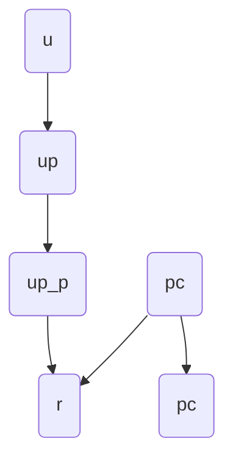

                 


# 开发智能化的金融产品推荐个性化引擎

## 关键词
金融推荐引擎、人工智能、协同过滤、个性化推荐、深度学习

## 摘要
随着金融市场的日益复杂化和客户需求的多样化，传统的金融产品推荐方法已经难以满足现代投资者的需求。本文将探讨如何利用人工智能技术，开发一个智能化的金融产品推荐个性化引擎。通过分析用户行为、产品特征和市场动态，结合先进的推荐算法，我们能够构建一个高效、精准的推荐系统，为投资者提供量身定制的金融产品建议。本文将详细讲解推荐引擎的核心概念、算法原理、系统架构以及实际项目中的实现细节，为开发者提供全面的指导。

---

# 第一部分: 金融产品推荐个性化引擎背景与核心概念

## 第1章: 问题背景与需求分析

### 1.1 问题背景

#### 1.1.1 传统金融产品推荐的局限性
传统的金融产品推荐方法主要依赖于人工经验和简单的规则匹配。这种方法在面对海量金融产品和多样化的客户需求时，表现出以下局限性：
- **信息孤岛**：难以整合多源数据，推荐结果片面。
- **推荐单一性**：无法根据用户行为和市场变化动态调整推荐策略。
- **效率低下**：人工推荐耗时长，难以满足大规模用户的实时需求。

#### 1.1.2 数据驱动的推荐系统兴起
随着大数据技术的发展和人工智能的普及，基于数据驱动的推荐系统逐渐成为主流。这些系统能够利用用户行为数据、产品特征数据和市场数据，通过机器学习算法生成个性化推荐，显著提高了推荐的准确性和效率。

#### 1.1.3 个性化推荐在金融领域的必要性
金融领域对个性化推荐的需求尤为强烈。投资者的财务目标、风险偏好和投资周期各不相同，传统的“一刀切”推荐方式难以满足个体需求。通过智能化推荐引擎，可以根据用户的实时需求和市场变化，提供精准的金融产品建议，从而提升用户体验和投资效率。

### 1.2 问题描述

#### 1.2.1 用户需求的多样性
用户需求的多样性主要体现在以下几个方面：
- **财务目标多样性**：不同用户有不同的财务目标，如资产保值、风险投资、长期理财等。
- **风险偏好多样性**：用户对风险的承受能力差异较大，从保守型到激进型不等。
- **投资周期多样性**：用户的投资周期从短期到长期不等，影响推荐产品的选择。

#### 1.2.2 产品属性的复杂性
金融产品的属性复杂，包括但不限于：
- **产品类型**：股票、基金、债券、保险等。
- **风险等级**：低风险、中风险、高风险。
- **收益预期**：固定收益或浮动收益。
- **市场流动性**：产品的流动性影响其变现能力。

#### 1.2.3 市场环境的动态变化
金融市场是一个动态变化的环境，市场波动、政策变化、经济周期等因素都会影响金融产品的推荐策略。传统的静态推荐方法无法适应这种动态变化。

### 1.3 问题解决

#### 1.3.1 数据驱动的解决方案
通过收集和分析用户行为数据、产品数据和市场数据，利用机器学习算法构建推荐模型，实现动态、个性化的推荐。

#### 1.3.2 人工智能技术的应用
人工智能技术（如深度学习、自然语言处理等）在金融推荐系统中的应用，能够提升推荐的准确性和智能化水平。

### 1.4 边界与外延

#### 1.4.1 系统边界
金融推荐引擎的边界包括：
- **输入数据**：用户信息、产品信息、市场信息。
- **输出结果**：个性化推荐列表。
- **内部逻辑**：数据处理、特征提取、模型训练、推荐生成。

#### 1.4.2 核心要素
- **用户画像**：基于用户行为和属性构建的用户特征模型。
- **产品特征**：金融产品的属性和风险收益特征。
- **推荐算法**：用于生成推荐的核心算法。

---

## 第2章: 核心概念与联系

### 2.1 核心概念原理

#### 2.1.1 用户画像
用户画像是基于用户行为数据和属性数据构建的用户特征模型。它包括：
- **用户基本信息**：年龄、性别、职业等。
- **投资行为数据**：历史投资记录、交易频率、收益偏好等。
- **市场行为数据**：市场波动下的投资决策、风险承受能力等。

#### 2.1.2 产品特征
产品特征是金融产品的属性描述，包括：
- **产品类型**：股票、基金、债券等。
- **风险等级**：低风险、中风险、高风险。
- **收益预期**：年化收益、历史收益等。
- **市场流动性**：产品的交易活跃度。

#### 2.1.3 推荐算法
推荐算法是金融推荐引擎的核心，主要包括：
- **协同过滤**：基于用户相似性或产品相似性进行推荐。
- **基于内容的推荐**：基于产品特征和用户偏好进行推荐。
- **混合推荐模型**：结合协同过滤和内容推荐的优势。

### 2.2 概念属性对比表

#### 2.2.1 用户画像与产品特征对比

| 特性       | 用户画像                           | 产品特征                           |
|------------|------------------------------------|------------------------------------|
| 数据来源   | 用户行为数据、用户属性数据          | 产品属性数据、市场数据             |
| 数据类型   | 结构化数据（如年龄、职业）和非结构化数据（如投资记录） | 结构化数据（如产品类型、风险等级） |
| 处理目标   | 描述用户行为和偏好                 | 描述产品属性和市场特征             |
| 应用场景   | 用户分群、个性化推荐                | 产品分类、推荐策略生成             |

#### 2.2.2 推荐算法的分类与特点

| 算法类型     | 协同过滤         | 基于内容的推荐   | 混合推荐模型     |
|--------------|------------------|------------------|----------------|
| 核心原理     | 用户相似性或产品相似性 | 产品特征与用户偏好的匹配度 | 结合协同过滤和内容推荐的优势 |
| 优点         | 高准确性         | 高可解释性       | 综合性强       |
| 缺点         | 计算复杂度高      | 需要高质量的产品特征 | 实现复杂        |

### 2.3 ER实体关系图



---

## 第3章: 算法原理与实现

### 3.1 协同过滤算法

#### 3.1.1 基于用户的协同过滤
基于用户的协同过滤算法通过寻找与目标用户行为相似的其他用户，推荐这些用户喜欢的产品。其步骤如下：
1. **计算用户相似度**：使用余弦相似度或皮尔逊相似度计算用户之间的相似度。
2. **生成推荐列表**：根据相似用户的评分或行为，加权生成推荐列表。

#### 3.1.2 基于物品的协同过滤
基于物品的协同过滤算法通过寻找与目标产品相似的其他产品，推荐给目标用户。其步骤如下：
1. **计算产品相似度**：基于产品特征或用户评分计算产品之间的相似度。
2. **生成推荐列表**：根据相似产品的评分或行为，加权生成推荐列表。

#### 3.1.3 混合推荐模型
混合推荐模型结合了基于用户的协同过滤和基于物品的协同过滤的优点，通过集成学习的方法生成最终推荐列表。

#### 3.1.4 代码实现

```python
def user_based_recommendation(user_id, similarity_matrix):
    # 获取与目标用户相似的用户
    similar_users = similarity_matrix[user_id]
    # 计算推荐分数
    recommendation_scores = {}
    for user in similar_users:
        for product in similar_users[user]:
            recommendation_scores[product] += similar_users[user][product]
    return recommendation_scores
```

---

通过以上分析，我们已经详细介绍了金融产品推荐个性化引擎的核心概念、算法原理和系统架构。接下来我们将继续探讨系统的实现细节和实际应用案例。

