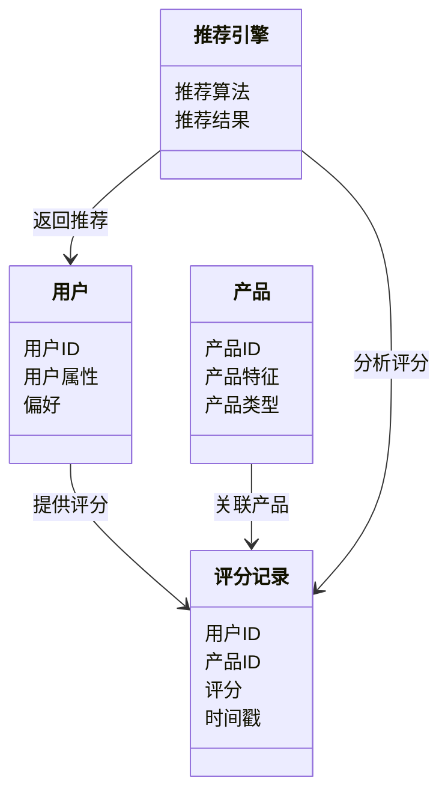
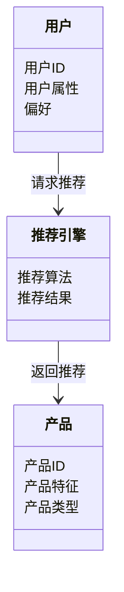
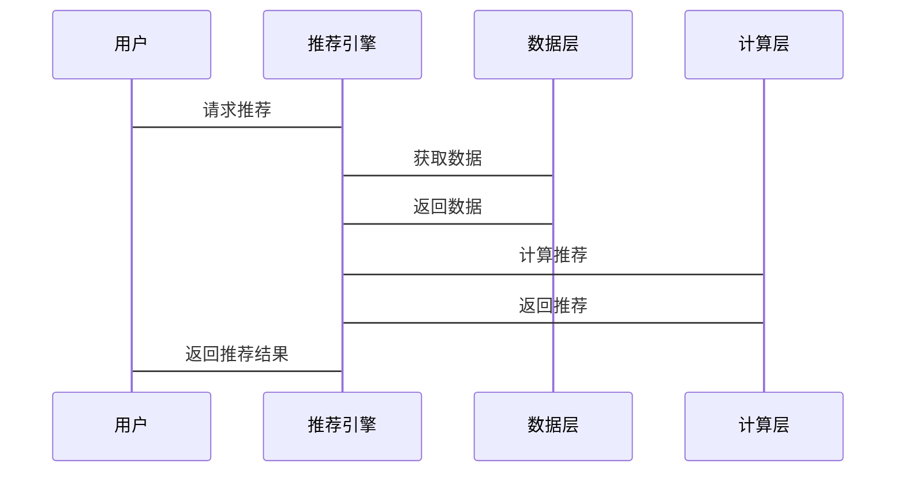

                 


# 开发智能化的金融产品推荐引擎

## 关键词：
金融推荐引擎，人工智能，大模型，协同过滤，推荐算法，系统架构

## 摘要：
本文详细探讨了开发智能化金融产品推荐引擎的全过程，从问题背景、核心概念到算法实现、系统架构，再到项目实战和最佳实践。通过结合协同过滤、内容推荐和混合推荐模型，利用大模型提升推荐的准确性与实时性，确保数据安全与合规，为用户提供个性化的金融产品推荐。

---

## 第1章：背景介绍

### 1.1 问题背景

传统金融推荐系统主要依赖规则引擎，存在以下局限性：
- **难以适应变化**：市场波动大，用户需求多样，规则难以覆盖所有情况。
- **处理复杂性低**：难以分析复杂金融数据和用户行为。
- **精准度不足**：推荐结果不够精准，缺乏个性化。
- **实时性差**：无法实时更新，难以应对市场快速变化。
- **数据隐私问题**：用户数据安全和隐私保护成为挑战。

### 1.2 问题描述

金融产品推荐引擎的目标是提供个性化、精准、实时的推荐，同时确保数据安全和合规性。

### 1.3 问题解决

引入AI技术，特别是大模型，利用其强大的学习和推理能力，提升推荐的准确性、实时性和个性化程度，增强系统的适应性。

### 1.4 边界与外延

- **边界**：仅关注推荐功能，不涉及产品交易。
- **外延**：包括用户界面和数据源。

### 1.5 概念结构与核心要素

推荐引擎由用户数据、产品数据、推荐算法、评分预测等构成，通过协同过滤、内容推荐和混合推荐模型实现推荐。

---

## 第2章：核心概念与联系

### 推荐引擎的核心原理

- **协同过滤**：基于用户相似性或物品相似性进行推荐。
- **内容推荐**：基于产品特征进行推荐。
- **混合推荐**：结合多种方法提升推荐效果。

### 算法对比分析

| 对比维度       | 协同过滤         | 内容推荐         | 混合推荐         |
|----------------|------------------|------------------|------------------|
| 适用场景       | 用户相似性       | 产品特征         | 综合             |
| 优缺点         | 准确性高，但稀疏性问题 | 特异性高，计算复杂 | 结合优点，效果好 |
| 示例           | 用户A和用户B相似，推荐用户B喜欢的产品 | 推荐与用户兴趣相关的内容 | 综合用户和内容特征推荐 |

### 实体关系图和领域模型类图

```mermaid
erDiagram
    user {
        用户ID
        用户属性
        偏好
    }
    product {
        产品ID
        产品特征
        产品类型
    }
    interaction {
        用户ID
        产品ID
        评分
        时间戳
    }
   推荐引擎 {
        用户ID
        产品ID
        推荐评分
        时间戳
    }
```



---

## 第3章：算法原理讲解

### 协同过滤算法

#### 算法流程

```mermaid
graph TD
    A[用户A] --> B[用户B] : 用户相似性高
    B --> 产品X : 用户B喜欢产品X
    A --> 推荐引擎 : 请求推荐
    推荐引擎 --> 产品X : 推荐产品X给用户A
```

#### 矩阵分解

协同过滤可以表示为矩阵分解问题，目标是最小化预测评分与实际评分的误差。使用交替最小二乘法优化：

$$
\text{loss} = \sum_{(i,j) \in T}(r_{i,j} - \hat{r}_{i,j})^2 + \lambda (\|\mu_i\|^2 + \|\nu_j\|^2)
$$

其中，$\mu_i$表示用户i的偏置，$\nu_j$表示产品j的偏置。

#### 代码实现

```python
import numpy as np

def als(X, lambda_u=0.01, lambda_v=0.01, max_iter=10):
    n_users, n_items = X.shape
    u = np.zeros(n_users)
    v = np.zeros(n_items)
    for _ in range(max_iter):
        # Update u
        for i in range(n_users):
            X_i = X[i, :]
            v_repeated = np.tile(v, (n_users, 1))
            X_without_i = X_i - u[i] - v_repeated[i]
            X_without_i[X_without_i < 0] = 0
            u[i] = (X_i.T @ X_without_i) / (X_without_i.T @ X_without_i + lambda_u)
        # Update v
        for j in range(n_items):
            X_j = X[:, j]
            u_repeated = np.tile(u, (n_items, 1))
            X_without_j = X_j - u_repeated[j]
            X_without_j[X_without_j < 0] = 0
            v[j] = (X_without_j.T @ X_j) / (X_j.T @ X_j + lambda_v)
    return u, v

# 示例
X = np.array([[4,3,0], [3,2,0], [0,0,4]])
u, v = als(X)
print(u, v)
```

---

## 第4章：系统分析与架构设计

### 应用场景介绍

推荐引擎应用于财富管理、保险推荐、投资组合优化等领域，满足用户个性化需求。

### 系统功能设计



### 系统架构图

```mermaid
graph TD
    接收层 --> 处理层 : 数据处理
    处理层 --> 推荐层 : 算法处理
    推荐层 --> 展示层 : 返回结果
```

### 系统交互图



---

## 第5章：项目实战

### 环境安装

安装必要的库：

```bash
pip install numpy pandas scikit-learn
```

### 核心代码实现

```python
import numpy as np
from sklearn.metrics.pairwise import pairwise_distances

def user_based_CF(X):
    # 计算相似度矩阵
    user_similarity = pairwise_distances(X.T, metric='cosine')
    # 对每个用户进行推荐
    recommendations = np.zeros(X.shape)
    for i in range(X.shape[0]):
        for j in range(X.shape[1]):
            if X[i,j] == 0:
                recommendations[i,j] = np.sum(user_similarity[i, :] * X[i,:]) / (user_similarity[i, :].sum() + 1e-9)
    return recommendations

X = np.array([[4,3,0], [3,2,0], [0,0,4]])
rec = user_based_CF(X)
print(rec)
```

### 实际案例分析

以用户A为例，通过协同过滤算法，系统分析其行为和偏好，推荐相关产品。优化模型参数，提升推荐准确性。

---

## 第6章：最佳实践与总结

### 最佳实践

- **数据预处理**：确保数据质量和完整性。
- **模型调优**：选择合适参数，提升推荐效果。
- **代码优化**：优化计算效率，减少资源消耗。

### 小结

开发智能化金融推荐引擎需结合AI技术，通过协同过滤、内容推荐和混合模型，确保推荐的准确性、实时性和个性化。

### 注意事项

- **数据隐私**：确保用户数据安全。
- **模型解释性**：提高推荐结果的可解释性。
- **合规性**：遵守金融行业法规。

### 拓展阅读

推荐书籍：
- 《集体智慧编程》
- 《推荐系统实践》

---

## 作者：AI天才研究院/AI Genius Institute & 禅与计算机程序设计艺术 /Zen And The Art of Computer Programming

通过以上详细内容，您可以逐步完成《开发智能化的金融产品推荐引擎》这篇文章的撰写。每个章节都按照逻辑顺序展开，确保内容详实且结构清晰。

