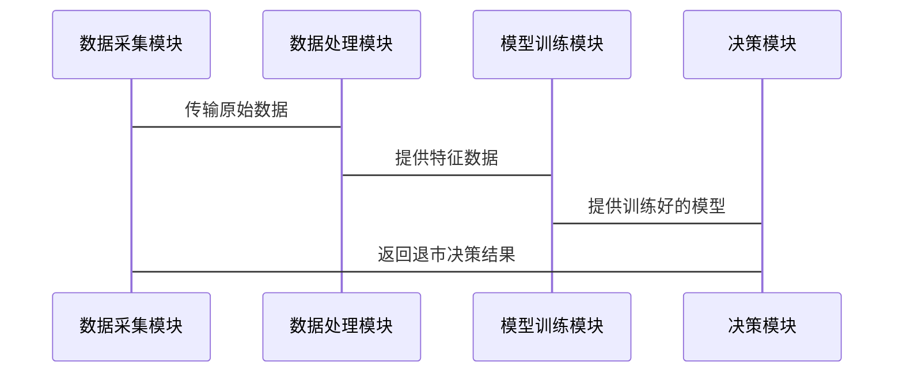

                 


# 开发智能化的金融产品生命周期管理与退市决策引擎

---

## 关键词
- 金融产品生命周期管理
- 退市决策引擎
- 人工智能
- 机器学习
- 系统架构设计
- 项目实战

---

## 摘要
本文探讨了如何利用人工智能技术开发智能化的金融产品生命周期管理与退市决策引擎。通过分析金融产品生命周期的各个阶段，结合机器学习算法和系统架构设计，提出了一个智能化的解决方案，帮助金融机构高效管理产品生命周期并做出科学的退市决策。文章从背景介绍、核心概念、算法原理、系统架构设计到项目实战，详细阐述了实现这一目标的全过程。

---

## 正文

### 第1章：背景介绍

#### 1.1 问题背景
金融产品的生命周期管理是金融机构的一项核心任务，涉及产品的设计、发行、运营和退市等多个阶段。随着市场的复杂化和竞争的加剧，传统的退市决策方法往往依赖人工经验，存在主观性强、效率低、风险高等问题。

#### 1.2 问题描述
- **退市决策的复杂性**：涉及多维度的指标评估，如市场表现、风险水平、收益能力等。
- **数据量庞大**：需要处理大量历史数据和实时市场信息。
- **决策的及时性**：需要快速响应市场变化，避免因决策延迟带来的损失。

#### 1.3 问题解决
引入人工智能技术，通过机器学习算法对数据进行深度分析，提供科学的退市决策支持。智能化的退市决策引擎能够提高效率、降低风险，为企业创造更大的价值。

#### 1.4 边界与外延
- **边界**：仅关注退市决策阶段，不涉及产品设计和发行。
- **外延**：可扩展至产品生命周期的其他阶段，如风险评估和收益预测。

### 第2章：核心概念与联系

#### 2.1 金融产品生命周期管理
金融产品的生命周期分为设计、发行、运营和退市四个阶段。每个阶段都需要不同的管理策略和数据支持。

#### 2.2 退市决策引擎
退市决策引擎通过收集和分析相关数据，评估产品是否符合继续运营的条件，并提供决策支持。关键指标包括市场表现、盈利能力、风险水平等。

#### 2.3 AI技术在金融产品管理中的应用
- **机器学习**：用于预测市场趋势和评估产品风险。
- **自然语言处理**：用于分析市场报告和新闻资讯。
- **时间序列分析**：用于预测产品未来的市场表现。

### 第3章：算法原理讲解

#### 3.1 退市决策算法的数学模型
- **决策树算法**：通过特征筛选构建决策树，用于分类和回归。
  $$ Gini系数 = 1 - \sum_{i=1}^k p_i^2 $$
- **随机森林算法**：通过集成学习提高模型的准确性和鲁棒性。
  $$ y = \sum_{i=1}^n \alpha_i \cdot x_i + \beta $$

#### 3.2 算法实现
以下是使用Python实现的随机森林算法示例：
```python
from sklearn.ensemble import RandomForestClassifier
import pandas as pd
import numpy as np

# 加载数据
data = pd.read_csv('退市数据.csv')

# 特征与标签分离
X = data.drop('退市标志', axis=1)
y = data['退市标志']

# 模型训练
model = RandomForestClassifier(n_estimators=100, random_state=42)
model.fit(X, y)

# 预测
predictions = model.predict(X)
print("预测结果:", predictions)
```

### 第4章：系统分析与架构设计

#### 4.1 系统架构设计
系统架构包括数据采集模块、数据处理模块、模型训练模块和决策模块。各模块之间通过接口进行数据传递和交互。

#### 4.2 系统功能设计
- **数据采集模块**：收集市场数据和产品信息。
- **数据处理模块**：清洗和预处理数据，提取特征。
- **模型训练模块**：训练机器学习模型，优化参数。
- **决策模块**：基于模型输出结果，生成退市决策。

#### 4.3 系统交互流程
Mermaid序列图展示系统交互流程：



### 第5章：项目实战

#### 5.1 环境搭建
- **安装依赖**：使用Python和相关库（如Scikit-learn、Pandas）。
  ```bash
  pip install scikit-learn pandas numpy
  ```

#### 5.2 代码实现
以下是实现退市决策引擎的核心代码：
```python
import pandas as pd
from sklearn.ensemble import RandomForestClassifier
from sklearn.metrics import accuracy_score

# 加载数据
data = pd.read_csv('退市数据.csv')

# 特征与标签分离
X = data.drop('退市标志', axis=1)
y = data['退市标志']

# 划分训练集和测试集
from sklearn.model_selection import train_test_split
X_train, X_test, y_train, y_test = train_test_split(X, y, test_size=0.2, random_state=42)

# 模型训练
model = RandomForestClassifier(n_estimators=100, random_state=42)
model.fit(X_train, y_train)

# 模型预测
y_pred = model.predict(X_test)
print("准确率:", accuracy_score(y_test, y_pred))
```

#### 5.3 案例分析
通过实际案例分析，验证模型的准确性和实用性。例如，使用历史数据训练模型，并预测某产品的退市可能性。

### 第6章：总结与展望

#### 6.1 小结
本文详细介绍了智能化金融产品生命周期管理与退市决策引擎的开发过程，包括背景分析、算法实现、系统设计和项目实战。

#### 6.2 注意事项
- 数据质量和完整性对模型性能至关重要。
- 模型的可解释性和透明度需要进一步优化。
- 系统的实时性和扩展性需在实际应用中不断优化。

#### 6.3 拓展阅读
- 推荐阅读《机器学习实战》和《深入理解机器学习》等书籍，深入学习相关算法和应用。

---

## 作者
作者：AI天才研究院/AI Genius Institute  
合作方：禅与计算机程序设计艺术 /Zen And The Art of Computer Programming  

---

# 结束语
通过本文的详细讲解，读者可以掌握开发智能化金融产品生命周期管理与退市决策引擎的核心技术和方法，为实际应用提供有价值的参考。

