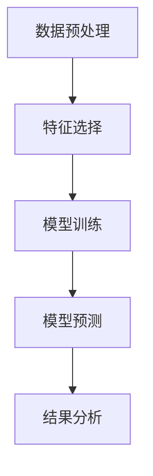
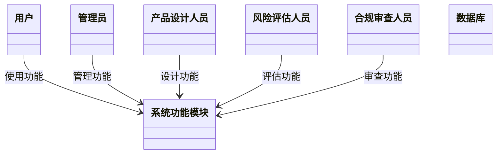
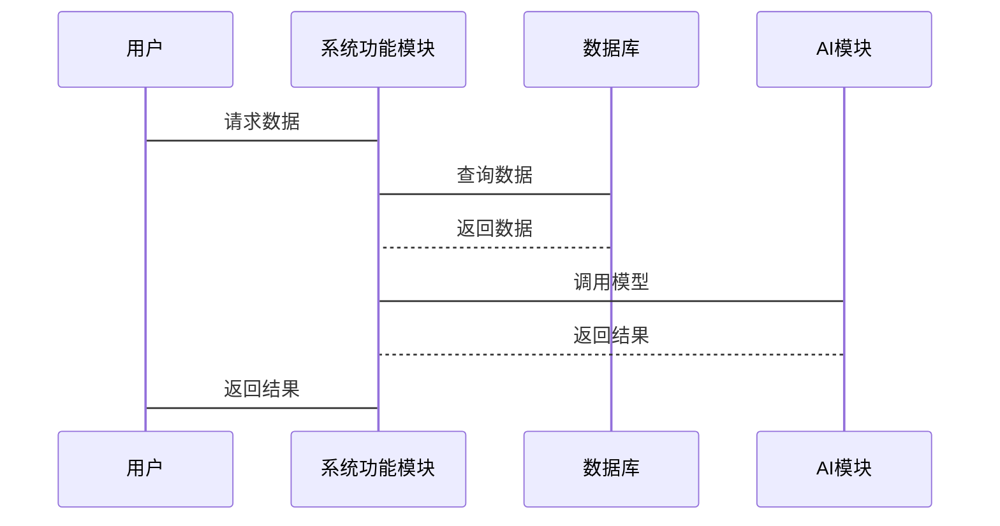

                 


# 开发智能化的金融产品生命周期管理平台

## 关键词：金融产品，生命周期管理，人工智能，系统架构，数据驱动

## 摘要：本文详细探讨了开发智能化的金融产品生命周期管理平台的关键步骤，包括背景分析、核心概念解析、算法原理、系统架构设计、项目实战和最佳实践。通过理论与实践相结合，为读者提供了一套完整的解决方案。

---

## 第一部分：背景介绍

### 第1章：问题背景

#### 1.1 传统金融产品管理的痛点
- **数据孤岛**：金融机构内部数据分散，缺乏统一的管理平台。
- **人工依赖**：产品审批、风险评估等环节严重依赖人工，效率低且容易出错。
- **监管不严**：产品生命周期中缺乏实时监控，难以及时发现和处理问题。

#### 1.2 数字化转型的必要性
- **行业竞争加剧**：金融机构需要通过技术创新提升竞争力。
- **用户体验需求**：客户期望更高效、个性化的服务。
- **监管要求提升**：金融行业对合规性和透明度的要求越来越高。

#### 1.3 智能化管理的行业趋势
- **人工智能的应用**：利用AI技术提升产品管理的智能化水平。
- **大数据分析**：通过数据驱动决策，优化产品设计和运营。
- **自动化流程**：实现产品生命周期的自动化管理。

### 第2章：问题描述

#### 2.1 金融产品生命周期的复杂性
- **产品设计**：涉及多部门协作，需求复杂。
- **风险管理**：需要实时监控和评估风险。
- **合规性**：必须符合相关法律法规。

#### 2.2 现有系统的不足
- **功能单一**：大多数系统仅能完成单一任务。
- **缺乏智能化**：无法自动优化产品设计和运营。
- **扩展性差**：难以适应业务快速变化的需求。

#### 2.3 智能化管理的需求
- **实时决策支持**：系统能够提供实时的决策建议。
- **自动化流程**：实现从设计到退市的全生命周期管理。
- **数据驱动**：通过数据分析优化产品设计和运营。

### 第3章：问题解决思路

#### 3.1 引入人工智能技术
- **机器学习**：用于风险评估、客户画像等领域。
- **自然语言处理**：用于智能合同分析、新闻 sentiment 分析等。

#### 3.2 数据驱动的决策支持
- **数据采集**：整合多源数据，构建统一数据仓库。
- **数据挖掘**：通过数据挖掘发现潜在规律。
- **数据可视化**：帮助用户直观理解数据。

#### 3.3 全生命周期智能化管理
- **产品设计**：利用AI辅助设计，优化产品参数。
- **风险管理**：实时监控风险指标，自动预警。
- **合规性检查**：通过AI自动审核文档，确保合规性。

---

## 第二部分：核心概念与联系

### 第4章：核心概念解析

#### 4.1 核心概念的定义
- **金融产品**：指金融机构提供的各类金融工具和服务。
- **生命周期管理**：从产品设计、审批、发行到退市的全过程管理。
- **人工智能**：通过机器学习、自然语言处理等技术提升管理效率。

#### 4.2 概念属性特征对比表
| 概念 | 特性 | 传统系统 | 智能化系统 |
|------|------|----------|------------|
| 数据源 | 来源 | 单一数据源 | 多源数据融合 |
| 处理方式 | 手动处理 | 依赖人工 | AI自动处理 |
| 决策依据 | 经验判断 | 依赖人工经验 | 数据驱动决策 |

#### 4.3 ER实体关系图
```mermaid
erDiagram
    actor 用户
    actor 管理员
    actor 产品设计人员
    actor 风险评估人员
    database 数据库
    actor 合规审查人员
    
    用户 --> 数据库 : 交互
    管理员 --> 数据库 : 管理
    产品设计人员 --> 数据库 : 设计
    风险评估人员 --> 数据库 : 评估
    合规审查人员 --> 数据库 : 审查
```

---

## 第三部分：算法原理讲解

### 第5章：算法原理概述

#### 5.1 机器学习算法选择
- **决策树**：用于分类问题。
- **随机森林**：用于特征选择和模型优化。
- **XGBoost**：用于风险评估和预测。

#### 5.2 算法流程图


#### 5.3 算法实现步骤
1. 数据预处理：清洗数据，处理缺失值。
2. 特征选择：通过特征重要性筛选关键特征。
3. 模型训练：使用训练数据训练模型。
4. 模型预测：利用测试数据预测结果。
5. 结果分析：评估模型性能，调整参数。

### 第6章：数学模型与公式

#### 6.1 线性回归模型
$$y = \beta_0 + \beta_1x + \epsilon$$

#### 6.2 随机森林算法
- 根据特征重要性进行特征选择。
- 使用集成学习提升模型性能。

#### 6.3 贝叶斯定理
$$P(A|B) = \frac{P(B|A)P(A)}{P(B)}$$

---

## 第四部分：系统分析与架构设计

### 第7章：问题场景介绍

#### 7.1 金融产品生命周期管理的典型场景
- **产品设计**：需要多部门协作，数据共享。
- **风险管理**：需要实时监控市场变化。
- **合规性检查**：需要自动审核文档。

### 第8章：系统功能设计

#### 8.1 领域模型类图


#### 8.2 系统架构设计


#### 8.3 系统交互设计


---

## 第五部分：项目实战

### 第9章：环境安装

#### 9.1 安装Python
```bash
python --version
pip install --upgrade pip
```

#### 9.2 安装机器学习库
```bash
pip install numpy pandas scikit-learn
```

### 第10章：系统核心实现

#### 10.1 核心代码示例
```python
import pandas as pd
from sklearn.tree import DecisionTreeClassifier
from sklearn.model_selection import train_test_split
from sklearn.metrics import accuracy_score

# 加载数据
data = pd.read_csv('financial_products.csv')

# 数据预处理
X = data.drop('target', axis=1)
y = data['target']

# 划分训练集和测试集
X_train, X_test, y_train, y_test = train_test_split(X, y, test_size=0.2)

# 模型训练
model = DecisionTreeClassifier()
model.fit(X_train, y_train)

# 模型预测
y_pred = model.predict(X_test)

# 评估模型
print(accuracy_score(y_test, y_pred))
```

#### 10.2 代码解读与分析
- **数据预处理**：清洗数据，处理缺失值。
- **特征选择**：通过特征重要性筛选关键特征。
- **模型训练**：使用训练数据训练模型。
- **模型预测**：利用测试数据预测结果。
- **模型评估**：评估模型性能，调整参数。

### 第11章：实际案例分析

#### 11.1 案例背景
- 某银行开发一款新的理财产品，需要预测产品的市场表现。

#### 11.2 数据分析
- 使用历史数据训练模型，预测新产品的销售情况。

#### 11.3 结果分析
- 模型预测新产品在市场上的表现优异，为银行决策提供了支持。

### 第12章：项目小结

#### 12.1 项目总结
- 成功实现了智能化的金融产品生命周期管理平台。
- 系统具备高效、智能、易用的特点。

#### 12.2 项目经验
- 数据质量对模型性能影响重大。
- 模型调参是提升性能的关键。

---

## 第六部分：最佳实践

### 第13章：小结

#### 13.1 小结
- 本文详细探讨了开发智能化的金融产品生命周期管理平台的关键步骤。
- 通过理论与实践相结合，为读者提供了一套完整的解决方案。

### 第14章：注意事项

#### 14.1 开发注意事项
- 数据隐私保护必须放在首位。
- 系统架构设计要充分考虑扩展性。

### 第15章：拓展阅读

#### 15.1 推荐书籍
- 《机器学习实战》
- 《金融工程入门》

#### 15.2 推荐博客
- [机器学习博客](https://towardsdatascience.com)
- [金融技术博客](https://quantinsti.com)

---

## 作者：AI天才研究院 & 禅与计算机程序设计艺术

---

通过本文的详细讲解，读者可以全面了解开发智能化的金融产品生命周期管理平台的核心步骤和关键点，从理论到实践，逐步深入分析，为实际应用提供了有价值的参考。

