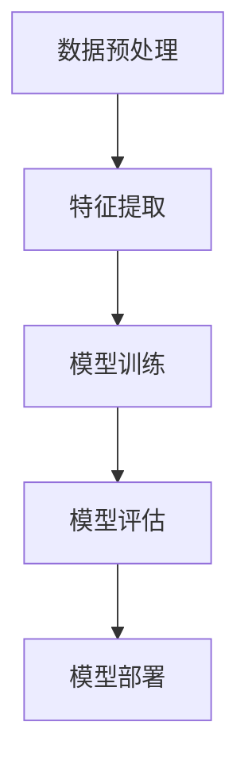
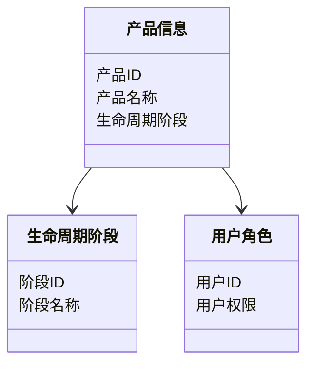
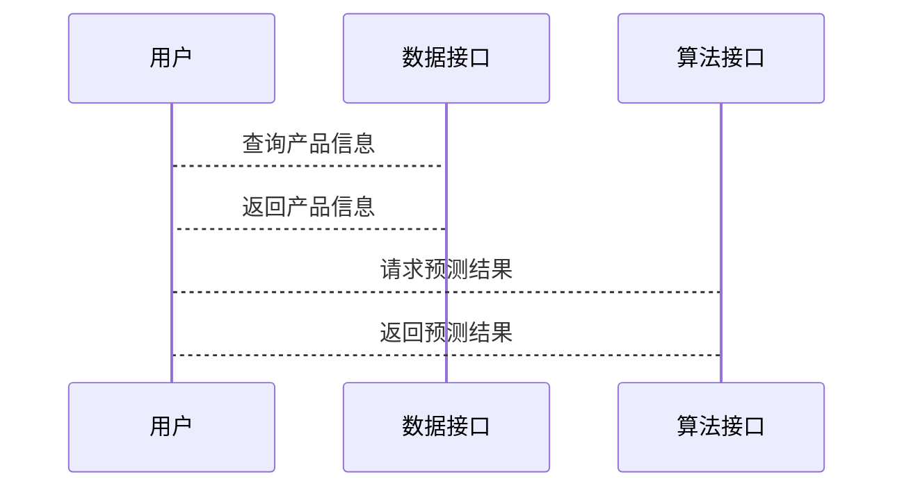

                 


# 开发智能化的金融产品生命周期管理平台

## 关键词：
金融产品生命周期管理, 智能化管理平台, 人工智能, 机器学习, 数据分析

## 摘要：
本文详细探讨了开发智能化的金融产品生命周期管理平台的关键技术与实现方法。文章首先介绍了金融行业的发展现状及智能化管理的必要性，然后深入分析了金融产品生命周期管理的核心概念，接着讲解了平台中使用的AI算法原理及其数学模型，随后设计了系统的整体架构并提供了项目实战案例，最后总结了最佳实践和开发注意事项。本文旨在为金融机构的技术人员提供一套高效、可靠的智能化管理解决方案。

---

## 第一部分: 智能化金融产品管理平台的背景

### 第1章: 金融产品生命周期管理平台概述

#### 1.1 金融行业的发展与挑战
##### 1.1.1 金融行业的现状与发展
金融行业正经历数字化转型，科技驱动的创新成为主流。金融机构需要应对市场变化，优化产品管理效率。传统管理模式存在效率低下、人工错误率高、难以实时监控等问题。

##### 1.1.2 金融产品管理的痛点与难点
- 产品种类繁多，生命周期复杂。
- 数据分散，难以统一管理。
- 缺乏实时监控和预测能力，难以快速响应市场变化。

##### 1.1.3 智能化管理的必要性
通过AI和大数据技术，实现产品全生命周期的自动化监控和优化，提升管理效率和决策准确性。

#### 1.2 金融产品生命周期管理的核心概念
##### 1.2.1 金融产品的定义与分类
金融产品包括理财产品、基金、保险等，不同产品的生命周期阶段和管理需求各不相同。

##### 1.2.2 产品生命周期的阶段划分
- 设计阶段：市场调研、需求分析、风险评估。
- 发行阶段：产品上线、客户推广。
- 运营阶段：监控表现、优化调整。
- 终止阶段：产品退市、客户通知。

##### 1.2.3 智能化管理的特点
- 数据驱动：利用数据分析优化管理流程。
- AI算法：用于风险预测、客户行为分析。
- 人机协同：结合人工审核和AI推荐。

#### 1.3 智能化金融产品管理平台的背景与意义
##### 1.3.1 AI技术在金融领域的应用趋势
AI技术广泛应用于风险评估、投资决策等领域，提升金融机构的竞争力。

##### 1.3.2 智能化管理平台的创新点
- 实现全生命周期智能化管理。
- 提供实时数据监控和预测分析。
- 支持个性化产品推荐。

##### 1.3.3 平台对金融机构的价值
- 提高管理效率，降低成本。
- 增强风险控制能力。
- 提升客户满意度和忠诚度。

#### 1.4 本章小结
本章介绍了金融行业的发展背景，分析了金融产品管理的痛点，提出了智能化管理的必要性，并阐述了智能化管理平台的核心概念和价值。

---

## 第二部分: 金融产品生命周期智能化管理的核心概念与联系

### 第2章: 金融产品生命周期管理的核心概念

#### 2.1 金融产品生命周期的定义与结构
##### 2.1.1 生命周期的阶段划分
- 设计阶段：市场调研、需求分析。
- 发行阶段：产品上线、客户推广。
- 运营阶段：监控表现、优化调整。
- 终止阶段：产品退市、客户通知。

##### 2.1.2 各阶段的核心要素
- 设计阶段：市场分析、风险评估。
- 发行阶段：产品上线、客户推广。
- 运营阶段：数据监控、客户反馈。
- 终止阶段：产品退市、客户通知。

##### 2.1.3 智能化管理的目标与价值
通过智能化管理，实现各阶段的高效协调，提升整体管理效率。

#### 2.2 智能化管理的核心要素
##### 2.2.1 数据驱动的管理方式
利用大数据分析，优化产品设计和运营策略。

##### 2.2.2 AI算法的应用场景
- 风险预测：通过机器学习模型预测产品风险。
- 客户行为分析：分析客户行为，优化产品推荐。

##### 2.2.3 人机协同的工作模式
结合人工审核和AI推荐，确保决策的准确性和及时性。

#### 2.3 核心概念的ER实体关系图
```mermaid
er
    entity 产品信息 {
        key 产品ID
        属性 产品名称, 产品类型, 产品描述
    }
    entity 生命周期阶段 {
        key 阶段ID
        属性 阶段名称, 开始时间, 结束时间
    }
    entity AI算法模型 {
        key 算法ID
        属性 算法名称, 算法版本, 模型文件
    }
    entity 用户角色 {
        key 用户ID
        属性 用户类型, 用户权限
    }
    relationship 产品信息 -- 生命周期阶段: 产品阶段关联
    relationship 产品信息 -- AI算法模型: 算法应用关联
    relationship 用户角色 -- 产品信息: 用户权限关联
```

#### 2.4 核心概念的对比分析
##### 2.4.1 传统管理 vs 智能化管理
- 传统管理：人工操作为主，效率低，错误率高。
- 智能化管理：数据驱动，AI辅助，效率高，准确性强。

##### 2.4.2 不同生命周期阶段的管理特点对比
| 阶段 | 传统管理 | 智能化管理 |
|------|----------|------------|
| 设计 | 人工分析 | 数据驱动预测 |
| 发行 | 线下推广 | 精准营销 |
| 运营 | 定期报告 | 实时监控 |
| 终止 | 通知客户 | 智能提醒 |

##### 2.4.3 核心概念的属性特征对比表格
| 概念       | 属性1 | 属性2 | 属性3 |
|------------|--------|--------|--------|
| 产品信息   | 名称   | 类型   | 描述   |
| 生命周期阶段 | 名称   | 时间   | 关联性 |

#### 2.5 本章小结
本章详细分析了金融产品生命周期管理的核心概念，通过对比分析和ER图，展示了智能化管理的优势和实现路径。

---

## 第三部分: 智能化管理平台的算法原理与实现

### 第3章: 智能化管理平台的算法原理

#### 3.1 算法选择与原理
##### 3.1.1 算法选择
选择适合金融产品管理的算法，如线性回归、随机森林等。

##### 3.1.2 算法原理
以线性回归为例，其数学模型为：
$$ y = \beta_0 + \beta_1x + \epsilon $$

##### 3.1.3 算法流程
1. 数据预处理：清洗、特征提取。
2. 模型训练：使用训练数据拟合模型。
3. 模型评估：计算误差，调整参数。
4. 模型部署：应用于实际管理场景。

#### 3.2 算法实现细节
##### 3.2.1 算法实现步骤
```python
import pandas as pd
from sklearn.linear_model import LinearRegression

# 数据加载
data = pd.read_csv('product_data.csv')

# 特征和目标变量分离
X = data[['feature1', 'feature2']]
y = data['target']

# 模型训练
model = LinearRegression()
model.fit(X, y)

# 模型预测
predictions = model.predict(X)
```

##### 3.2.2 算法流程图


#### 3.3 算法实现的数学模型
##### 3.3.1 线性回归的数学公式
$$ y = \beta_0 + \beta_1x + \epsilon $$

##### 3.3.2 随机森林的数学模型
随机森林通过集成学习提升模型的准确性和鲁棒性。

#### 3.4 本章小结
本章详细讲解了智能化管理平台中使用的AI算法，包括算法选择、实现步骤和数学模型，为后续的系统设计奠定了基础。

---

## 第四部分: 系统分析与架构设计方案

### 第4章: 系统架构设计方案

#### 4.1 系统模块划分
##### 4.1.1 模块划分
- 数据采集模块：负责数据的采集和存储。
- 算法处理模块：执行AI算法，生成预测结果。
- 用户界面模块：展示管理信息，供用户操作。

##### 4.1.2 模块交互流程
1. 数据采集模块获取产品信息。
2. 算法处理模块进行数据分析和预测。
3. 用户界面模块展示结果，用户进行操作。

#### 4.2 系统架构图


#### 4.3 系统功能设计
##### 4.3.1 领域模型类图


#### 4.4 系统接口设计
##### 4.4.1 接口设计
- 数据接口：REST API，提供数据查询和更新功能。
- 用户接口：Web界面，供用户查看和操作产品信息。

##### 4.4.2 接口交互序列图


#### 4.5 本章小结
本章设计了系统的整体架构，包括模块划分、架构图和接口设计，为后续的项目实施提供了指导。

---

## 第五部分: 项目实战

### 第5章: 项目实战

#### 5.1 项目背景
##### 5.1.1 项目背景介绍
某金融机构希望通过智能化平台优化产品生命周期管理。

#### 5.2 环境安装
##### 5.2.1 环境配置
- Python 3.8+
- 安装依赖库：pandas、scikit-learn、flask

#### 5.3 核心代码实现
##### 5.3.1 数据预处理代码
```python
import pandas as pd

data = pd.read_csv('product_data.csv')
data = data.dropna()
```

##### 5.3.2 模型训练代码
```python
from sklearn.linear_model import LinearRegression

model = LinearRegression()
model.fit(X_train, y_train)
```

##### 5.3.3 接口实现代码
```python
from flask import Flask
app = Flask(__name__)

@app.route('/predict', methods=['POST'])
def predict():
    # 处理请求，返回预测结果
    return jsonify(result)
```

#### 5.4 实际案例分析
##### 5.4.1 案例背景
分析某理财产品在智能化平台管理下的表现。

##### 5.4.2 案例分析
- 数据采集：收集产品的市场表现数据。
- 算法处理：使用随机森林模型预测产品风险。
- 结果展示：生成风险报告，指导产品优化。

#### 5.5 本章小结
本章通过实际案例展示了智能化管理平台的实现过程，验证了平台的有效性和实用性。

---

## 第六部分: 最佳实践与总结

### 第6章: 最佳实践与总结

#### 6.1 最佳实践
##### 6.1.1 数据质量管理
确保数据的准确性和完整性，是模型性能的关键。

##### 6.1.2 算法选择与调优
根据具体场景选择合适的算法，并进行参数调优。

##### 6.1.3 系统架构优化
设计高效的系统架构，确保系统的可扩展性和稳定性。

#### 6.2 小结
智能化金融产品生命周期管理平台通过AI技术和大数据分析，显著提升了金融机构的管理效率和决策能力。

#### 6.3 注意事项
- 数据隐私保护：遵守相关法律法规，确保数据安全。
- 模型可解释性：选择可解释的模型，便于管理和优化。
- 系统稳定性：确保系统在高并发情况下的稳定运行。

#### 6.4 拓展阅读
- 《机器学习实战》
- 《金融风险管理》
- 《微服务架构设计》

#### 6.5 本章小结
本文总结了开发智能化金融产品生命周期管理平台的关键点，提出了最佳实践建议，为读者提供了宝贵的参考。

---

## 作者：AI天才研究院/AI Genius Institute & 禅与计算机程序设计艺术 /Zen And The Art of Computer Programming

---

感谢您的阅读！希望本文能为您提供开发智能化金融产品生命周期管理平台的有益参考。

