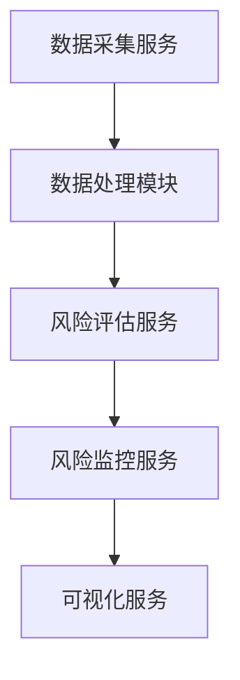
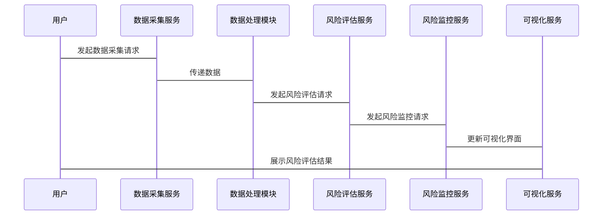

                 


# 开发智能化的金融产品生命周期风险动态管理平台

> 关键词：金融风险管理，智能化管理，生命周期模型，动态风险评估，人工智能，机器学习，系统架构

> 摘要：本文详细探讨了开发智能化的金融产品生命周期风险动态管理平台的背景、核心概念、算法原理、系统架构以及项目实战。通过分析金融市场的风险特征，提出了基于机器学习的动态风险管理模型，并结合系统架构设计和项目实现，展示了如何利用人工智能技术实现金融产品的智能化风险管理。

---

# 第一部分: 背景与概述

## 第1章: 金融产品生命周期风险动态管理平台的背景与目标

### 1.1 金融风险管理的重要性

#### 1.1.1 金融市场的风险特征
金融市场是一个高度复杂和动态变化的环境，涉及多种风险因素，如市场风险、信用风险、流动性风险等。这些风险在金融产品的生命周期中不断变化，对金融机构的稳健运行构成挑战。

#### 1.1.2 传统金融风险管理的局限性
传统金融风险管理方法依赖于静态模型和经验判断，存在以下局限性：
- 数据采集和处理效率低下，难以应对海量数据。
- 风险评估结果滞后，无法实时反映市场变化。
- 风险模型缺乏动态调整能力，难以捕捉复杂市场环境中的潜在风险。

#### 1.1.3 智能化风险管理的必要性
随着人工智能和大数据技术的快速发展，智能化风险管理成为可能。通过引入机器学习算法，可以实现对金融产品生命周期中风险的实时监控和动态评估，从而提高风险管理的效率和准确性。

### 1.2 平台的目标与范围

#### 1.2.1 平台的核心目标
开发一个智能化的金融产品生命周期风险动态管理平台，旨在实现以下目标：
- 实时监控金融产品的风险状态。
- 动态评估风险因素的变化。
- 提供风险预警和应对策略。

#### 1.2.2 平台的功能范围
平台的功能范围包括：
- 数据采集与预处理模块。
- 风险评估模型构建模块。
- 动态风险监控与预警模块。
- 可视化展示与报告生成模块。

#### 1.2.3 平台的预期效益
通过平台的实施，预期可以实现以下效益：
- 提高风险管理的效率和准确性。
- 降低金融产品的风险敞口。
- 增强金融机构的市场竞争力。

---

## 第2章: 金融产品生命周期管理的现状与挑战

### 2.1 金融产品生命周期的定义

#### 2.1.1 生命周期的阶段划分
金融产品的生命周期可以划分为以下几个阶段：
- 产品设计阶段：确定产品目标、风险特征和市场定位。
- 产品发行阶段：进行产品定价、风险评估和合规审查。
- 产品运作阶段：监控产品表现、调整投资策略和应对市场变化。
- 产品终止阶段：进行清算、结算和风险处置。

#### 2.1.2 各阶段的风险特征
在不同阶段，金融产品的风险特征有所不同：
- 产品设计阶段：主要关注产品设计的合理性和风险可控性。
- 产品发行阶段：关注市场风险和信用风险。
- 产品运作阶段：关注流动性风险和市场波动风险。
- 产品终止阶段：关注清算风险和法律风险。

### 2.2 现有风险管理系统的局限性

#### 2.2.1 数据孤岛问题
现有的风险管理系统往往依赖于单一的数据源，导致数据孤岛问题，无法全面捕捉市场的动态变化。

#### 2.2.2 风险评估的滞后性
传统风险评估方法通常基于历史数据，无法实时反映市场的最新变化，导致评估结果滞后。

#### 2.2.3 高维数据处理的困难
金融市场中的数据通常是高维的，传统方法难以有效处理和分析这些数据。

### 2.3 智能化管理的机遇与挑战

#### 2.3.1 人工智能在金融领域的应用潜力
人工智能技术，特别是机器学习算法，在金融风险管理中的应用潜力巨大，可以实现对复杂数据的高效处理和预测。

#### 2.3.2 数据隐私与安全问题
金融数据的隐私性和安全性要求较高，如何在保证数据安全的前提下利用人工智能技术是一个重要挑战。

#### 2.3.3 技术实现的复杂性
智能化风险管理平台的开发涉及多个技术领域，如数据处理、算法实现、系统架构设计等，技术实现的复杂性较高。

---

## 第3章: 核心概念与理论

### 3.1 金融产品生命周期模型

#### 3.1.1 数据采集与特征提取
数据采集是构建生命周期模型的第一步，需要从多个数据源获取相关数据，如市场数据、产品数据、交易数据等。特征提取则是从数据中提取有助于风险评估的关键特征，如波动率、收益率、相关性等。

#### 3.1.2 生命周期阶段的划分
生命周期阶段的划分是基于产品的市场表现和风险特征进行的，可以通过聚类分析等方法实现。

#### 3.1.3 阶段间的依赖关系
不同阶段之间存在相互依赖关系，例如，产品设计阶段的风险特征会影响产品发行阶段的市场表现。

### 3.2 风险评估模型

#### 3.2.1 风险因子的选取
风险因子是影响金融产品风险的关键因素，通常包括市场因子、信用因子、流动性因子等。

#### 3.2.2 风险评估指标的设计
风险评估指标的设计需要考虑产品的生命周期阶段和市场环境，常用的指标包括VaR、CVaR、信用评分等。

#### 3.2.3 模型的验证与优化
模型的验证与优化是通过历史数据和实时数据进行回测和验证，确保模型的准确性和稳定性。

### 3.3 动态风险管理

#### 3.3.1 动态风险管理的定义
动态风险管理是指在金融产品生命周期中，实时监控和调整风险管理策略，以应对市场环境的变化。

#### 3.3.2 动态风险管理的实现方法
动态风险管理的实现方法包括实时数据采集、模型更新、风险预警和应对策略的动态调整。

---

## 第4章: 算法原理与实现

### 4.1 机器学习算法在风险评估中的应用

#### 4.1.1 随机森林算法
随机森林是一种基于树的集成算法，具有较高的准确性和鲁棒性，适用于分类和回归问题。

#### 4.1.2 XGBoost算法
XGBoost是一种基于梯度提升的算法，具有高效的计算能力和良好的泛化性能，适用于风险评估中的分类和回归任务。

#### 4.1.3 神经网络算法
神经网络算法通过构建人工神经网络模型，可以捕捉数据中的非线性关系，适用于复杂的金融数据建模。

### 4.2 风险评估模型的数学公式

#### 4.2.1 线性回归模型
线性回归模型用于预测连续型变量，其数学公式为：
$$ y = \beta_0 + \beta_1 x_1 + \beta_2 x_2 + \ldots + \beta_n x_n $$

#### 4.2.2 随机森林算法的实现流程
随机森林算法的实现流程包括以下步骤：
1. 从训练数据中随机抽取样本，构建决策树。
2. 对每个决策树进行投票或加权，得到最终预测结果。
3. 通过袋外样本验证模型的准确性和稳定性。

### 4.3 算法实现的代码示例

#### 4.3.1 使用Python实现随机森林算法
```python
from sklearn.ensemble import RandomForestClassifier
from sklearn.metrics import accuracy_score

# 数据准备
X_train, y_train = prepare_data()

# 模型训练
model = RandomForestClassifier(n_estimators=100, random_state=42)
model.fit(X_train, y_train)

# 模型预测
y_pred = model.predict(X_test)

# 模型评估
accuracy = accuracy_score(y_test, y_pred)
print("Accuracy:", accuracy)
```

#### 4.3.2 使用XGBoost算法进行风险评估
```python
import xgboost as xgb

# 数据准备
dtrain = xgb.DMatrix(X_train, label=y_train)
dtest = xgb.DMatrix(X_test, label=y_test)

# 模型训练
params = {
    'n_estimators': 100,
    'learning_rate': 0.1,
    'max_depth': 6,
    'objective': 'binary:logit'
}
model = xgb.XGBClassifier(**params)
model.fit(dtrain)

# 模型预测
y_pred = model.predict(dtest)
```

---

## 第5章: 系统架构设计

### 5.1 系统功能设计

#### 5.1.1 领域模型设计
领域模型设计包括以下几个核心模块：
- 数据采集模块：负责从多个数据源获取金融产品生命周期数据。
- 数据处理模块：对数据进行清洗、转换和特征提取。
- 风险评估模块：基于机器学习模型进行风险评估和预测。
- 风险监控模块：实时监控风险状态并触发预警。

#### 5.1.2 系统架构设计
系统架构采用微服务架构，包括以下几个核心组件：
- 数据采集服务：负责数据的采集和预处理。
- 风险评估服务：基于机器学习模型进行风险评估。
- 风险监控服务：实时监控风险状态并触发预警。
- 可视化服务：提供风险评估结果的可视化展示。

### 5.2 系统架构图



### 5.3 系统接口设计

#### 5.3.1 数据接口
数据接口用于数据采集和预处理，支持多种数据格式和接口协议，如REST API、WebSocket等。

#### 5.3.2 风险评估接口
风险评估接口提供基于机器学习模型的风险评估服务，支持批量处理和实时请求。

#### 5.3.3 风险监控接口
风险监控接口负责实时监控风险状态，支持多种预警方式，如邮件、短信、推送通知等。

### 5.4 系统交互流程图



---

## 第6章: 项目实战

### 6.1 环境搭建

#### 6.1.1 安装开发环境
需要安装以下工具和库：
- Python 3.8+
- Jupyter Notebook
- Pandas、NumPy、Scikit-learn、XGBoost、Mermaid

#### 6.1.2 数据准备
数据准备包括以下几个步骤：
1. 数据清洗：去除缺失值和异常值。
2. 数据转换：对数据进行标准化或归一化处理。
3. 特征提取：从数据中提取有助于风险评估的关键特征。

### 6.2 系统核心实现

#### 6.2.1 数据采集模块实现
```python
import pandas as pd
import requests

def fetch_data(api_url, params):
    response = requests.get(api_url, params=params)
    data = response.json()
    df = pd.DataFrame(data['result'])
    return df
```

#### 6.2.2 风险评估模块实现
```python
from sklearn.ensemble import RandomForestClassifier
from sklearn.metrics import accuracy_score

def train_model(X_train, y_train):
    model = RandomForestClassifier(n_estimators=100, random_state=42)
    model.fit(X_train, y_train)
    return model

def evaluate_model(model, X_test, y_test):
    y_pred = model.predict(X_test)
    accuracy = accuracy_score(y_test, y_pred)
    return accuracy
```

#### 6.2.3 风险监控模块实现
```python
import pandas as pd
import numpy as np

def calculate_risk_scores(model, X):
    risk_scores = model.predict_proba(X)[:, 1]
    return risk_scores

def trigger_warnings(scores, threshold=0.8):
    warnings = []
    for score in scores:
        if score > threshold:
            warnings.append('High risk detected')
        elif score < 0.2:
            warnings.append('Low risk detected')
    return warnings
```

### 6.3 项目小结

#### 6.3.1 核心功能实现
- 数据采集与处理模块实现了从多个数据源获取数据，并进行清洗和转换。
- 风险评估模块基于随机森林算法实现了对金融产品的风险评估和预测。
- 风险监控模块实现了对风险状态的实时监控，并在风险超过阈值时触发预警。

#### 6.3.2 系统性能优化
- 数据预处理模块优化了数据读取和处理效率，提高了系统的响应速度。
- 模型优化模块通过超参数调优和特征选择，提高了模型的准确性和稳定性。

---

## 第7章: 优化与展望

### 7.1 系统优化方向

#### 7.1.1 性能优化
- 优化数据处理模块的效率，减少数据读取和处理的时间。
- 优化模型训练和预测的速度，提高系统的响应能力。

#### 7.1.2 可扩展性优化
- 优化系统架构，使其支持更多的数据源和更多的金融产品类型。
- 提高系统的可扩展性，使其能够应对更大的数据规模和更高的并发请求。

### 7.2 未来的研究方向

#### 7.2.1 新型算法研究
- 研究更先进的机器学习算法，如深度学习、强化学习等，提高风险评估的准确性和智能化水平。

#### 7.2.2 数据隐私与安全
- 研究数据隐私保护技术，如联邦学习、差分隐私等，确保数据的安全性和隐私性。

#### 7.2.3 多模态数据融合
- 研究如何将结构化数据和非结构化数据相结合，提高风险评估的全面性和准确性。

---

# 结语

开发智能化的金融产品生命周期风险动态管理平台是一项复杂而重要的任务。通过结合人工智能技术，可以实现对金融产品生命周期中风险的实时监控和动态评估，从而提高风险管理的效率和准确性。未来，随着技术的不断发展，智能化风险管理平台将发挥越来越重要的作用，为金融机构提供更强大、更智能的风险管理工具。

---

# 作者：AI天才研究院 & 禅与计算机程序设计艺术

