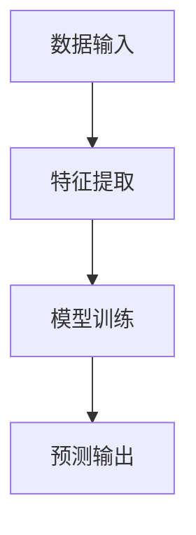
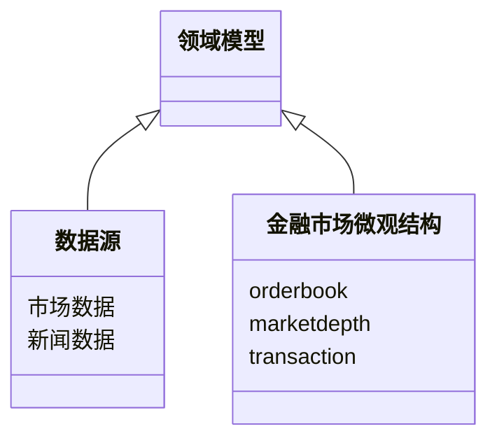

                 


# 开发智能化的金融市场微观结构分析工具

> 关键词：金融市场微观结构、人工智能、机器学习、算法设计、系统架构、技术实现

> 摘要：本文详细探讨了开发智能化金融市场微观结构分析工具的背景、核心概念、算法原理、系统架构设计、项目实战以及最佳实践。通过结合金融市场的基本概念、微观结构分析的必要性、AI技术的应用，本文为读者提供了从理论到实践的全面指导，帮助开发出高效的智能化分析工具。

---

# 第一部分: 金融市场微观结构分析工具开发背景

## 第1章: 金融市场概述

### 1.1 金融市场的基本概念

#### 1.1.1 金融市场的定义与分类
金融市场的定义是一个复杂的系统，涉及多个参与者和机构。金融市场可以分为一级市场和二级市场，一级市场涉及新证券的发行，二级市场涉及现有证券的交易。

$$
\text{一级市场} \rightarrow \text{新证券发行} \\
\text{二级市场} \rightarrow \text{现有证券交易}
$$

#### 1.1.2 金融市场的参与者与角色
参与者包括投资者、机构投资者、经纪商、做市商、交易所等。

#### 1.1.3 金融市场的重要性与功能
金融市场的功能包括资金筹集、价格发现、风险管理和资源配置。

### 1.2 金融市场微观结构分析

#### 1.2.1 微观结构分析的定义
微观结构分析关注市场中的个体行为和交易动态，如订单簿、市场深度、交易量等。

#### 1.2.2 微观结构分析的核心要素
核心要素包括订单簿、市场深度、交易行为、市场参与者类型等。

#### 1.2.3 微观结构分析的常见方法
常用方法包括统计分析、机器学习模型和自然语言处理技术。

### 1.3 AI技术在金融市场中的应用

#### 1.3.1 AI在金融分析中的优势
AI技术能够处理大量数据，识别复杂模式，提高预测准确性。

#### 1.3.2 微观结构分析中的AI技术
AI技术用于预测市场趋势、识别套利机会和优化交易策略。

#### 1.3.3 市场微观结构分析工具的智能化需求
智能化工具需要实时数据处理、自适应学习和自动化决策能力。

---

## 第2章: 金融市场微观结构分析工具的核心概念

### 2.1 金融市场微观结构模型

#### 2.1.1 微观结构模型的定义
微观结构模型描述了市场的微观层面，包括订单簿、交易行为等。

#### 2.1.2 常见的微观结构模型
常见的模型包括凯恩斯模型、马科维茨模型等。

#### 2.1.3 微观结构模型的属性特征对比表

| 模型属性 | 凯恩斯模型 | 马科维茨模型 |
|----------|------------|--------------|
| 核心假设 | 市场非有效 | 市场有效     |
| 适用场景 | 中短期预测 | 长期投资     |

### 2.2 微观结构模型的ER实体关系图

```mermaid
er
    actor:投资者
    institution:机构投资者
    broker:经纪商
    marketmaker:做市商
    exchange:交易所
    orderbook:订单簿
    marketdepth:市场深度
    transaction:交易记录
    actor --> orderbook
    institution --> orderbook
    broker --> orderbook
    marketmaker --> orderbook
    orderbook --> transaction
    marketdepth --> transaction
```

---

## 第3章: AI技术在金融市场微观结构分析中的应用

### 3.1 AI技术的核心原理

#### 3.1.1 机器学习的基本原理



$$
\text{机器学习} = f(\text{特征}, \text{标签})
$$

#### 3.1.2 自然语言处理的原理

$$
\text{NLP} = \text{文本} \rightarrow \text{向量} \rightarrow \text{情感/实体}
$$

#### 3.1.3 强化学习的原理

$$
\text{强化学习} = \text{状态} \rightarrow \text{动作} \rightarrow \text{奖励}
$$`

### 3.2 AI技术在微观结构分析中的具体应用

#### 3.2.1 基于机器学习的市场预测

```python
from sklearn.neighbors import KNeighborsClassifier
model = KNeighborsClassifier(n_neighbors=3)
model.fit(X_train, y_train)
y_pred = model.predict(X_test)
```

#### 3.2.2 基于NLP的新闻情感分析

```python
import nltk
from nltk.sentiment import SentimentIntensityAnalyzer
sia = SentimentIntensityAnalyzer()
sentiment = sia.polarity_scores(text)
```

#### 3.2.3 基于强化学习的交易策略

$$
\text{策略} = \argmax_{a} Q(s,a)
$$`

---

## 第4章: 金融市场微观结构分析工具的系统架构设计

### 4.1 系统架构设计的背景与目标

#### 4.1.1 项目背景

#### 4.1.2 项目目标
开发一个智能化的微观结构分析工具，支持实时数据处理、智能预测和自动化决策。

### 4.2 系统功能设计

#### 4.2.1 领域模型设计



### 4.3 系统架构设计

#### 4.3.1 分层架构设计


### 4.4 系统接口设计

#### 4.4.1 API接口设计

```python
from flask import Flask
app = Flask(__name__)
@app.route('/analyze', methods=['POST'])
def analyze():
    data = request.json
    # 处理数据并返回结果
    return result
```

---

## 第5章: 项目实战

### 5.1 环境安装与配置

```bash
pip install numpy pandas scikit-learn
```

### 5.2 系统核心实现

#### 5.2.1 核心代码实现

```python
import pandas as pd
from sklearn.ensemble import RandomForestClassifier

# 数据加载
data = pd.read_csv('market_data.csv')

# 特征工程
features = data[['volume', 'open', 'high', 'low']]
target = data['label']

# 模型训练
model = RandomForestClassifier()
model.fit(features, target)

# 预测
new_data = pd.read_csv('new_market_data.csv')
new_features = new_data[['volume', 'open', 'high', 'low']]
predictions = model.predict(new_features)
```

### 5.3 案例分析与解读

#### 5.3.1 案例分析

### 5.4 项目总结

---

## 第6章: 最佳实践与总结

### 6.1 小结

### 6.2 注意事项

### 6.3 拓展阅读

---

作者：AI天才研究院/AI Genius Institute & 禅与计算机程序设计艺术 /Zen And The Art of Computer Programming

