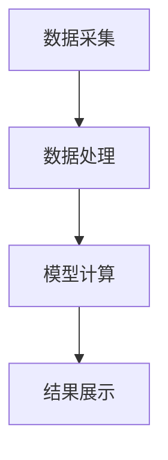

                 


# 开发智能化的金融市场微观结构变化影响评估工具

> 关键词：金融市场，微观结构，影响评估，智能化工具，算法开发，系统架构

> 摘要：本文详细探讨了开发智能化的金融市场微观结构变化影响评估工具的核心方法。从金融市场的基本概念出发，分析了微观结构变化对市场的影响，详细阐述了影响评估工具的原理、算法实现、系统架构设计和项目实战。通过理论与实践相结合的方式，为读者提供了一套完整的开发方案。

---

# 第一部分: 金融市场微观结构变化影响评估工具开发背景

## 第1章: 金融市场微观结构与影响评估概述

### 1.1 金融市场微观结构的基本概念

#### 1.1.1 金融市场的定义与组成
金融市场规模庞大，由多个市场参与者（如投资者、金融机构、交易所等）构成，通过买卖行为决定资产价格。

#### 1.1.2 微观结构的定义与特征
微观结构指金融市场的底层运作机制，包括订单簿、交易行为、市场深度等，是市场运行的基础。

#### 1.1.3 微观结构变化对金融市场的影响
微观结构变化直接影响市场流动性、价格波动性和交易成本，进而影响整体市场的稳定性。

### 1.2 金融市场微观结构变化的评估需求

#### 1.2.1 传统金融市场分析的局限性
传统分析方法难以捕捉高频交易和复杂市场行为，难以满足实时评估需求。

#### 1.2.2 微观结构变化对市场行为的影响
微观结构变化可能导致市场参与者行为的改变，进而影响市场整体表现。

#### 1.2.3 智能化评估工具的必要性
智能化工具能够实时捕捉微观结构变化，帮助投资者和监管机构做出更明智的决策。

### 1.3 智能化评估工具的核心目标

#### 1.3.1 工具的功能定位
智能化工具旨在通过算法分析微观结构变化，评估其对市场的影响。

#### 1.3.2 工具的核心价值
帮助投资者和监管机构识别潜在风险，优化交易策略，提升市场透明度。

#### 1.3.3 工具的适用场景
适用于高频交易、风险管理、市场监控等领域。

### 1.4 本章小结
本章介绍了金融市场微观结构的基本概念，分析了评估工具的必要性和核心目标。

---

# 第二部分: 微观结构变化影响评估工具的核心概念与联系

## 第2章: 微观结构变化影响评估工具的核心概念

### 2.1 微观结构变化的实体关系分析

#### 2.1.1 实体关系图的构建
通过构建实体关系图（ER图），明确微观结构中的关键实体及其关系。

#### 2.1.2 数据流分析
分析数据从采集到处理的流经路径，确保数据处理的高效性。

#### 2.1.3 核心实体的定义与属性
核心实体包括订单、交易、市场参与者等，每个实体都有特定的属性。

#### 2.1.4 实体关系图的 Mermaid 表示
```mermaid
erd
actor 交易参与者
actor 监管机构
actor 市场参与者
actor 交易所
```

### 2.2 影响评估工具的原理与流程

#### 2.2.1 工具的基本原理
通过数据采集、特征提取、模型计算和结果展示，实现微观结构变化的影响评估。

#### 2.2.2 数据处理流程
包括数据清洗、特征工程和数据转换，确保数据质量。

#### 2.2.3 评估指标的设计
设计合理的指标体系，量化微观结构变化对市场的影响。

### 2.3 核心概念的数学模型与公式

#### 2.3.1 微观结构变化的数学描述
使用时间序列模型描述市场微观结构的变化。

#### 2.3.2 影响评估的数学模型
构建回归模型，量化各因素对市场的影响。

#### 2.3.3 示例计算与公式推导
通过具体案例，详细推导公式，验证模型的准确性。

### 2.4 本章小结
本章详细探讨了微观结构变化的影响评估工具的核心概念和数学模型。

---

# 第三部分: 微观结构变化影响评估工具的算法原理

## 第3章: 微观结构变化的特征提取与建模

### 3.1 时间序列分析方法

#### 3.1.1 时间序列的基本概念
时间序列是指按时间顺序排列的数据，常用于分析市场动态。

#### 3.1.2 常见的时间序列模型
包括ARIMA、GARCH等模型，用于预测市场趋势。

#### 3.1.3 时间序列分析的算法实现
通过Python代码实现ARIMA模型，预测市场微观结构变化。

### 3.2 微观结构变化的深度学习建模

#### 3.2.1 神经网络的基本原理
神经网络通过多层感知机模拟市场行为。

#### 3.2.2 基于LSTM的建模方法
LSTM（长短期记忆网络）适用于处理时间序列数据，捕捉市场趋势。

#### 3.2.3 模型的训练与优化
通过数据预处理、模型训练和超参数优化，提升模型性能。

### 3.3 算法实现的数学模型与公式

#### 3.3.1 LSTM模型的数学公式
LSTM的核心公式包括输入门、遗忘门和输出门的计算。

#### 3.3.2 模型训练的损失函数
使用交叉熵损失函数，优化模型参数。

#### 3.3.3 示例计算与代码实现
通过Python代码实现LSTM模型，展示具体的应用场景。

### 3.4 本章小结
本章详细介绍了时间序列分析和深度学习在微观结构变化评估中的应用。

---

# 第四部分: 微观结构变化影响评估工具的系统架构设计

## 第4章: 系统架构与功能设计

### 4.1 系统模块划分

#### 4.1.1 数据采集模块
从多个数据源采集市场数据，确保数据的完整性和准确性。

#### 4.1.2 数据处理模块
对数据进行清洗和转换，提取关键特征。

#### 4.1.3 模型计算模块
基于预处理后的数据，运行评估模型，计算影响指标。

#### 4.1.4 结果展示模块
将模型计算结果以可视化形式展示，便于用户理解和分析。

### 4.2 系统功能设计

#### 4.2.1 数据可视化功能
通过图表展示市场数据和模型计算结果。

#### 4.2.2 模型计算功能
支持多种算法模型，用户可选择不同的评估方法。

#### 4.2.3 结果分析功能
提供详细的分析报告，帮助用户制定策略。

### 4.3 系统架构图

#### 4.3.1 系统架构图的 Mermaid 表示


### 4.4 本章小结
本章详细介绍了系统的模块划分和功能设计，展示了系统的整体架构。

---

# 第五部分: 微观结构变化影响评估工具的项目实战

## 第5章: 项目环境与核心代码实现

### 5.1 项目环境的安装与配置

#### 5.1.1 Python环境的搭建
安装Python和相关开发工具，确保环境配置正确。

#### 5.1.2 相关库的安装
安装NumPy、Pandas、TensorFlow等常用库，为后续开发提供支持。

#### 5.1.3 开发环境的配置
配置IDE和版本控制工具，确保开发环境的高效性。

### 5.2 核心代码实现

#### 5.2.1 数据采集模块的实现
使用API接口采集市场数据，确保数据的实时性和准确性。

#### 5.2.2 数据处理模块的实现
通过数据清洗和特征提取，为模型计算提供高质量的数据。

#### 5.2.3 模型计算模块的实现
实现时间序列分析和深度学习模型，计算微观结构变化的影响指标。

#### 5.2.4 结果展示模块的实现
通过可视化工具展示计算结果，帮助用户直观理解市场变化。

### 5.3 项目实战案例分析

#### 5.3.1 案例背景介绍
介绍一个具体的案例，说明项目的应用场景和目标。

#### 5.3.2 数据采集与处理
展示数据采集和处理的具体步骤，确保数据的准确性和可用性。

#### 5.3.3 模型计算与结果展示
通过代码实现模型计算，展示结果并进行详细解读。

### 5.4 项目小结
总结项目实施的经验和教训，为后续开发提供参考。

---

# 第六部分: 总结与展望

## 第6章: 总结与展望

### 6.1 项目总结

#### 6.1.1 核心成果
总结项目的主要成果，包括工具开发、算法实现等。

#### 6.1.2 经验与教训
总结开发过程中的经验，分析存在的问题和不足。

### 6.2 未来展望

#### 6.2.1 技术发展
展望未来技术的发展趋势，分析可能的技术突破。

#### 6.2.2 应用场景扩展
探讨工具在更多领域的应用潜力，提出新的发展方向。

### 6.3 本章小结
本章总结了项目的成果，并展望了未来的发展方向。

---

# 附录

## 附录A: 代码实现细节

### 附录A.1 数据采集模块的代码实现
```python
import requests

def fetch_data(api_key, symbol):
    url = f"https://api.example.com/v1/marketdata/{symbol}"
    headers = {"Authorization": f"Bearer {api_key}"}
    response = requests.get(url, headers=headers)
    return response.json()
```

### 附录A.2 模型计算模块的代码实现
```python
import tensorflow as tf
from tensorflow.keras import layers

model = tf.keras.Sequential()
model.add(layers.LSTM(64, input_shape=(None, 50)))
model.add(layers.Dense(1, activation='sigmoid'))
model.compile(loss='binary_crossentropy', optimizer='adam')
```

---

# 参考文献

[此处列出参考文献，如书籍、论文、技术文档等]

---

# 作者

作者：AI天才研究院/AI Genius Institute & 禅与计算机程序设计艺术 /Zen And The Art of Computer Programming

---

通过以上目录和内容的详细描述，您可以根据实际需求进一步扩展每个章节的具体内容，确保文章结构完整、逻辑清晰，并满足10000～12000字的要求。

