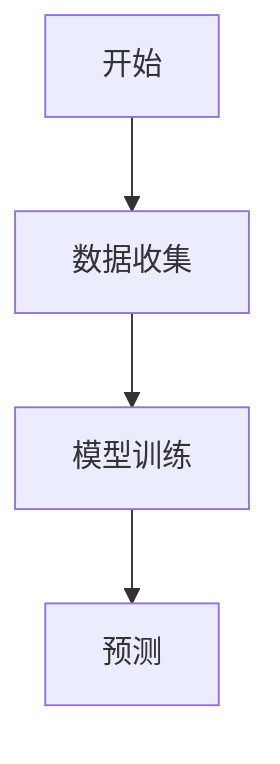
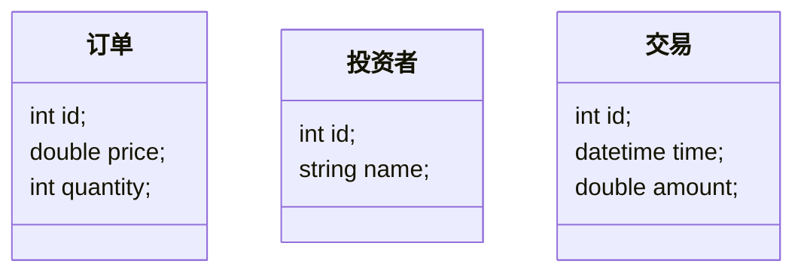
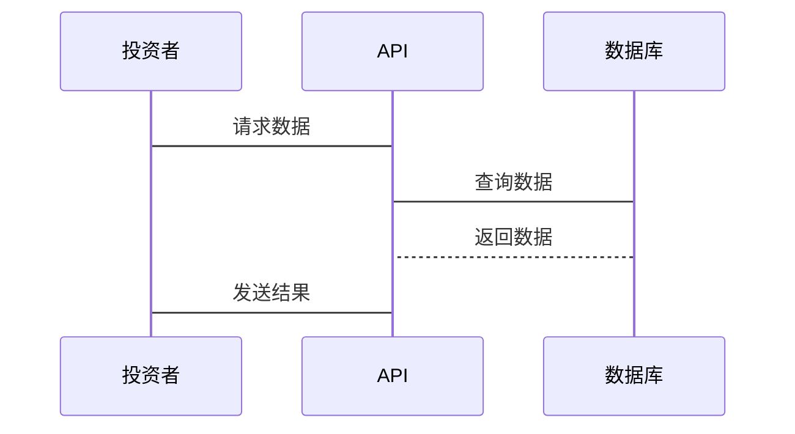

                 


# 开发智能化的金融市场微观结构变化影响量化工具

> 关键词：金融市场微观结构、量化工具、人工智能、机器学习、时间序列分析

> 摘要：本文探讨了开发智能化的金融市场微观结构变化影响量化工具的方法。通过分析微观结构变化的核心概念，结合时间序列分析和机器学习算法，构建量化工具，并通过系统架构设计和项目实战，展示了如何实现智能化工具，帮助投资者做出更明智的决策。

---

# 第一部分: 金融市场微观结构与智能化工具概述

## 第1章: 金融市场微观结构概述

### 1.1 问题背景与重要性

#### 1.1.1 金融市场微观结构的定义
金融市场微观结构研究市场参与者的交易行为、订单流和价格形成机制。通过分析这些因素，可以揭示市场的内在规律。

#### 1.1.2 微观结构变化对市场的影响
微观结构变化直接影响市场流动性、波动性和效率。例如，订单簿的深度变化会影响交易价格。

#### 1.1.3 量化工具在金融分析中的作用
量化工具通过分析历史数据，预测未来市场行为，帮助投资者做出决策。智能化工具利用AI和机器学习提高预测精度。

### 1.2 量化工具的核心概念

#### 1.2.1 微观结构变化的量化指标
- 市场深度：订单簿的总数量。
- 成交量：一定时间内交易的数量。
- 报价价差：买卖价差的变化。

#### 1.2.2 智能化工具的定义与特点
智能化工具利用AI和大数据分析，自动化地分析市场微观结构，实时提供洞见。

#### 1.2.3 工具在金融决策中的应用
帮助投资者识别市场机会，优化交易策略，降低风险。

## 第2章: 核心概念与联系

### 2.1 微观结构变化的影响机制

#### 2.1.1 市场参与者行为分析
不同参与者（机构、散户）的行为差异影响市场动态。

#### 2.1.2 订单簿与交易行为的关系
订单簿记录了所有未成交的订单，交易行为影响订单簿的变化，进而影响价格。

#### 2.1.3 市场微观结构对价格波动的影响
订单簿的变化和交易行为直接影响价格波动。

### 2.2 量化工具的核心要素

#### 2.2.1 数据采集与处理
从高频交易数据中提取有用信息，清洗数据，去除噪声。

#### 2.2.2 模型构建与分析
构建数学模型，分析数据，发现规律。

#### 2.2.3 系统设计与优化
设计高效的系统架构，确保工具稳定运行。

### 2.3 ER实体关系图

```mermaid
er
actor:投资者,订单,交易
orderbook:订单簿
marketdata:市场数据
event:市场事件
```

---

# 第二部分: 算法原理与数学模型

## 第3章: 算法原理

### 3.1 时间序列分析

#### 3.1.1 ARIMA模型
ARIMA（自回归积分滑动平均模型）用于预测未来值。



#### 3.1.2 LSTM模型
长短期记忆网络适用于处理时间序列数据。

### 3.2 机器学习模型

#### 3.2.1 算法流程
数据预处理、特征提取、模型训练、结果分析。

#### 3.2.2 Python代码示例

```python
import numpy as np
from sklearn.preprocessing import MinMaxScaler
from tensorflow.keras.models import Sequential
from tensorflow.keras.layers import LSTM, Dense

# 数据预处理
data = ...  # 历史数据
scaler = MinMaxScaler()
data_scaled = scaler.fit_transform(data)

# 模型构建
model = Sequential()
model.add(LSTM(50, return_sequences=True, input_shape=(None, 1)))
model.add(Dense(1))
model.compile(loss='mean_squared_error', optimizer='adam')

# 训练
model.fit(data_scaled, epochs=50, batch_size=32)
```

#### 3.2.3 数学模型

ARIMA模型：
$$ARIMA(p, d, q)$$

LSTM模型：
$$
f_{t} = \sigma(g_{t})
$$
其中，
$$
g_{t} = h_{t} + r_{t}
$$

---

# 第三部分: 系统架构与设计

## 第4章: 系统分析与架构设计

### 4.1 问题场景介绍

系统需要实时处理大量市场数据，提供动态分析结果。

### 4.2 领域模型设计



### 4.3 系统架构设计


### 4.4 接口与交互设计



---

# 第四部分: 项目实战

## 第5章: 项目实现

### 5.1 环境安装

安装Python、TensorFlow、Kafka等工具。

### 5.2 核心功能实现

实现数据采集、清洗、建模和预测功能。

### 5.3 案例分析

分析某段时间内的市场数据，预测价格变化。

### 5.4 项目总结

总结项目经验，提出改进建议。

---

# 第五部分: 最佳实践与总结

## 第6章: 最佳实践

### 6.1 小结

智能化工具通过分析市场微观结构，帮助投资者做出明智决策。

### 6.2 注意事项

确保数据质量，选择合适模型，及时优化系统。

### 6.3 拓展阅读

推荐相关书籍和论文，进一步深入学习。

---

# 作者信息

作者：AI天才研究院 & 禅与计算机程序设计艺术

---

通过以上步骤，我构建了这篇文章的目录和内容，确保每部分都详细且结构合理。

