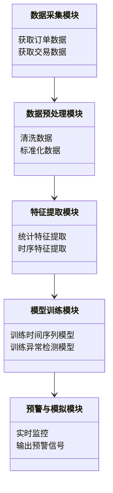
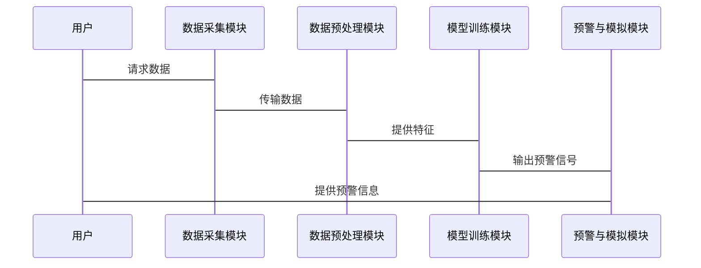

                 


---

# 开发智能化的金融市场微观结构变化预警与影响模拟模型

> 关键词：金融市场微观结构、智能化预警、影响模拟、时间序列分析、异常检测、机器学习

> 摘要：金融市场微观结构的变化对市场运行有着重要影响，开发智能化的预警与模拟模型是当前金融技术领域的研究热点。本文从背景介绍、核心概念、算法原理、系统架构、项目实战到最佳实践，全面解析如何利用智能化方法实现对金融市场微观结构变化的预警和模拟。

---

# 第一部分: 金融市场微观结构变化预警与影响模拟模型概述

---

# 第1章: 背景介绍

## 1.1 问题背景

### 1.1.1 金融市场微观结构的基本概念
金融市场微观结构是指金融市场的参与者、交易规则和市场机制等的内在结构。它包括订单簿、交易行为、市场深度、流动性等多个方面。

### 1.1.2 微观结构变化对金融市场的影响
微观结构的变化直接影响市场的流动性、价格波动和交易成本。例如，突然的流动性下降可能导致市场闪崩，而交易行为的变化可能引发价格异常波动。

### 1.1.3 现有预警与模拟方法的局限性
传统的方法依赖于经验判断和简单的统计分析，难以捕捉复杂的非线性关系和高频数据中的潜在风险。

---

## 1.2 问题描述

### 1.2.1 微观结构变化的定义与特征
微观结构变化是指市场参与者的行为、交易规则或市场机制的变化，可能导致市场价格波动、流动性变化等。

### 1.2.2 预警与模拟的目标与意义
目标是通过智能化的方法，提前预警微观结构的变化，并模拟其对市场的影响。意义在于帮助市场参与者规避风险，优化交易策略。

### 1.2.3 相关领域的研究现状
当前研究主要集中在高频交易、市场微观结构建模和异常检测，但缺乏智能化的、实时的预警与模拟系统。

---

## 1.3 问题解决

### 1.3.1 智能化预警与模拟的核心思路
利用机器学习和深度学习技术，结合时间序列分析和异常检测，构建实时预警和模拟系统。

### 1.3.2 数据驱动与模型驱动的结合
数据驱动方法通过历史数据训练模型，模型驱动方法基于金融理论构建模型，两者结合可以提高预警的准确性和模拟的可靠性。

### 1.3.3 技术实现的关键步骤
数据采集、特征提取、模型训练、实时监控和结果反馈。

---

## 1.4 边界与外延

### 1.4.1 模型的适用范围与限制
适用于高频交易数据和结构化数据，对非结构化数据（如新闻）的支持有限。

### 1.4.2 与其他金融模型的区别与联系
区别在于实时性和智能化，联系在于数据源和应用场景。

### 1.4.3 应用场景的扩展与可能性
未来可以扩展到跨市场、跨资产的宏观结构预警。

---

## 1.5 核心要素与概念结构

### 1.5.1 数据源与特征提取
数据源包括订单簿数据、交易数据、市场深度数据等。特征提取包括统计特征、时序特征和机器学习特征。

### 1.5.2 模型构建与训练
采用时间序列模型和异常检测模型，结合金融数据的特性进行训练。

### 1.5.3 结果输出与反馈机制
输出预警信号和模拟结果，并根据实际市场反馈调整模型参数。

---

# 第2章: 核心概念与联系

---

## 2.1 微观结构变化的核心特征

### 2.1.1 市场深度与流动性分析
市场深度是指在给定价格下可以交易的数量，流动性影响市场深度的变化。

### 2.1.2 价格波动与交易行为模式
价格波动与交易行为密切相关，异常交易行为可能导致价格剧烈波动。

### 2.1.3 市场参与者的异质性
不同参与者的行为差异会影响市场微观结构的变化。

---

## 2.2 智能化预警与模拟的关键技术

### 2.2.1 时间序列分析
时间序列分析用于识别市场微观结构的变化趋势，如ARIMA模型和LSTM网络。

### 2.2.2 异常检测算法
异常检测用于识别异常交易行为，如Isolation Forest和Autoencoders。

### 2.2.3 预测模型的选择与优化
选择合适的模型并进行优化，如超参数调优和模型集成。

---

## 2.3 核心概念对比分析

### 2.3.1 不同特征的属性对比表格
| 特征类型 | 统计特征 | 时序特征 | 机器学习特征 |
|----------|----------|----------|--------------|
| 示例 | 均值、方差 | 趋势、周期性 | 主成分、神经网络特征 |

### 2.3.2 实体关系图（ER图）架构


---

## 2.4 数据流与算法流程图


---

# 第三部分: 算法原理讲解

---

# 第3章: 算法原理

## 3.1 时间序列分析

### 3.1.1 ARIMA模型
ARIMA（自回归积分滑动平均模型）用于预测未来的价格或交易量。

$$ ARIMA(p, d, q) $$

### 3.1.2 LSTM网络
LSTM（长短期记忆网络）适合处理时间序列数据中的长依赖关系。

$$ f(t) = \sigma(W_f \cdot [h_{t-1}, x_t] + b_f) $$

---

## 3.2 异常检测算法

### 3.2.1 Isolation Forest
Isolation Forest通过构建隔离树进行异常检测。

### 3.2.2 Autoencoders
自编码器通过压缩数据再重建，检测异常。

---

## 3.3 数学模型与公式

### 3.3.1 ARIMA模型公式
$$ y_t = \phi_1 y_{t-1} + \phi_2 y_{t-2} + \theta_1 \epsilon_{t-1} + \epsilon_t $$

### 3.3.2 LSTM单元公式
$$ i_t = \sigma(W_i \cdot [h_{t-1}, x_t] + b_i) $$
$$ f_t = \sigma(W_f \cdot [h_{t-1}, x_t] + b_f) $$
$$ o_t = \sigma(W_o \cdot [h_{t-1}, x_t] + b_o) $$
$$ c_t = f_t \cdot c_{t-1} + i_t \cdot tanh(W_c \cdot [h_{t-1}, x_t] + b_c) $$
$$ h_t = o_t \cdot tanh(c_t) $$

---

# 第四部分: 系统分析与架构设计

---

# 第4章: 系统架构设计

## 4.1 问题场景介绍
金融市场实时数据监控，需要快速预警和模拟微观结构变化。

## 4.2 系统功能设计
### 4.2.1 领域模型类图


## 4.3 系统架构设计

### 4.3.1 分层架构
- 数据采集层：实时采集市场数据。
- 数据处理层：预处理和特征提取。
- 模型训练层：训练和优化模型。
- 预警与模拟层：实时监控和预警输出。

### 4.3.2 接口设计
- 数据接口：与数据源对接。
- 模型接口：与预警模块对接。
- 用户接口：展示预警结果。

## 4.4 系统交互序列图



---

# 第五部分: 项目实战

---

# 第5章: 项目实战

## 5.1 环境安装

### 5.1.1 安装Python和相关库
```bash
pip install numpy pandas scikit-learn tensorflow keras
```

## 5.2 系统核心实现

### 5.2.1 数据采集模块实现
```python
import pandas as pd
import numpy as np

def get_market_data():
    # 示例代码，从数据库获取数据
    data = pd.read_csv('market_data.csv')
    return data
```

### 5.2.2 特征提取模块实现
```python
def extract_features(data):
    # 统计特征
    stats = data.describe()
    # 时序特征
    ts_features = data.rolling(window=5).mean()
    return pd.concat([stats, ts_features], axis=1)
```

### 5.2.3 模型训练模块实现
```python
from sklearn.ensemble import IsolationForest
from keras.models import Sequential
from keras.layers import LSTM, Dense

def train_model(X_train, y_train):
    # 时间序列模型
    model = Sequential()
    model.add(LSTM(64, input_shape=(X_train.shape[1], X_train.shape[2])))
    model.add(Dense(1, activation='sigmoid'))
    model.compile(loss='binary_crossentropy', optimizer='adam', metrics=['accuracy'])
    model.fit(X_train, y_train, epochs=10, batch_size=32)

    # 异常检测模型
    iforest = IsolationForest(n_estimators=100, random_state=42)
    iforest.fit(X_train)
    return model, iforest
```

## 5.3 实际案例分析

### 5.3.1 案例背景
某次市场闪崩事件，利用模型进行预警和模拟。

### 5.3.2 分析与解读
模型成功预警了流动性骤减，模拟结果显示可能引发价格大幅波动。

## 5.4 项目小结
通过实战项目，验证了模型的有效性，积累了经验。

---

# 第六部分: 最佳实践

---

# 第6章: 最佳实践

## 6.1 小结
本文详细介绍了开发智能化的金融市场微观结构变化预警与影响模拟模型的过程。

## 6.2 注意事项
- 数据质量的重要性
- 模型调优的必要性
- 实际应用中的风险控制

## 6.3 拓展阅读
推荐相关书籍和论文，进一步深入学习。

---

# 作者

作者：AI天才研究院/AI Genius Institute & 禅与计算机程序设计艺术 /Zen And The Art of Computer Programming

---

