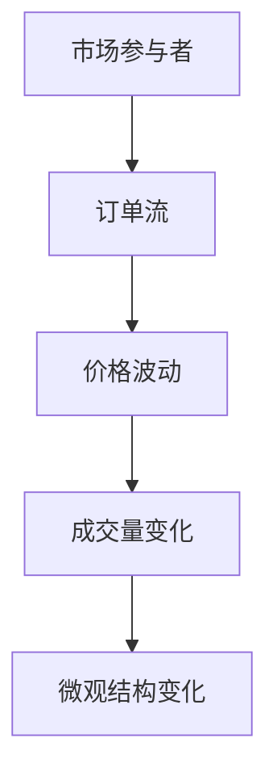
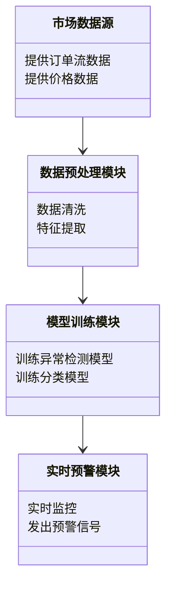
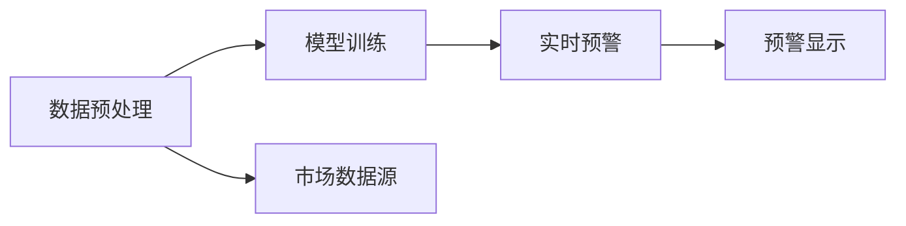
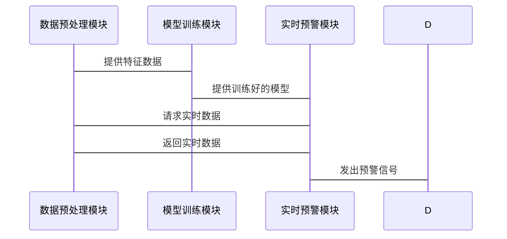

                 


# 开发智能化的金融市场微观结构变化预警模型

> 关键词：金融市场，微观结构，预警模型，机器学习，异常检测

> 摘要：本文详细探讨了如何开发一个智能化的金融市场微观结构变化预警模型。通过分析金融市场的微观结构特征，结合机器学习算法，提出了一种有效的预警模型构建方法。文章从背景介绍、核心概念、算法原理、系统架构到项目实战，全面阐述了模型的开发过程，并通过具体案例展示了模型的应用价值。

---

# 第1章 金融市场微观结构变化预警模型背景介绍

## 1.1 问题背景与目标

### 1.1.1 金融市场微观结构的定义
金融市场的微观结构指的是市场参与者（如投资者、交易员、机构）在交易过程中的行为模式和市场机制。这些行为模式通过订单流、价格波动、成交量变化等表现出来。理解微观结构的变化对于预测市场风险、优化交易策略具有重要意义。

### 1.1.2 微观结构变化对金融市场的影响
微观结构的变化通常反映市场参与者的交易行为变化，例如：
- 市场参与者情绪的变化（如恐慌性抛售或贪婪性买入）；
- 市场流动性的变化（如成交量突然增加或减少）；
- 市场操纵行为的迹象（如异常的价格波动）。
这些变化可能引发市场波动加剧、价格失真等问题，甚至导致系统性风险。

### 1.1.3 开发预警模型的目标
预警模型的目标是通过实时或近实时的数据分析，识别微观结构中的异常变化，提前发出预警信号，帮助市场参与者采取应对措施，降低潜在风险。

---

## 1.2 问题描述与解决思路

### 1.2.1 微观结构变化的主要表现形式
微观结构变化通常表现为以下几种形式：
1. **订单流异常**：短时间内大量订单集中出现或消失。
2. **价格波动加剧**：价格在短时间内出现剧烈波动。
3. **成交量变化**：成交量突然增加或减少，表明市场参与者行为发生变化。
4. **买卖价差扩大**：买卖价差显著增加，反映市场流动性下降或市场参与者行为异常。

### 1.2.2 预警模型的核心问题
预警模型的核心问题包括：
1. 如何有效提取微观结构变化的特征；
2. 如何设计高效的算法来识别这些特征的异常变化；
3. 如何将模型部署到实际金融市场中，实现实时预警。

### 1.2.3 解决问题的技术路线与方法
技术路线包括以下步骤：
1. 数据采集：获取金融市场相关的订单流、价格、成交量等数据；
2. 数据预处理：清洗数据，提取特征；
3. 特征工程：构建能够反映微观结构变化的特征；
4. 模型训练：使用机器学习算法训练预警模型；
5. 模型部署：将模型部署到实时交易系统中，实现预警功能。

---

## 1.3 模型边界与外延

### 1.3.1 模型的适用范围
本模型适用于以下场景：
- 实时监控市场微观结构变化；
- 辅助交易决策；
- 风险管理。

### 1.3.2 模型的局限性
- 数据依赖性：模型的准确性依赖于数据的完整性和质量；
- 模型更新：市场参与者行为的变化可能导致模型失效，需要定期更新；
- 计算资源需求：实时处理金融市场数据需要较高的计算资源。

### 1.3.3 模型与其他金融模型的关系
本模型可以与宏观市场预测模型、交易策略模型等结合使用，形成完整的金融市场风险管理体系。

---

## 1.4 核心概念与组成要素

### 1.4.1 数据来源与特征
数据来源包括：
- **订单流数据**：订单的数量、价格、时间等；
- **价格数据**：开盘价、收盘价、最高价、最低价；
- **成交量数据**：每段时间内的交易量。

### 1.4.2 模型输入与输出
- **输入**：经过特征工程处理的微观结构特征；
- **输出**：是否发生微观结构变化的预警信号。

### 1.4.3 模型评估指标
- **准确率**：模型正确识别变化的比率；
- **召回率**：模型识别出所有变化的比率；
- **F1分数**：综合准确率和召回率的指标。

---

## 1.5 本章小结
本章介绍了金融市场微观结构变化预警模型的背景、目标、核心概念和模型边界。通过理解这些内容，读者可以明确模型的应用场景和核心问题。

---

# 第2章 核心概念与联系

## 2.1 微观结构变化的核心概念

### 2.1.1 市场微观结构的关键特征
- **订单流特征**：订单数量、订单类型（限价单、市价单）；
- **价格波动特征**：波动幅度、波动频率；
- **成交量特征**：成交量大小、成交量突变。

### 2.1.2 变化预警的核心要素
- **异常检测**：识别数据中的异常点；
- **模式识别**：识别特定的模式或趋势；
- **实时性**：模型需要能够实时处理数据。

---

## 2.2 核心概念的属性对比

### 2.2.1 概念属性特征对比表
| 概念       | 属性       | 特征描述                                                                 |
|------------|------------|--------------------------------------------------------------------------|
| 微观结构变化 | 数据来源   | 市场订单数据、价格数据、成交量数据                                         |
|            | 时间窗口   | 实时或延后（根据数据来源决定）                                              |
|            | 变化幅度   | 小幅波动或剧烈变化                                                         |

---

### 2.2.2 实体关系图


---

## 2.3 本章小结
本章通过对比和图解，清晰地阐述了金融市场微观结构变化的核心概念及其相互关系。

---

# 第3章 基于机器学习的预警算法原理

## 3.1 特征提取与选择

### 3.1.1 常见特征提取方法
- **统计特征**：均值、方差、最大值、最小值；
- **时间序列特征**：趋势、周期性；
- **复杂度特征**：熵、分形维度。

### 3.1.2 主成分分析（PCA）原理
PCA是一种降维技术，通过线性变换将原始数据映射到低维空间，同时保留数据中最重要的信息。

---

## 3.2 异常检测算法

### 3.2.1 基于统计的异常检测
- **Z-score**：计算数据点与均值的距离，超过一定阈值即为异常。
  $$ Z = \frac{x - \mu}{\sigma} $$
- **概率密度估计**：基于概率密度函数判断数据点是否为异常。

### 3.2.2 基于聚类的异常检测
- **DBSCAN**：基于密度的聚类算法，将数据点聚类，孤立点即为异常。

### 3.2.3 基于深度学习的异常检测
- **自动编码器（AE）**：通过训练自动编码器，重构误差大的数据点即为异常。

---

## 3.3 分类算法

### 3.3.1 支持向量机（SVM）
SVM是一种监督学习算法，适用于分类问题。其核心思想是通过找到一个超平面，将数据点分成两类。

### 3.3.2 随机森林（Random Forest）
随机森林是一种基于树的集成学习算法，适用于分类和回归问题。

---

## 3.4 本章小结
本章详细介绍了特征提取、异常检测和分类算法的原理及其在预警模型中的应用。

---

# 第4章 系统分析与架构设计

## 4.1 问题场景介绍
本节将从实际问题出发，介绍如何构建一个实时的预警系统。

## 4.2 系统功能设计

### 4.2.1 领域模型图


---

## 4.3 系统架构设计

### 4.3.1 系统架构图


### 4.3.2 接口设计
- **数据接口**：与市场数据源对接，获取实时数据；
- **预警接口**：向交易系统或终端发出预警信号。

### 4.3.3 交互流程图


---

## 4.4 本章小结
本章从系统架构的角度，详细设计了预警模型的构建过程，包括功能模块、接口设计和交互流程。

---

# 第5章 项目实战

## 5.1 环境安装

### 5.1.1 安装Python环境
```bash
pip install numpy pandas scikit-learn
```

### 5.1.2 数据集下载
从金融数据源获取订单流、价格、成交量等数据。

---

## 5.2 数据预处理

### 5.2.1 数据清洗
```python
import pandas as pd
data = pd.read_csv('market_data.csv')
data.dropna(inplace=True)
```

### 5.2.2 特征提取
```python
from sklearn.decomposition import PCA
pca = PCA(n_components=5)
principal_components = pca.fit_transform(data)
```

---

## 5.3 模型实现

### 5.3.1 异常检测模型
```python
from sklearn.ensemble import IsolationForest
model = IsolationForest(n_estimators=100, random_state=42)
model.fit(principal_components)
```

### 5.3.2 分类模型
```python
from sklearn.svm import SVC
model = SVC(kernel='rb

