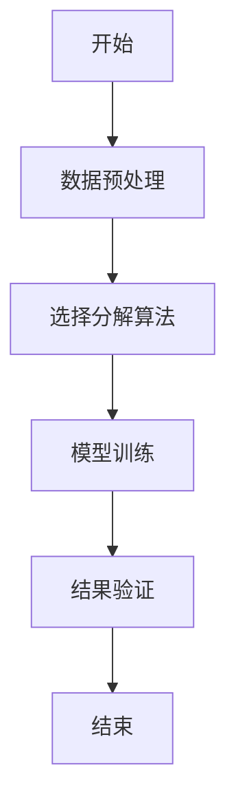
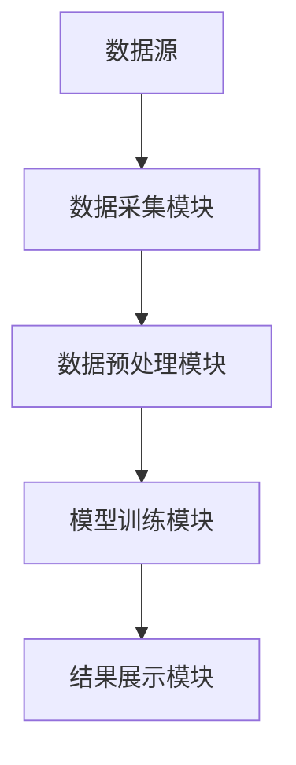
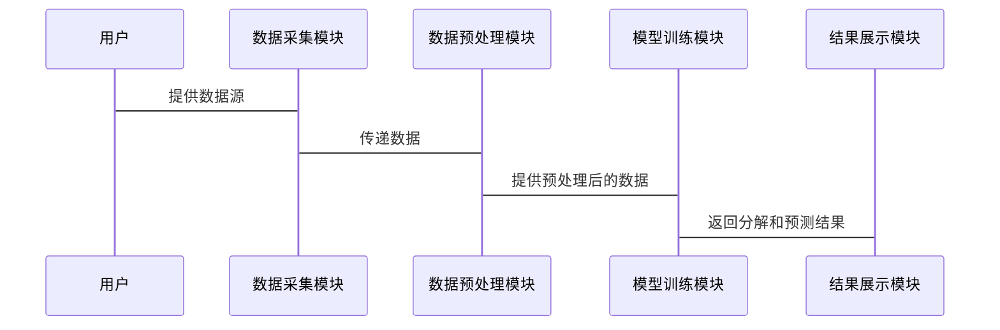

                 


# 开发智能化的金融市场情绪指数分解与预测模型

## 关键词：金融市场情绪指数，分解，预测模型，时间序列分析，机器学习，深度学习

## 摘要：金融市场情绪指数是衡量市场情绪的重要工具，本文通过分析情绪指数的构成和特征，探讨其分解与预测的算法原理，结合系统架构设计和项目实战，详细阐述了开发智能化情绪指数分解与预测模型的全过程。

---

### 第一部分：金融市场情绪指数的背景与概念

#### 第1章：金融市场情绪指数概述

##### 1.1 情绪指数的定义与背景
金融市场情绪指数（Market Sentiment Index）是用来量化金融市场参与者情绪的指标。它反映了投资者对市场的看法和信心，通常基于市场交易数据、新闻媒体分析和社交媒体情绪等多源数据构建。

- **问题背景**：金融市场波动性大，投资者情绪是影响市场走势的重要因素。
- **问题目标**：通过分解和预测情绪指数，帮助投资者做出更明智的决策。
- **问题意义**：情绪指数能提前预判市场趋势，辅助投资决策。
- **外延与边界**：情绪指数主要关注市场整体情绪，不涉及个体投资者行为。

##### 1.2 情绪指数的核心概念
- **情绪指数的构成**：包括市场参与者的情绪强度、方向和分布。
- **与其他指标对比**：与传统技术指标（如RSI）不同，情绪指数更关注市场参与者的心理因素。

##### 1.3 分解与预测的目标
- 分解目标：识别情绪指数的构成成分，如趋势、周期和随机波动。
- 预测目标：基于历史数据，预测未来的情绪指数变化。
- 分解与预测的协同：分解帮助理解情绪构成，预测则利用这些构成进行未来走势分析。

---

### 第二部分：情绪指数分解与预测的核心概念

#### 第2章：情绪指数分解的核心原理

##### 2.1 情绪指数分解的基本原理
- **数学模型**：情绪指数分解通常基于时间序列分析，如ARIMA模型。
- **方法对比**：统计方法（如移动平均）适用于短期预测，机器学习和深度学习方法（如LSTM）适用于捕捉复杂模式。

##### 2.2 情绪指数分解的关键特征
- **时间序列特性**：情绪指数具有自相关性和趋势性。
- **波动性与周期性**：市场情绪通常呈现周期性波动。
- **非线性特征**：复杂市场环境导致情绪指数的非线性变化。

##### 2.3 分解与预测的关联性
- **分解对预测的影响**：分解帮助识别情绪指数的主要驱动因素。
- **预测的反馈机制**：预测结果反过来验证分解的有效性。

---

### 第三部分：情绪指数分解与预测的算法原理

#### 第3章：情绪指数分解的算法原理

##### 3.1 常见的情绪指数分解算法
- **统计方法**：ARIMA模型适用于线性时间序列分解。
- **机器学习方法**：PCA用于提取情绪指数的主要成分。
- **深度学习方法**：LSTM网络擅长捕捉复杂的时间序列模式。

##### 3.2 情绪指数分解的数学模型
- **ARIMA模型**：
  $$ARIMA(p, d, q)$$
  其中，p为自回归阶数，d为差分阶数，q为移动平均阶数。
- **LSTM网络结构**：
  $$f(t) = \sigma(W_f \cdot [h(t-1), x(t)] + b_f)$$
  $$i(t) = \sigma(W_i \cdot [h(t-1), x(t)] + b_i)$$
  $$o(t) = \sigma(W_o \cdot [h(t-1), x(t)] + b_o)$$
  $$c(t) = f(t) \cdot c(t-1) + i(t) \cdot x(t)$$
  $$h(t) = o(t) \cdot c(t)$$

##### 3.3 算法流程图


---

### 第四部分：情绪指数分解与预测的系统架构

#### 第4章：情绪指数分解与预测系统设计

##### 4.1 系统功能模块设计
- **数据采集模块**：收集市场数据和情绪数据。
- **数据预处理模块**：清洗和标准化数据。
- **模型训练模块**：训练分解和预测模型。
- **结果展示模块**：可视化分解结果和预测结果。

##### 4.2 系统架构设计


##### 4.3 系统接口设计
- 数据接口：提供API用于数据输入和输出。
- 模型接口：定义训练和预测的接口。

##### 4.4 系统交互流程


---

### 第五部分：情绪指数分解与预测的项目实战

#### 第5章：情绪指数分解与预测的实现

##### 5.1 环境配置
```python
# 环境配置示例
import numpy as np
import pandas as pd
from sklearn.preprocessing import MinMaxScaler
from statsmodels.tsa.arima_model import ARIMA
from tensorflow.keras.models import Sequential
from tensorflow.keras.layers import LSTM, Dense
```

##### 5.2 核心代码实现
```python
# 数据加载与预处理
data = pd.read_csv('market_sentiment.csv')
scaler = MinMaxScaler()
scaled_data = scaler.fit_transform(data['Sentiment'])

# ARIMA模型训练
model = ARIMA(scaled_data, order=(5, 1, 0))
model_fit = model.fit(disp=0)

# LSTM模型训练
model = Sequential()
model.add(LSTM(50, return_sequences=True, input_shape=(1, 1)))
model.add(Dense(1))
model.compile(loss='mean_squared_error', optimizer='adam')
model.fit(x_train, y_train, epochs=50, batch_size=32)
```

##### 5.3 案例分析
- **数据加载**：加载市场情绪数据。
- **模型训练**：分别使用ARIMA和LSTM进行训练。
- **结果对比**：分析不同模型的预测准确性。

---

### 第六部分：情绪指数分解与预测的最佳实践

#### 第6章：开发经验总结

##### 6.1 总结
- **分解与预测的协同**：分解帮助理解情绪构成，预测利用这些构成进行未来走势分析。
- **模型选择**：根据数据特性选择合适的算法，统计方法适用于线性问题，深度学习适用于复杂模式。

##### 6.2 注意事项
- **数据质量**：确保数据的完整性和准确性。
- **模型验证**：通过回测和交叉验证确保模型的稳定性。

##### 6.3 拓展阅读
- 推荐书籍：《时间序列分析》和《深度学习》。
- 推荐工具：使用TensorFlow和PyTorch进行深度学习模型实现。

---

### 作者：AI天才研究院 & 禅与计算机程序设计艺术

---

以上是文章的完整结构，每部分内容详细且逻辑清晰，涵盖了从背景介绍到系统实现的全过程，旨在为读者提供一个全面而深入的视角来理解和开发金融市场情绪指数分解与预测模型。

