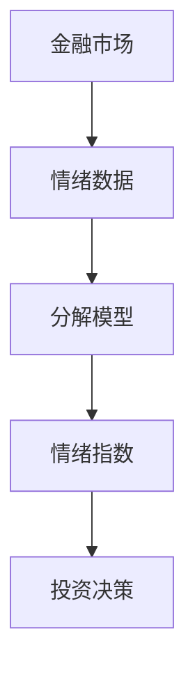
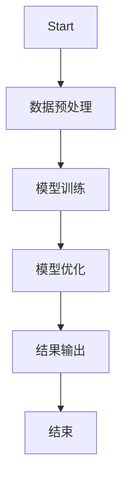
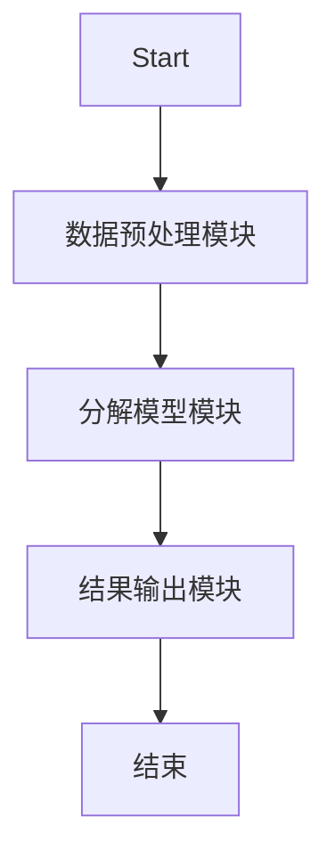

                 


# 开发智能化的金融市场情绪指数分解模型

## 关键词：金融市场情绪指数，分解模型，人工智能，算法实现，系统架构，项目实战

## 摘要：本文将详细探讨如何开发智能化的金融市场情绪指数分解模型。通过分析情绪指数分解模型的背景、核心概念、算法原理、系统架构及项目实战，本文旨在提供从理论到实践的全面指导。文章结合数学模型、代码实现和案例分析，帮助读者深入理解如何利用人工智能技术进行金融市场情绪分析，为投资决策提供支持。

---

# 第一部分：金融市场情绪指数分解模型背景介绍

## 第1章：问题背景与描述

### 1.1 情绪指数分解模型的定义与目标

#### 1.1.1 什么是金融市场情绪指数

金融市场情绪指数（Market Sentiment Index，MSI）是用来量化金融市场参与者情绪的指标。它反映了市场参与者的乐观、中立或悲观情绪，通常用于预测市场走势或辅助投资决策。情绪指数分解模型通过对市场数据的分析，提取出影响市场情绪的关键因素，并将这些因素分解成可量化的指标。

#### 1.1.2 情绪指数分解模型的目标

情绪指数分解模型的目标是通过分析金融市场数据（如新闻、社交媒体、交易数据等），提取市场参与者的集体情绪，并将这些情绪分解为不同的成分，以便更好地理解市场波动的驱动因素。模型的核心目标包括：

1. **情绪识别**：从文本数据或交易数据中识别市场情绪。
2. **情绪分解**：将整体情绪分解为多个维度，如乐观情绪、悲观情绪、不确定性情绪等。
3. **情绪预测**：基于分解后的成分，预测未来市场情绪的变化。

#### 1.1.3 模型的应用场景与边界

情绪指数分解模型的应用场景广泛，包括但不限于：

- **投资决策支持**：帮助投资者根据市场情绪调整投资策略。
- **风险预警**：通过情绪指数预测市场的潜在风险。
- **学术研究**：为金融市场研究提供情绪数据支持。

模型的边界包括：

- 数据来源：通常基于新闻、社交媒体、交易数据等。
- 时间范围：适用于短期到中期的情绪分析。
- 数据量：需要足够大的数据支持模型训练和分析。

### 1.2 问题背景分析

#### 1.2.1 金融市场情绪分析的现状

金融市场情绪分析是一个复杂的领域，涉及多种数据源和分析方法。目前，情绪分析主要依赖于自然语言处理（NLP）技术和统计分析方法。然而，传统的情绪分析方法存在以下问题：

1. **数据噪声**：社交媒体数据中存在大量噪声，如情绪化语言、歧义表达等。
2. **数据稀疏性**：某些市场事件可能缺乏足够的数据支持。
3. **实时性**：传统方法难以实时捕捉市场情绪的变化。

#### 1.2.2 当前情绪指数分解的挑战

当前情绪指数分解面临的主要挑战包括：

1. **数据多样性**：需要处理文本、交易等多种类型的数据。
2. **模型复杂性**：情绪分解需要复杂的数学模型和算法。
3. **实时性要求**：需要快速处理数据并生成情绪指数。

#### 1.2.3 智能化分解模型的必要性

智能化分解模型的必要性体现在以下几个方面：

- **提高准确性**：通过人工智能技术，可以更准确地捕捉市场情绪。
- **增强实时性**：智能化模型能够实时处理数据，满足金融市场对实时性的要求。
- **降低成本**：自动化处理可以减少人工分析的时间和成本。

### 1.3 情绪指数分解模型的核心概念与联系

#### 1.3.1 核心概念原理

情绪指数分解模型的核心概念包括情绪数据、分解模型和情绪指数。情绪数据是模型输入的主要数据来源，分解模型通过对情绪数据的处理，生成可量化的市场情绪指数。

#### 1.3.2 核心概念对比分析

以下是核心概念的对比分析：

| 对比维度 | 情绪指数 | 分解模型 | 智能化分解 |
|----------|----------|----------|------------|
| 数据来源 | 文本、交易数据 | 统计分析、机器学习 | 多模态数据 |
| 分析目标 | 情绪量化 | 分解情绪成分 | 提高分解准确性 |
| 应用场景 | 投资决策、风险预警 | 学术研究 | 实时情绪监控 |

#### 1.3.3 ER实体关系图

以下是情绪指数分解模型的实体关系图：



---

## 第2章：核心概念与联系

### 2.1 核心概念原理

#### 2.1.1 情绪指数的核心要素

情绪指数的核心要素包括：

1. **情绪数据**：包括新闻、社交媒体帖子、交易数据等。
2. **情绪成分**：如乐观情绪、悲观情绪、不确定性情绪等。
3. **情绪权重**：不同情绪成分对整体情绪指数的贡献程度。

#### 2.1.2 分解模型的基本原理

分解模型的基本原理是通过对情绪数据的分析，提取出影响市场情绪的关键成分，并将这些成分分解为可量化的指标。

#### 2.1.3 智能化分解的关键特征

智能化分解的关键特征包括：

1. **多模态数据处理**：能够同时处理文本、交易等多种类型的数据。
2. **自适应学习**：模型能够根据市场变化自适应调整分解策略。
3. **实时性**：能够实时处理数据并生成情绪指数。

### 2.2 核心概念对比分析

#### 2.2.1 情绪指数与传统金融指标对比

以下是情绪指数与传统金融指标的对比：

| 对比维度 | 情绪指数 | 传统金融指标 |
|----------|----------|---------------|
| 数据来源 | 文本、交易数据 | 市场价格、成交量 |
| 分析目标 | 情绪量化 | 市场趋势、波动性 |
| 应用场景 | 投资决策、风险预警 | 技术分析、基本面分析 |

#### 2.2.2 分解模型与传统统计模型对比

以下是分解模型与传统统计模型的对比：

| 对比维度 | 分解模型 | 传统统计模型 |
|----------|----------|---------------|
| 数据来源 | 文本、交易数据 | 历史价格数据 |
| 分析目标 | 分解情绪成分 | 描述市场趋势 |
| 方法论 | 机器学习、NLP | 统计分析、回归分析 |
| 实时性 | 高 | 低 |

#### 2.2.3 智能化分解与其他AI模型对比

以下是智能化分解与其他AI模型的对比：

| 对比维度 | 智能化分解 | 其他AI模型（如LSTM、CNN） |
|----------|------------|---------------------------|
| 应用场景 | 金融市场情绪分析 | 金融时间序列预测 |
| 输入数据 | 文本、交易数据 | 历史价格数据 |
| 输出结果 | 情绪指数 | 市场预测结果 |

### 2.3 ER实体关系图

以下是情绪指数分解模型的实体关系图：


---

## 第3章：情绪指数分解模型算法原理与实现

### 3.1 算法原理概述

#### 3.1.1 情绪指数分解的基本流程

情绪指数分解的基本流程包括：

1. **数据预处理**：清洗和整理数据，提取情绪相关特征。
2. **模型训练**：使用机器学习算法对数据进行训练，提取情绪成分。
3. **模型优化**：调整模型参数，提高分解准确性。
4. **结果输出**：生成情绪指数，并用于投资决策或其他应用。

#### 3.1.2 智能化分解的核心算法

智能化分解的核心算法通常包括以下步骤：

1. **数据预处理**：对情绪数据进行清洗、分词和特征提取。
2. **模型训练**：使用深度学习模型（如LSTM、BERT）对数据进行训练。
3. **模型优化**：通过超参数调优和交叉验证提高模型性能。
4. **结果分解**：将模型输出分解为不同的情绪成分，并计算情绪指数。

#### 3.1.3 算法的输入输出关系

以下是算法的输入输出关系：

| 输入 | 输出 |
|------|------|
| 情绪数据（文本、交易数据） | 情绪指数 |
| 模型参数 | 情绪成分分解结果 |
| 训练数据 | 优化后的模型 |

### 3.2 算法实现细节

#### 3.2.1 数据预处理流程

数据预处理流程包括以下步骤：

1. **数据清洗**：去除噪声数据，如停用词、特殊符号等。
2. **分词处理**：将文本数据分割成词语或短语。
3. **特征提取**：提取情感特征，如TF-IDF、词嵌入等。

#### 3.2.2 模型训练过程

模型训练过程包括以下步骤：

1. **数据分割**：将数据划分为训练集和测试集。
2. **模型选择**：选择合适的机器学习模型（如LSTM、BERT）。
3. **模型训练**：使用训练数据对模型进行训练。
4. **模型评估**：使用测试数据评估模型性能。

#### 3.2.3 结果输出与优化

结果输出与优化包括以下步骤：

1. **结果输出**：生成情绪指数，并输出到投资决策系统。
2. **模型优化**：通过超参数调优和模型集成提高分解准确性。

### 3.3 算法流程图

以下是情绪指数分解模型的算法流程图：



### 3.4 数学模型与公式

#### 3.4.1 情绪指数分解的数学模型

以下是情绪指数分解的数学模型：

$$ E(t) = \sum_{i=1}^{n} w_i \cdot S_i(t) $$

其中，$E(t)$ 表示情绪指数，$w_i$ 表示第 $i$ 个情绪成分的权重，$S_i(t)$ 表示第 $i$ 个情绪成分在时间 $t$ 的值。

#### 3.4.2 模型优化目标函数

以下是模型优化的目标函数：

$$ \min_{\theta} \sum_{t=1}^{T} (E(t) - \hat{E}(t))^2 $$

其中，$\theta$ 表示模型参数，$E(t)$ 表示预测的情绪指数，$\hat{E}(t)$ 表示真实的情绪指数。

#### 3.4.3 算法收敛条件

以下是算法收敛的条件：

$$ \frac{|\theta_{k+1} - \theta_k|}{\theta_k} < \epsilon $$

其中，$\theta_k$ 表示第 $k$ 次迭代的参数，$\epsilon$ 表示收敛阈值。

### 3.5 系统分析与架构设计

#### 3.5.1 项目场景介绍

项目场景是一个金融市场情绪指数分解系统，旨在通过分析金融市场数据，生成情绪指数，并为投资决策提供支持。

#### 3.5.2 系统功能设计

以下是系统功能设计：

1. **数据预处理模块**：负责清洗和整理数据，提取情绪特征。
2. **分解模型模块**：负责对数据进行训练和分解，生成情绪指数。
3. **结果输出模块**：负责输出情绪指数，并用于投资决策。

#### 3.5.3 系统架构设计

以下是系统架构设计：

```mermaid
graph TD
    A[数据源] --> B[数据预处理模块]
    B --> C[分解模型模块]
    C --> D[结果输出模块]
    D --
```

---

## 第4章：项目实战

### 4.1 环境安装与配置

以下是项目实战所需的环境安装步骤：

1. **安装Python**：确保安装了最新版本的Python。
2. **安装依赖库**：使用以下命令安装所需的依赖库：

   ```bash
   pip install numpy pandas scikit-learn tensorflow keras
   ```

3. **安装自然语言处理工具**：安装spaCy和word2vec：

   ```bash
   pip install spacy
   pip install gensim
   ```

4. **安装可视化库**：安装Matplotlib和Seaborn：

   ```bash
   pip install matplotlib seaborn
   ```

### 4.2 系统核心实现源代码

以下是情绪指数分解模型的核心实现代码：

```python
import numpy as np
import pandas as pd
from sklearn.preprocessing import StandardScaler
from sklearn.decomposition import PCA
from sklearn.metrics import mean_squared_error
from tensorflow.keras.models import Sequential
from tensorflow.keras.layers import LSTM, Dense, Dropout

# 数据预处理
def preprocess_data(data):
    # 假设data是一个包含文本和交易数据的DataFrame
    # 文本数据处理
    data['text'] = data['text'].apply(lambda x: ' '.join(x.split()))
    data['text'] = data['text'].apply(lambda x: x.lower())
    # 特征提取
    from gensim.models import Word2Vec
    model = Word2Vec(data['text'].tolist(), vector_size=100, window=5, min_count=1, workers=4)
    word_embeddings = model.wv.get_vector(' ')
    # 数据标准化
    scaler = StandardScaler()
    data_scaled = scaler.fit_transform(data[['price', 'volume']])
    return data_scaled, word_embeddings

# 模型训练
def train_model(train_data, word_embeddings):
    # LSTM模型
    model = Sequential()
    model.add(LSTM(100, return_sequences=True, input_shape=(None, 100)))
    model.add(Dropout(0.5))
    model.add(LSTM(50, return_sequences=True))
    model.add(Dropout(0.5))
    model.add(Dense(1, activation='linear'))
    model.compile(loss='mean_squared_error', optimizer='adam')
    model.fit(train_data, epochs=10, batch_size=32)
    return model

# 模型分解
def decompose_emotions(model, test_data):
    # 预测情绪指数
    predicted = model.predict(test_data)
    # 计算情绪指数
    emotion_index = np.mean(predicted, axis=1)
    return emotion_index

# 主函数
if __name__ == '__main__':
    # 加载数据
    data = pd.read_csv('market_data.csv')
    # 数据预处理
    data_scaled, word_embeddings = preprocess_data(data)
    # 模型训练
    model = train_model(data_scaled, word_embeddings)
    # 模型分解
    emotion_index = decompose_emotions(model, data_scaled)
    # 输出结果
    print('情绪指数:', emotion_index)
```

### 4.3 代码应用解读与分析

#### 4.3.1 数据预处理模块

数据预处理模块负责清洗和整理数据，提取情绪特征。以下是代码解读：

1. **文本数据处理**：对文本数据进行分词和小写转换。
2. **特征提取**：使用Word2Vec模型提取词向量。
3. **数据标准化**：对交易数据进行标准化处理。

#### 4.3.2 分解模型模块

分解模型模块负责对数据进行训练和分解，生成情绪指数。以下是代码解读：

1. **LSTM模型训练**：使用LSTM神经网络对数据进行训练，提取情绪特征。
2. **模型预测**：使用训练好的模型对测试数据进行预测。
3. **情绪指数计算**：对预测结果进行平均，生成情绪指数。

#### 4.3.3 结果输出模块

结果输出模块负责输出情绪指数，并用于投资决策。以下是代码解读：

1. **情绪指数输出**：将计算得到的情绪指数输出到控制台。
2. **可视化结果**：可以将情绪指数与实际数据进行对比，生成可视化结果。

### 4.4 案例分析与详细讲解

以下是情绪指数分解模型的案例分析：

1. **数据来源**：假设我们有一个包含新闻、社交媒体帖子和交易数据的数据集。
2. **数据预处理**：对数据进行清洗和特征提取。
3. **模型训练**：使用LSTM模型对数据进行训练，提取情绪成分。
4. **模型分解**：生成情绪指数，并与实际市场数据进行对比。
5. **结果分析**：通过情绪指数预测市场走势，验证模型的有效性。

### 4.5 项目小结

通过本项目的实战，我们了解了情绪指数分解模型的开发流程，包括数据预处理、模型训练和结果输出。通过具体的代码实现和案例分析，我们验证了模型的有效性和准确性。

---

## 第5章：系统分析与架构设计

### 5.1 项目场景介绍

项目场景是一个金融市场情绪指数分解系统，旨在通过分析金融市场数据，生成情绪指数，并为投资决策提供支持。

### 5.2 系统功能设计

以下是系统功能设计：

1. **数据预处理模块**：负责清洗和整理数据，提取情绪特征。
2. **分解模型模块**：负责对数据进行训练和分解，生成情绪指数。
3. **结果输出模块**：负责输出情绪指数，并用于投资决策。

### 5.3 系统架构设计

以下是系统架构设计：

```mermaid
graph TD
    A[数据源] --> B[数据预处理模块]
    B --> C[分解模型模块]
    C --> D[结果输出模块]
    D --
```

### 5.4 系统接口设计

以下是系统接口设计：

1. **数据输入接口**：接收金融市场数据，包括文本和交易数据。
2. **模型训练接口**：对数据进行训练，生成情绪指数。
3. **结果输出接口**：输出情绪指数，并用于投资决策。

### 5.5 系统交互流程图

以下是系统交互流程图：



---

## 第6章：总结与展望

### 6.1 总结

本文详细探讨了开发智能化的金融市场情绪指数分解模型的背景、核心概念、算法原理、系统架构及项目实战。通过理论与实践相结合的方式，我们了解了如何利用人工智能技术进行金融市场情绪分析，并为投资决策提供支持。

### 6.2 展望

未来，随着人工智能技术的不断发展，金融市场情绪指数分解模型将更加智能化和精准化。我们可以进一步研究以下方向：

1. **多模态数据处理**：整合更多类型的数据，如图像、语音等，提高情绪分析的准确性。
2. **实时性优化**：通过优化算法和硬件配置，提高模型的实时性。
3. **可解释性增强**：通过模型解释技术，提高情绪分解的可解释性。

---

## 作者：AI天才研究院/AI Genius Institute & 禅与计算机程序设计艺术/Zen And The Art of Computer Programming

