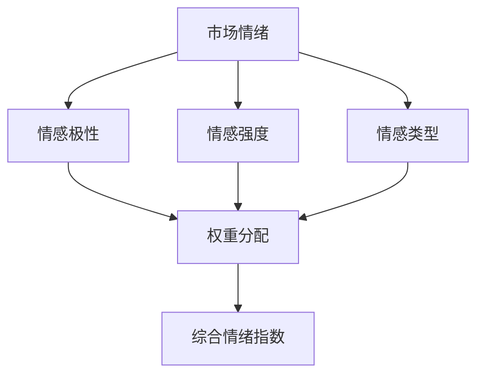
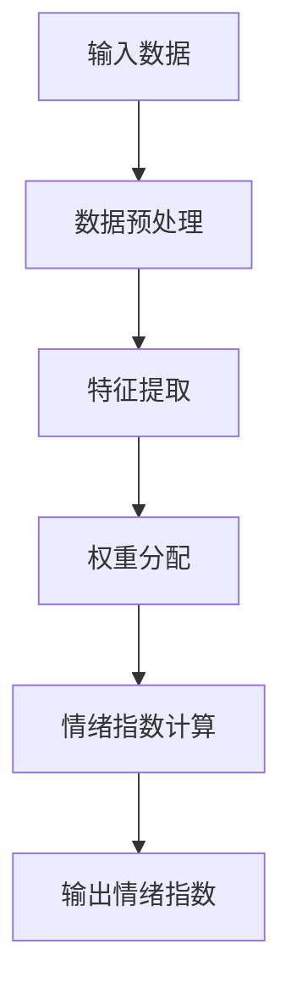
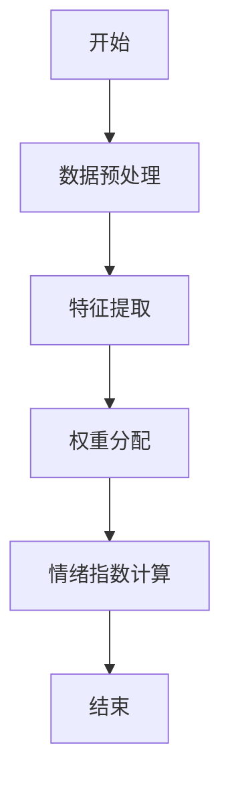
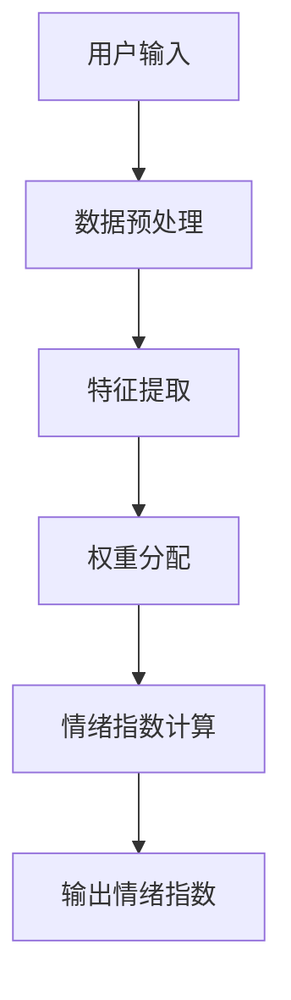
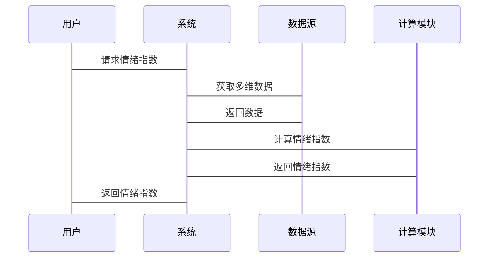

                 


# 开发智能化的金融市场情绪指数多维度分解模型

> 关键词：金融市场情绪指数、多维度分解模型、人工智能、大数据分析、量化交易

> 摘要：本文深入探讨了如何利用人工智能和大数据技术开发金融市场情绪指数的多维度分解模型。文章从问题背景出发，分析了情绪指数的重要性及其在投资决策中的应用价值。通过构建数学模型和算法，详细阐述了分解模型的原理和实现过程。最后，结合实际案例，展示了模型在量化交易中的应用，并提出了未来的研究方向。

---

## 第一部分：背景介绍

### 第1章：问题背景与应用价值

#### 1.1 问题背景
- 1.1.1 金融市场情绪分析的重要性  
金融市场的情绪分析能够帮助投资者理解市场的整体情绪，从而做出更明智的投资决策。情绪波动往往会影响资产价格，因此准确捕捉和量化这些情绪变化对于投资策略的制定至关重要。

- 1.1.2 情绪指数在投资决策中的作用  
情绪指数可以作为量化交易的重要参考指标，帮助投资者识别市场趋势和潜在风险。例如，投资者可以根据情绪指数调整仓位，规避市场恐慌或贪婪带来的非理性波动。

- 1.1.3 当前情绪分析的局限性  
传统的单一维度情绪分析方法难以捕捉市场的复杂性和多样性。例如，仅通过新闻标题或社交媒体数据进行分析，可能会忽略其他重要的市场信号，导致分析结果的片面性。

#### 1.2 问题描述
- 1.2.1 情绪指数的多维度特性  
金融市场情绪受多种因素影响，包括市场参与者的预期、宏观经济数据、政策变化等。单一维度的情绪分析难以全面反映市场的复杂性。

- 1.2.2 市场情绪的动态变化  
市场情绪并非一成不变，它会随着时间和事件的变化而波动。因此，情绪指数需要能够实时捕捉这些变化，并进行动态调整。

- 1.2.3 数据来源的多样性  
情绪数据来源广泛，包括新闻、社交媒体、交易数据等。如何有效整合这些数据，并提取有用的信息，是构建情绪指数的关键挑战。

#### 1.3 问题解决思路
- 1.3.1 多维度分解模型的提出  
为了克服传统方法的局限性，提出了一种多维度分解模型，将市场情绪分解为多个维度的综合指标。

- 1.3.2 模型的目标与核心问题  
模型的目标是将多维度的情绪数据进行分解，提取每个维度的特征，并综合这些特征形成最终的情绪指数。核心问题包括如何选择维度、如何提取特征、如何进行权重分配等。

- 1.3.3 解决方案的创新性  
通过引入先进的机器学习算法和大数据处理技术，模型能够更准确地捕捉市场情绪的变化，并提供实时的指数更新。

#### 1.4 相关技术与应用价值
- 1.4.1 AI与大数据技术的结合  
人工智能技术（如自然语言处理、深度学习）与大数据分析技术的结合，为情绪指数的构建提供了强大的技术支持。

- 1.4.2 情绪指数在量化交易中的应用  
情绪指数可以作为量化交易的输入信号，帮助算法模型做出更精准的交易决策。

- 1.4.3 模型的市场价值与社会意义  
情绪指数的准确量化有助于提高市场的透明度，降低信息不对称带来的市场风险，促进金融市场的健康发展。

---

## 第二部分：核心概念与联系

### 第2章：情绪指数与分解模型的核心概念

#### 2.1 情绪指数的定义与属性
- 2.1.1 情绪指数的定义  
情绪指数是衡量市场参与者情绪状态的综合指标，通常基于多种数据源（如新闻、社交媒体、交易数据等）进行计算。

- 2.1.2 情绪指数的属性对比（表格）  
| 属性         | 描述                                                                 |
|--------------|----------------------------------------------------------------------|
| 数据来源     | 包括新闻、社交媒体、交易数据等                                             |
| 计算维度     | 情感极性、情感强度、情感类型等                                             |
| 更新频率     | 可以是实时更新或按固定周期更新                                               |

- 2.1.3 情绪指数的计算维度  
情绪指数的计算通常涉及多个维度，如市场参与者的信心、投资者的乐观程度、市场的波动性等。

#### 2.2 分解模型的原理与结构
- 2.2.1 模型的基本原理  
多维度分解模型通过将情绪数据分解为多个维度的特征，并对每个维度进行独立分析，最终将这些特征综合起来形成整体的情绪指数。

- 2.2.2 分解模型的结构图（Mermaid）  


- 2.2.3 情绪指数与分解模型的关系  
情绪指数是分解模型的输出结果，而分解模型则是实现情绪指数计算的核心工具。

#### 2.3 情绪指数与分解模型的关系
- 2.3.1 数据流分析（Mermaid）  


- 2.3.2 实体关系图（ER图）  
```mermaid
erd
    participant 市场情绪
    participant 数据来源
    participant 情绪维度
    participant 权重
    participant 情绪指数

    市场情绪 --> 数据来源: 包含
    市场情绪 --> 情绪维度: 分解为
    情绪维度 --> 权重: 根据分配
    权重 --> 情绪指数: 综合计算
```

---

## 第三部分：算法原理

### 第3章：分解模型的算法设计

#### 3.1 算法概述
- 3.1.1 算法的目标  
算法的目标是将多维度的情绪数据分解为多个特征，并计算这些特征的综合情绪指数。

- 3.1.2 算法的输入与输出  
输入：多维度的情绪数据（如情感极性、情感强度、情感类型等）。输出：综合情绪指数。

- 3.1.3 算法的流程（Mermaid）  


#### 3.2 数学模型与公式
- 3.2.1 情绪指数的分解公式  
$$ E = \sum_{i=1}^{n} w_i x_i $$  
其中，$E$ 是情绪指数，$w_i$ 是第 $i$ 个维度的权重，$x_i$ 是第 $i$ 个维度的特征值。

- 3.2.2 权重计算公式  
$$ w_i = \frac{e_i}{\sum_{j=1}^{n} e_j} $$  
其中，$w_i$ 是第 $i$ 个维度的权重，$e_i$ 是第 $i$ 个维度的情感强度，$\sum_{j=1}^{n} e_j$ 是所有维度情感强度的总和。

- 3.2.3 模型优化公式  
$$ \theta = \arg \min_{\theta} \sum_{i=1}^{m} (y_i - f(x_i))^2 $$  
其中，$\theta$ 是模型参数，$y_i$ 是实际情绪指数，$f(x_i)$ 是模型预测值。

#### 3.3 算法实现与代码示例
- 3.3.1 环境安装  
需要安装Python和相关库（如NumPy、Pandas、Scikit-learn等）。

- 3.3.2 核心代码实现  
```python
import numpy as np
from sklearn.decomposition import PCA

# 示例数据：多维情绪特征
X = np.array([[8, 2, 3], [5, 6, 7], [4, 10, 1]])

# 使用PCA进行特征分解
pca = PCA(n_components=2)
pca.fit(X)
principal_components = pca.transform(X)

# 计算权重
weights = np.sum(principal_components, axis=0) / np.sum(np.sum(principal_components, axis=0))

# 计算综合情绪指数
E = np.dot(weights, principal_components.T)
```

- 3.3.3 代码解读  
上述代码使用主成分分析（PCA）对多维情绪数据进行降维，计算每个维度的权重，并最终得到综合情绪指数。

---

## 第四部分：系统分析与架构设计

### 第4章：系统架构设计

#### 4.1 项目背景
项目旨在开发一个智能化的金融市场情绪指数多维度分解模型，为投资者提供实时的情绪指数，辅助投资决策。

#### 4.2 系统功能设计
- 4.2.1 数据预处理模块  
负责清洗和标准化输入数据，确保数据的质量和一致性。

- 4.2.2 特征提取模块  
从多维度数据中提取情感特征，如情感极性、情感强度等。

- 4.2.3 权重分配模块  
根据特征的重要性分配权重，通常使用机器学习算法进行优化。

- 4.2.4 情绪指数计算模块  
根据权重和特征计算综合情绪指数。

#### 4.3 系统架构设计（Mermaid）  


#### 4.4 系统接口设计
- API接口：提供情绪指数查询接口，支持实时查询和历史数据查询。

#### 4.5 系统交互设计（Mermaid）  


---

## 第五部分：项目实战

### 第5章：项目实现与案例分析

#### 5.1 环境安装
需要安装Python、NumPy、Pandas、Scikit-learn、Plotly等库。

#### 5.2 核心代码实现
```python
import numpy as np
import pandas as pd
from sklearn.decomposition import PCA
from sklearn.preprocessing import StandardScaler

# 示例数据：包含新闻标题、社交媒体情绪、交易数据等
data = pd.DataFrame({
    'news_sentiment': [0.8, 0.5, 0.7],
    'social_sentiment': [0.6, 0.4, 0.9],
    'volume': [1000, 800, 1200]
})

# 数据标准化
scaler = StandardScaler()
scaled_data = scaler.fit_transform(data)

# 使用PCA进行特征分解
pca = PCA(n_components=2)
pca.fit(scaled_data)
principal_components = pca.transform(scaled_data)

# 计算权重
weights = np.sum(principal_components, axis=0) / np.sum(np.sum(principal_components, axis=0))

# 计算综合情绪指数
E = np.dot(weights, principal_components.T)
print("综合情绪指数：", E)
```

#### 5.3 代码解读
上述代码展示了如何从多维数据中提取特征、标准化数据、进行主成分分析，并计算综合情绪指数。

#### 5.4 案例分析
以某次市场波动为例，展示模型如何根据多维数据计算情绪指数，并分析其在实际投资中的应用。

---

## 第六部分：总结与展望

### 第6章：总结与未来研究方向

#### 6.1 最佳实践 tips
- 数据来源的多样性是模型准确性的关键，建议整合尽可能多的市场数据。
- 模型的权重分配需要根据实际情况进行调整，可以通过回测来优化。

#### 6.2 小结
本文详细介绍了如何开发智能化的金融市场情绪指数多维度分解模型，从问题背景到算法实现，再到系统设计和项目实战，为读者提供了全面的指导。

#### 6.3 注意事项
- 模型的实时性要求较高，需要考虑数据处理的效率。
- 情绪数据可能存在噪声，需要进行有效的数据清洗和特征选择。

#### 6.4 未来研究方向
- 研究更复杂的深度学习模型，如LSTM，以捕捉情绪的时间依赖性。
- 结合市场微观结构数据，进一步提升情绪指数的预测能力。

---

## 作者：AI天才研究院/AI Genius Institute & 禅与计算机程序设计艺术 /Zen And The Art of Computer Programming

---

通过以上目录大纲，可以清晰地看到文章的逻辑结构和主要内容。每一章都深入浅出地解释了相关概念和实现细节，帮助读者系统地理解和掌握开发智能化的金融市场情绪指数多维度分解模型的方法和技巧。

