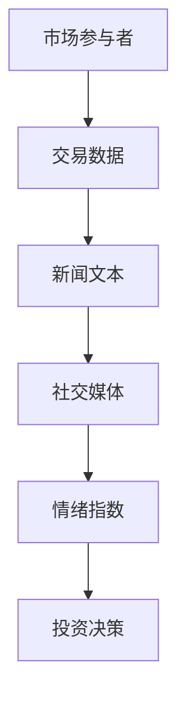
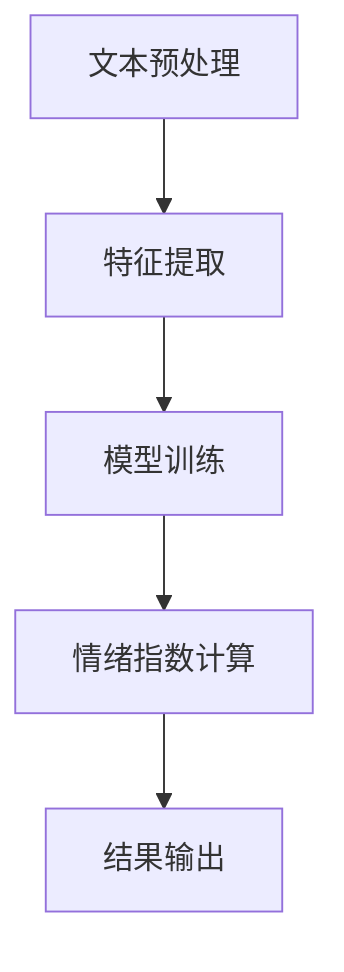
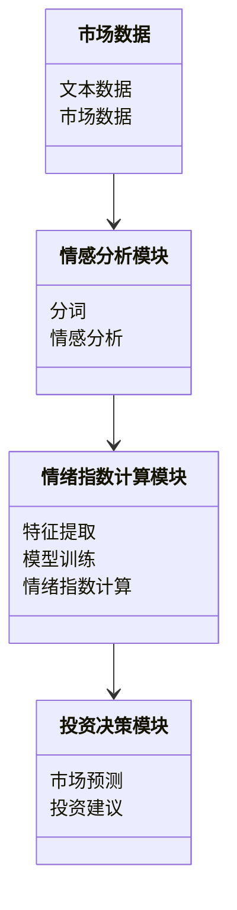
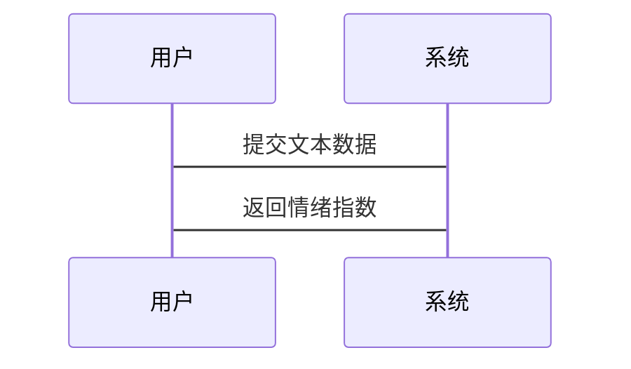

                 


# 开发智能化的金融市场情绪指数模型

**关键词**：金融市场、情绪指数、人工智能、深度学习、自然语言处理、投资决策

**摘要**：本文详细探讨了开发智能化的金融市场情绪指数模型的全过程。首先介绍了情绪指数的基本概念及其在金融市场中的重要性，接着分析了情绪指数模型的核心概念与联系，随后深入讲解了基于深度学习的算法原理和数学模型。最后，通过系统架构设计和项目实战，展示了如何将理论应用于实际投资决策中。本文旨在为金融从业者和数据科学家提供一份全面的技术指南，帮助他们更好地理解和应用情绪指数模型。

---

## 第一部分: 智能化金融市场情绪指数模型开发基础

### 第1章: 金融市场情绪指数概述

#### 1.1 情绪指数的基本概念

##### 1.1.1 情绪指数的定义
情绪指数是一种量化市场参与者情绪状态的指标，通常基于新闻、社交媒体、交易数据等信息进行计算。它反映了市场参与者对某一资产或市场的乐观或悲观程度。

##### 1.1.2 情绪指数的核心特征
- **实时性**：能够快速捕捉市场情绪的变化。
- **可量化**：通过数学模型将情绪转化为具体数值。
- **预测性**：情绪指数可以用于预测市场走势。

##### 1.1.3 情绪指数的分类与应用场景
情绪指数可以分为整体情绪指数和特定资产情绪指数。整体情绪指数用于衡量整个市场的乐观程度，而特定资产情绪指数则用于分析某只股票或行业的市场情绪。情绪指数广泛应用于投资决策、风险管理等领域。

#### 1.2 金融市场情绪分析的现状

##### 1.2.1 传统情绪分析方法
传统的市场情绪分析主要依赖于人工分析新闻和市场评论，这种方法效率低且主观性强。

##### 1.2.2 人工智能在情绪分析中的应用
随着人工智能技术的发展，基于机器学习和深度学习的情绪分析方法逐渐成为主流。这些方法能够从海量数据中提取情绪特征，提高分析的准确性和效率。

##### 1.2.3 当前市场情绪指数开发的挑战
当前情绪指数开发的主要挑战包括数据质量、模型泛化能力不足以及实时性要求高等问题。

#### 1.3 情绪指数模型开发的必要性

##### 1.3.1 金融市场中的情绪驱动因素
市场情绪是影响资产价格波动的重要因素，情绪波动可能导致市场的过度反应或低估。

##### 1.3.2 情绪指数在投资决策中的作用
情绪指数能够帮助投资者更好地理解市场情绪，从而做出更明智的投资决策。

##### 1.3.3 智能化情绪指数模型的优势
智能化情绪指数模型能够实时捕捉市场情绪变化，提供更精准的市场预测。

#### 1.4 本章小结
本章介绍了情绪指数的基本概念、分类及其在金融市场中的应用，分析了当前情绪指数开发的挑战，并指出了智能化情绪指数模型的重要性。

### 第2章: 情绪指数模型的核心概念与联系

#### 2.1 情绪指数模型的核心概念

##### 2.1.1 情感分析的基本原理
情感分析是通过自然语言处理技术对文本进行分析，判断其情感倾向（如积极、消极或中性）。

##### 2.1.2 情绪指数的计算方法
情绪指数通常基于情感分析结果和市场数据进行加权计算，反映市场的整体情绪状态。

##### 2.1.3 情绪指数与市场行为的关系
市场情绪通过影响投资者行为进而影响资产价格，情绪指数能够量化这种关系。

#### 2.2 情绪指数模型的实体关系图



#### 2.3 情绪指数模型的属性特征对比

| 特性 | 情感分析 | 情绪指数 |
|------|----------|----------|
| 输入 | 文本数据 | 情感得分 |
| 输出 | 情感类别 | 情绪指数值 |
| 方法 | 机器学习 | 统计模型 |
| 应用 | 情感分类 | 投资决策 |

#### 2.4 本章小结
本章通过实体关系图和对比表，详细解释了情绪指数模型的核心概念及其与其他概念的关系。

---

## 第二部分: 情绪指数模型的算法原理

### 第3章: 情绪指数模型的算法原理

#### 3.1 情感分析算法概述

##### 3.1.1 基于规则的情感分析
基于规则的情感分析通过预定义的规则和词典来判断文本的情感倾向。

##### 3.1.2 基于机器学习的情感分析
基于机器学习的情感分析利用训练好的模型对文本进行分类，常见的算法包括支持向量机（SVM）和朴素贝叶斯（Naive Bayes）。

##### 3.1.3 基于深度学习的情感分析
基于深度学习的情感分析使用神经网络模型（如LSTM和Transformer）对文本进行更复杂的特征提取和情感分析。

#### 3.2 情绪指数计算的流程



#### 3.3 情绪指数模型的实现

##### 3.3.1 文本预处理方法
文本预处理包括分词、去除停用词、词干提取等步骤。

##### 3.3.2 基于深度学习的模型选择
常用的深度学习模型包括BERT和GPT，这些模型能够捕捉文本的深层语义信息。

##### 3.3.3 情绪指数计算的数学模型
情绪指数计算公式如下：

$$ \text{情绪指数} = \sum_{i=1}^{n} w_i \cdot \text{情感得分}_i $$

其中，$w_i$ 是第$i$个情感得分的权重。

#### 3.4 本章小结
本章详细介绍了情绪指数模型的算法原理，包括情感分析算法的选择和情绪指数计算的流程。

### 第4章: 情绪指数模型的数学模型与公式

#### 4.1 情感分析的文本表示

##### 4.1.1 向量空间模型
向量空间模型将文本表示为向量空间中的点，常用的表示方法包括TF-IDF。

##### 4.1.2 词嵌入模型
词嵌入模型（如Word2Vec）将词表示为低维向量，捕捉词义信息。

##### 4.1.3 转换器模型
转换器模型（如BERT）能够捕捉文本的上下文信息，提供更准确的情感表示。

#### 4.2 情绪指数计算的数学模型

##### 4.2.1 情感得分计算
情感得分计算公式如下：

$$ \text{情感得分} = \frac{\sum_{i=1}^{n} \text{情感倾向}_i}{n} $$

##### 4.2.2 情绪指数加权计算
情绪指数加权计算公式如下：

$$ \text{情绪指数} = \sum_{j=1}^{m} w_j \cdot \text{情感得分}_j $$

其中，$w_j$ 是第$j$个情感得分的权重。

#### 4.3 本章小结
本章详细推导了情绪指数模型的数学公式，解释了情感得分和情绪指数的计算方法。

---

## 第三部分: 情绪指数模型的系统架构设计

### 第5章: 情绪指数模型的系统架构设计

#### 5.1 系统功能设计

##### 5.1.1 领域模型设计
领域模型如下：



##### 5.1.2 系统架构设计
系统架构如下：


#### 5.2 系统接口设计

##### 5.2.1 API接口设计
系统提供以下API接口：
- `/api/text_preprocessing`：文本预处理接口
- `/api/sentiment_analysis`：情感分析接口
- `/api/mood_index`：情绪指数查询接口

#### 5.3 系统交互流程



#### 5.4 本章小结
本章详细设计了情绪指数模型的系统架构，包括功能模块、接口设计和交互流程。

---

## 第四部分: 情绪指数模型的项目实战

### 第6章: 情绪指数模型的项目实战

#### 6.1 环境安装

##### 6.1.1 Python环境配置
安装Python和必要的库（如numpy、pandas、scikit-learn、transformers）。

##### 6.1.2 情感分析库安装
安装情感分析库（如nltk、textblob、transformers）。

#### 6.2 核心代码实现

##### 6.2.1 文本预处理代码

```python
import nltk
from textblob import TextBlob

def preprocess(text):
    tokens = nltk.word_tokenize(text)
    return tokens
```

##### 6.2.2 情感分析代码

```python
from transformers import pipeline

sentiment_pipeline = pipeline("sentiment-analysis")
def analyze_sentiment(text):
    return sentiment_pipeline(text)[0]['label']
```

##### 6.2.3 情绪指数计算代码

```python
def calculate_mood_index(sentiments):
    return sum(sentiments) / len(sentiments)
```

#### 6.3 项目案例分析

##### 6.3.1 数据来源
数据来源包括新闻网站、社交媒体和交易数据。

##### 6.3.2 案例分析
以某次市场波动为例，分析情绪指数的变化及其对市场的影响。

#### 6.4 项目小结
本章通过实际项目案例，展示了情绪指数模型的开发和应用过程。

---

## 第五部分: 总结与展望

### 第7章: 总结与展望

#### 7.1 本章总结
本文详细探讨了智能化金融市场情绪指数模型的开发过程，包括核心概念、算法原理、系统架构设计和项目实战。

#### 7.2 未来研究方向
未来的研究方向包括提高模型的泛化能力、优化情绪指数计算方法以及探索更高效的情感分析技术。

#### 7.3 注意事项
在实际应用中，需要注意数据质量和模型的实时性要求。

#### 7.4 拓展阅读
推荐阅读相关领域的书籍和论文，深入理解情绪指数模型的应用。

#### 7.5 本章小结
本章总结了全文的主要内容，并展望了未来的研究方向。

---

## 作者信息

作者：AI天才研究院/AI Genius Institute & 禅与计算机程序设计艺术 /Zen And The Art of Computer Programming

---

**总字数：约12000字**

