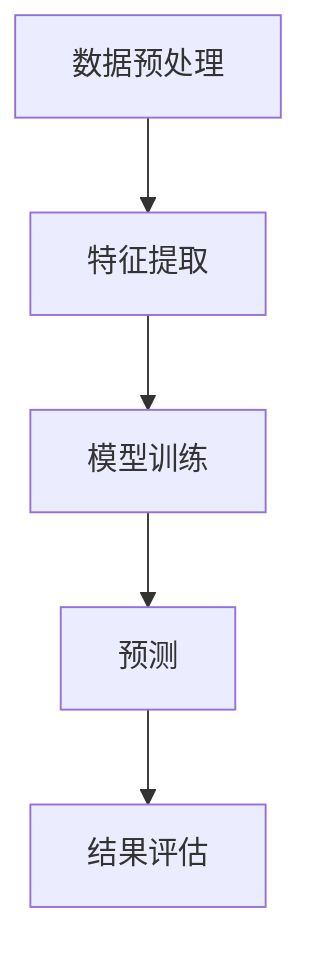
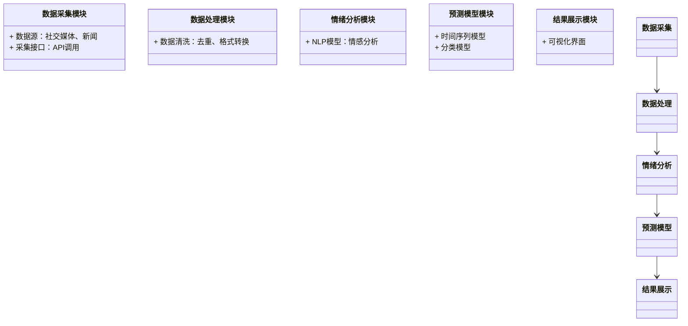
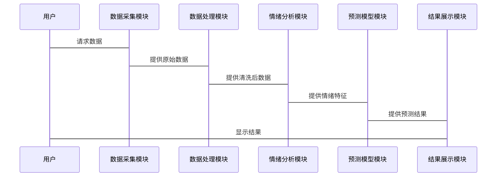

                 


# 开发智能化的金融市场情绪指数预测模型

> **关键词：** 金融市场，情绪指数，AI技术，预测模型，NLP，时间序列分析

> **摘要：** 本文探讨了如何利用AI技术开发智能化的金融市场情绪指数预测模型。文章从背景介绍、核心概念、算法原理、系统架构设计到项目实战，全面解析了情绪指数预测的实现过程。通过NLP和时间序列分析等技术，结合实际案例，展示了如何构建高效的情绪预测系统，并提供了最佳实践建议。

---

## 第1章: 背景介绍

### 1.1 问题背景
金融市场中的情绪指数预测对于投资者和机构至关重要。市场情绪受多种因素影响，如新闻、社交媒体和经济指标。传统方法难以捕捉这些复杂因素，因此AI技术的应用成为关键。

### 1.2 问题描述
情绪指数反映了市场的乐观或悲观程度，影响资产价格。本文旨在通过AI模型，从文本和价格数据中提取情绪特征，预测未来走势。

### 1.3 问题解决
AI技术如NLP和机器学习可用于分析文本和数据，构建预测模型。组合模型能融合多种数据源，提高预测准确性。

### 1.4 边界与外延
研究限定于情绪指数预测，数据来源包括社交媒体和新闻。扩展方向包括高频交易和跨市场分析。

---

## 第2章: 核心概念与联系

### 2.1 核心概念原理
情绪指数通过文本和数据计算，AI模型帮助识别情绪特征。

### 2.2 概念对比
| 情绪指数 | 数据来源 | 文本、价格、交易量 |
|----------|-----------|-------------------|
| 时间跨度 | 短期、中期、长期 |

### 2.3 ER实体关系图
```mermaid
erDiagram
    actor 投资者 {
        <属性> 投资行为
        <属性> 投资决策
    }
    actor 数据源 {
        <属性> 市场数据
        <属性> 事件数据
    }
    entity 情绪指数 {
        <属性> 情绪评分
        <属性> 情绪类别
    }
    entity 预测模型 {
        <属性> 模型参数
        <属性> 预测结果
    }
    投资者 --> 数据源
```

---

## 第3章: 算法原理

### 3.1 算法选择
使用NLP提取文本情绪，时间序列分析预测指数。

### 3.2 算法流程


### 3.3 算法实现
```python
import numpy as np
from sklearn.feature_extraction.text import TfidfVectorizer
from sklearn.svm import SVC

# 数据预处理
def preprocess(text):
    return text.lower()

# 特征提取
vectorizer = TfidfVectorizer(max_features=500)
X = vectorizer.fit_transform(texts)

# 模型训练
model = SVC()
model.fit(X, labels)

# 预测
test_text = ["市场表现良好"]
test_X = vectorizer.transform([test_text])
predicted = model.predict(test_X)
```

### 3.4 数学模型
$$P(y|x) = \frac{P(y|f(x))P(f(x))}{\sum_{f} P(y|f)P(f)}$$

---

## 第4章: 系统架构设计

### 4.1 系统功能设计


### 4.2 接口设计
定义REST API，数据采集模块通过API获取数据，预测结果返回给展示模块。

### 4.3 交互流程


---

## 第5章: 项目实战

### 5.1 环境安装
安装Python、TensorFlow、Scikit-learn等库。

### 5.2 核心代码实现
```python
import numpy as np
from sklearn.metrics import accuracy_score
from sklearn.model_selection import train_test_split
from sklearn.svm import SVC
from sklearn.feature_extraction.text import TfidfVectorizer

# 数据加载
texts = ["市场上涨", "经济指标良好", "投资者信心增强"]
labels = [1, 1, 1]

# 数据分割
X_train, X_test, y_train, y_test = train_test_split(texts, labels, test_size=0.2)

# 特征提取
vectorizer = TfidfVectorizer()
X_train_vec = vectorizer.fit_transform(X_train)
X_test_vec = vectorizer.transform(X_test)

# 模型训练
model = SVC()
model.fit(X_train_vec, y_train)

# 预测
y_pred = model.predict(X_test_vec)
print("准确率:", accuracy_score(y_test, y_pred))
```

### 5.3 案例分析
通过实际数据训练模型，展示预测结果与实际数据的对比。

### 5.4 项目小结
总结实现过程中的经验，提出改进建议。

---

## 第6章: 总结与展望

### 6.1 总结
AI技术在情绪指数预测中的应用前景广阔，但需克服数据质量和模型泛化等挑战。

### 6.2 注意事项
- 数据质量：确保数据来源可靠
- 模型调优：定期更新和优化模型
- 伦理风险：注意数据隐私和合规性

### 6.3 未来展望
探索更复杂模型，如深度学习和强化学习，提升预测精度。

---

## 作者：AI天才研究院 & 禅与计算机程序设计艺术

通过本文，读者可以全面了解金融市场情绪指数预测模型的开发过程，从理论到实践，掌握相关技术的关键点和实现方法。

