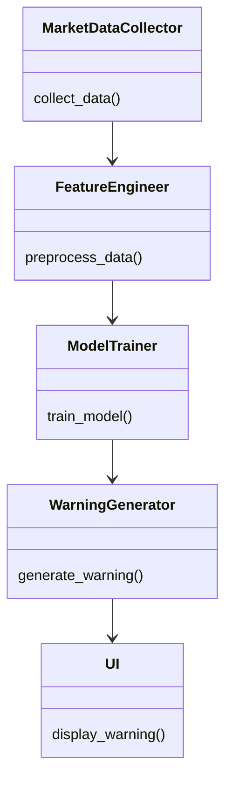

                 


# 开发智能化的金融市场流动性风险传导预警模型

> 关键词：金融市场，流动性风险，人工智能，预警模型，风险传导，系统架构

> 摘要：本文旨在探讨如何利用人工智能技术开发智能化的金融市场流动性风险传导预警模型。通过分析金融市场流动性风险的基本概念、传导机制，结合AI技术的优势，提出构建智能化预警模型的核心方法。文章详细阐述了模型的算法原理、系统架构设计、项目实现过程及实际案例分析，为金融从业者和数据科学家提供了一套完整的解决方案。

---

## 第1章: 金融市场流动性风险概述

### 1.1 金融市场流动性风险的基本概念

#### 1.1.1 金融市场的基本概念
金融市场是资金流动和资产交易的场所，参与者包括个人、机构、政府等。市场的主要功能是资金的融通和资产的定价。流动性是指资产能够在短时间内以合理价格变现的能力。

#### 1.1.2 流动性风险的定义与特征
流动性风险是指由于市场流动性不足，导致资产无法以合理价格变现的风险。其特征包括：
1. **隐蔽性**：流动性风险在市场正常时不易察觉。
2. **突发性**：在市场波动时可能迅速放大。
3. **系统性**：流动性风险可能引发系统性金融危机。

#### 1.1.3 流动性风险的分类与影响
流动性风险可以分为微观和宏观两类：
1. **微观流动性风险**：单个资产或机构的流动性风险。
2. **宏观流动性风险**：整个金融系统的流动性风险。

流动性风险的影响包括市场波动加剧、资产价格崩盘、金融机构倒闭等。

### 1.2 金融市场流动性风险的传导机制

#### 1.2.1 风险传导的路径分析
流动性风险可以通过以下路径传导：
1. **资产价格波动**：某类资产价格下跌引发投资者恐慌，导致抛售行为增加。
2. **金融机构破产**：一家机构的破产可能引发连锁反应，导致整个金融系统的流动性危机。
3. **市场信心下降**：投资者信心下降导致市场流动性枯竭。

#### 1.2.2 市场参与者的角色与影响
1. **机构投资者**：大型机构的交易行为对市场流动性影响显著。
2. **零售投资者**：散户的恐慌性抛售可能加剧流动性风险。
3. **中央银行**：通过货币政策和市场干预缓解流动性压力。

#### 1.2.3 系统性风险的形成与扩散
系统性风险的形成通常由多个因素共同作用，包括杠杆率过高、金融创新过度、监管不足等。一旦系统性风险爆发，可能引发金融危机。

### 1.3 智能化预警模型的背景与意义

#### 1.3.1 传统风险预警方法的局限性
传统方法主要依赖统计分析和专家经验，存在以下问题：
1. **数据依赖性强**：需要大量历史数据支持。
2. **实时性不足**：难以实时捕捉市场变化。
3. **模型稳定性差**：容易受市场环境变化影响。

#### 1.3.2 AI技术在金融风险预警中的应用价值
人工智能技术具有以下优势：
1. **非线性建模能力**：可以捕捉复杂市场关系。
2. **实时性**：能够快速响应市场变化。
3. **自适应性**：模型可以根据市场反馈自动调整。

#### 1.3.3 智能化预警模型的目标与优势
目标是通过AI技术实时监测市场流动性风险，提前预警潜在风险。优势包括：
1. **实时监测**：能够实时捕捉市场波动。
2. **智能分析**：能够自动识别复杂风险模式。
3. **提前预警**：可以在风险发生前发出预警信号。

---

## 第2章: 智能化流动性风险预警模型的核心概念

### 2.1 智能化预警模型的构成要素

#### 2.1.1 数据来源与特征
1. **数据来源**：包括市场交易数据、新闻数据、社交媒体数据等。
2. **数据特征**：时间序列特征、文本情感特征、网络结构特征等。

#### 2.1.2 预警算法与模型
1. **算法选择**：时间序列分析、图神经网络等。
2. **模型框架**：基于深度学习的端到端模型。

#### 2.1.3 预警指标与阈值
1. **预警指标**：包括市场波动率、交易量、相关资产价格变化等。
2. **阈值设定**：根据历史数据确定预警触发条件。

### 2.2 风险传导网络的构建

#### 2.2.1 图论在风险传导中的应用
1. **图论基础**：节点代表市场参与者，边代表交易关系。
2. **网络构建**：通过交易数据构建市场参与者的关系网络。

#### 2.2.2 风险传导网络的构建方法
1. **加权网络**：根据交易量或相关性加权。
2. **社区检测**：识别市场中的风险传导集群。

#### 2.2.3 网络分析工具与平台
1. **工具**：Gephi、NetworkX等。
2. **平台**：Python、TensorFlow等。

### 2.3 数据特征与风险识别

#### 2.3.1 时间序列数据的特征提取
1. **特征提取方法**：均值、标准差、自相关系数等。
2. **时间序列模型**：ARIMA、LSTM等。

#### 2.3.2 文本数据的情感分析
1. **情感分析方法**：基于词袋模型、词嵌入模型（如Word2Vec）。
2. **情感极性分析**：判断新闻或社交媒体内容的积极或消极情绪。

#### 2.3.3 多源数据的融合与处理
1. **数据融合方法**：加权融合、主成分分析等。
2. **数据预处理**：数据清洗、标准化等。

---

## 第3章: 智能化预警模型的算法原理

### 3.1 时间序列分析算法

#### 3.1.1 ARIMA模型的原理与实现
ARIMA（AutoRegressive Integrated Moving Average）模型用于时间序列预测，主要步骤包括：
1. **数据预处理**：差分消除趋势。
2. **模型参数估计**：使用最大似然估计。
3. **模型预测**：基于模型参数预测未来值。

#### 3.1.2 LSTM网络的应用与优势
LSTM（长短期记忆网络）能够有效捕捉时间序列的长程依赖关系，适用于金融市场预测。

#### 3.1.3 Prophet模型的简单实现
Prophet模型由Facebook开源，适用于非频繁数据的时间序列预测，实现简单且效果显著。

### 3.2 图神经网络在风险传导中的应用

#### 3.2.1 图神经网络的基本原理
图神经网络通过节点之间的关系进行信息传播，能够捕捉复杂网络结构中的风险传导路径。

#### 3.2.2 GAT模型的结构与特点
GAT（Graph Attention Network）通过注意力机制动态调整节点之间的权重，提高模型的表达能力。

#### 3.2.3 图嵌入技术与风险传播
图嵌入技术（如Node2Vec）可以将图结构转换为低维向量，用于后续的风险传播分析。

### 3.3 集成学习与模型优化

#### 3.3.1 集成学习的基本概念
集成学习通过组合多个模型的结果提高预测准确性，常见方法包括Bagging和Boosting。

#### 3.3.2 Bagging与Boosting的对比分析
Bagging通过随机采样生成多个基模型，Boosting通过逐步优化生成序列模型。

#### 3.3.3 模型调优与评估指标
模型调优包括参数优化和超参数调整，常用评估指标包括准确率、召回率、F1分数等。

---

## 第4章: 智能化预警模型的系统架构设计

### 4.1 系统功能模块划分

#### 4.1.1 数据采集与处理模块
1. **功能**：采集市场数据、新闻数据、社交媒体数据等。
2. **实现**：使用API接口获取实时数据。

#### 4.1.2 特征工程与数据预处理模块
1. **功能**：提取特征并进行标准化处理。
2. **实现**：使用Python的pandas库进行数据处理。

#### 4.1.3 模型训练与优化模块
1. **功能**：训练预警模型并进行参数优化。
2. **实现**：使用TensorFlow或PyTorch框架。

#### 4.1.4 预警生成与推送模块
1. **功能**：根据模型预测结果生成预警信息并推送。
2. **实现**：使用消息队列（如Kafka）进行实时推送。

#### 4.1.5 用户界面与交互模块
1. **功能**：提供用户友好的界面和交互功能。
2. **实现**：使用React或Vue.js构建前端界面。

### 4.2 系统架构设计

#### 4.2.1 系统功能设计（领域模型）



#### 4.2.2 系统架构设计（架构图）


---

## 第5章: 项目实战

### 5.1 项目环境配置

```bash
# 安装依赖库
pip install numpy pandas scikit-learn tensorflow keras
```

### 5.2 核心代码实现

#### 5.2.1 数据采集与处理

```python
import pandas as pd
import requests

def collect_data(api_key):
    url = f"https://api.example.com/market-data?api_key={api_key}"
    response = requests.get(url)
    data = response.json()
    return pd.DataFrame(data)
```

#### 5.2.2 模型实现

```python
from tensorflow.keras.models import Sequential
from tensorflow.keras.layers import LSTM, Dense

model = Sequential()
model.add(LSTM(64, input_shape=(timesteps, features)))
model.add(Dense(1))
model.compile(optimizer='adam', loss='mean_squared_error')
model.fit(X_train, y_train, epochs=100, batch_size=32)
```

### 5.3 实际案例分析

#### 5.3.1 案例背景
以2008年金融危机为例，分析模型在预测流动性风险中的表现。

#### 5.3.2 数据分析与结果展示
使用模型对历史数据进行回测，评估预警效果。

---

## 第6章: 总结与展望

### 6.1 总结
本文详细探讨了智能化的金融市场流动性风险传导预警模型的开发过程，包括背景、核心概念、算法原理、系统架构设计及项目实现。通过案例分析，验证了模型的有效性。

### 6.2 展望
未来的研究方向包括：
1. **模型优化**：进一步提高模型的预测准确率。
2. **数据源扩展**：引入更多类型的数据源。
3. **实时性提升**：优化模型的实时性，使其能够更快地响应市场变化。

---

## 作者：AI天才研究院 & 禅与计算机程序设计艺术

本文由AI天才研究院与“禅与计算机程序设计艺术”联合撰写，转载请注明出处。

