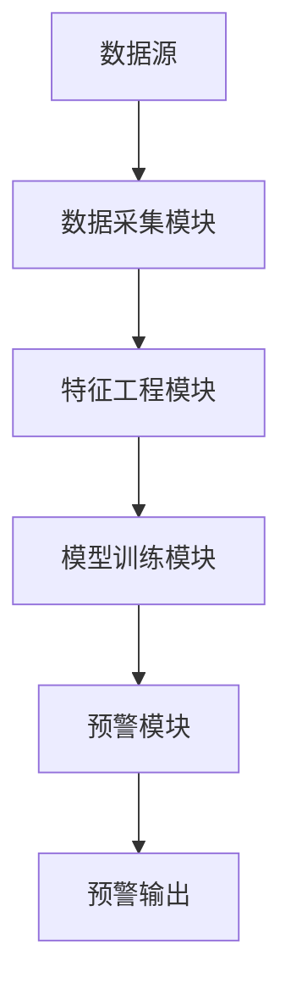
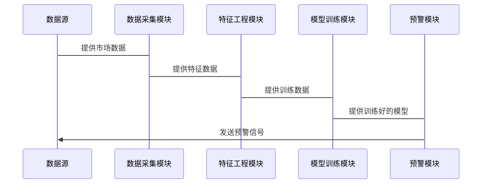

                 


# 开发智能化的金融市场流动性风险预警模型

## 关键词
金融市场、流动性风险、预警模型、时间序列分析、机器学习、深度学习、系统架构

## 摘要
金融市场流动性风险是影响金融机构稳定性和市场健康的重要因素。本文通过分析金融市场流动性风险的定义、核心概念以及智能化预警模型的构建，详细介绍如何利用时间序列分析、机器学习和深度学习算法开发高效的流动性风险预警系统。文章从系统架构设计到项目实战，全面解析如何构建一个智能化的流动性风险预警模型，为金融机构的风险管理提供有力支持。

---

# 第一部分：金融市场流动性风险预警模型概述

## 第1章：金融市场流动性风险概述

### 1.1 金融市场概述
- 1.1.1 金融市场的定义与分类
  - 一级市场与二级市场的区别
  - 机构投资者、个人投资者和监管机构的角色
- 1.1.2 金融市场的功能与作用
  - 资金融通、价格发现和风险管理的核心作用
- 1.1.3 金融市场中的主要参与者
  - 交易主体（如银行、基金公司、保险公司等）及其角色

### 1.2 流动性风险的定义与特点
- 1.2.1 流动性风险的定义
  - 无法以合理价格快速变现资产的风险
- 1.2.2 流动性风险的核心要素
  - 资产流动性、市场流动性、资金流动性
- 1.2.3 流动性风险与市场风险的区别
  - 流动性风险侧重于变现能力，市场风险侧重于价格波动

### 1.3 流动性风险预警模型的背景与意义
- 1.3.1 金融市场流动性风险的重要性
  - 流动性风险是金融危机的导火索之一
- 1.3.2 建立流动性风险预警模型的必要性
  - 提前识别潜在风险，避免系统性金融危机
- 1.3.3 智能化预警模型的优势
  - 利用大数据和人工智能技术提高预测精度和效率

## 第2章：智能化流动性风险预警模型的核心概念

### 2.1 智能化预警模型的基本原理
- 2.1.1 数据驱动的预警机制
  - 基于历史数据和实时数据进行预测
- 2.1.2 智能算法的应用
  - 机器学习和深度学习算法的结合
- 2.1.3 预警系统的反馈机制
  - 根据预警结果调整模型参数

### 2.2 核心概念与联系
- 2.2.1 流动性风险的实体关系图（ER图）
  ```mermaid
  graph TD
      A[金融市场] --> B[交易主体]
      B --> C[资产]
      C --> D[流动性指标]
      D --> E[风险预警信号]
  ```

- 2.2.2 算法原理流程图
  ```mermaid
  graph TD
      A[数据输入] --> B[特征提取]
      B --> C[模型训练]
      C --> D[风险预测]
      D --> E[预警输出]
  ```

## 第3章：流动性风险预警模型的算法原理

### 3.1 时间序列分析
- 3.1.1 ARIMA模型的原理
  - 自回归（AR）、差分（I）和移动平均（MA）的结合
- 3.1.2 LSTM模型的应用
  - 长短期记忆网络在时间序列预测中的优势
- 3.1.3 GARCH模型的实现
  - 广义自回归条件异方差模型在波动率预测中的应用

### 3.2 机器学习算法
- 3.2.1 支持向量机（SVM）的应用
  - 线性分类器在风险分类中的应用
- 3.2.2 随机森林（Random Forest）的实现
  - 集成学习在特征重要性分析中的应用
- 3.2.3 神经网络模型的构建
  - 多层感知机（MLP）在风险预测中的应用

### 3.3 深度学习模型
- 3.3.1 LSTM网络的结构
  - 细胞状态、输入门、遗忘门和输出门的协同工作
- 3.3.2 Transformer模型的应用
  - 注意力机制在时间序列数据中的应用
- 3.3.3 图神经网络的实现
  - 图结构数据在金融市场中的应用

## 第4章：流动性风险预警模型的数学模型与公式

### 4.1 时间序列模型的数学公式
- 4.1.1 ARIMA模型的公式
  $$ARIMA(p, d, q) = y_t = \phi_1 y_{t-1} + \dots + \phi_p y_{t-p} + \theta_1 \epsilon_{t-1} + \dots + \theta_q \epsilon_{t-q} + \epsilon_t$$

- 4.1.2 LSTM模型的结构
  $$f(t) = \text{sigmoid}(W_f \cdot [h_{t-1}, x_t] + b_f)$$
  $$i(t) = \text{sigmoid}(W_i \cdot [h_{t-1}, x_t] + b_i)$$
  $$o(t) = \text{sigmoid}(W_o \cdot [h_{t-1}, x_t] + b_o)$$
  $$c(t) = f(t) \cdot c_{t-1} + i(t) \cdot x_t$$
  $$h(t) = o(t) \cdot \text{tanh}(c(t))$$

### 4.2 机器学习模型的数学公式
- 4.2.1 支持向量机（SVM）的优化目标
  $$\min_{\theta, \alpha} \frac{1}{2} ||\theta||^2 + C \sum_{i=1}^n \alpha_i (1 - y_i (\theta \cdot x_i + b))$$

- 4.2.2 随机森林的分类公式
  $$\text{预测类别} = \text{多数投票}(\text{树的预测结果})$$

## 第5章：系统架构设计

### 5.1 问题场景介绍
- 金融市场交易场景中的流动性风险
- 预警系统的功能需求和性能要求

### 5.2 系统功能设计
- 数据采集模块：实时采集市场数据和交易数据
- 特征工程模块：提取关键特征（如波动率、交易量等）
- 模型训练模块：训练和优化预警模型
- 预警模块：实时监控并输出预警信号

### 5.3 系统架构设计


### 5.4 系统接口设计
- 数据接口：与数据源的交互接口
- 预警接口：向用户或系统发送预警信号

### 5.5 系统交互序列图


## 第6章：项目实战

### 6.1 环境安装
- Python 3.8+
- NumPy、Pandas、Scikit-learn、Keras、TensorFlow

### 6.2 核心实现代码
```python
import numpy as np
from sklearn.ensemble import RandomForestClassifier
from tensorflow.keras.models import Sequential
from tensorflow.keras.layers import LSTM, Dense, Dropout

# 示例：基于LSTM的时间序列预测模型
def build_lstm_model(input_shape):
    model = Sequential()
    model.add(LSTM(units=50, return_sequences=True, input_shape=input_shape))
    model.add(Dropout(0.2))
    model.add(LSTM(units=50, return_sequences=False))
    model.add(Dense(1, activation='sigmoid'))
    model.compile(loss='binary_crossentropy', optimizer='adam', metrics=['accuracy'])
    return model

# 示例：随机森林分类模型
def build_random_forest_model(n_estimators=100):
    model = RandomForestClassifier(n_estimators=n_estimators, random_state=42)
    return model
```

### 6.3 代码应用解读与分析
- LSTM模型适用于时间序列数据，能够捕捉长期依赖关系
- 随机森林模型适用于特征工程，能够处理高维数据

### 6.4 实际案例分析
- 数据准备：收集某段时间内的市场数据，提取相关特征
- 模型训练：使用历史数据训练模型
- 预警输出：实时监控市场数据，根据模型预测结果发出预警信号

### 6.5 项目小结
- 项目实现的关键步骤和注意事项
- 模型性能的评估与优化
- 实际应用中的问题与解决方案

## 第7章：总结与展望

### 7.1 本章小结
- 本文详细介绍了金融市场流动性风险预警模型的开发过程
- 包括背景分析、算法原理、系统架构和项目实战

### 7.2 模型优缺点分析
- 优点：智能化、高精度、实时性强
- 缺点：需要大量数据支持，模型复杂度高

### 7.3 未来展望
- 结合更多先进的机器学习和深度学习算法
- 提高模型的泛化能力和实时性
- 应用到更多的金融场景中

## 第8章：最佳实践 tips、小结、注意事项、拓展阅读

### 8.1 最佳实践 tips
- 数据预处理是模型性能的关键
- 选择合适的算法和模型参数
- 定期更新模型和优化策略

### 8.2 小结
- 本文为读者提供了一套完整的金融市场流动性风险预警模型开发方案
- 从理论到实践，帮助读者掌握模型的设计与实现

### 8.3 注意事项
- 数据质量和完整性对模型性能影响重大
- 模型部署和维护需要专业的技术支持
- 风险预警模型仅提供参考，实际决策需结合其他因素

### 8.4 拓展阅读
- 《时间序列分析与应用》
- 《机器学习实战》
- 《深度学习导论》

---

# 作者：AI天才研究院/AI Genius Institute & 禅与计算机程序设计艺术 /Zen And The Art of Computer Programming

---

通过以上目录和内容的设计，您可以开始撰写完整的文章。每章内容需要根据实际需求进行扩展和详细编写。

