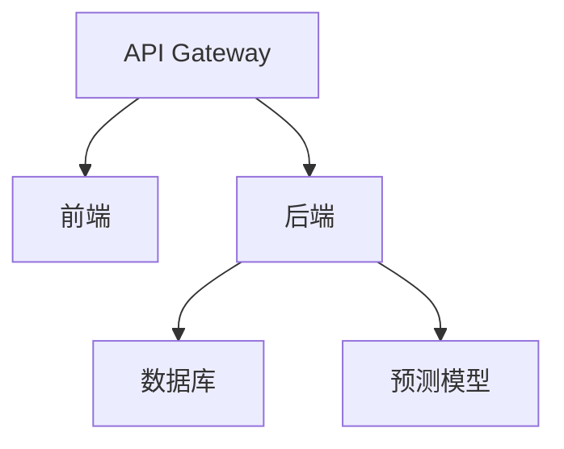

                 


# 开发智能化的金融时序数据多源信息融合预测模型

> 关键词：金融时序数据，多源信息融合，预测模型，深度学习，时间序列分析

> 摘要：本文详细介绍了开发智能化的金融时序数据多源信息融合预测模型的过程，涵盖背景分析、模型构建、系统设计、项目实战和优化等方面。通过多源数据融合和深度学习技术，构建了一个高效、准确的预测模型，为金融领域提供了有力支持。

---

# 第一部分: 金融时序数据多源信息融合预测模型的背景与基础

## 第1章: 开发智能化的金融时序数据预测模型概述

### 1.1 问题背景与定义

#### 1.1.1 金融时序数据的定义与特点
金融时序数据是指在金融领域中，随着时间推移而产生的各种数据，包括股票价格、汇率、债券收益率、市场指数等。这类数据具有以下特点：
- **时间依赖性**：数据的变化往往受到过去趋势的影响。
- **波动性**：金融市场波动较大，数据呈现不稳定性。
- **复杂性**：涉及多个影响因素，如经济指标、政策变化、市场情绪等。

#### 1.1.2 多源信息融合预测的必要性
金融市场的决策往往依赖于多源数据的综合分析。例如，股票价格可能受到公司财务数据、市场情绪、宏观经济指标等多种因素的影响。因此，将这些多源数据进行融合，可以提高预测的准确性和全面性。

#### 1.1.3 智能化预测模型的核心目标
智能化预测模型的核心目标是通过整合多源数据，利用先进的算法和技术，捕捉数据中的潜在模式和关联性，从而实现对金融时序数据的精准预测。

### 1.2 多源信息融合预测模型的边界与外延

#### 1.2.1 数据来源的多样性
多源信息融合预测模型的数据来源包括：
- **市场数据**：如股票价格、成交量等。
- **财务数据**：如公司财务报表、盈利指标等。
- **新闻数据**：如市场新闻、公司公告等。
- **宏观经济数据**：如GDP增长率、利率、通货膨胀率等。

#### 1.2.2 数据融合的挑战与解决方案
数据融合的挑战主要在于不同数据源的异质性、噪声和不一致。解决方案包括数据清洗、标准化和特征提取等步骤。

#### 1.2.3 模型的适用场景与限制
模型适用于金融市场的短期预测、风险评估和投资决策等领域。然而，模型的有效性受到数据质量和市场波动的限制。

### 1.3 模型的核心概念与联系

#### 1.3.1 核心概念原理
多源信息融合预测模型通过整合多个数据源，利用机器学习算法提取特征并建立预测模型。其核心在于数据的融合和模型的优化。

#### 1.3.2 核心概念属性特征对比表
| 特征属性 | 描述 |
|----------|------|
| 数据源多样性 | 包括市场、财务、新闻等多种数据源 |
| 数据融合方式 | 基于规则、加权或深度学习的方法 |
| 模型类型 | 时间序列模型、深度学习模型等 |

#### 1.3.3 ER实体关系图架构
```mermaid
erDiagram
    customer[CustID] o-|{m,n}| order[OrderID]
    product[ProductID] o-|{m,n}| order[OrderID]
    customer --> order : 下单
    product --> order : 订单包含产品
```

### 1.4 本章小结
本章介绍了金融时序数据多源信息融合预测模型的背景、定义、特点和核心概念，为后续章节奠定了基础。

---

## 第2章: 多源信息融合的理论基础

### 2.1 数据预处理与特征提取

#### 2.1.1 数据清洗与标准化
数据清洗包括去除缺失值、异常值和噪声数据。标准化是将不同量纲的数据转换为统一尺度，以便模型处理。

#### 2.1.2 特征选择与降维
特征选择通过评估特征的重要性，剔除冗余特征。降维方法如主成分分析（PCA）可以降低数据维度，减少计算复杂度。

#### 2.1.3 时间序列特征的提取方法
时间序列特征提取包括均值、方差、自相关函数（ACF）、部分自相关函数（PACF）等。

### 2.2 多源数据融合方法

#### 2.2.1 基于加权的融合方法
根据数据源的重要性进行加权，构建加权融合模型。

#### 2.2.2 基于规则的融合方法
根据预设的规则，对多个数据源进行融合，如平均值、最大值等。

#### 2.2.3 基于深度学习的融合方法
利用神经网络自动提取特征并融合多源数据，如多输入模型。

### 2.3 融合效果评估指标

#### 2.3.1 均方误差（MSE）
$$MSE = \frac{1}{n}\sum_{i=1}^{n}(y_i - \hat{y}_i)^2$$

#### 2.3.2 平均绝对误差（MAE）
$$MAE = \frac{1}{n}\sum_{i=1}^{n}|y_i - \hat{y}_i|$$

### 2.4 本章小结
本章详细介绍了数据预处理和特征提取的方法，以及多源数据融合的策略和效果评估指标。

---

## 第3章: 模型构建与训练

### 3.1 数据预处理与特征提取

#### 3.1.1 数据清洗与标准化
使用Python进行数据清洗和标准化处理。

```python
import pandas as pd
import numpy as np

# 数据清洗
data = pd.read_csv('financial_data.csv')
data.dropna(inplace=True)
data = data.replace(np.inf, np.nan).dropna()

# 数据标准化
from sklearn.preprocessing import StandardScaler
scaler = StandardScaler()
scaled_data = scaler.fit_transform(data)
```

#### 3.1.2 特征选择与降维
使用PCA进行特征降维。

```python
from sklearn.decomposition import PCA
pca = PCA(n_components=10)
pca.fit(scaled_data)
principal_components = pca.transform(scaled_data)
```

### 3.2 模型结构设计

#### 3.2.1 LSTM网络结构
使用LSTM进行时间序列预测。

```python
from tensorflow.keras.models import Sequential
from tensorflow.keras.layers import LSTM, Dense

model = Sequential()
model.add(LSTM(50, return_sequences=True, input_shape=(timesteps, features)))
model.add(LSTM(50, return_sequences=False))
model.add(Dense(1))
```

### 3.3 模型训练与优化

#### 3.3.1 模型训练
使用训练数据进行模型训练。

```python
model.compile(loss='mean_squared_error', optimizer='adam')
model.fit(X_train, y_train, epochs=100, batch_size=32)
```

#### 3.3.2 模型优化
通过调整超参数和早停法优化模型性能。

```python
from tensorflow.keras.callbacks import EarlyStopping

early_stop = EarlyStopping(monitor='val_loss', patience=10)
model.fit(X_train, y_train, epochs=100, batch_size=32, validation_data=(X_val, y_val), callbacks=[early_stop])
```

### 3.4 本章小结
本章介绍了模型构建的具体步骤，包括数据预处理、特征提取、模型设计和训练优化。

---

## 第4章: 模型预测与评估

### 4.1 模型预测

#### 4.1.1 模型预测方法
使用训练好的模型进行预测。

```python
y_pred = model.predict(X_test)
```

### 4.2 模型评估

#### 4.2.1 评估指标
使用MSE和MAE评估模型性能。

```python
from sklearn.metrics import mean_squared_error, mean_absolute_error

mse = mean_squared_error(y_test, y_pred)
mae = mean_absolute_error(y_test, y_pred)
```

### 4.3 本章小结
本章详细介绍了模型预测的方法和评估指标。

---

## 第5章: 系统设计与实现

### 5.1 系统架构设计

#### 5.1.1 系统架构图


### 5.2 系统接口设计

#### 5.2.1 API接口
提供RESTful API接口，供前端调用。

```python
from flask import Flask, request, jsonify
from tensorflow.keras.models import load_model

app = Flask(__name__)
model = load_model('financial_model.h5')

@app.route('/predict', methods=['POST'])
def predict():
    data = request.json['data']
    # 数据处理
    prediction = model.predict(data)
    return jsonify({'result': prediction.tolist()})
```

### 5.3 系统实现

#### 5.3.1 数据获取与处理
使用Yahoo Finance API获取股票数据。

```python
import yfinance as yf

data = yf.download('AAPL', start='2020-01-01', end='2023-12-31')
```

### 5.4 本章小结
本章介绍了系统的整体架构设计和接口实现。

---

## 第6章: 项目实战与优化

### 6.1 项目实战

#### 6.1.1 环境搭建
安装必要的库和框架，如TensorFlow、Flask、yfinance等。

### 6.1.2 核心代码实现
实现数据获取、预处理、模型训练和预测的完整流程。

```python
import yfinance as yf
import numpy as np
import pandas as pd
from sklearn.preprocessing import StandardScaler
from tensorflow.keras.models import Sequential
from tensorflow.keras.layers import LSTM, Dense

# 数据获取
data = yf.download('AAPL', start='2020-01-01', end='2023-12-31')

# 数据预处理
scaler = StandardScaler()
scaled_data = scaler.fit_transform(data['Close'].values.reshape(-1, 1))

# 模型构建
model = Sequential()
model.add(LSTM(50, return_sequences=True, input_shape=(1, 1)))
model.add(LSTM(50, return_sequences=False))
model.add(Dense(1))
model.compile(loss='mean_squared_error', optimizer='adam')

# 模型训练
X_train = scaled_data[:-100]
y_train = scaled_data[100:]
X_test = scaled_data[-100:]
y_test = scaled_data[100:]

model.fit(X_train, y_train, epochs=50, batch_size=32)
```

### 6.2 项目优化

#### 6.2.1 模型优化
通过调整LSTM层数和神经元数量优化模型性能。

#### 6.2.2 系统优化
优化API接口的响应速度和系统的稳定性。

### 6.3 本章小结
本章通过实际项目展示了模型的实现过程，并提出了优化建议。

---

## 第7章: 总结与展望

### 7.1 本章总结
本文详细介绍了开发智能化的金融时序数据多源信息融合预测模型的过程，涵盖了数据预处理、模型构建、系统设计和项目实战等方面。

### 7.2 未来展望
未来的研究方向包括引入更复杂的深度学习模型、优化数据融合方法和提升系统的实时性。

---

作者：AI天才研究院 & 禅与计算机程序设计艺术

