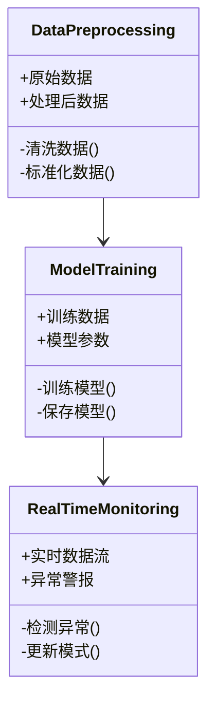
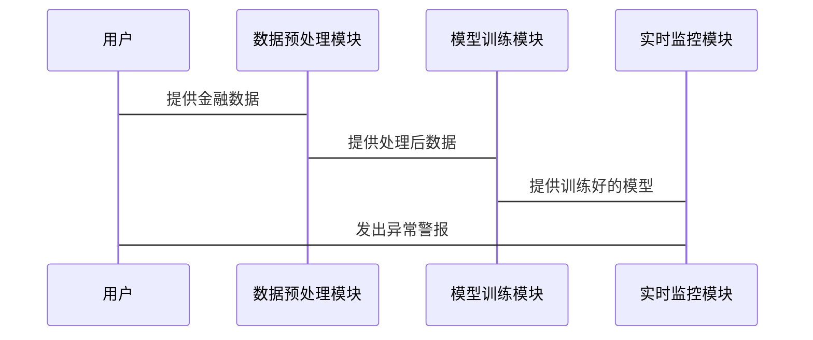

                 


# 开发智能化的金融时序数据异常模式演化跟踪模型

> 关键词：金融时序数据，异常模式演化，深度学习，LSTM，Transformer，智能化开发

> 摘要：本文详细探讨了开发智能化的金融时序数据异常模式演化跟踪模型的全过程，包括问题背景、核心概念、算法原理、系统架构、项目实战及小结。通过结合深度学习技术，分析了如何有效检测和跟踪金融数据中的异常模式，并展示了实际应用场景中的案例，帮助读者系统地理解和掌握相关技术。

---

## 第一部分: 金融时序数据异常模式演化跟踪模型背景与概述

### 第1章: 问题背景与数据特征

#### 1.1 问题背景
##### 1.1.1 金融数据异常模式的定义与重要性
在金融领域，异常模式指的是偏离正常趋势或规律的数据点或序列。这些异常可能代表市场操纵、欺诈交易、突发事件或潜在的风险信号。及时发现和分析这些异常模式，对于金融机构的风险控制、投资决策和合规管理至关重要。

##### 1.1.2 时序数据的特点与挑战
金融数据通常具有以下特点：
- **连续性**：数据随时间连续变化。
- **波动性**：受市场情绪、政策变化等多种因素影响，数据波动较大。
- **非线性**：某些金融数据可能呈现非线性变化，传统线性模型难以捕捉。
- **高维性**：金融数据可能包含多个维度，如价格、成交量、市场情绪等。

#### 1.1.3 异常模式演化跟踪的必要性
异常模式并不是静态的，它们会随着时间推移而变化。例如，市场操纵行为可能在一段时间后改变策略，或者突发事件可能引发新的异常模式。因此，模型需要能够动态跟踪这些演化，以保持检测的准确性。

---

### 第2章: 技术发展与应用趋势

#### 2.1 异常检测技术的发展历程
##### 2.1.1 统计方法与传统机器学习
传统的异常检测方法包括基于统计的方法（如Z-score、马氏距离）和机器学习方法（如孤立森林、支持向量机）。这些方法在某些情况下表现良好，但难以处理复杂的时间序列数据。

##### 2.1.2 深度学习在异常检测中的应用
深度学习的兴起为异常检测带来了新的可能性。特别是循环神经网络（RNN）及其变体（如LSTM）在处理时间序列数据方面表现出色。

##### 2.1.3 时间序列分析的最新进展
近年来，时间序列分析的最新进展包括Transformer模型在时间序列任务中的应用，以及基于图神经网络的时序数据分析方法。

#### 2.2 智能化金融数据分析的现状
##### 2.2.1 AI在金融领域的应用现状
AI技术已经在金融领域的多个方面得到广泛应用，包括股票预测、风险评估、欺诈检测等。

##### 2.2.2 时序数据智能化分析的趋势
随着深度学习技术的不断发展，时序数据的智能化分析将更加精准和实时。

##### 2.2.3 异常模式演化跟踪的技术挑战
异常模式演化跟踪的关键挑战包括模型的实时性、可解释性以及对复杂演化模式的捕捉能力。

---

### 第3章: 金融场景中的具体应用

#### 3.1 股票价格波动异常检测
##### 3.1.1 股票价格波动的特征分析
股票价格波动通常受到市场情绪、公司业绩、宏观经济指标等多种因素的影响。

##### 3.1.2 异常波动的识别与预警
通过分析股票价格的变化趋势，可以识别出异常波动并进行预警。

##### 3.1.3 股票市场操纵行为的检测
利用模型检测股票价格的异常波动，可以发现潜在的市场操纵行为。

#### 3.2 交易流水异常识别
##### 3.2.1 交易流水数据的特征提取
交易流水数据通常包括交易时间、金额、频率等特征。

##### 3.2.2 交易异常模式的识别
通过分析交易流水数据，可以识别出异常交易行为，如频繁的小额交易可能暗示洗钱行为。

##### 3.2.3 交易风险的实时监控
实时监控交易流水数据，可以及时发现并预警潜在的交易风险。

#### 3.3 债券评级异常跟踪
##### 3.3.1 债券评级数据的时序分析
债券评级数据的变化通常反映了发行人的信用状况变化。

##### 3.3.2 评级异常的识别与预测
通过分析评级数据的变化趋势，可以识别出评级下降的异常情况并进行预测。

##### 3.3.3 评级变化的动态跟踪
模型需要能够动态跟踪评级的变化，以应对市场的动态变化。

---

## 第二部分: 模型核心概念与原理

### 第4章: 异常模式演化跟踪的核心概念

#### 4.1 模型组成与核心要素
##### 4.1.1 数据预处理模块
数据预处理是模型开发的关键步骤，包括数据清洗、标准化、缺失值处理等。

##### 4.1.2 异常检测模块
异常检测模块负责识别数据中的异常点或异常序列。

##### 4.1.3 模式演化跟踪模块
模式演化跟踪模块负责捕捉和预测异常模式的演化趋势。

#### 4.2 关键算法与原理对比
##### 4.2.1 常见异常检测算法对比
| 算法类型       | 优点                     | 缺点                     |
|----------------|--------------------------|--------------------------|
| 统计方法       | 实现简单，计算效率高       | 对复杂数据模式捕捉能力有限 |
| 机器学习方法   | 能够捕捉非线性模式         | 需要大量数据，训练时间较长 |
| 深度学习方法   | 能够捕捉复杂模式，效果好   | 实现复杂，计算资源消耗大 |

##### 4.2.2 LSTM与Transformer对比
| 特性       | LSTM                   | Transformer               |
|------------|------------------------|---------------------------|
| 处理顺序   | 顺序处理               | 并行处理                   |
| 长期依赖   | 通过门控机制处理长期依赖 | 通过自注意力机制处理依赖 |
| 计算效率   | 较低                   | 较高                       |

---

### 第5章: 算法原理详细讲解

#### 5.1 LSTM原理
##### 5.1.1 LSTM结构
LSTM由输入门、遗忘门和输出门组成，能够有效捕捉长序列中的模式。

##### 5.1.2 LSTM公式
$$
f_t = \sigma(W_f \cdot [h_{t-1}, x_t] + b_f)
$$

##### 5.1.3 LSTM示例
假设我们有一个股票价格序列，可以通过LSTM模型预测下一个价格点。

#### 5.2 Transformer原理
##### 5.2.1 Transformer结构
Transformer由编码器和解码器组成，编码器负责将输入序列编码为固定长度的向量，解码器负责生成输出序列。

##### 5.2.2 自注意力机制
$$
\text{Attention}(Q, K, V) = \text{softmax}\left(\frac{QK^T}{\sqrt{d_k}}\right)V
$$

##### 5.2.3 Transformer示例
使用Transformer模型分析金融新闻，生成市场情绪指标。

---

### 第6章: 系统架构与设计

#### 6.1 系统功能设计
##### 6.1.1 数据预处理模块
- 数据清洗：处理缺失值、异常值。
- 数据标准化：归一化处理，确保模型输入一致。

##### 6.1.2 模型训练模块
- 算法选择：LSTM或Transformer。
- 参数调优：优化学习率、批量大小等超参数。

##### 6.1.3 实时监控模块
- 异常检测：实时检测金融数据中的异常点。
- 模式跟踪：动态更新异常模式。

#### 6.2 系统架构设计
##### 6.2.1 系统类图


##### 6.2.2 系统交互图


---

### 第7章: 项目实战与实现

#### 7.1 环境安装
- 安装Python、TensorFlow、Keras、pandas等库。

#### 7.2 核心代码实现
##### 7.2.1 数据预处理
```python
import pandas as pd
import numpy as np

def preprocess_data(data):
    # 处理缺失值
    data = data.dropna()
    # 标准化处理
    from sklearn.preprocessing import StandardScaler
    scaler = StandardScaler()
    data_scaled = scaler.fit_transform(data)
    return data_scaled
```

##### 7.2.2 模型训练
```python
import tensorflow as tf
from tensorflow.keras.layers import LSTM, Dense, Dropout

model = tf.keras.Sequential([
    LSTM(64, return_sequences=True),
    Dropout(0.2),
    LSTM(32),
    Dense(1)
])
model.compile(optimizer='adam', loss='mean_squared_error')
model.fit(x_train, y_train, epochs=10, batch_size=32)
```

##### 7.2.3 异常检测
```python
def detect_anomalies(model, data):
    # 预测正常值
    predicted = model.predict(data)
    # 计算残差
    residuals = data - predicted
    # 设定阈值
    threshold = np.std(residuals)
    anomalies = np.where(abs(residuals) > threshold, True, False)
    return anomalies
```

#### 7.3 案例分析与结果展示
通过实际数据集（如股票价格数据）进行训练和测试，展示模型在异常检测中的表现。

---

### 第8章: 小结与展望

#### 8.1 小结
本文详细介绍了开发智能化的金融时序数据异常模式演化跟踪模型的全过程，从背景分析到算法实现，再到系统设计，为读者提供了全面的技术指导。

#### 8.2 展望
未来的研究方向包括模型的实时性优化、可解释性增强，以及多模态数据的融合分析。同时，随着AI技术的不断发展，模型在金融领域的应用将更加广泛和深入。

---

## 作者信息

作者：AI天才研究院/AI Genius Institute & 禅与计算机程序设计艺术 /Zen And The Art of Computer Programming

