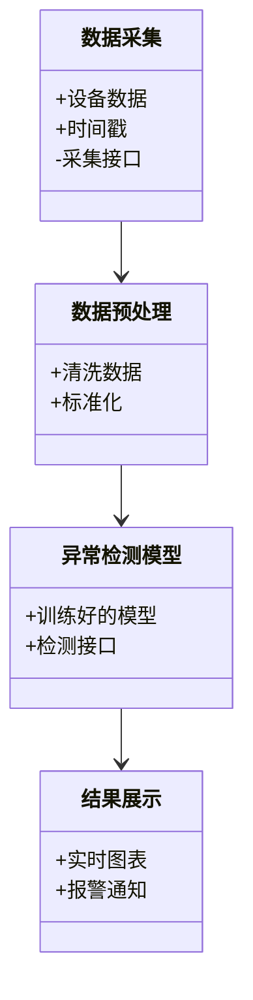
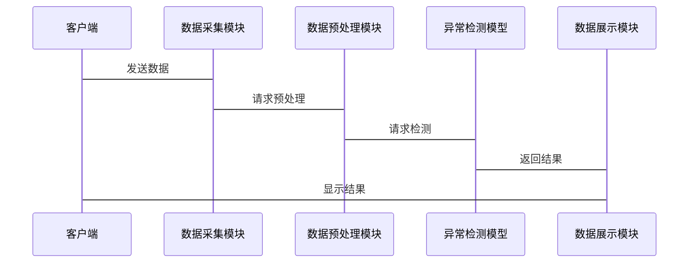

                 


# 异常检测：识别AI Agent的非正常行为

## 关键词：异常检测，AI Agent，机器学习，数据挖掘，行为分析

## 摘要：  
本文深入探讨了异常检测在识别AI Agent非正常行为中的应用。通过分析异常检测的核心概念、算法原理、系统架构以及实际案例，本文为读者提供了从理论到实践的全面指导。文章结合统计学方法和机器学习算法，详细阐述了如何有效识别和处理AI Agent中的异常行为，并通过具体的项目实战展示了实际应用中的关键步骤和注意事项。

---

# 第一部分: 异常检测概述

## 第1章: 异常检测的基本概念

### 1.1 异常检测的定义与背景

#### 1.1.1 异常检测的定义  
异常检测（Outlier Detection）是指识别数据集中与预期模式或行为显著不同的数据点。在AI Agent中，异常检测用于识别偏离正常行为的事件或模式，从而帮助系统快速响应和处理异常情况。

#### 1.1.2 异常检测的重要性和应用领域  
在AI Agent的应用中，异常检测至关重要。例如，在自动驾驶系统中，异常检测可以识别传感器数据中的异常，避免潜在的安全风险；在金融领域，异常检测可以识别欺诈交易，保护用户资产。

#### 1.1.3 AI Agent中的异常检测需求  
AI Agent通常需要实时处理大量数据，异常检测能够帮助其快速识别异常行为，优化决策过程，提高系统的鲁棒性和可靠性。

### 1.2 异常检测在AI Agent中的作用  
#### 1.2.1 异常检测如何帮助AI Agent  
通过异常检测，AI Agent可以识别异常行为，及时采取纠正措施，避免系统故障或错误决策。

#### 1.2.2 异常检测在AI Agent中的应用场景  
- **安全性**：识别恶意攻击或异常操作。  
- **可靠性**：检测系统故障或数据错误。  
- **效率**：优化资源分配，提高运行效率。  

---

## 第2章: AI Agent与异常检测的关系  

### 2.1 AI Agent的基本概念  
#### 2.1.1 AI Agent的定义  
AI Agent是一种智能体，能够感知环境、自主决策并执行任务。其核心能力包括感知、推理、学习和行动。

#### 2.1.2 AI Agent的核心功能与特点  
- **自主性**：能够独立执行任务。  
- **反应性**：能够实时感知并响应环境变化。  
- **学习能力**：能够通过数据学习和优化行为。  

### 2.2 异常检测在AI Agent中的作用  
#### 2.2.1 异常检测如何帮助AI Agent  
异常检测帮助AI Agent识别异常行为，提高系统的安全性和可靠性。例如，在自动驾驶中，异常检测可以识别传感器故障或环境异常。

#### 2.2.2 异常检测在AI Agent中的应用场景  
- **自动驾驶**：检测传感器数据异常，避免事故。  
- **智能客服**：识别用户行为异常，防止欺诈。  
- **工业自动化**：检测设备异常，减少停机时间。  

---

# 第二部分: 异常检测的核心概念与原理  

## 第3章: 异常检测的核心概念  

### 3.1 异常检测的关键属性  

#### 3.1.1 数据分布的偏离  
数据点偏离整体分布的情况，可能是异常。例如，在正态分布中，远离均值的点可能是异常。

#### 3.1.2 时间序列中的突变  
在时间序列数据中，突然的变化可能是异常。例如，股票价格的突然波动可能是市场异常。

#### 3.1.3 群体行为的异常识别  
识别群体行为中的异常个体，例如在社交网络中识别异常用户行为。

### 3.2 异常检测的核心要素  
| 核心要素 | 描述 |  
|----------|------|  
| 数据来源 | 数据的来源和类型。 |  
| 异常类型 | 离群点、时间异常、行为异常等。 |  
| 检测目标 | 是否需要实时检测或事后分析。 |  

---

## 第4章: 异常检测的原理与方法  

### 4.1 统计学方法  

#### 4.1.1 基于均值和标准差的异常检测  
使用均值和标准差来判断数据点是否为异常。公式：  
$$ Z = \frac{x - \mu}{\sigma} $$  
其中，Z值越大，数据点越可能是异常。

#### 4.1.2 基于箱线图的异常识别  
箱线图通过四分位数识别异常。公式：  
$$ Q1 = 25\% \text{分位数}, Q3 = 75\% \text{分位数} $$  
异常点为小于 $Q1 - 1.5 \times IQR$ 或大于 $Q3 + 1.5 \times IQR$ 的数据。

### 4.2 机器学习方法  

#### 4.2.1 基于聚类的异常检测  
使用聚类算法将数据分为簇，异常点通常位于小簇或远离主簇的位置。

#### 4.2.2 基于分类的异常检测  
使用分类算法（如决策树、随机森林）训练正常数据，然后识别异常。

#### 4.2.3 基于深度学习的异常检测  
使用深度学习模型（如Autoencoder、GAN）学习正常数据的分布，识别异常。

### 4.3 异常检测算法对比  

| 算法类型      | 优点                          | 缺点                          |  
|---------------|-------------------------------|-------------------------------|  
| 统计学方法    | 简单易懂，计算速度快           | 适用于简单数据，不适用于复杂场景 |  
| 聚类方法      | 无需标签，适合无监督学习       | 需要调整参数，计算复杂           |  
| 深度学习方法  | 能处理复杂数据，效果好         | 需要大量数据，计算资源消耗大     |  

---

## 第5章: 异常检测的数学模型与公式  

### 5.1 统计学模型  

#### 5.1.1 Z-score公式  
$$ Z = \frac{x - \mu}{\sigma} $$  
其中，$\mu$ 是均值，$\sigma$ 是标准差。

#### 5.1.2 箱线图的四分位数计算  
$$ Q1 = 25\% \text{分位数}, Q3 = 75\% \text{分位数} $$  
异常点为小于 $Q1 - 1.5 \times (Q3 - Q1)$ 或大于 $Q3 + 1.5 \times (Q3 - Q1)$ 的数据。

### 5.2 机器学习模型  

#### 5.2.1 Isolation Forest算法  
Isolation Forest通过构建随机森林，将数据点隔离到不同的节点，异常点更容易被隔离。

#### 5.2.2 One-Class SVM  
One-Class SVM用于学习正常数据的分布，识别异常点。公式：  
$$ y = \text{max}(0, 1 - \gamma \|x - c\|^2) $$  
其中，$\gamma$ 是惩罚系数，$c$ 是中心点。

---

# 第三部分: 系统分析与架构设计  

## 第6章: 异常检测系统架构  

### 6.1 问题场景介绍  
假设我们开发一个AI Agent，用于监控工业设备的运行状态。需要实时检测设备数据中的异常。

### 6.2 系统功能设计  

#### 6.2.1 领域模型  


### 6.3 系统架构设计  

#### 6.3.1 分层架构  


#### 6.3.2 接口设计  


---

# 第四部分: 项目实战  

## 第7章: 异常检测项目实战  

### 7.1 环境安装  

#### 7.1.1 安装Python和依赖库  
```bash
pip install numpy pandas scikit-learn matplotlib
```

### 7.2 核心代码实现  

#### 7.2.1 数据预处理  
```python
import numpy as np
import pandas as pd

data = pd.read_csv('data.csv')
data = data.dropna()
data = (data - data.mean()) / data.std()
```

#### 7.2.2 模型训练与检测  
```python
from sklearn.ensemble import IsolationForest

model = IsolationForest(random_state=42)
model.fit(data)
outliers = model.predict(data)
```

### 7.3 代码解读与分析  

#### 7.3.1 数据预处理  
代码对数据进行标准化处理，消除特征之间的尺度差异。

#### 7.3.2 模型训练  
使用Isolation Forest算法训练模型，识别异常点。

### 7.4 实际案例分析  
以电商平台为例，识别用户的异常行为，如欺诈交易。

### 7.5 项目总结  
通过项目实战，展示了如何将异常检测算法应用于实际场景，关键在于数据预处理和模型选择。

---

# 第五部分: 最佳实践  

## 第8章: 最佳实践与小结  

### 8.1 异常检测的关键点  
- 数据预处理：清洗和标准化数据。  
- 模型选择：根据场景选择合适的算法。  
- 结果解释：提供可理解的报警信息。  

### 8.2 注意事项  
- 异常检测需要结合业务背景。  
- 避免过度拟合，选择合适的模型参数。  
- 定期更新模型，适应数据分布的变化。  

### 8.3 未来研究方向  
- 深度学习在异常检测中的应用。  
- 实时异常检测的优化。  
- 多模态数据的异常检测。  

---

## 作者：AI天才研究院  
**作者简介**  
作者是AI天才研究院的专家，专注于人工智能和计算机编程领域的研究，拥有丰富的实践经验和技术洞见。

