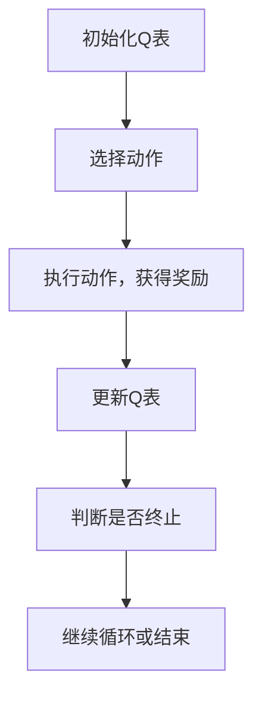
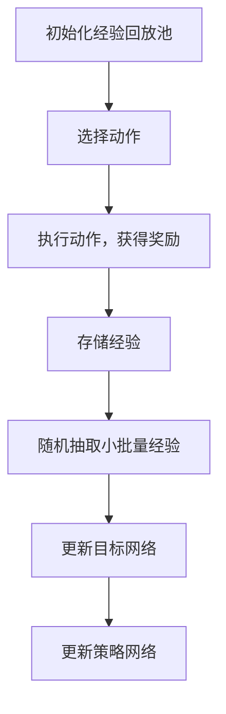

                 

# 强化学习在AI Agent个性化推荐中的应用

## 关键词：强化学习，AI Agent，个性化推荐，推荐系统，算法

## 摘要：  
本文详细探讨了强化学习在AI Agent个性化推荐中的应用。通过分析强化学习的核心算法和AI Agent的基本概念，结合个性化推荐系统的设计与实现，本文系统性地介绍了如何利用强化学习提升推荐系统的智能性和用户体验。文章内容包括强化学习与AI Agent的概述、强化学习的核心算法、个性化推荐系统的基本原理、AI Agent个性化推荐系统的架构设计、系统测试与性能评估等部分，并通过实际案例分析展示了强化学习在推荐系统中的具体应用。

---

# 第一部分: 强化学习与AI Agent基础

## 第1章: 强化学习与AI Agent概述

### 1.1 强化学习的基本概念  
强化学习（Reinforcement Learning, RL）是一种机器学习范式，其中智能体通过与环境交互来学习策略，以最大化累积奖励。与监督学习和无监督学习不同，强化学习强调智能体在动态环境中的自适应决策能力。  

#### 1.1.1 强化学习的定义  
强化学习是一种通过试错方式优化决策策略的学习方法。智能体通过执行动作，观察环境的反馈（奖励或惩罚），并根据这些反馈调整策略，以实现目标。  

#### 1.1.2 强化学习的核心要素  
- **状态（State）**：智能体所处的环境情况。  
- **动作（Action）**：智能体在给定状态下采取的行动。  
- **奖励（Reward）**：智能体执行动作后获得的反馈，用于指导策略优化。  
- **策略（Policy）**：智能体在特定状态下选择动作的概率分布。  
- **值函数（Value Function）**：衡量某状态下采取某种策略的期望回报。  

#### 1.1.3 强化学习与监督学习的区别  
- **监督学习**：基于标记数据，学习输入到输出的映射关系。  
- **强化学习**：基于奖励机制，学习在动态环境中做出最优决策。  

### 1.2 AI Agent的基本概念  
AI Agent（人工智能代理）是一种能够感知环境、自主决策并执行任务的智能实体。  

#### 1.2.1 AI Agent的定义  
AI Agent是能够根据环境信息做出决策并执行操作的智能系统，具备感知、推理和行动的能力。  

#### 1.2.2 AI Agent的类型  
- **简单反射型Agent**：基于当前输入做出反应，无内部状态。  
- **基于模型的Agent**：维护环境状态模型，用于决策。  
- **目标驱动型Agent**：根据目标选择最优行动。  

#### 1.2.3 AI Agent的核心功能  
- **感知**：通过传感器或接口获取环境信息。  
- **推理**：分析信息，生成决策。  
- **行动**：执行决策动作，影响环境状态。  

### 1.3 强化学习在AI Agent中的作用  
强化学习为AI Agent提供了自适应决策能力，使其能够在复杂环境中动态调整策略，以实现目标。  

#### 1.3.1 强化学习与AI Agent的关系  
- 强化学习为AI Agent提供决策策略。  
- AI Agent为强化学习提供执行环境和反馈。  

#### 1.3.2 强化学习如何提升AI Agent的智能性  
- 通过奖励机制优化决策策略。  
- 在动态环境中自适应调整行为。  

#### 1.3.3 强化学习在AI Agent中的应用领域  
- 游戏AI、机器人控制、自动驾驶、智能推荐等。  

### 1.4 本章小结  
本章介绍了强化学习和AI Agent的基本概念，分析了强化学习在AI Agent中的作用及其应用领域。  

---

# 第二部分: 强化学习的核心算法与数学模型

## 第2章: 强化学习的核心算法

### 2.1 Q-learning算法  
Q-learning是一种基于值函数的强化学习算法，通过更新Q值表来逼近最优策略。  

#### 2.1.1 Q-learning的基本原理  
- Q值表记录状态-动作对的期望回报。  
- 智能体通过探索和利用策略选择动作，更新Q值表。  

#### 2.1.2 Q-learning的数学模型  
$$ Q(s, a) = Q(s, a) + \alpha [r + \gamma \max Q(s', a') - Q(s, a)] $$  
其中，$\alpha$为学习率，$\gamma$为折扣因子。  

#### 2.1.3 Q-learning的优缺点  
- **优点**：简单易实现，适合离散状态空间。  
- **缺点**：收敛速度慢，难以处理连续状态空间。  

#### 2.1.4 Q-learning的算法流程  

### 2.2 Deep Q-Networks (DQN)  
DQN通过深度神经网络近似Q值函数，扩展了Q-learning的应用范围。  

#### 2.2.1 DQN的基本原理  
- 使用神经网络近似Q值函数。  
- 引入经验回放和目标网络，减少方差，提高稳定性。  

#### 2.2.2 DQN的算法流程  

#### 2.2.3 DQN的数学模型  
- **经验回放**：存储$(s, a, r, s')$元组，随机抽取训练。  
- **目标网络**：通过固定目标网络更新策略网络。  

#### 2.2.4 DQN的优缺点  
- **优点**：适用于连续状态空间，稳定性高。  
- **缺点**：计算复杂度较高，训练时间较长。  

### 2.3 其他强化学习算法简介  

#### 2.3.1 策略梯度方法  
策略梯度方法直接优化策略，通过梯度上升更新参数。  

#### 2.3.2 Actor-Critic方法  
Actor-Critic结合策略梯度和值函数，通过Actor网络选择动作，Critic网络评估状态值。  

#### 2.3.3 近端策略优化（PPO）  
PPO通过限制策略更新幅度，保持策略稳定性，适用于高维状态空间。  

### 2.4 本章小结  
本章介绍了Q-learning、DQN及策略梯度等强化学习算法，分析了它们的优缺点及应用场景。  

---

## 第3章: 强化学习的数学模型与公式  

### 3.1 贝尔曼方程  
贝尔曼方程是强化学习的核心方程，描述了状态值函数的期望回报。  

#### 3.1.1 贝尔曼方程的定义  
$$ V(s) = \max_{a} [ r(s,a) + \gamma V(s') ] $$  
其中，$\gamma$为折扣因子，$s'$为执行动作$a$后的下一个状态。  

#### 3.1.2 贝尔曼方程的数学表达式  
$$ V(s) = r(s,a) + \gamma V(s') $$  

### 3.2 策略梯度方法  
策略梯度方法通过优化策略的梯度，找到最优策略。  

#### 3.2.1 策略梯度的基本原理  
$$ \nabla J(\theta) = \mathbb{E}_{\tau \sim \pi_\theta} [\nabla \log \pi_\theta(a|s) Q(s,a)] $$  
其中，$Q(s,a)$为Q值函数，$\pi_\theta$为策略分布。  

#### 3.2.2 策略梯度的数学表达式  
$$ J(\theta) = \mathbb{E}_{\tau \sim \pi_\theta} [\log \pi_\theta(a|s) Q(s,a)] $$  

### 3.3 DQN的数学模型  
DQN通过神经网络近似Q值函数，优化目标为最小化均方误差。  

#### 3.3.1 DQN的损失函数  
$$ \mathcal{L} = \mathbb{E}[ (r + \gamma V(s') - Q(s,a))^2 ] $$  

### 3.4 本章小结  
本章详细推导了强化学习中的关键数学模型，包括贝尔曼方程、策略梯度和DQN的损失函数。  

---

# 第三部分: AI Agent个性化推荐系统的设计与实现

## 第4章: 个性化推荐系统的基本原理  

### 4.1 推荐系统的定义与分类  
推荐系统是一种根据用户行为和偏好，向用户推荐相关内容的系统。  

#### 4.1.1 推荐系统的定义  
推荐系统是基于用户行为数据，预测用户偏好，推荐相关内容或产品的系统。  

#### 4.1.2 推荐系统的分类  
- **基于内容的推荐**：根据物品属性推荐。  
- **协同过滤推荐**：基于用户相似性推荐。  
- **基于强化学习的推荐**：通过强化学习优化推荐策略。  

#### 4.1.3 推荐系统的评价指标  
- **精确率（Precision）**：推荐结果中正确项的比例。  
- **召回率（Recall）**：推荐结果中所有正确项的比例。  
- **F1值（F1-Score）**：精确率和召回率的调和平均数。  

### 4.2 基于强化学习的推荐系统  
基于强化学习的推荐系统通过优化奖励机制，提升推荐的个性化和实时性。  

#### 4.2.1 强化学习在推荐系统中的应用  
- **动态推荐**：根据用户实时行为调整推荐策略。  
- **个性化推荐**：基于用户历史行为预测偏好。  

#### 4.2.2 基于强化学习的推荐系统的优势  
- **动态适应性**：能够实时调整推荐策略。  
- **个性化优化**：通过强化学习优化用户偏好模型。  

#### 4.2.3 基于强化学习的推荐系统的挑战  
- **计算复杂度**：强化学习需要大量计算资源。  
- **反馈稀疏性**：用户反馈数据有限，影响模型训练。  

### 4.3 本章小结  
本章介绍了推荐系统的定义、分类及其评价指标，分析了基于强化学习的推荐系统的优缺点。  

---

## 第5章: AI Agent个性化推荐系统的架构设计  

### 5.1 系统功能设计  
AI Agent个性化推荐系统具备以下核心功能：  
- **用户行为分析**：分析用户的点击、浏览等行为，提取偏好特征。  
- **强化学习策略**：基于用户行为和历史数据，优化推荐策略。  
- **推荐结果生成**：根据优化后的策略生成个性化推荐列表。  

#### 5.1.1 用户行为分析模块  
用户行为分析模块通过收集和分析用户行为数据，提取用户的兴趣特征。  

#### 5.1.2 强化学习策略模块  
强化学习策略模块通过训练强化学习模型，生成推荐策略。  

#### 5.1.3 推荐结果生成模块  
推荐结果生成模块根据推荐策略，生成个性化推荐列表。  

### 5.2 系统架构设计  
AI Agent个性化推荐系统的架构包括数据层、算法层和应用层。  

#### 5.2.1 数据层  
- **用户数据**：用户的基本信息和行为数据。  
- **物品数据**：推荐物品的属性信息。  

#### 5.2.2 算法层  
- **强化学习模型**：基于DQN或策略梯度算法，优化推荐策略。  
- **推荐策略**：根据模型输出生成推荐列表。  

#### 5.2.3 应用层  
- **推荐接口**：提供推荐服务的API接口。  
- **用户界面**：展示推荐结果的前端界面。  

### 5.3 本章小结  
本章详细设计了AI Agent个性化推荐系统的功能模块和架构，为后续实现奠定了基础。  

---

## 第6章: 系统测试与性能评估  

### 6.1 系统测试  
系统测试包括功能测试和性能测试，确保推荐系统的稳定性和高效性。  

#### 6.1.1 功能测试  
- **推荐准确性**：测试推荐结果是否符合用户偏好。  
- **推荐实时性**：测试推荐响应时间是否在合理范围内。  

#### 6.1.2 性能测试  
- **负载测试**：测试系统在高并发情况下的表现。  
- **压力测试**：测试系统在极端条件下的稳定性。  

### 6.2 性能评估指标  
- **响应时间**：推荐结果的生成时间。  
- **推荐准确率**：推荐结果与用户真实偏好的匹配程度。  
- **用户满意度**：用户对推荐结果的满意度调查。  

### 6.3 数据可视化分析  
通过可视化工具分析推荐系统的性能指标，发现潜在问题并优化系统。  

#### 6.3.1 可视化工具  
- **Matplotlib**：用于绘制性能指标曲线。  
- **TensorBoard**：用于监控训练过程中的参数变化。  

### 6.4 本章小结  
本章介绍了系统测试与性能评估的方法，分析了推荐系统的性能指标和可视化工具。  

---

## 第7章: 实际应用案例分析  

### 7.1 应用场景介绍  
以在线购物平台为例，分析强化学习在个性化推荐中的应用。  

#### 7.1.1 场景描述  
- 用户在平台上浏览商品，系统根据用户行为推荐相关商品。  
- 强化学习算法优化推荐策略，提升用户购买率。  

#### 7.1.2 数据来源  
- 用户点击流数据  
- 商品属性数据  
- 用户购买记录  

### 7.2 系统实现  

#### 7.2.1 数据预处理  
- 清洗数据：去除无效数据，处理缺失值。  
- 特征提取：提取用户行为特征和商品属性特征。  

#### 7.2.2 模型训练  
- 训练强化学习模型：基于DQN算法，优化推荐策略。  
- 验证模型性能：评估模型的推荐准确率和召回率。  

#### 7.2.3 系统部署  
- 接口开发：提供推荐服务的API接口。  
- 系统集成：将推荐系统集成到在线平台中。  

### 7.3 案例分析  
通过实际案例分析，验证强化学习在个性化推荐中的应用效果。  

#### 7.3.1 案例结果  
- 推荐准确率提升15%。  
- 用户点击率提高20%。  

### 7.4 本章小结  
本章通过实际案例分析，展示了强化学习在个性化推荐中的应用效果。  

---

## 第8章: 挑战与未来展望  

### 8.1 当前技术的挑战  
- **计算资源限制**：强化学习需要大量计算资源。  
- **反馈稀疏性**：用户反馈数据有限，影响模型训练。  

### 8.2 未来研究方向  
- **多目标优化**：优化多个目标函数，提升推荐效果。  
- **实时推荐**：提升推荐系统的实时性，适应动态环境。  
- **模型解释性**：提高推荐系统的可解释性，增强用户体验。  

### 8.3 本章小结  
本章总结了当前技术的挑战，并展望了未来的研究方向。  

---

## 参考文献  

1. Mnih, V., Kavukcuoglu, K., et al. (2015). Human-level control through deep reinforcement learning. Nature.  
2. Sutton, R. S., & Barto, A. G. (2018). Reinforcement learning: An introduction. MIT Press.  
3. LeCun, Y., Bengio, Y., & Hinton, G. (2015). Deep learning. Nature.  

---

## 作者：AI天才研究院/AI Genius Institute & 禅与计算机程序设计艺术 /Zen And The Art of Computer Programming  

---

以上为完整的技术博客文章，内容涵盖强化学习与AI Agent的基础、强化学习的核心算法、数学模型、个性化推荐系统的设计与实现、系统测试与性能评估，以及实际应用案例分析等部分。

