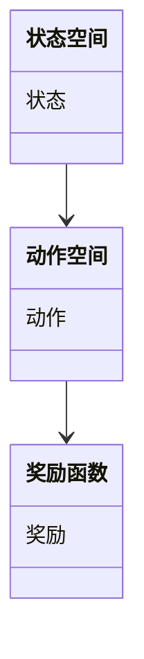
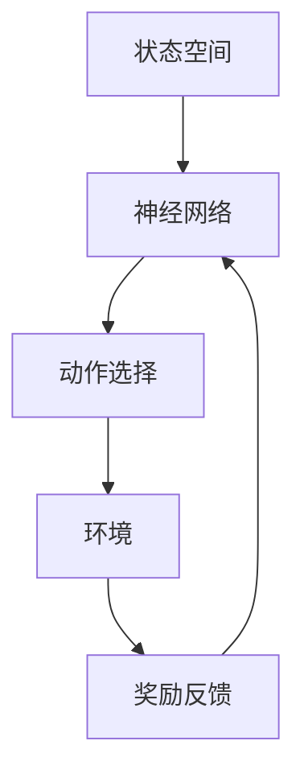
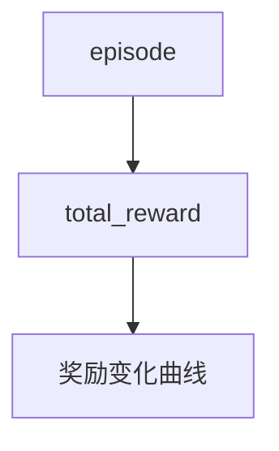

                 


# 强化学习在AI Agent交互策略中的应用

> 关键词：强化学习，AI Agent，交互策略，算法原理，系统架构，项目实战

> 摘要：本文深入探讨了强化学习在AI Agent交互策略中的应用，从基础概念到核心算法，从系统架构到项目实战，全面解析了强化学习如何优化AI Agent的交互行为。文章首先介绍了强化学习的基本概念与AI Agent的核心原理，然后详细讲解了强化学习在AI Agent交互策略中的核心算法及其数学模型，接着通过系统架构设计与项目实战，展示了如何将强化学习应用于实际场景中。最后，本文总结了强化学习在AI Agent交互策略中的优势与挑战，并展望了未来的研究方向。

---

# 第一部分: 强化学习与AI Agent交互策略的背景介绍

## 第1章: 强化学习的基本概念与AI Agent的概述

### 1.1 强化学习的基本概念

#### 1.1.1 从监督学习到强化学习的演进
强化学习（Reinforcement Learning, RL）是机器学习领域的重要分支，它与监督学习（Supervised Learning）和无监督学习（Unsupervised Learning）有着本质的区别。监督学习依赖于有标签的训练数据，要求模型通过输入数据预测输出标签；无监督学习则需要模型从无标签数据中发现模式和结构。而强化学习的核心思想是通过智能体（Agent）与环境的交互，逐步学习最优策略，以最大化累积奖励。

图1-1：强化学习与传统机器学习的区别  
```mermaid
graph TD
    RL[强化学习] --> {对比}
    Supervised[监督学习] --> {输入数据带标签}
    Unsupervised[无监督学习] --> {输入数据无标签}
    RL --> {通过环境反馈学习}
```

#### 1.1.2 强化学习的核心特点
强化学习的核心特点在于其“试错”机制。智能体通过与环境交互，逐步探索和学习，最终找到最优策略。具体特点包括：
- **环境动态性**：环境的状态和反馈可能随智能体的行为而变化。
- **延迟奖励**：智能体的行为可能在较长时间后才获得反馈。
- **策略优化**：目标是通过策略优化，最大化累积奖励。

#### 1.1.3 强化学习与传统机器学习的区别
表1-1：强化学习与传统机器学习的区别对比

| 对比维度 | 强化学习 | 监督学习 | 无监督学习 |
|----------|----------|----------|------------|
| 数据来源 | 环境反馈 | 标签数据 | 无标签数据 |
| 学习目标 | 最大化奖励 | 预测准确性 | 数据聚类或降维 |
| 交互方式 | 智能体与环境交互 | 数据输入模型 | 模型与数据交互 |

### 1.2 AI Agent的基本概念与交互策略

#### 1.2.1 AI Agent的定义与分类
AI Agent是指在特定环境中能够感知环境并采取行动以实现目标的智能体。根据智能体的智能水平和决策能力，可以将AI Agent分为以下几类：
- **反应式Agent**：基于当前感知做出反应，不依赖历史信息。
- **认知式Agent**：具备推理、规划和学习能力，能够处理复杂任务。
- **协作式Agent**：多个Agent协同工作，完成复杂任务。

#### 1.2.2 AI Agent的交互策略与行为模式
AI Agent的交互策略决定了其在不同环境下的行为方式。常见的策略包括：
- **贪心策略**：每一步选择当前最优的动作。
- **随机策略**：通过随机选择动作来探索新状态。
- **混合策略**：结合贪心和随机策略，平衡探索与利用。

#### 1.2.3 强化学习在AI Agent交互策略中的作用
强化学习为AI Agent提供了优化交互策略的框架。通过与环境的交互，智能体可以逐步学习最优策略，从而在复杂环境中实现高效决策。

### 1.3 强化学习在AI Agent中的应用背景

#### 1.3.1 问题背景与挑战
在实际应用中，AI Agent需要在动态且复杂的环境中做出决策。传统基于规则的方法难以应对不确定性，而强化学习通过试错机制能够有效解决这一问题。

#### 1.3.2 问题描述与目标
本文旨在探讨如何通过强化学习优化AI Agent的交互策略，使其在复杂环境中实现高效决策。

#### 1.3.3 问题解决的边界与外延
强化学习的应用范围广泛，但也有其局限性。例如，对于高维状态空间，强化学习可能面临“维度灾难”问题。

---

# 第二部分: 强化学习的核心概念与数学模型

## 第2章: 强化学习的核心概念与数学模型

### 2.1 强化学习的核心概念

#### 2.1.1 状态、动作、奖励的定义
- **状态（State）**：环境在某一时刻的描述。
- **动作（Action）**：智能体在某一状态下采取的行为。
- **奖励（Reward）**：智能体采取动作后获得的反馈。

#### 2.1.2 马尔可夫决策过程（MDP）
马尔可夫决策过程是一种常用的强化学习模型，定义了智能体与环境交互的数学框架。MDP由以下五元组表示：
$$ M = (S, A, P, R, \gamma) $$
- $S$：状态空间
- $A$：动作空间
- $P$：状态转移概率
- $R$：奖励函数
- $\gamma$：折扣因子

#### 2.1.3 策略与价值函数的定义
- **策略（Policy）**：智能体选择动作的概率分布。
- **价值函数（Value Function）**：衡量一个状态或动作的好坏程度。

### 2.2 强化学习的核心算法原理

#### 2.2.1 Q-learning算法
Q-learning是一种基于值函数的强化学习算法，通过更新Q表来学习最优策略。

图2-1：Q-learning算法流程图  
```mermaid
graph TD
    start --> init Q表
    loop
        状态s --> 选择动作a
        动作a --> 执行动作，获得奖励r和新状态s'
        更新Q(s, a) = Q(s, a) + α(r + γ * max Q(s', a') - Q(s, a))
    end
    until 终止条件满足
    end --> 输出最优策略
```

公式2-1：Q-learning的更新公式  
$$ Q(s, a) = Q(s, a) + \alpha [r + \gamma \max Q(s', a') - Q(s, a)] $$

#### 2.2.2 策略梯度方法
策略梯度方法通过优化策略直接寻找最优动作分布。

图2-2：策略梯度算法流程图  
```mermaid
graph TD
    start --> 初始化策略θ
    loop
        状态s --> 根据πθ(s)选择动作a
        执行动作a，获得奖励r和新状态s'
        计算梯度∇θ J(θ)
        更新θ = θ + α ∇θ J(θ)
    end
    until 终止条件满足
    end --> 输出最优策略
```

公式2-2：策略梯度的梯度计算公式  
$$ \nabla \theta J(\theta) = \mathbb{E}_{\tau \sim \pi_\theta} [\nabla \log \pi_\theta(a|s) Q(s,a)] $$

#### 2.2.3 深度强化学习的原理
深度强化学习结合了深度学习和强化学习的优势，通过神经网络逼近价值函数或策略。

图2-3：深度强化学习框架  
```mermaid
graph TD
    状态s --> 神经网络
    神经网络 --> 输出Q值或策略
    Q值/策略 --> 动作选择
    动作 --> 环境，获得奖励r和新状态s'
    神经网络 <-- r, s'
```

### 2.3 强化学习的数学模型与公式

#### 2.3.1 Q-learning的数学模型
$$ Q(s, a) = Q(s, a) + \alpha [r + \gamma \max Q(s', a') - Q(s, a)] $$

#### 2.3.2 策略梯度的数学模型
$$ \nabla \theta J(\theta) = \mathbb{E}_{\tau \sim \pi_\theta} [\nabla \log \pi_\theta(a|s) Q(s,a)] $$

---

# 第三部分: AI Agent交互策略的核心概念与联系

## 第3章: AI Agent交互策略的核心概念与联系

### 3.1 AI Agent交互策略的核心概念

#### 3.1.1 策略的定义与分类
- **策略的定义**：AI Agent在不同状态下的动作选择规则。
- **策略的分类**：基于确定性和随机性的策略，基于值函数和策略梯度的策略。

#### 3.1.2 策略的优化目标
- 最大化累积奖励
- 最小化策略损失

#### 3.1.3 策略的评价指标
- **累积奖励（Cumulative Reward）**：衡量策略的总体表现。
- **收敛速度（Convergence Speed）**：策略优化的速度。
- **稳定性（Stability）**：策略在动态环境中的适应能力。

### 3.2 强化学习与AI Agent交互策略的关系

#### 3.2.1 强化学习在策略优化中的应用
- Q-learning用于离线策略优化
- 策略梯度用于在线策略优化

#### 3.2.2 策略与价值函数的联系
- 策略通过价值函数进行评估
- 价值函数指导策略的优化

---

# 第四部分: 系统分析与架构设计方案

## 第4章: 系统分析与架构设计方案

### 4.1 问题场景介绍

#### 4.1.1 问题场景
考虑一个AI Agent需要在动态环境中进行交互决策，例如智能音箱、自动驾驶等场景。

### 4.2 项目介绍

#### 4.2.1 项目目标
通过强化学习优化AI Agent的交互策略，使其在复杂环境中实现高效决策。

#### 4.2.2 项目范围
- 系统功能设计
- 系统架构设计
- 系统接口设计
- 系统交互设计

### 4.3 系统功能设计

#### 4.3.1 领域模型设计
图4-1：领域模型类图  


### 4.4 系统架构设计

#### 4.4.1 系统架构图
图4-2：系统架构图  


### 4.5 系统接口设计

#### 4.5.1 接口描述
- 输入接口：状态、动作
- 输出接口：奖励、新状态

### 4.6 系统交互设计

#### 4.6.1 交互流程
图4-3：系统交互序列图  
```mermaid
graph TD
    start --> 状态感知
    状态感知 --> 动作选择
    动作选择 --> 执行动作
    执行动作 --> 环境反馈
    环境反馈 --> 奖励计算
    奖励计算 --> 策略优化
    策略优化 --> 输出最优策略
    end
```

---

# 第五部分: 项目实战

## 第5章: 项目实战

### 5.1 环境安装与配置

#### 5.1.1 环境依赖
- Python 3.8+
- TensorFlow 2.0+
- OpenAI Gym

### 5.2 系统核心实现

#### 5.2.1 环境交互代码
```python
import gym
import numpy as np

env = gym.make('CartPole-v0')
env.seed(42)
```

#### 5.2.2 强化学习算法实现
```python
class QLearning:
    def __init__(self, env):
        self.env = env
        self.alpha = 0.1
        self.gamma = 0.99
        self.q_table = np.zeros(env.observation_space.shape + (env.action_space.n,))
    
    def choose_action(self, state):
        if np.random.random() < 0.9:
            return np.argmax(self.q_table[state])
        else:
            return np.random.randint(self.env.action_space.n)
    
    def update_q_table(self, state, action, reward, next_state):
        q = self.q_table[state][action]
        next_q = np.max(self.q_table[next_state])
        self.q_table[state][action] = q + self.alpha * (reward + self.gamma * next_q - q)
```

#### 5.2.3 策略优化代码
```python
def train():
    ql = QLearning(env)
    for episode in range(1000):
        state = env.reset()
        total_reward = 0
        while True:
            action = ql.choose_action(state)
            next_state, reward, done, _ = env.step(action)
            ql.update_q_table(state, action, reward, next_state)
            total_reward += reward
            state = next_state
            if done:
                break
        print(f"Episode {episode}, Total Reward: {total_reward}")
```

### 5.3 代码应用解读与分析

#### 5.3.1 代码功能解读
- `QLearning`类实现了Q-learning算法，维护Q表并更新。
- `train`函数实现了训练过程，通过不断交互优化Q表。

### 5.4 实际案例分析

#### 5.4.1 训练过程分析
图5-1：训练过程奖励变化曲线  


### 5.5 项目小结

#### 5.5.1 项目总结
通过Q-learning算法实现了AI Agent在CartPole环境中的交互策略优化。

---

# 第六部分: 总结与展望

## 第6章: 总结与展望

### 6.1 总结

#### 6.1.1 强化学习的优势
- 无需大量标注数据
- 能够处理动态环境
- 可以实现端到端优化

#### 6.1.2 当前的挑战
- 状态空间高维问题
- 算法收敛速度慢
- 环境复杂性难以处理

### 6.2 未来研究方向

#### 6.2.1 算法优化
- 更高效的强化学习算法
- 更好的策略优化方法

#### 6.2.2 应用领域扩展
- 更多实际场景的应用
- 多智能体协作

### 6.3 最佳实践 tips

#### 6.3.1 实践建议
- 合理选择强化学习算法
- 设计有效的奖励机制
- 充分利用环境信息

#### 6.3.2 注意事项
- 注意算法的收敛性
- 处理好探索与利用的平衡
- 防止过拟合

---

作者：AI天才研究院/AI Genius Institute & 禅与计算机程序设计艺术/Zen And The Art of Computer Programming

