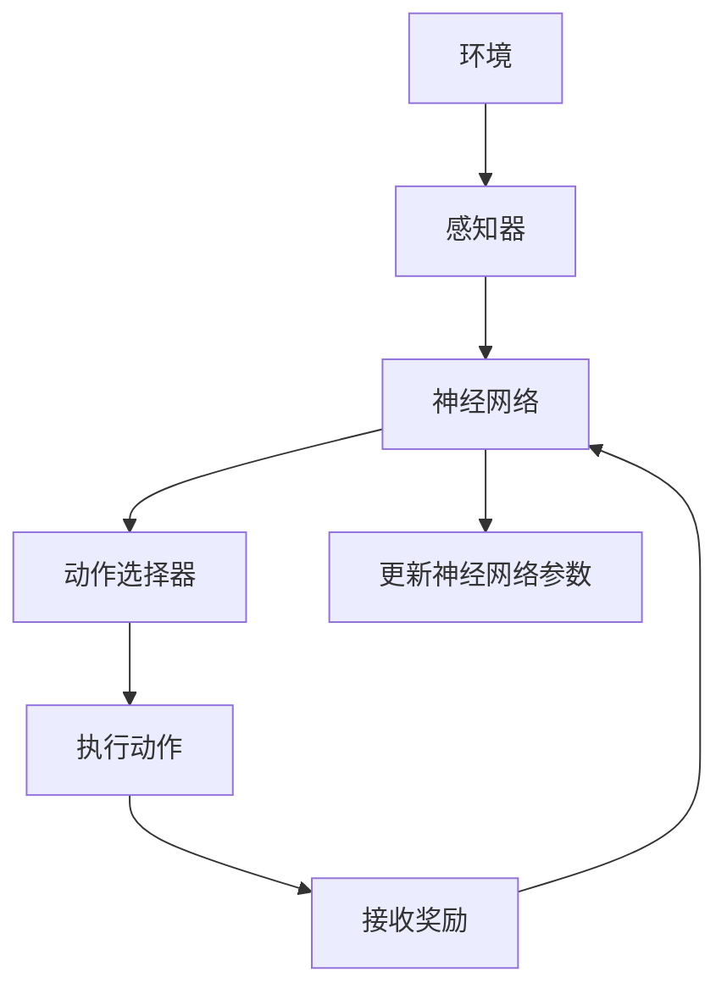

                 


# 强化学习在AI Agent人机协作中的应用

---

## 关键词：
- 强化学习
- AI Agent
- 人机协作
- 算法原理
- 系统设计

---

## 摘要：
本文探讨了强化学习在AI Agent人机协作中的应用，分析了强化学习的核心算法及其在AI Agent中的应用。文章详细讲解了Q-Learning和DQN算法的原理、数学模型，并通过实际案例展示了如何将这些算法应用于人机协作场景中。最后，本文提出了系统设计与架构方案，并给出了项目实战的代码实现，为读者提供了全面的理解和应用指导。

---

## 目录大纲

# 第一部分: 强化学习与AI Agent基础

## 第1章: 强化学习与AI Agent概述

### 1.1 强化学习的基本概念
- **1.1.1 强化学习的定义**
  - 强化学习是一种通过试错机制，让智能体在与环境交互中学习策略的方法。
- **1.1.2 AI Agent的定义与特点**
  - AI Agent：能够感知环境、做出决策并采取行动的智能体。
- **1.1.3 强化学习与AI Agent的关系**
  - 强化学习是AI Agent实现自主决策的核心技术之一。

### 1.2 AI Agent的任务模型
- **1.2.1 单智能体与多智能体任务模型**
  - 单智能体：独立决策。
  - 多智能体：协作与竞争。
- **1.2.2 人机协作的定义与特点**
  - 人类与AI Agent共同完成任务，结合人类的直觉与AI的计算能力。

### 1.3 强化学习在人机协作中的应用前景
- **1.3.1 人机协作的潜在应用领域**
  - 游戏AI、推荐系统、机器人协作。
- **1.3.2 企业采用人机协作的优势**
  - 提高效率，增强决策能力。
- **1.3.3 应用的挑战与机遇**
  - 算法复杂性，数据隐私问题。

## 第2章: 强化学习的核心算法

### 2.1 Q-Learning算法
- **2.1.1 Q-Learning的基本原理**
  - 动作价值函数Q(s,a)：状态s下采取动作a的价值。
  - 更新规则：Q(s,a) = Q(s,a) + α( r + γ max Q(s',a') - Q(s,a) )。
  - 其中，α是学习率，γ是折扣因子。

- **2.1.2 Q-Learning的数学模型**
  - 状态空间S，动作空间A，奖励函数R(s,a)。
  - 转移概率P(s'|s,a)。

- **2.1.3 Q-Learning的实现步骤**
  - 初始化Q表。
  - 与环境交互，更新Q表。
  - 收敛时得到最优策略。

### 2.2 Deep Q-Networks (DQN)算法
- **2.2.1 DQN的原理与改进**
  - 使用深度神经网络近似Q函数。
  - 解决高维状态空间问题。

- **2.2.2 DQN的算法流程图**



- **2.2.3 DQN的数学模型**
  - 神经网络输出Q(s,a)，目标是最小化预测与实际奖励的差。
  - 损失函数：L = (r + γ max Q(s',a') - Q(s,a))²。

---

# 第二部分: AI Agent的设计与实现

## 第3章: AI Agent的设计与实现

### 3.1 AI Agent的结构
- **3.1.1 感知模块**
  - 从环境中获取信息。
- **3.1.2 决策模块**
  - 使用强化学习算法做出决策。
- **3.1.3 执行模块**
  - 执行动作影响环境。

### 3.2 人机协作的任务模型
- **3.2.1 任务分解**
  - 将复杂任务分解为子任务。
- **3.2.2 人机协作的交互模型**
  - 基于强化学习的反馈机制。

### 3.3 系统设计与架构
- **3.3.1 系统架构设计**
  - 分层架构：感知层、决策层、执行层。
  - 接口设计：标准化接口实现模块化。

---

# 第三部分: 强化学习在人机协作中的应用案例

## 第4章: 应用案例分析

### 4.1 游戏AI
- **4.1.1 游戏AI的基本原理**
  - 使用强化学习训练AI在游戏中的决策能力。
- **4.1.2 DQN在游戏AI中的应用**
  - 经典案例：AlphaGo。

### 4.2 推荐系统
- **4.2.1 基于强化学习的推荐算法**
  - 使用强化学习优化推荐策略。

### 4.3 机器人协作
- **4.3.1 多智能体协作的强化学习方法**
  - 使用MADE算法解决协作问题。

---

# 第四部分: 项目实战

## 第5章: 项目实战

### 5.1 环境安装
- **5.1.1 安装Python环境**
  - 使用Anaconda或虚拟环境。
- **5.1.2 安装相关库**
  - TensorFlow、Keras、OpenAI Gym。

### 5.2 核心代码实现
- **5.2.1 Q-Learning算法实现**
  ```python
  import numpy as np

  class QLearning:
      def __init__(self, state_space, action_space):
          self.state_space = state_space
          self.action_space = action_space
          self.q_table = np.zeros((state_space, action_space))

      def act(self, state, epsilon=0.1):
          if np.random.random() < epsilon:
              return np.random.randint(self.action_space)
          else:
              return np.argmax(self.q_table[state])

      def update(self, state, action, reward, next_state, alpha=0.1, gamma=0.99):
          self.q_table[state][action] += alpha * (reward + gamma * np.max(self.q_table[next_state]) - self.q_table[state][action])
  ```

- **5.2.2 DQN算法实现**
  ```python
  import tensorflow as tf

  class DQN:
      def __init__(self, state_dim, action_dim):
          self.model = self.build_model()
          self.target_model = self.build_model()
          self.state_dim = state_dim
          self.action_dim = action_dim

      def build_model(self):
          model = tf.keras.Sequential([
              tf.keras.layers.Dense(64, activation='relu', input_dim=self.state_dim),
              tf.keras.layers.Dense(64, activation='relu'),
              tf.keras.layers.Dense(self.action_dim, activation='linear')
          ])
          return model

      def get_action(self, state, epsilon=0.1):
          state = tf.convert_to_tensor([state], dtype=tf.float32)
          prediction = self.model.predict(state)[0]
          if np.random.random() < epsilon:
              return np.random.randint(self.action_dim)
          else:
              return np.argmax(prediction)

      def update_target(self):
          self.target_model.set_weights(self.model.get_weights())
  ```

---

# 第五部分: 系统设计与架构

## 第6章: 系统设计与架构

### 6.1 系统架构设计
- **6.1.1 系统整体架构**
  ```mermaid
  graph LR
      A[用户] --> B[输入层]
      B --> C[感知器]
      C --> D[决策模块]
      D --> E[执行器]
      E --> F[环境]
      F --> C
  ```

- **6.1.2 系统功能模块**
  - 感知模块：接收输入。
  - 决策模块：强化学习算法。
  - 执行模块：输出动作。

### 6.2 接口设计
- **6.2.1 标准化接口**
  - 输入接口：接收状态信息。
  - 输出接口：输出动作。

### 6.3 交互设计
- **6.3.1 人机交互流程**
  ```mermaid
  graph LR
      A[用户输入] --> B[感知器]
      B --> C[决策模块]
      C --> D[执行器]
      D --> E[环境反馈]
      E --> B
  ```

---

# 第六部分: 总结与展望

## 第7章: 总结与展望

### 7.1 总结
- 强化学习在AI Agent人机协作中的重要性。
- Q-Learning和DQN算法的应用。

### 7.2 未来展望
- 多智能体协作的强化学习。
- 新兴领域：元强化学习。

---

## 作者：AI天才研究院/AI Genius Institute & 禅与计算机程序设计艺术 /Zen And The Art of Computer Programming

