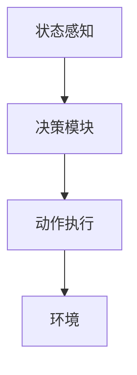

                 


# 强化学习在AI Agent任务规划中的实践

**关键词**：强化学习、AI Agent、任务规划、马尔可夫决策过程、Q-learning、策略梯度方法

**摘要**：本文详细探讨了强化学习在AI Agent任务规划中的应用，从理论基础到实际应用，逐步分析了强化学习的核心概念、算法原理以及系统设计，结合实际案例展示了强化学习在任务规划中的实践应用。

---

## 第1章 强化学习与AI Agent概述

### 1.1 强化学习的基本概念
强化学习是一种机器学习方法，通过智能体与环境的交互，学习如何采取最优动作以最大化累计奖励。AI Agent（智能体）是强化学习的核心主体，负责感知环境、做出决策并执行动作。

#### 1.1.1 强化学习的定义与特点
- **定义**：强化学习通过试错机制，学习在特定环境中采取最优动作序列以获得最大累积奖励。
- **特点**：
  - 基于反馈的强化信号（奖励）进行学习。
  - 动作空间和状态空间的多样性。
  - 需要平衡探索与利用。

#### 1.1.2 AI Agent的基本概念
- **AI Agent**：能够感知环境并采取行动以实现目标的智能体。
- **任务规划**：AI Agent根据任务目标和环境状态，制定并执行一系列动作以完成任务。

#### 1.1.3 强化学习在AI Agent任务规划中的作用
- 强化学习为AI Agent提供决策策略，使其能够在动态环境中自主规划和优化任务执行。

### 1.2 强化学习的核心概念
- **状态（State）**：环境在某一时刻的特征描述。
- **动作（Action）**：智能体在某一状态下采取的行为。
- **奖励（Reward）**：智能体执行动作后获得的反馈，用于指导学习。

### 1.3 任务规划的基本原理
- **任务分解**：将复杂任务分解为多个子任务，逐步解决。
- **状态转移**：任务执行过程中，状态之间通过动作转移。

### 1.4 本章小结
本章介绍了强化学习和AI Agent的基本概念，以及强化学习在任务规划中的作用，为后续章节奠定基础。

---

## 第2章 强化学习的理论基础

### 2.1 马尔可夫决策过程（MDP）
马尔可夫决策过程是强化学习的核心模型，描述了智能体与环境的交互过程。

#### 2.1.1 状态空间与动作空间
- **状态空间（S）**：所有可能状态的集合。
- **动作空间（A）**：所有可能动作的集合。

#### 2.1.2 奖励函数与价值函数
- **奖励函数（R(s,a)）**：给定状态和动作时的即时奖励。
- **价值函数（V(s)）**：状态s的长期累计奖励。

#### 2.1.3 策略与价值函数的关系
- **策略（π）**：给定状态下选择动作的概率分布。
- **价值函数**：评估策略在状态下的长期收益。

### 2.2 基于值函数的强化学习算法
#### 2.2.1 Q-learning算法
Q-learning是一种经典的值迭代算法，适用于离线学习。

- **Q值更新公式**：
  $$ Q(s,a) = Q(s,a) + \alpha [r + \gamma \max Q(s',a') - Q(s,a)] $$
  其中，α是学习率，γ是折扣因子。

- **动作选择策略**：
  $$ \pi(a|s) = \text{argmax}_a Q(s,a) $$

#### 2.2.2 动态规划方法
动态规划通过迭代更新价值函数，找到最优策略。

- **贝尔曼方程**：
  $$ V_{\pi}(s) = \mathbb{E}[r + \gamma V_{\pi}(s')] $$

### 2.3 基于策略的强化学习算法
#### 2.3.1 策略梯度方法
策略梯度通过优化策略参数，直接最大化奖励期望。

- **策略更新公式**：
  $$ \theta \leftarrow \theta + \alpha \nabla_\theta \mathbb{E}[R] $$

#### 2.3.2 REINFORCE算法
REINFORCE是一种基于策略梯度的算法，适用于离散动作空间。

- **梯度计算公式**：
  $$ \nabla_\theta \mathbb{E}[R] = \nabla_\theta \log \pi(a|s) \cdot R $$

### 2.4 本章小结
本章介绍了强化学习的理论基础，包括马尔可夫决策过程和核心算法的数学模型。

---

## 第3章 AI Agent任务规划模型

### 3.1 基于模型的任务规划
基于模型的任务规划依赖于对环境的建模，适用于环境已知的情况。

#### 3.1.1 状态空间建模
通过构建状态转移模型，预测下一状态。

#### 3.1.2 动作空间建模
定义可用动作及其效果。

#### 3.1.3 奖励函数设计
设计奖励函数以引导智能体完成任务。

### 3.2 基于无模型的任务规划
基于无模型的任务规划无需环境模型，适用于未知环境。

#### 3.2.1 探索与利用策略
平衡探索新状态和利用已知状态。

#### 3.2.2 增量式学习方法
逐步更新策略，适应新环境。

### 3.3 多阶段任务规划模型
多阶段任务规划将任务分解为多个子任务，逐步完成。

#### 3.3.1 分阶段任务分解
将复杂任务分解为简单子任务。

#### 3.3.2 阶段间状态转移
子任务之间的状态转移关系。

#### 3.3.3 多阶段奖励机制
设计分阶段奖励，引导智能体完成子任务。

### 3.4 本章小结
本章介绍了基于模型和无模型的任务规划方法，以及多阶段任务规划模型。

---

## 第4章 强化学习算法的数学模型与公式

### 4.1 Q-learning算法的数学模型
Q-learning通过更新Q值函数，学习最优策略。

- **Q值更新公式**：
  $$ Q(s,a) = Q(s,a) + \alpha [r + \gamma \max Q(s',a') - Q(s,a)] $$

- **动作选择策略**：
  $$ \pi(a|s) = \text{argmax}_a Q(s,a) $$

### 4.2 策略梯度方法的数学模型
策略梯度通过优化策略参数，直接最大化奖励期望。

- **策略更新公式**：
  $$ \theta \leftarrow \theta + \alpha \nabla_\theta \mathbb{E}[R] $$

- **梯度计算公式**：
  $$ \nabla_\theta \mathbb{E}[R] = \nabla_\theta \log \pi(a|s) \cdot R $$

### 4.3 本章小结
本章详细推导了Q-learning和策略梯度方法的数学模型，为后续实现提供理论基础。

---

## 第5章 强化学习在AI Agent任务规划中的系统设计

### 5.1 系统功能设计
- **需求分析**：明确任务目标和环境特性。
- **功能模块**：状态感知、决策制定、动作执行。

### 5.2 系统架构设计
- **领域模型**：描述系统核心概念及其关系。
- **架构图**：展示系统各模块的交互关系。



### 5.3 系统接口设计
- **输入接口**：接收环境状态。
- **输出接口**：发送决策动作。

### 5.4 本章小结
本章详细描述了强化学习在AI Agent任务规划中的系统设计，包括功能模块、架构和接口设计。

---

## 第6章 项目实战：基于强化学习的AI Agent任务规划

### 6.1 环境搭建
- **工具安装**：安装Python、TensorFlow等工具。
- **环境配置**：设置强化学习环境，如OpenAI Gym。

### 6.2 核心代码实现
以下是一个简单的Q-learning算法实现：

```python
import numpy as np

class QLearning:
    def __init__(self, state_space, action_space, alpha=0.1, gamma=0.9):
        self.Q = np.zeros((state_space, action_space))
        self.alpha = alpha
        self.gamma = gamma

    def choose_action(self, state):
        return np.argmax(self.Q[state, :])

    def update_Q(self, state, action, reward, next_state):
        self.Q[state, action] += self.alpha * (reward + self.gamma * np.max(self.Q[next_state, :]) - self.Q[state, action])

# 示例使用
env = ...  # 初始化环境
agent = QLearning(env.observation_space, env.action_space)

for episode in range(1000):
    state = env.reset()
    while not done:
        action = agent.choose_action(state)
        next_state, reward, done, _ = env.step(action)
        agent.update_Q(state, action, reward, next_state)
```

### 6.3 案例分析与实现解读
通过实际案例分析，展示强化学习在任务规划中的应用效果。

### 6.4 本章小结
本章通过项目实战，展示了强化学习在AI Agent任务规划中的具体应用，包括环境搭建和代码实现。

---

## 第7章 总结与展望

### 7.1 本章总结
本文详细探讨了强化学习在AI Agent任务规划中的应用，从理论基础到实际应用，系统地分析了相关方法和实现。

### 7.2 未来展望
未来的研究方向包括更高效的算法设计和更复杂任务的规划。

### 7.3 最佳实践Tips
- 合理设计奖励函数。
- 平衡探索与利用。
- 选择合适的算法和工具。

### 7.4 本章小结
总结全文内容，展望未来发展方向。

---

**作者：AI天才研究院 & 禅与计算机程序设计艺术**

---

通过以上内容，我们系统地探讨了强化学习在AI Agent任务规划中的应用，从理论到实践，为读者提供了全面的知识体系。

