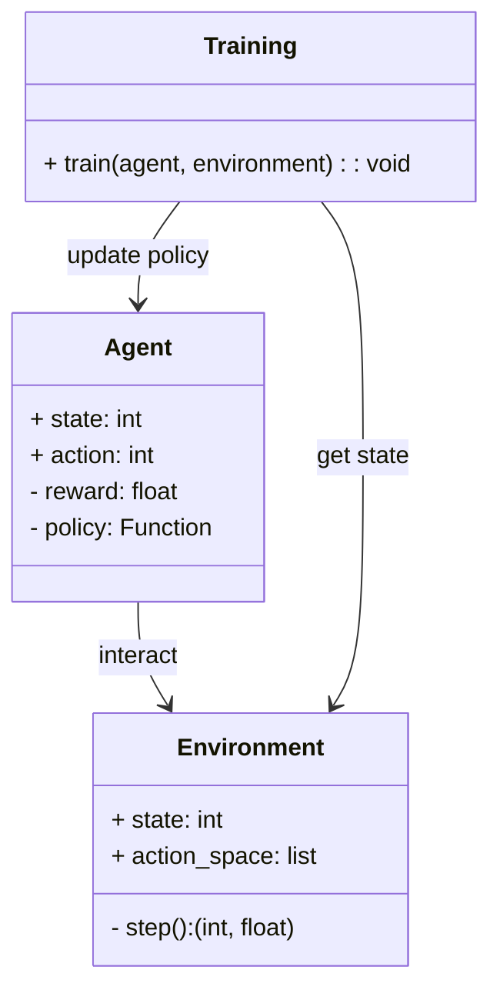
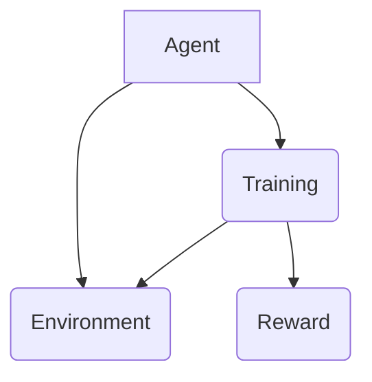

                 


# 强化学习在AI Agent决策中的应用

## 关键词：强化学习、AI Agent、决策系统、算法原理、系统架构、项目实战

## 摘要

强化学习（Reinforcement Learning，RL）是一种通过智能体与环境交互来学习最优决策策略的机器学习方法。本文深入探讨强化学习在AI Agent决策中的应用，从基础概念到高级算法，结合实际项目案例，详细讲解如何设计和实现高效的决策系统。内容涵盖强化学习的核心概念、经典算法、系统架构、项目实战以及高级应用，旨在为读者提供全面的理论与实践指导。

---

## 第一部分：强化学习基础

### 第1章：强化学习的背景与概念

#### 1.1 强化学习的定义与特点

- **定义**：强化学习是一种通过试错机制，智能体通过与环境交互，学习如何采取行动以最大化累积奖励的机器学习方法。

- **特点**：
  - **自主性**：智能体在没有外部监督的情况下，通过与环境互动学习。
  - **目标导向**：通过最大化累积奖励来优化决策策略。
  - **在线学习**：智能体在实时环境中学习，需要快速做出决策。

- **与监督学习和无监督学习的对比**：
  - **监督学习**：有标签数据，直接知道正确输出。
  - **无监督学习**：无标签数据，发现数据中的模式。
  - **强化学习**：通过奖励信号，学习如何与环境互动。

#### 1.2 强化学习的历史与发展

- **起源**：20世纪50年代，Richard Bellman提出动态规划概念。
- **里程碑**：
  - 1990年代：Q-Learning算法提出。
  - 2010年代：深度强化学习（如Deep Q-Networks）兴起。
- **当前趋势**：应用于游戏AI、自动驾驶、机器人控制等领域。

#### 1.3 强化学习的应用领域

- **游戏AI**：如AlphaGo、Dota AI。
- **机器人控制**：如自动导航和机械臂控制。
- **自动驾驶**：路径规划和决策控制。
- **金融投资**：资产配置和交易策略优化。

### 第2章：强化学习的核心概念

#### 2.1 状态空间与动作空间

- **状态（State）**：智能体所处环境的描述，例如在迷宫中的位置。
- **动作（Action）**：智能体可以执行的操作，例如“左转”或“右转”。
- **状态空间**：所有可能状态的集合，可以是高维连续空间或低维离散空间。

#### 2.2 奖励函数与目标函数

- **奖励函数（Reward Function）**：定义智能体在每个状态下采取某个动作后所获得的奖励。
- **目标函数**：优化目标，通常是最化累积奖励。

#### 2.3 策略与价值函数

- **策略（Policy）**：定义智能体在每个状态下选择动作的概率分布。
- **价值函数（Value Function）**：评估某状态下采取某种策略的期望累积奖励。

---

## 第二部分：强化学习的算法原理

### 第3章：强化学习的基本算法

#### 3.1 Q-Learning算法

- **算法原理**：
  - 使用Q表存储状态-动作对的Q值。
  - 通过贝尔曼方程更新Q值：$Q(s, a) = r + \gamma \max_{a'} Q(s', a')$。

- **代码实现**：

```python
import numpy as np

class QLearning:
    def __init__(self, state_space, action_space, gamma=0.99, alpha=0.1):
        self.q_table = np.zeros((state_space, action_space))
        self.gamma = gamma
        self.alpha = alpha

    def take_action(self, state):
        return np.argmax(self.q_table[state])

    def update(self, state, action, reward, next_state):
        self.q_table[state, action] = self.q_table[state, action] * (1 - self.alpha) + self.alpha * (reward + self.gamma * np.max(self.q_table[next_state]))
```

- **案例分析**：迷宫导航问题，智能体通过Q-Learning学习路径。

#### 3.2 策略梯度法

- **算法原理**：
  - 使用策略直接优化，通过梯度上升方法更新策略参数。
  - 策略函数形式：$\pi(a|s) = \frac{e^{Q(s,a)}}{\sum e^{Q(s,a')}}$。

- **代码实现**：

```python
import torch
import torch.nn as nn

class PolicyGradient:
    def __init__(self, input_dim, output_dim, learning_rate=0.01):
        self.net = nn.Linear(input_dim, output_dim)
        self.optimizer = torch.optim.Adam(self.net.parameters(), lr=learning_rate)

    def forward(self, x):
        return torch.softmax(self.net(x), dim=1)

    def update(self, rewards, log_probs):
        loss = -torch.mean(torch.log(log_probs) * rewards)
        self.optimizer.zero_grad()
        loss.backward()
        self.optimizer.step()
```

- **案例分析**：使用策略梯度法训练智能体在OpenAI Gym环境中行走。

---

## 第三部分：强化学习的系统架构与应用

### 第4章：系统分析与架构设计

#### 4.1 问题场景分析

- **游戏AI**：设计一个AI代理在复杂游戏环境中做出决策。
- **机器人控制**：设计机器人在动态环境中自主导航和操作。

#### 4.2 系统功能设计

- **领域模型**：使用Mermaid类图展示系统模块及其关系。



#### 4.3 系统架构设计

- **架构设计**：使用Mermaid架构图展示系统架构。



---

## 第四部分：项目实战

### 第5章：强化学习项目实战

#### 5.1 环境搭建

- 安装必要的库：`gym`, `numpy`, `tensorflow`。

#### 5.2 系统核心实现

- **Q-Learning实现**：迷宫导航问题。
- **策略梯度法实现**：在OpenAI Gym中训练智能体行走。

#### 5.3 实际案例分析

- 使用强化学习训练一个AI代理在复杂环境中做出决策，并展示训练过程和结果。

---

## 第五部分：强化学习的高级应用

### 第6章：强化学习的高级应用与扩展

#### 6.1 多智能体协作

- **多智能体强化学习**：多个智能体协同工作的场景，如机器人编队和交通管理。

#### 6.2 连续控制与实时应用

- **连续控制**：使用深度强化学习解决连续控制问题。
- **实时应用**：实时决策系统，如自动驾驶和实时交易。

---

## 第六部分：总结与展望

### 6.1 总结

- 强化学习是一种强大的机器学习方法，广泛应用于AI Agent的决策系统中。
- 需要结合具体问题场景，选择合适的算法和架构。

### 6.2 展望

- 结合深度学习和强化学习，探索更复杂的决策问题。
- 研究实时强化学习和边缘计算结合的应用。

---

## 作者信息

作者：AI天才研究院/AI Genius Institute & 禅与计算机程序设计艺术 /Zen And The Art of Computer Programming

