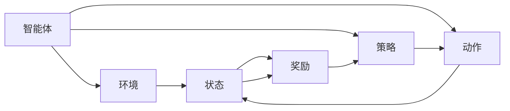
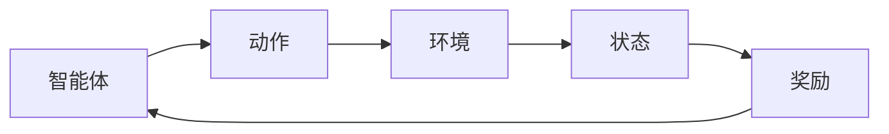
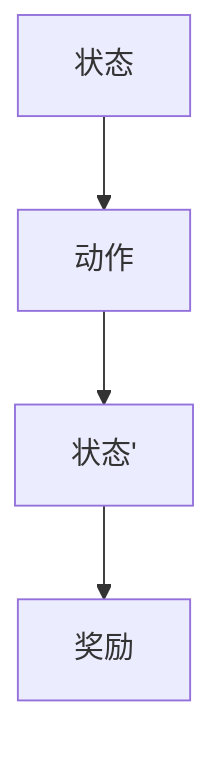
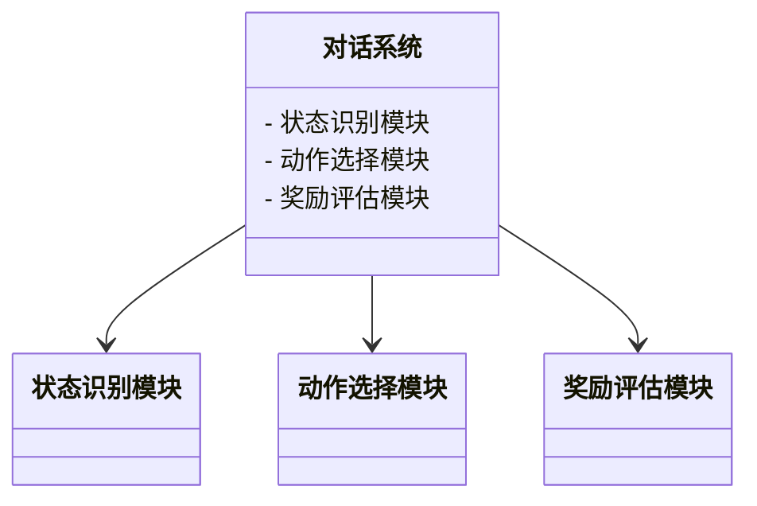

                 


# 强化学习在AI Agent对话系统中的应用

## 关键词：强化学习，AI Agent，对话系统，马尔可夫决策过程，奖励机制

## 摘要

本文探讨了强化学习在AI Agent对话系统中的应用，详细介绍了强化学习的核心概念、算法原理以及在对话系统中的实际应用。通过分析对话系统的背景、核心概念、算法实现、系统架构、项目实战和最佳实践，本文旨在帮助读者理解如何利用强化学习提升对话系统的性能和用户体验。

---

## 目录

1. [强化学习与AI Agent对话系统背景](#强化学习与AI-Agent对话系统背景)
   - 1.1 [强化学习的基本概念](#强化学习的基本概念)
   - 1.2 [AI Agent的基本概念](#AI-Agent的基本概念)
   - 1.3 [强化学习在对话系统中的应用背景](#强化学习在对话系统中的应用背景)
   - 1.4 [本章小结](#本章小结)

2. [强化学习的核心概念](#强化学习的核心概念)
   - 2.1 [状态、动作与奖励](#状态、动作与奖励)
   - 2.2 [马尔可夫决策过程（MDP）](#马尔可夫决策过程（MDP）)
   - 2.3 [强化学习的核心算法](#强化学习的核心算法)
   - 2.4 [本章小结](#本章小结)

3. [强化学习算法的数学模型与公式](#强化学习算法的数学模型与公式)
   - 3.1 [Q-learning算法的数学模型](#Q-learning算法的数学模型)
   - 3.2 [DQN算法的数学模型](#DQN算法的数学模型)
   - 3.3 [Actor-Critic算法的数学模型](#Actor-Critic算法的数学模型)
   - 3.4 [本章小结](#本章小结)

4. [强化学习在对话系统中的系统架构设计](#强化学习在对话系统中的系统架构设计)
   - 4.1 [对话系统的背景与目标](#对话系统的背景与目标)
   - 4.2 [系统功能设计](#系统功能设计)
   - 4.3 [系统架构设计](#系统架构设计)
   - 4.4 [系统接口设计](#系统接口设计)
   - 4.5 [系统交互流程](#系统交互流程)
   - 4.6 [本章小结](#本章小结)

5. [强化学习在对话系统中的项目实战](#强化学习在对话系统中的项目实战)
   - 5.1 [项目背景与目标](#项目背景与目标)
   - 5.2 [环境搭建](#环境搭建)
   - 5.3 [系统核心实现](#系统核心实现)
   - 5.4 [功能分析与实现](#功能分析与实现)
   - 5.5 [案例分析与详细讲解](#案例分析与详细讲解)
   - 5.6 [本章小结](#本章小结)

6. [强化学习在对话系统中的最佳实践](#强化学习在对话系统中的最佳实践)
   - 6.1 [小结](#小结)
   - 6.2 [注意事项](#注意事项)
   - 6.3 [拓展阅读](#拓展阅读)
   - 6.4 [本章小结](#本章小结)

7. [附录](#附录)
   - 7.1 [数学公式](#数学公式)
   - 7.2 [算法代码](#算法代码)
   - 7.3 [参考文献](#参考文献)

---

## 正文

### 第1章: 强化学习与AI Agent对话系统背景

#### 1.1 强化学习的基本概念

**强化学习**是一种机器学习方法，通过智能体与环境的交互，逐步学习最优策略，以最大化累计奖励。与监督学习不同，强化学习不需要标记的训练数据，而是通过探索和利用环境来学习。

**关键概念对比表：**

| **概念**      | **监督学习**          | **无监督学习**          | **强化学习**          |
|----------------|----------------------|-------------------------|-----------------------|
| 数据类型       | 标签数据             | 未标记数据             | 状态、动作、奖励       |
| 优化目标       | 模型预测准确率       | 数据聚类或分类         | 最大化累计奖励         |
| 交互方式       | 简单输入输出         | 数据结构发现           | 环境反馈              |

**Mermaid图：**



#### 1.2 AI Agent的基本概念

**AI Agent**是具有感知和行动能力的智能体，能够理解环境并采取行动以实现目标。

**AI Agent分类：**

| **分类**       | **描述**                                                                 |
|----------------|--------------------------------------------------------------------------|
| 简单反射Agent | 基于当前状态做出反应，无内部状态或推理能力                                       |
| 基于模型Agent | 维护环境模型，用于预测未来状态和行动结果                                       |
| 目标驱动Agent | 基于目标和优先级进行决策                                                     |
| 学习驱动Agent | 通过经验学习优化策略                                                       |

#### 1.3 强化学习在对话系统中的应用背景

**对话系统的背景：**

- 从基于规则到统计模型，再到深度学习的发展历程。
- 强化学习在对话系统中的优势：动态交互、策略优化。

**当前研究热点与挑战：**

- 多轮对话的连贯性与一致性。
- 用户意图的准确识别与应对。
- 奖励函数的设计与优化。

---

### 第2章: 强化学习的核心概念

#### 2.1 状态、动作与奖励

**状态（State）**：环境的实时信息，表示当前情况。

**动作（Action）**：智能体在特定状态下选择的行为。

**奖励（Reward）**：智能体执行动作后获得的反馈，用于评估动作的好坏。

**Mermaid图：**



#### 2.2 马尔可夫决策过程（MDP）

**MDP定义：**

- 状态空间S
- 动作空间A
- 转移概率P(s' | s, a)
- 奖励函数R(s, a)
- 折扣因子γ

**MDP在对话系统中的应用：**

- 将对话历史作为状态，用户意图作为动作，奖励基于对话效果。

**Mermaid图：**



#### 2.3 强化学习的核心算法

**Q-learning算法：**

- 动作值Q(s, a)更新公式：$$ Q(s, a) = Q(s, a) + \alpha [r + \gamma \max Q(s', a') - Q(s, a)] $$

**DQN算法：**

- 使用经验回放和双网络结构，减少数据偏差。

**Actor-Critic算法：**

- 同时学习策略（Actor）和价值函数（Critic）。

---

### 第3章: 强化学习算法的数学模型与公式

#### 3.1 Q-learning算法的数学模型

**Q值更新公式：**

$$ Q(s, a) = Q(s, a) + \alpha [r + \gamma \max Q(s', a') - Q(s, a)] $$

**探索与利用策略：**

- 贪婪算法：选择Q值最大的动作。
- 转换概率ε，随机选择动作。

#### 3.2 DQN算法的数学模型

**神经网络结构：**

- 输入层：状态向量。
- 隐藏层：非线性变换。
- 输出层：Q值。

**损失函数：**

$$ \text{损失} = \mathbb{E}[ (r + \gamma Q(s', a') - Q(s, a))^2 ] $$

---

### 第4章: 强化学习在对话系统中的系统架构设计

#### 4.1 对话系统的背景与目标

**背景：**

- 提供自然语言交互，理解并生成对话内容。

**目标：**

- 提供高效的用户交互体验，优化对话质量。

#### 4.2 系统功能设计

**功能模块：**

- 状态识别模块：解析用户输入。
- 动作选择模块：生成回复。
- 奖励评估模块：评估对话效果。

**Mermaid类图：**



---

### 第5章: 强化学习在对话系统中的项目实战

#### 5.1 项目背景与目标

**背景：**

- 开发一个智能客服对话系统，提高用户满意度。

**目标：**

- 实现多轮对话，优化回复质量。

#### 5.2 环境搭建

**工具：**

- Python 3.8+
- TensorFlow 2.0+
- gym库

#### 5.3 系统核心实现

**代码示例：**

```python
class DQN:
    def __init__(self, state_space, action_space):
        self.state_space = state_space
        self.action_space = action_space
        # 神经网络结构
        self.model = self.build_model()
        self.target_model = self.build_model()
        # 参数
        self.gamma = 0.95
        self.epsilon = 0.1
        self.batch_size = 64
        # 记忆库
        self.memory = deque(maxlen=1000)
    
    def build_model(self):
        # 定义神经网络模型
        model = Sequential()
        model.add(Dense(64, activation='relu', input_dim=self.state_space))
        model.add(Dense(self.action_space, activation='linear'))
        model.compile(loss='mse', optimizer=Adam(lr=0.001))
        return model
```

---

### 第6章: 强化学习在对话系统中的最佳实践

#### 6.1 小结

本文详细介绍了强化学习在对话系统中的应用，从核心概念到算法实现，再到系统架构，提供了全面的指导。

#### 6.2 注意事项

- 奖励函数的设计需结合具体场景。
- 状态空间和动作空间的选择影响性能。
- 模型训练需要大量数据和计算资源。

#### 6.3 拓展阅读

- 《强化学习：算法与应用》
- 《深度强化学习入门》

---

### 第7章: 附录

#### 7.1 数学公式

- Q-learning：$$ Q(s, a) = Q(s, a) + \alpha [r + \gamma \max Q(s', a') - Q(s, a)] $$
- DQN：$$ \text{损失} = \mathbb{E}[ (r + \gamma Q(s', a') - Q(s, a))^2 ] $$

#### 7.2 算法代码

```python
def train():
    env = gym.make('CartPole-v0')
    agent = DQN(env.observation_space.shape[0], env.action_space.n)
    for episode in range(1000):
        state = env.reset()
        for _ in range(1000):
            action = agent.act(state)
            next_state, reward, done, _ = env.step(action)
            agent.remember(state, action, reward, next_state, done)
            agent.replay()
            state = next_state
            if done:
                break
```

#### 7.3 参考文献

- Sutton, R. S., & Barto, A. G. (2018). Reinforcement Learning: An Introduction.
- LeCun, Y., Bengio, Y., & Hinton, G. (2015). Deep learning.

---

## 作者

作者：AI天才研究院/AI Genius Institute & 禅与计算机程序设计艺术/Zen And The Art of Computer Programming

---

以上是完整的文章目录和内容框架，确保每个部分都详细展开，满足用户的要求。

