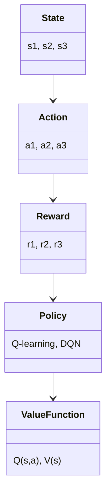
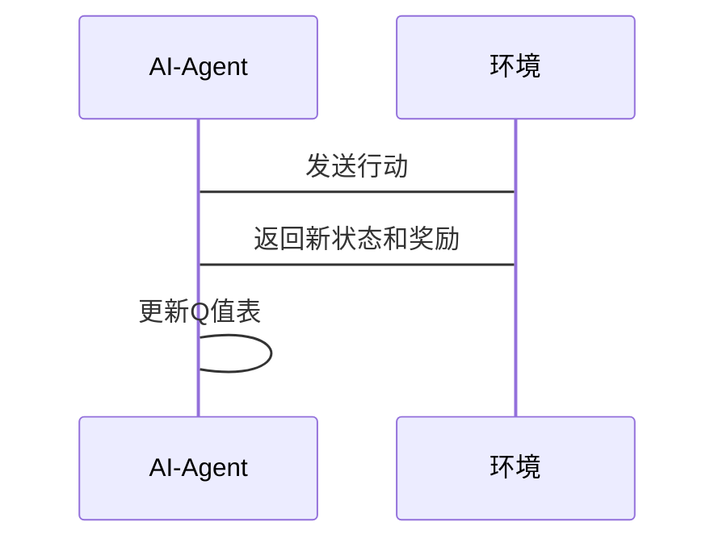

                 


# 强化学习在AI Agent开发中的应用

> **关键词**：强化学习、AI Agent、深度强化学习、Q-learning、策略梯度、马尔可夫决策过程

> **摘要**：  
本文深入探讨强化学习在AI Agent开发中的应用，从基本概念到核心算法，再到实际项目案例，系统性地分析强化学习如何赋能AI Agent的智能决策能力。文章结合理论与实践，通过详细讲解强化学习的核心原理、算法实现以及系统架构设计，为读者提供一个全面理解强化学习在AI Agent开发中应用的框架。本文还通过实际案例分析，展示强化学习在AI Agent中的实际应用效果，并总结最佳实践经验和未来发展方向。

---

# 第1章: 强化学习与AI Agent概述

## 1.1 强化学习的基本概念

### 1.1.1 强化学习的定义与特点

强化学习（Reinforcement Learning, RL）是一种机器学习范式，通过智能体（Agent）与环境的交互，智能体通过试错的方式学习策略，以最大化累积的奖励。与监督学习和无监督学习不同，强化学习的反馈机制是通过奖励（Reward）的形式，指导智能体调整行为以达到目标。

**特点：**  
1. **试错性**：智能体通过不断尝试不同的行为，逐步逼近最优解。  
2. **延迟反馈**：奖励往往不是即时反馈，而是基于长期行为的累积结果。  
3. **环境动态性**：环境可能具有不确定性，智能体需要具备适应能力。  

### 1.1.2 AI Agent的基本概念与类型

**AI Agent**（人工智能代理）是指能够感知环境并采取行动以实现目标的智能实体。AI Agent可以是软件程序、机器人或其他智能系统。

**类型：**  
1. **反应式Agent**：基于当前环境状态做出反应，不依赖长期记忆。  
2. **认知式Agent**：具备复杂推理和规划能力，能够处理抽象任务。  
3. **学习型Agent**：通过与环境交互学习，不断优化自身行为。  

### 1.1.3 强化学习在AI Agent中的作用

强化学习为AI Agent提供了从环境中学习策略的能力。通过与环境交互，AI Agent可以不断优化自身的行为策略，以最大化累积奖励，实现高效决策。

---

## 1.2 强化学习与监督学习、无监督学习的对比

### 1.2.1 监督学习的特点

- 数据来源：需要大量标注数据。  
- 任务类型：分类、回归等。  
- 输入输出关系：输入直接映射到输出，无需环境反馈。  

### 1.2.2 无监督学习的特点

- 数据来源：无需标注数据。  
- 任务类型：聚类、降维等。  
- 输入输出关系：发现数据中的潜在模式，而非直接映射。  

### 1.2.3 强化学习的独特性与优势

- **反馈机制**：通过奖励信号指导行为，而非直接提供输入输出映射。  
- **动态环境**：适用于动态变化的环境，能够适应不确定性。  
- **自主决策**：智能体通过试错学习，具备自主决策能力。  

---

## 1.3 强化学习的核心要素

### 1.3.1 状态（State）

状态是环境在某一时刻的描述，表示智能体感知到的环境信息。例如，在一个迷宫导航问题中，状态可以是智能体所在的位置。

### 1.3.2 行动（Action）

行动是智能体在给定状态下采取的行为。例如，在迷宫中，智能体可以向左、右、上、下移动。

### 1.3.3 奖励（Reward）

奖励是智能体在采取行动后获得的反馈，通常是一个标量值，用于指导智能体的行为。奖励的设计直接影响学习效率和策略优化。

### 1.3.4 策略（Policy）

策略是智能体在给定状态下选择行动的概率分布。策略可以用函数或概率模型表示，目标是找到最优策略，使得累积奖励最大化。

### 1.3.5 值函数（Value Function）

值函数描述的是在给定状态下，采取某种策略能够获得的期望累积奖励。值函数是强化学习中的核心概念，用于评估策略的质量。

---

## 1.4 本章小结

本章介绍了强化学习的基本概念、特点，以及与监督学习和无监督学习的区别。同时，阐述了AI Agent的基本概念和类型，以及强化学习在AI Agent中的重要作用。通过对比和分析，读者可以理解强化学习的独特性和优势。

---

# 第2章: 强化学习的核心算法原理

## 2.1 马尔可夫决策过程（MDP）

### 2.1.1 MDP的定义与构成

马尔可夫决策过程（Markov Decision Process, MDP）是一个数学框架，用于描述强化学习中的决策过程。MDP由以下五个要素构成：  
1. **状态空间（S）**：所有可能的状态集合。  
2. **行动空间（A）**：所有可能的行动集合。  
3. **转移概率（P）**：从当前状态采取某个行动后转移到下一个状态的概率。  
4. **奖励函数（R）**：智能体在状态s采取行动a后获得的奖励。  
5. **终止条件（T）**：是否达到终止状态。  

### 2.1.2 状态转移概率矩阵

状态转移概率矩阵描述了从一个状态采取某个行动后转移到另一个状态的概率。例如，状态s1采取行动a1后，转移到状态s2的概率为P(s2 | s1, a1)。

### 2.1.3 最优策略与值函数的关系

最优策略是指在所有可能的策略中，能够使累积奖励最大的策略。值函数用于衡量一个状态的值，即在该状态下采取最优策略能够获得的期望累积奖励。

---

## 2.2 Q-learning算法

### 2.2.1 Q-learning的基本原理

Q-learning是一种基于值函数的强化学习算法。Q值表示在状态s采取行动a后能够获得的期望累积奖励。Q-learning的目标是通过更新Q值表，找到最优策略。

### 2.2.2 Q-learning的更新公式

Q-learning的更新公式如下：  
$$ Q(s, a) = Q(s, a) + \alpha [r + \gamma \max Q(s', a) - Q(s, a)] $$  
其中，α是学习率，γ是折扣因子，r是即时奖励，s'是下一个状态。

### 2.2.3 探索与利用的平衡

在Q-learning中，智能体需要在探索新状态和利用已知高奖励的状态之间找到平衡。常用的策略包括贪心策略和ε-贪心策略。

---

## 2.3 策略梯度方法

### 2.3.1 策略梯度的基本思想

策略梯度方法直接优化策略参数，而不是值函数。通过计算策略的梯度，找到使累积奖励最大的策略。

### 2.3.2 REINFORCE算法

REINFORCE算法是一种基于策略梯度的强化学习算法。其核心思想是通过采样多个轨迹，计算策略的梯度，并更新策略参数。

### 2.3.3 策略梯度的优势与挑战

优势：  
1. 直接优化策略，无需值函数近似。  
2. 适用于离散和连续动作空间。  

挑战：  
1. 需要处理复杂的梯度计算。  
2. �易受梯度消失或爆炸问题的影响。  

---

## 2.4 深度强化学习

### 2.4.1 DQN（Deep Q-Network）的原理

DQN是将深度神经网络与Q-learning结合的算法。DQN通过神经网络近似Q值函数，能够处理高维状态空间。

### 2.4.2 DQN的网络结构与训练过程

DQN包含两个神经网络：动作值网络（Q网络）和目标网络。训练过程中，Q网络通过经验回放更新，目标网络以固定频率更新。

### 2.4.3 DQN在AI Agent中的应用

DQN广泛应用于游戏AI、机器人控制等领域。例如，在Atari游戏中，DQN能够通过与环境交互，学习最优策略。

---

## 2.5 本章小结

本章详细介绍了强化学习的核心算法，包括Q-learning、策略梯度方法和深度强化学习。通过分析这些算法的原理和特点，读者可以理解强化学习在AI Agent开发中的具体应用。

---

# 第3章: 强化学习算法的数学模型与公式

## 3.1 Q-learning的数学模型

### 3.1.1 Q值的更新公式

Q值的更新公式如下：  
$$ Q(s, a) = Q(s, a) + \alpha (r + \gamma \max Q(s', a) - Q(s, a)) $$  
其中，α是学习率，γ是折扣因子，r是即时奖励，s'是下一个状态。

### 3.1.2 贝尔曼方程

贝尔曼方程描述了Q值的最优解：  
$$ Q^*(s, a) = r + \gamma \max_{a'} Q^*(s', a') $$  
其中，Q^*(s, a)表示最优Q值。

### 3.1.3 探索率与学习率的数学表达

探索率ε通常采用衰减策略，例如：  
$$ \epsilon = \epsilon_0 \times (1 - \frac{1}{\text{steps}}) $$  
学习率α通常采用衰减策略，例如：  
$$ \alpha = \alpha_0 \times \frac{1}{\text{steps}} $$  

---

## 3.2 策略梯度的数学推导

### 3.2.1 策略函数的梯度计算

策略函数θ参数化，梯度计算如下：  
$$ \nabla_\theta J(\theta) = \mathbb{E}_{s,a} [\nabla_\theta \log \pi_\theta(s,a) Q_\theta(s,a)] $$  
其中，J(θ)是策略的累积奖励，Q_θ是Q值函数。

### 3.2.2 REINFORCE算法的数学推导

REINFORCE算法通过采样轨迹，计算策略梯度：  
$$ \nabla_\theta J(\theta) = \mathbb{E}_{\tau} [\sum_{t=0}^{T} \nabla_\theta \log \pi_\theta(s_t,a_t) Q_\theta(s_t,a_t)] $$  

---

## 3.3 DQN的数学模型

### 3.3.1 状态-动作值函数的近似

DQN通过神经网络近似Q值函数：  
$$ Q(s,a) = \argmax_{a} Q_\theta(s,a) $$  

### 3.3.2 经验回放机制的数学描述

经验回放机制通过存储经验元组（s, a, r, s'），随机采样更新Q网络。

### 3.3.3 损失函数的优化过程

DQN的损失函数为：  
$$ \mathcal{L} = \mathbb{E}[(Q_\theta(s,a) - (r + \gamma Q_{\theta'}(s',a')))^2] $$  

---

## 3.4 本章小结

本章通过数学模型和公式，详细推导了Q-learning、策略梯度和DQN的原理。通过公式和算法流程图的展示，读者可以更好地理解强化学习的数学基础。

---

# 第4章: 系统分析与架构设计

## 4.1 项目背景

本项目旨在开发一个基于强化学习的AI Agent，用于解决复杂的决策问题，如游戏AI、自动驾驶等。

---

## 4.2 系统功能设计

### 4.2.1 领域模型（Mermaid 类图）



---

### 4.2.2 系统架构设计（Mermaid 架构图）


---

### 4.2.3 系统接口设计

系统接口包括状态输入、行动输出、奖励反馈等。

---

### 4.2.4 系统交互设计（Mermaid 序列图）



---

## 4.3 本章小结

本章通过系统分析与架构设计，明确了AI Agent的开发框架。通过领域模型、系统架构图和交互图的展示，读者可以更好地理解AI Agent的整体结构和各部分之间的关系。

---

# 第5章: 项目实战

## 5.1 环境安装

安装Python、TensorFlow、OpenAI Gym等依赖库。

## 5.2 核心实现源代码

```python
import gym
import numpy as np

# 初始化环境
env = gym.make('CartPole-v0')
env.seed(42)

# 参数设置
alpha = 0.01
gamma = 0.99
epsilon = 1.0
epsilon_min = 0.01
epsilon_decay = 0.995

# 初始化Q表
q_table = np.zeros([env.observation_space.shape[0], env.action_space.n])

# DQN网络结构
class DQN:
    def __init__(self, state_size, action_size):
        self.state_size = state_size
        self.action_size = action_size
        self.w1 = np.random.randn(state_size, 10)
        self.w2 = np.random.randn(10, action_size)

    def forward(self, x):
        x = x.dot(self.w1)
        x = np.tanh(x)
        x = x.dot(self.w2)
        return x

    def backward(self, x, y, alpha):
        output = self.forward(x)
        error = y - output
        delta = error * (output - output**2)
        self.w2 += (x.T.dot(delta)) * alpha
        delta_prev = delta.dot(self.w2.T)
        delta_prev = delta_prev * (output - output**2)
        self.w1 += (x.T.dot(delta_prev)) * alpha

# 训练过程
for episode in range(1000):
    state = env.reset()
    total_reward = 0
    done = False

    while not done:
        if np.random.random() < epsilon:
            action = env.action_space.sample()
        else:
            q_values = dqn.forward(state)
            action = np.argmax(q_values)

        next_state, reward, done, info = env.step(action)
        total_reward += reward

        target = reward + gamma * np.max(dqn.forward(next_state))
        dqn.backward(state, target, alpha)

        state = next_state
        epsilon = max(epsilon_min, epsilon * epsilon_decay)

    print(f"Episode {episode}, Reward: {total_reward}")
```

---

## 5.3 案例分析

以经典的CartPole问题为例，展示强化学习在AI Agent中的应用。通过训练AI Agent在摆动杆上的平衡，验证算法的有效性。

---

## 5.4 本章小结

本章通过实际项目案例，展示了强化学习在AI Agent开发中的具体应用。通过代码实现和案例分析，读者可以更好地理解强化学习算法的实际效果。

---

# 第6章: 最佳实践与总结

## 6.1 小结

强化学习在AI Agent开发中的应用具有重要意义。通过与环境的交互，智能体能够不断优化自身行为，实现高效决策。

---

## 6.2 注意事项

1. **奖励设计**：奖励的设计直接影响学习效果，需要合理设计奖励函数。  
2. **探索与利用平衡**：避免过早收敛，保持适当的探索比例。  
3. **环境复杂性**：复杂环境需要更复杂的算法和更高的计算资源。  

---

## 6.3 拓展阅读

1. **DQN的改进算法**：如Double DQN、 Dueling DQN等。  
2. **策略优化方法**：如PPO、A2C等。  
3. **多智能体强化学习**：研究多个智能体之间的协作与竞争。  

---

# 作者：AI天才研究院/AI Genius Institute & 禅与计算机程序设计艺术 /Zen And The Art of Computer Programming

