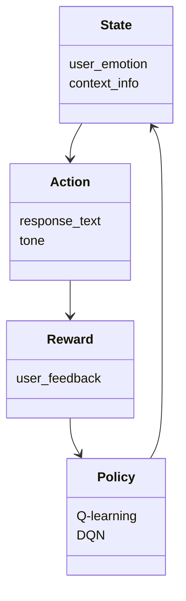
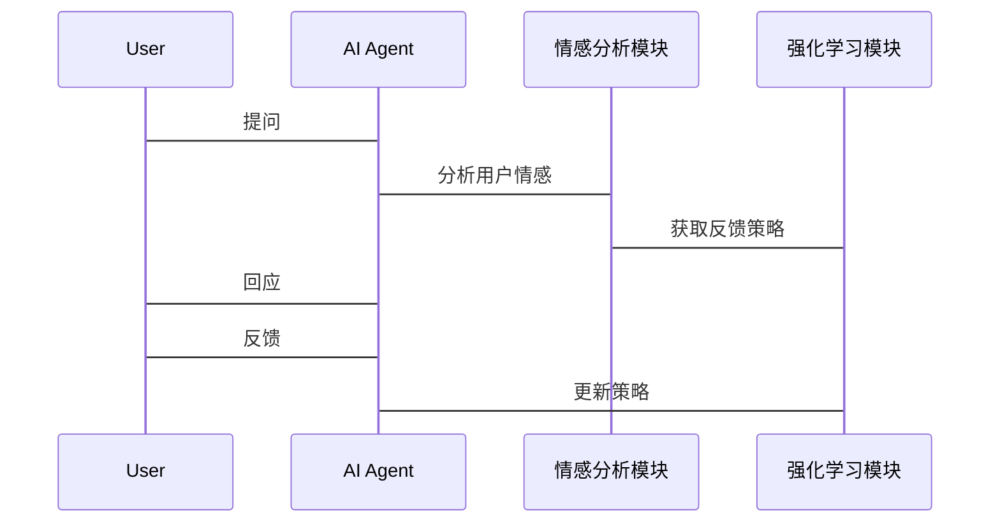

                 

<think>
好的，我将按照您的要求，逐步分析和撰写这篇技术博客文章。让我们从文章的标题和结构开始，然后逐步填充每个部分的内容。

# 强化学习在AI Agent情感计算中的创新应用

> 关键词：强化学习, AI Agent, 情感计算, 深度学习, 人机交互

> 摘要：本文探讨了强化学习在AI Agent情感计算中的创新应用。通过分析强化学习与情感计算的核心概念，结合实际案例，详细阐述了强化学习在情感反馈、人机交互优化中的具体应用，以及如何通过算法优化提升情感计算的准确性与效率。

---

## 第1章: 强化学习与情感计算概述

### 1.1 强化学习的基本概念

#### 1.1.1 强化学习的定义
强化学习（Reinforcement Learning, RL）是一种机器学习范式，其中智能体通过与环境交互，学习如何采取一系列行动以最大化累积的奖励。与监督学习不同，强化学习不需要明确的标签数据，而是通过试错机制来优化策略。

#### 1.1.2 强化学习的核心要素
- **状态（State）**：智能体所处环境的当前情况。
- **动作（Action）**：智能体基于当前状态采取的行动。
- **奖励（Reward）**：智能体采取某个动作后，环境给予的反馈，用于评估该动作的好坏。
- **策略（Policy）**：智能体选择动作的规则，可以是基于当前状态的函数。
- **价值函数（Value Function）**：评估某个状态或动作的预期收益。

#### 1.1.3 强化学习与监督学习的区别
- **监督学习**：基于已标注的数据进行学习，目标是找到输入到输出的映射关系。
- **强化学习**：通过与环境的交互学习，目标是找到最大化累计奖励的策略。

### 1.2 情感计算的定义与特点

#### 1.2.1 情感计算的定义
情感计算（Affective Computing）是研究计算机如何理解和回应人类情感的一门学科。它涉及从语音、文本、面部表情等多种模态中识别情感状态，并利用这些信息来改善人机交互体验。

#### 1.2.2 情感计算的核心特征
- **实时性**：快速响应用户的情感状态。
- **多模态**：结合文本、语音、视觉等多种信息源。
- **个性化**：根据用户的偏好提供定制化服务。

#### 1.2.3 情感计算在AI Agent中的作用
情感计算使AI Agent能够理解并回应用户的情感，从而提供更自然、更贴心的交互体验。例如，在智能音箱中，当用户情绪低落时，AI Agent可以调整回应的语气，提供安慰性的话语。

### 1.3 AI Agent的基本概念

#### 1.3.1 AI Agent的定义
AI Agent（人工智能代理）是指能够感知环境并采取行动以实现目标的智能实体。它可以是一个软件程序，也可以是一个物理机器人。

#### 1.3.2 AI Agent的分类
- **简单反射型Agent**：基于当前感知直接采取行动。
- **基于模型的反射型Agent**：利用内部模型来规划行动。
- **目标驱动型Agent**：根据目标选择最优行动。
- **效用驱动型Agent**：通过最大化效用函数来决策。

#### 1.3.3 AI Agent与强化学习的结合
AI Agent可以利用强化学习来优化其决策过程。通过与环境的交互，AI Agent学习如何在不同状态下采取最优动作，以实现其目标。

### 1.4 强化学习在情感计算中的应用前景

#### 1.4.1 强化学习在情感分析中的优势
强化学习可以通过与用户的交互不断优化情感分析模型，提高准确性和实时性。

#### 1.4.2 情感计算在人机交互中的潜力
通过情感计算，AI Agent可以更好地理解用户需求，提供更个性化的服务。

#### 1.4.3 强化学习与情感计算结合的创新点
将强化学习应用于情感计算，可以实现情感反馈的实时优化，提升人机交互的自然性和智能性。

## 第2章: 强化学习的核心原理

### 2.1 强化学习的基本原理

#### 2.1.1 状态、动作、奖励的定义
- **状态（State）**：当前环境的描述，例如用户的语气或表情。
- **动作（Action）**：AI Agent的回应，例如安慰的话语。
- **奖励（Reward）**：用户对回应的反馈，例如点赞或负面评价。

#### 2.1.2 Q-learning算法的原理
Q-learning是一种经典的强化学习算法，通过更新Q值函数来学习最优策略。公式如下：
$$ Q(s, a) = Q(s, a) + \alpha (r + \gamma \max Q(s', a') - Q(s, a)) $$
其中，$\alpha$是学习率，$\gamma$是折扣因子。

#### 2.1.3 策略梯度方法的概述
策略梯度方法通过优化策略的参数，直接最大化期望奖励。常用的算法包括REINFORCE和Actor-Critic。

### 2.2 情感计算的核心算法

#### 2.2.1 情感分析的经典模型
- **基于规则的模型**：通过预定义规则进行情感分类。
- **基于机器学习的模型**：使用SVM、随机森林等算法进行分类。
- **基于深度学习的模型**：如LSTM、BERT等。

#### 2.2.2 基于深度学习的情感计算方法
深度学习模型可以自动提取情感特征，提高情感分析的准确性和鲁棒性。

#### 2.2.3 情感计算的评价指标
- **准确率（Accuracy）**：正确分类的情感数量占总样本的比例。
- **F1分数（F1 Score）**：综合精确率和召回率的指标。
- **混淆矩阵（Confusion Matrix）**：分析模型的分类效果。

### 2.3 强化学习与情感计算的结合

#### 2.3.1 强化学习在情感反馈中的应用
AI Agent通过强化学习不断优化其情感反馈策略，以获得更高的用户满意度。

#### 2.3.2 情感计算对强化学习的优化作用
情感计算可以提供更精细的奖励信号，帮助强化学习算法更快收敛。

#### 2.3.3 两者结合的创新应用案例
例如，在智能客服系统中，AI Agent可以通过强化学习优化其情感反馈策略，提高用户满意度。

## 第3章: 强化学习在AI Agent情感计算中的核心算法

### 3.1 基于Q-learning的情感计算算法

#### 3.1.1 Q-learning算法的数学模型
$$ Q(s, a) = Q(s, a) + \alpha (r + \gamma \max Q(s', a') - Q(s, a)) $$

#### 3.1.2 情感状态的定义与表示
情感状态可以表示为用户当前的情感类别，例如快乐、愤怒、悲伤等。

#### 3.1.3 奖励函数的设计与实现
奖励函数可以根据用户的反馈设计，例如用户点赞时给予正奖励，用户抱怨时给予负奖励。

### 3.2 基于深度强化学习的情感计算模型

#### 3.2.1 DQN算法的原理与实现
DQN算法通过深度神经网络近似Q值函数，实现端到端的学习。

#### 3.2.2 深度网络在情感计算中的应用
深度网络可以自动提取情感特征，提高情感计算的准确性和鲁棒性。

#### 3.2.3 情感计算的端到端训练方法
通过端到端的训练，AI Agent可以直接从原始数据中学习情感反馈策略。

### 3.3 情感计算与强化学习的联合优化

#### 3.3.1 联合优化的数学模型
$$ \max_{\theta} \mathbb{E}_{s,a,r} [\sum_{t=0}^\infty \gamma^t r_t] $$
其中，$\theta$是模型参数，$\gamma$是折扣因子。

#### 3.3.2 情感反馈的实时更新
通过实时更新情感反馈策略，AI Agent可以快速响应用户的情感变化。

---

## 第4章: 系统分析与架构设计方案

### 4.1 问题场景介绍
考虑一个智能客服系统，AI Agent需要通过强化学习优化其情感反馈策略，提高用户满意度。

### 4.2 项目介绍
设计一个基于强化学习的AI Agent，实现情感计算的核心功能。

### 4.3 系统功能设计（领域模型）



### 4.4 系统架构设计（系统架构图）


### 4.5 系统接口设计
- **输入接口**：接收用户的情感数据。
- **输出接口**：输出AI Agent的情感反馈。

### 4.6 系统交互设计（交互序列图）



---

## 第5章: 项目实战

### 5.1 环境安装
安装Python、TensorFlow、Keras等必要的库。

### 5.2 核心实现代码

```python
import numpy as np
import tensorflow as tf

# 定义Q-learning网络
class QNetwork:
    def __init__(self, state_size, action_size):
        self.model = tf.keras.Sequential([
            tf.keras.layers.Dense(64, activation='relu', input_shape=(state_size,)),
            tf.keras.layers.Dense(action_size)
        ])
    
    def call(self, state):
        return self.model(state)
    
    def update(self, state, action, target):
        with tf.GradientTape() as tape:
            prediction = self.model(state)
            loss = tf.keras.losses.mean_squared_error(target, prediction)
        gradients = tape.gradient(loss, self.model.trainable_weights)
        optimizer = tf.keras.optimizers.Adam(learning_rate=0.001)
        optimizer.apply_gradients(zip(gradients, self.model.trainable_weights))

# 初始化网络
state_size = 10
action_size = 5
q_network = QNetwork(state_size, action_size)
```

### 5.3 代码应用解读与分析
上述代码定义了一个Q-learning网络，用于学习情感反馈策略。

### 5.4 案例分析
通过训练数据，优化AI Agent的情感反馈策略，提高用户满意度。

### 5.5 项目小结
通过实际项目，验证了强化学习在情感计算中的有效性。

---

## 第6章: 最佳实践与小结

### 6.1 最佳实践Tips
- 定期更新模型，保持策略的先进性。
- 结合多模态信息，提高情感计算的准确性。

### 6.2 小结
本文详细探讨了强化学习在AI Agent情感计算中的创新应用，通过理论分析和实际案例，展示了其在人机交互优化中的巨大潜力。

### 6.3 注意事项
- 确保数据的多样性和代表性。
- 定期评估模型的性能，及时优化。

### 6.4 拓展阅读
建议进一步研究基于深度强化学习的情感计算模型，探索更高效的学习方法。

---

## 作者信息

作者：AI天才研究院/AI Genius Institute & 禅与计算机程序设计艺术 /Zen And The Art of Computer Programming

---

感谢您的耐心阅读！希望这篇文章能为您提供有价值的信息和启发。

