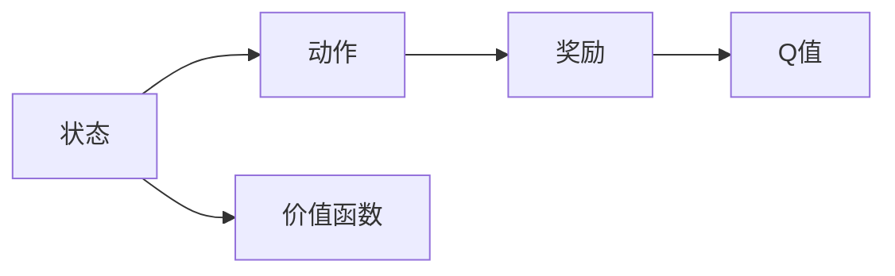
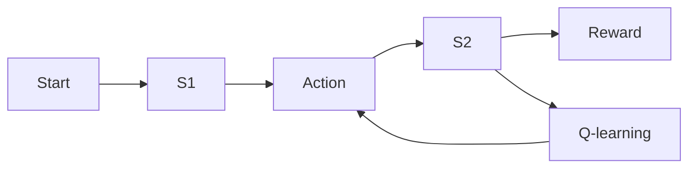

                 


# 强化学习在AI Agent自主探索中的应用

> 关键词：强化学习, AI Agent, 自主探索, 马尔可夫决策过程, 深度Q网络, 策略梯度

> 摘要：本文系统地介绍了强化学习在AI Agent自主探索中的应用，从强化学习的基本概念和数学模型，到核心算法的原理和实现，再到系统架构的设计与项目实战，全面阐述了强化学习在AI Agent中的核心作用和具体应用。

---

## 第1章: 强化学习与AI Agent概述

### 1.1 强化学习的基本概念
#### 1.1.1 什么是强化学习
强化学习是一种机器学习范式，通过智能体与环境交互，通过试错学习来最大化累积奖励。其核心在于通过经验改进策略，实现对目标的最优路径探索。

#### 1.1.2 强化学习的核心要素
- **状态（State）**：智能体所处环境的特征。
- **动作（Action）**：智能体对环境采取的行为。
- **奖励（Reward）**：智能体行为的价值反馈。
- **策略（Policy）**：智能体选择动作的概率分布。
- **价值函数（Value Function）**：评估状态或动作-状态对的价值。

#### 1.1.3 AI Agent的定义与特点
- **AI Agent**：具有感知环境、决策、执行动作能力的智能体。
- **自主探索**：智能体无需外部干预，通过与环境交互学习任务完成方法。

### 1.2 强化学习的数学模型
#### 1.2.1 马尔可夫决策过程（MDP）
- **状态空间（S）**：所有可能的状态集合。
- **动作空间（A）**：所有可能的动作集合。
- **转移概率（P(s'|s,a)）**：从状态s采取动作a后转移到状态s'的概率。
- **奖励函数（R(s,a)）**：在状态s采取动作a后获得的奖励。

### 1.3 强化学习在AI Agent中的应用
#### 1.3.1 游戏AI
- **案例**：AlphaGo通过强化学习在围棋中击败人类顶尖选手。
- **原理**：通过不断与环境交互，优化策略，最终实现最优决策。

#### 1.3.2 机器人控制
- **案例**：智能机器人通过强化学习实现自主导航和避障。
- **优势**：无需人工干预，能够自主学习完成复杂任务。

## 第2章: 强化学习的数学模型与算法原理

### 2.1 马尔可夫决策过程（MDP）
#### 2.1.1 MDP的基本定义
$$
MDP = (S, A, P, R, \gamma)
$$
其中：
- S：状态空间
- A：动作空间
- P：转移概率
- R：奖励函数
- γ：折扣因子

### 2.2 Q-learning算法
#### 2.2.1 Q-learning的基本原理
- **目标**：学习状态-动作对的Q值，即$$Q(s,a) = r + \gamma \max_{a'} Q(s',a')$$
- **更新规则**：
$$
Q(s,a) \leftarrow Q(s,a) + \alpha [r + \gamma \max Q(s',a') - Q(s,a)]
$$
其中α是学习率。

#### 2.2.2 Q-learning的收敛性
- **收敛条件**：在离散状态空间中，Q-learning在探索率逐渐减小的情况下，会收敛到最优策略。

### 2.3 深度Q网络（DQN）
#### 2.3.1 DQN的结构与原理
- **网络结构**：输入是状态s，输出是动作a的Q值。
- **经验回放**：通过存储历史经验，减少样本之间的依赖性，提高学习稳定性。

### 2.4 策略梯度方法
#### 2.4.1 策略梯度的基本思想
- **目标**：直接优化策略，使得获得最大奖励的概率最大化。
- **数学表达**：
$$
\theta \leftarrow \theta + \alpha \nabla_\theta \left( \sum_{t} R_t \right)
$$

## 第3章: 强化学习的核心概念与联系

### 3.1 核心概念对比
| 概念 | 描述 |
|------|------|
| 状态 | 智能体所处的环境特征 |
| 动作 | 智能体采取的具体行为 |
| 奖励 | 对智能体行为的反馈 |
| 策略 | 动作选择的概率分布 |

### 3.2 核心概念关系图


### 3.3 算法原理图


## 第4章: 强化学习的系统架构与设计

### 4.1 系统组成
#### 4.1.1 状态感知模块
- **功能**：获取环境状态信息。
- **实现**：通过传感器或API接口获取输入数据。

#### 4.1.2 决策控制模块
- **功能**：根据当前状态选择最优动作。
- **实现**：基于强化学习算法计算动作选择的概率分布。

### 4.2 系统架构设计


### 4.3 接口设计
- **输入接口**：接收环境状态信息。
- **输出接口**：输出动作选择结果。

## 第5章: 强化学习在AI Agent中的应用

### 5.1 项目实战
#### 5.1.1 环境安装
```bash
pip install gym numpy
```

#### 5.1.2 核心代码实现
```python
import gym
import numpy as np

env = gym.make('CartPole-v0')
env.seed(42)

# 初始化Q网络参数
Q = np.zeros((env.observation_space.shape[0], env.action_space.n))

# 参数设置
alpha = 0.1
gamma = 0.99

# 训练过程
for episode in range(1000):
    state = env.reset()
    total_reward = 0
    while True:
        # 选择动作
        if np.random.random() < 0.1:
            action = env.action_space.sample()
        else:
            action = np.argmax(Q[state])
        
        # 执行动作
        next_state, reward, done, _ = env.step(action)
        
        # 更新Q值
        Q[state][action] += alpha * (reward + gamma * np.max(Q[next_state]) - Q[state][action])
        
        state = next_state
        total_reward += reward
        if done:
            break
    print(f" Episode {episode}, Reward: {total_reward}")
```

### 5.2 案例分析
- **案例**：使用强化学习训练一个AI Agent在CartPole环境中保持平衡。
- **分析**：通过不断尝试，AI Agent能够找到最优策略，实现长时间保持平衡。

## 第6章: 总结与展望

### 6.1 总结
本文详细介绍了强化学习在AI Agent自主探索中的应用，从基本概念到算法实现，再到系统设计和项目实战，全面覆盖了强化学习的核心内容。

### 6.2 展望
- **算法优化**：探索更高效的强化学习算法。
- **应用拓展**：将强化学习应用于更多复杂场景。

---

# 作者：AI天才研究院/AI Genius Institute & 禅与计算机程序设计艺术 /Zen And The Art of Computer Programming

