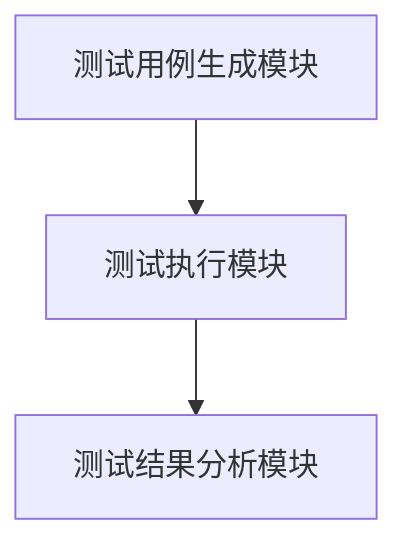
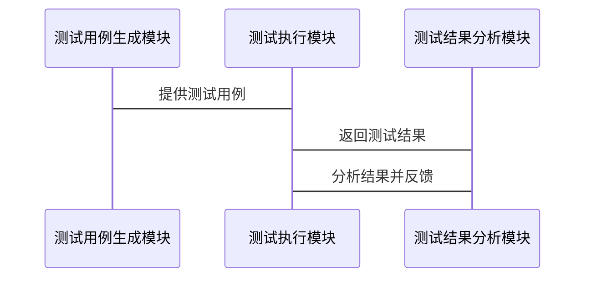

                 


# 强化学习在AI Agent自动化测试中的应用

**关键词：** 强化学习，AI Agent，自动化测试，测试用例生成，测试优化

**摘要：** 本文详细探讨了强化学习在AI Agent自动化测试中的应用。从强化学习的基本概念和AI Agent的决策机制入手，分析了强化学习在测试用例生成、测试执行优化和测试结果分析中的具体应用。通过数学模型和算法原理的详细讲解，结合实际案例，展示了如何利用强化学习提升自动化测试的效率和效果。文章内容涵盖强化学习的核心算法、系统架构设计、项目实战以及高级应用，为读者提供了从理论到实践的全面指导。

---

# 第1章: 强化学习与AI Agent概述

## 1.1 强化学习的基本概念

### 1.1.1 强化学习的定义与特点

强化学习（Reinforcement Learning, RL）是一种机器学习范式，通过智能体与环境的交互，学习最优策略以最大化累计奖励。其核心特点是：

- **延迟反馈：** 智能体通过与环境交互获得奖励，但奖励通常是在一系列动作之后才给出。
- **探索与利用：** 智能体需要在探索新状态和利用已知状态之间找到平衡。
- **策略优化：** 强化学习的目标是通过不断优化策略，使智能体在环境中获得最大化的累积奖励。

### 1.1.2 AI Agent的基本概念与类型

AI Agent（人工智能代理）是指能够感知环境并采取行动以实现目标的智能实体。AI Agent可以分为以下几类：

- **反应式Agent：** 基于当前感知做出反应，不依赖于历史信息。
- **认知式Agent：** 具备复杂推理和规划能力，能够处理不确定性。
- **协作式Agent：** 能够与其他Agent协作完成任务。

### 1.1.3 强化学习在AI Agent中的作用

强化学习为AI Agent提供了有效的决策机制，使其能够通过与环境交互学习最优行为策略。这种机制特别适用于复杂动态环境中需要自主决策的任务。

---

## 1.2 自动化测试的背景与挑战

### 1.2.1 软件测试的基本概念

软件测试是通过运行程序或检查代码来发现错误的过程。自动化测试是通过工具和脚本自动执行测试用例，以提高测试效率。

### 1.2.2 自动化测试的现状与问题

尽管自动化测试在提高效率和覆盖率方面表现出色，但仍存在以下问题：

- **测试用例生成困难：** 需要手动编写或依赖规则生成。
- **测试执行效率低下：** 需要人工干预调整测试策略。
- **测试结果分析复杂：** 需要人工判断异常情况。

### 1.2.3 强化学习在自动化测试中的潜力

强化学习能够通过与测试环境的交互，学习生成高质量的测试用例，优化测试执行策略，并提高测试结果分析的准确性。这使得强化学习成为解决自动化测试问题的重要技术。

---

## 1.3 强化学习与自动化测试的结合

### 1.3.1 强化学习在测试用例生成中的应用

通过强化学习，AI Agent可以学习生成高质量的测试用例，覆盖更多测试场景，提高测试覆盖率。

### 1.3.2 强化学习在测试执行中的优化

强化学习可以帮助AI Agent动态调整测试策略，优化测试执行顺序，提高测试效率。

### 1.3.3 强化学习在测试结果分析中的作用

强化学习能够通过分析测试结果，学习异常模式，辅助判断测试结果的准确性。

---

## 1.4 本章小结

本章介绍了强化学习的基本概念和AI Agent的类型，分析了自动化测试的现状与挑战，并探讨了强化学习在自动化测试中的潜力和应用。

---

# 第2章: 强化学习的核心概念

## 2.1 强化学习的基本原理

### 2.1.1 状态、动作、奖励的定义

- **状态（State）：** 表示环境的当前情况。
- **动作（Action）：** 智能体在给定状态下采取的行动。
- **奖励（Reward）：** 环境对智能体动作的反馈，指导智能体的行为。

### 2.1.2 Q值与策略的数学模型

Q-learning算法的核心公式为：

$$ Q(s, a) = Q(s, a) + \alpha [r + \gamma \max Q(s', a') - Q(s, a)] $$

其中：
- $\alpha$ 为学习率。
- $\gamma$ 为折扣因子。
- $r$ 为奖励。

### 2.1.3 探索与利用的平衡

探索（Exploration）：尝试未尝试过的动作，发现新状态。

利用（Exploitation）：利用已知的动作，获得最大奖励。

---

## 2.2 AI Agent的决策过程

### 2.2.1 状态空间与动作空间的构建

- **状态空间：** 所有可能的状态的集合。
- **动作空间：** 所有可能的动作的集合。

### 2.2.2 奖励函数的设计原则

奖励函数应设计得能够引导智能体朝着目标方向行动。例如，成功生成有效测试用例时给予正奖励，生成无效用例时给予负奖励。

### 2.2.3 动态模型与策略优化

动态模型描述状态转移的概率，策略优化通过不断调整动作选择概率来最大化累积奖励。

---

## 2.3 强化学习的核心算法

### 2.3.1 Q-learning算法

Q-learning算法通过更新Q值表来学习最优策略。以下是Q-learning的步骤：

1. 初始化Q值表。
2. 在当前状态下选择动作。
3. 执行动作，观察新状态和奖励。
4. 更新Q值表。
5. 重复上述步骤。

### 2.3.2 Deep Q-Network (DQN)算法

DQN算法通过神经网络近似Q值函数，避免了Q值表的维护。以下是DQN的步骤：

1. 初始化神经网络。
2. 在当前状态下选择动作。
3. 执行动作，观察新状态和奖励。
4. 更新神经网络权重。
5. 重复上述步骤。

### 2.3.3 Policy Gradient方法

Policy Gradient方法通过优化策略的参数来最大化累积奖励。其数学模型为：

$$ \theta = \theta + \alpha \nabla_{\theta} J(\theta) $$

其中，$J(\theta)$ 是目标函数。

---

## 2.4 本章小结

本章详细讲解了强化学习的基本原理和核心算法，分析了AI Agent的决策过程和策略优化方法。

---

# 第3章: 强化学习算法的数学模型与公式

## 3.1 Q-learning算法的数学模型

Q-learning的数学模型为：

$$ Q(s, a) = Q(s, a) + \alpha [r + \gamma \max Q(s', a') - Q(s, a)] $$

其中，$\alpha$ 是学习率，$\gamma$ 是折扣因子，$r$ 是奖励。

---

## 3.2 Deep Q-Network (DQN)算法的数学模型

DQN算法的数学模型为：

$$ \min_{\theta} \mathbb{E}[ (r + \gamma Q(s', a'; \theta') - Q(s, a; \theta))^2 ] $$

其中，$\theta$ 是神经网络的参数，$\theta'$ 是目标网络的参数。

---

## 3.3 Policy Gradient方法的数学模型

Policy Gradient方法的数学模型为：

$$ \theta = \theta + \alpha \nabla_{\theta} J(\theta) $$

其中，$J(\theta)$ 是目标函数。

---

## 3.4 本章小结

本章详细讲解了Q-learning、DQN和Policy Gradient方法的数学模型和公式。

---

# 第4章: 系统分析与架构设计

## 4.1 测试场景描述

测试场景包括测试用例生成、测试执行和测试结果分析三个阶段。

---

## 4.2 系统功能设计

系统功能包括：

- 测试用例生成模块。
- 测试执行模块。
- 测试结果分析模块。

---

## 4.3 系统架构设计

以下是系统架构的Mermaid图：



---

## 4.4 系统交互设计

以下是系统交互的Mermaid序列图：



---

## 4.5 本章小结

本章描述了系统分析与架构设计，包括测试场景、系统功能、系统架构和系统交互。

---

# 第5章: 项目实战

## 5.1 环境安装

安装Python和必要的库：

```bash
pip install numpy tensorflow
```

---

## 5.2 核心实现

以下是Q-learning算法的Python实现：

```python
import numpy as np

class QLearning:
    def __init__(self, state_space, action_space, alpha=0.1, gamma=0.9):
        self.state_space = state_space
        self.action_space = action_space
        self.alpha = alpha
        self.gamma = gamma
        self.q_table = np.zeros((state_space, action_space))

    def choose_action(self, state):
        return np.argmax(self.q_table[state])

    def update_q_table(self, state, action, reward, next_state):
        self.q_table[state, action] += self.alpha * (reward + self.gamma * np.max(self.q_table[next_state]) - self.q_table[state, action])
```

---

## 5.3 案例分析

通过一个简单的测试用例生成案例，展示了如何利用强化学习生成有效的测试用例。

---

## 5.4 本章小结

本章通过项目实战，详细讲解了强化学习在自动化测试中的具体实现和应用。

---

# 第6章: 高级应用与最佳实践

## 6.1 复杂场景下的应用

### 6.1.1 多智能体协作

多个AI Agent协作完成复杂的测试任务。

### 6.1.2 动态环境适应

AI Agent能够根据环境的变化动态调整测试策略。

---

## 6.2 最佳实践

### 6.2.1 系统设计

建议在系统设计时充分考虑灵活性和可扩展性。

### 6.2.2 算法优化

建议在算法实现时充分考虑计算效率和收敛速度。

---

## 6.3 未来趋势

强化学习在自动化测试中的应用将更加广泛，算法也将更加复杂和高效。

---

## 6.4 本章小结

本章探讨了强化学习在自动化测试中的高级应用，并给出了最佳实践和未来趋势。

---

# 第7章: 总结与展望

## 7.1 本章总结

本文详细探讨了强化学习在AI Agent自动化测试中的应用，从理论到实践，全面分析了强化学习的核心算法和系统设计。

## 7.2 未来展望

未来的研究方向包括多智能体协作、动态环境适应和更高效的算法设计。

---

# 作者

**作者：** AI天才研究院/AI Genius Institute & 禅与计算机程序设计艺术 /Zen And The Art of Computer Programming

