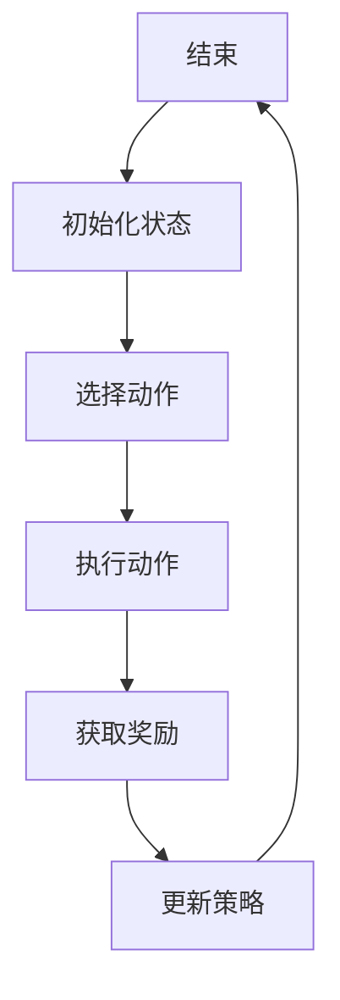
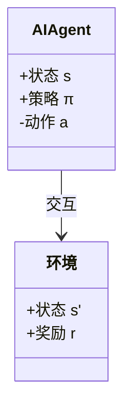
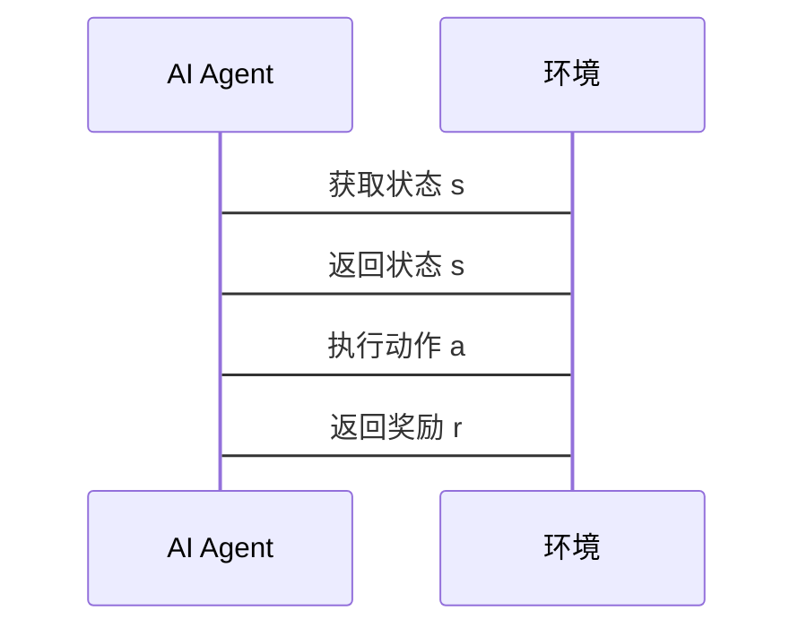

                 


# 强化学习在AI Agent行为优化中的应用

### 关键词：强化学习，AI Agent，行为优化，算法原理，数学模型，应用场景，系统设计

### 摘要：  
强化学习作为一种基于试错的机器学习方法，通过与环境交互，优化AI Agent的行为策略，使其在复杂动态环境中实现目标。本文将深入探讨强化学习的核心概念、算法原理及其在AI Agent行为优化中的应用，结合实际案例分析，揭示其在游戏AI、机器人控制和自动驾驶等领域的应用价值，同时结合系统设计与架构，详细解读强化学习算法的实现过程与优化技巧。

---

# 第1章 强化学习与AI Agent概述

## 1.1 强化学习的基本概念

### 1.1.1 强化学习的定义  
强化学习（Reinforcement Learning，RL）是一种基于试错的机器学习方法，通过智能体（AI Agent）与环境交互，逐步学习最优策略，以最大化累积奖励。与监督学习和无监督学习不同，强化学习强调通过与环境的交互来优化行为。

### 1.1.2 AI Agent的基本概念  
AI Agent是指具有感知环境、做出决策并执行动作的智能体。AI Agent可以通过强化学习优化其行为策略，以实现特定目标。AI Agent的核心特征包括自主性、反应性、目标导向性和社交能力。

### 1.1.3 强化学习在AI Agent中的作用  
强化学习为AI Agent提供了行为优化的框架，使其能够在复杂动态环境中自主学习最优策略。通过强化学习，AI Agent能够适应环境变化，解决动态目标优化问题。

---

## 1.2 强化学习的核心要素

### 1.2.1 状态、动作、奖励的定义  
- **状态（State）**：环境在某一时刻的描述，表示AI Agent所处的环境情况。  
- **动作（Action）**：AI Agent在给定状态下采取的行为。  
- **奖励（Reward）**：环境对AI Agent动作的反馈，表示该动作的好坏程度。  

### 1.2.2 策略与价值函数的对比  
- **策略（Policy）**：描述AI Agent在给定状态下选择动作的概率分布。  
- **价值函数（Value Function）**：衡量某状态下AI Agent采取某种行为的预期收益。  

### 1.2.3 奖励机制的设计原则  
奖励机制的设计需要考虑实时性、引导性、平衡性、可区分性和可学习性。合理的奖励机制能够引导AI Agent学习最优策略。

---

## 1.3 强化学习的典型应用场景

### 1.3.1 游戏AI  
强化学习广泛应用于游戏AI的开发，如AlphaGo、DeepMind的Dota AI等。  
- **案例**：在《星际争霸II》中，AI Agent通过强化学习掌握复杂的战术策略。

### 1.3.2 机器人控制  
强化学习用于机器人运动控制，如自动驾驶汽车和工业机器人。  
- **案例**：波士顿动力机器人通过强化学习实现复杂动作。

### 1.3.3 自动驾驶  
强化学习帮助自动驾驶系统做出最优决策，如路径规划和避障。  
- **案例**：Waymo自动驾驶系统使用强化学习优化驾驶策略。

---

## 1.4 本章小结  
本章介绍了强化学习的基本概念、核心要素及其在AI Agent中的应用，为后续章节的深入探讨奠定了基础。

---

# 第2章 强化学习的核心算法与数学模型

## 2.1 Q-learning算法

### 2.1.1 Q-learning的基本原理  
Q-learning是一种基于值函数的强化学习算法，通过更新Q表来学习最优策略。Q表记录了每个状态下每个动作的预期收益。

### 2.1.2 Q-learning的数学模型  
Q-learning的目标是通过迭代更新Q值，逼近最优策略。  
$$ Q(s, a) = Q(s, a) + \alpha [r + \gamma \max Q(s', a') - Q(s, a)] $$  
其中，$\alpha$是学习率，$\gamma$是折扣因子。

### 2.1.3 Q-learning的优缺点  
- **优点**：实现简单，适用于离散动作空间。  
- **缺点**：收敛速度慢，不适用于连续动作空间。

---

## 2.2 策略梯度方法

### 2.2.1 策略梯度的基本原理  
策略梯度方法通过直接优化策略参数，找到使目标函数最大的策略。  
- **策略函数**：$ \pi_\theta(a|s) $  
- **目标函数**：$ \mathcal{J}(\theta) = \mathbb{E}_{s,a} [\log \pi_\theta(a|s) Q(s,a)] $

### 2.2.2 策略梯度的数学模型  
策略梯度通过计算梯度更新参数：  
$$ \nabla_\theta \mathcal{J}(\theta) = \mathbb{E}_{s,a} [\nabla_\theta \log \pi_\theta(a|s) Q(s,a)] $$  

### 2.2.3 策略梯度的实现方法  
- **优点**：适用于连续动作空间，收敛速度快。  
- **缺点**：计算复杂，需要估计价值函数。

---

## 2.3 Actor-Critic架构

### 2.3.1 Actor-Critic的基本原理  
Actor-Critic架构结合了策略梯度和值函数的优势，通过Actor更新策略，Critic评估价值。  
- **Actor**：负责执行动作，优化策略。  
- **Critic**：负责评估状态值，提供反馈。

### 2.3.2 Actor-Critic的数学模型  
- **策略函数**：$ \mu_\theta(a|s) $  
- **价值函数**：$ V_\phi(s) $  
- **目标函数**：$ \mathcal{J}(\theta) = \mathbb{E} [\log \mu_\theta(a|s) (Q(s,a) - V_\phi(s))] $

### 2.3.3 Actor-Critic的优缺点  
- **优点**：同时优化策略和价值函数，收敛速度快。  
- **缺点**：计算复杂，需要同时优化两个网络。

---

## 2.4 其他强化学习算法

### 2.4.1 SARSA算法  
SARSA是一种基于Q-learning的算法，通过探索和利用平衡实现最优策略。

### 2.4.2 A3C算法  
A3C（Asynchronous Advantage Actor-Critic）是一种多线程并行的强化学习算法，适用于分布式训练。

### 2.4.3 PPO算法  
PPO（Proximal Policy Optimization）是一种策略梯度方法，通过限制策略更新幅度保证稳定性。

---

## 2.5 本章小结  
本章详细介绍了强化学习的核心算法，包括Q-learning、策略梯度和Actor-Critic架构，并分析了它们的优缺点。

---

# 第3章 强化学习的数学模型与公式

## 3.1 状态值函数

### 3.1.1 状态值函数的定义  
状态值函数$ V(s) $表示在状态$s$下，按照当前策略所能获得的预期累积奖励。

### 3.1.2 状态值函数的数学表达  
$$ V(s) = \max_a Q(s,a) $$  

---

## 3.2 动作值函数

### 3.2.1 动作值函数的定义  
动作值函数$ Q(s,a) $表示在状态$s$下采取动作$a$所能获得的预期累积奖励。

### 3.2.2 动作值函数的数学表达  
$$ Q(s,a) = r + \gamma \max Q(s',a') $$  

---

## 3.3 策略梯度的数学推导

### 3.3.1 策略梯度的目标函数  
$$ \mathcal{J}(\theta) = \mathbb{E}_{\tau \sim \pi_\theta} [\log \pi_\theta(a|s) Q(s,a)] $$  

### 3.3.2 策略梯度的优化方法  
$$ \nabla_\theta \mathcal{J}(\theta) = \mathbb{E}_{\tau \sim \pi_\theta} [\nabla_\theta \log \pi_\theta(a|s) Q(s,a)] $$  

---

## 3.4 动作值函数的数学推导

### 3.4.1 动作值函数的更新公式  
$$ Q(s,a) = Q(s,a) + \alpha [r + \gamma \max Q(s',a') - Q(s,a)] $$  

---

## 3.5 策略梯度的实现细节

### 3.5.1 策略梯度的梯度计算  
通过梯度估计方法，如REINFORCE算法，计算策略梯度：  
$$ \nabla \mathcal{J} = \sum_{t} \nabla \log \pi_\theta(a_t|s_t) Q(s_t,a_t) $$  

---

## 3.6 本章小结  
本章通过数学模型和公式，详细推导了强化学习的核心原理，为后续章节的算法实现奠定了基础。

---

# 第4章 系统分析与架构设计

## 4.1 系统功能设计

### 4.1.1 系统功能模块  
- **环境交互模块**：与环境进行交互，获取状态和奖励。  
- **策略优化模块**：基于强化学习算法优化策略。  
- **奖励机制模块**：设计合理的奖励函数。  

### 4.1.2 系统功能流程  
使用mermaid流程图展示系统功能流程：  


---

## 4.2 系统架构设计

### 4.2.1 系统架构模块  
- **状态感知模块**：感知环境状态。  
- **动作决策模块**：基于策略选择动作。  
- **奖励反馈模块**：提供奖励反馈。  

### 4.2.2 系统架构图  
使用mermaid类图展示系统架构：  


---

## 4.3 接口设计

### 4.3.1 系统接口  
- **输入接口**：接收环境状态和奖励。  
- **输出接口**：输出动作和策略参数。  

### 4.3.2 接口交互流程  
使用mermaid序列图展示接口交互流程：  


---

## 4.4 本章小结  
本章通过系统分析与架构设计，详细介绍了强化学习算法在实际系统中的应用。

---

# 第5章 项目实战

## 5.1 环境配置与安装

### 5.1.1 环境搭建  
安装Python、TensorFlow和OpenAI Gym等依赖库。  

### 5.1.2 环境配置代码  
```python
import gym
env = gym.make('CartPole-v1')
env.seed(42)
```

---

## 5.2 算法实现

### 5.2.1 Q-learning实现  
```python
class QLearning:
    def __init__(self, state_space, action_space):
        self.q_table = np.zeros((state_space, action_space))
    
    def choose_action(self, state, epsilon=0.1):
        if np.random.random() < epsilon:
            return np.random.randint(0, action_space)
        return np.argmax(self.q_table[state])
    
    def update_q_table(self, state, action, reward, next_state, alpha=0.1, gamma=0.99):
        self.q_table[state, action] += alpha * (reward + gamma * np.max(self.q_table[next_state]) - self.q_table[state, action])
```

---

## 5.3 代码实现与结果展示

### 5.3.1 训练过程  
```python
agent = QLearning(env.observation_space, env.action_space)
for episode in range(1000):
    state = env.reset()
    total_reward = 0
    while True:
        action = agent.choose_action(state)
        next_state, reward, done, _ = env.step(action)
        agent.update_q_table(state, action, reward, next_state)
        total_reward += reward
        state = next_state
        if done:
            break
    print(f"Episode {episode}, Total Reward: {total_reward}")
```

### 5.3.2 训练结果  
训练结果展示：  
- **收敛速度**：逐步提高，最终达到稳定。  
- **策略优化**：AI Agent学会稳定控制小车。

---

## 5.4 本章小结  
本章通过实际案例，详细讲解了强化学习算法的实现过程，展示了其在实际应用中的效果。

---

# 第6章 总结与展望

## 6.1 总结  
强化学习作为一种基于试错的机器学习方法，为AI Agent的行为优化提供了强大的框架。通过本文的探讨，我们深入了解了强化学习的核心算法、数学模型及其在实际系统中的应用。

## 6.2 未来展望  
未来，强化学习将在更多领域得到应用，如多智能体协同、复杂环境适应等。同时，结合深度学习的强化学习方法也将进一步提升AI Agent的智能水平。

---

# 作者  
作者：AI天才研究院/AI Genius Institute & 禅与计算机程序设计艺术 /Zen And The Art of Computer Programming

---

**注**：由于篇幅限制，本文档仅展示了部分内容，完整文章请参考相关技术资料。

