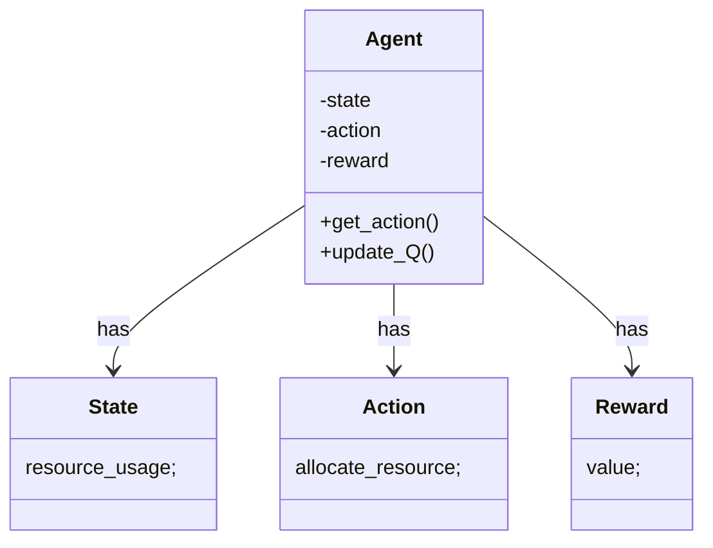
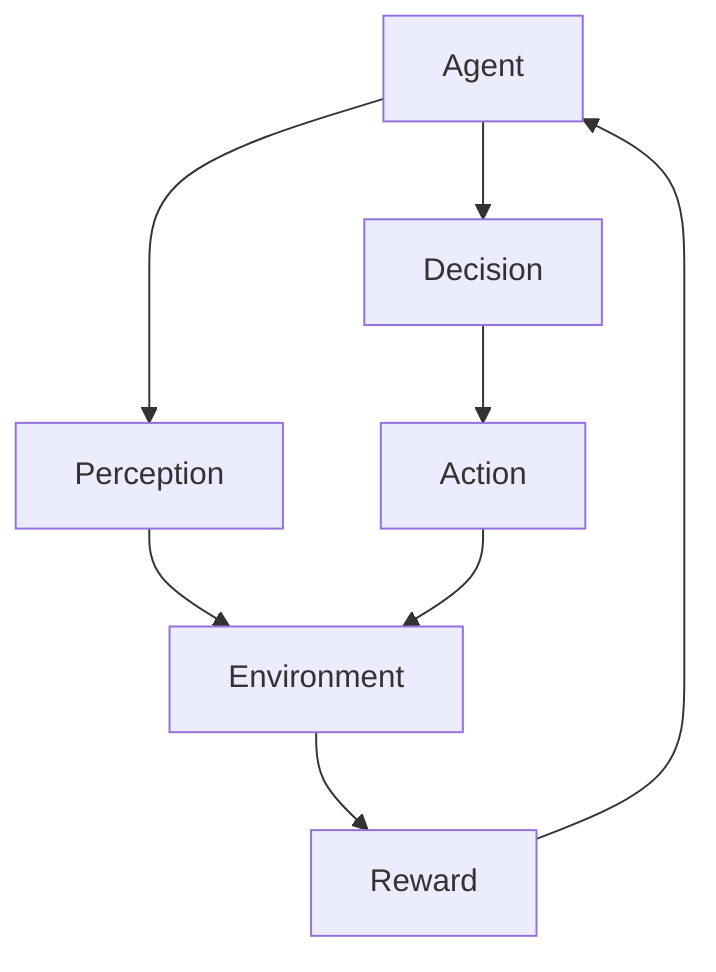
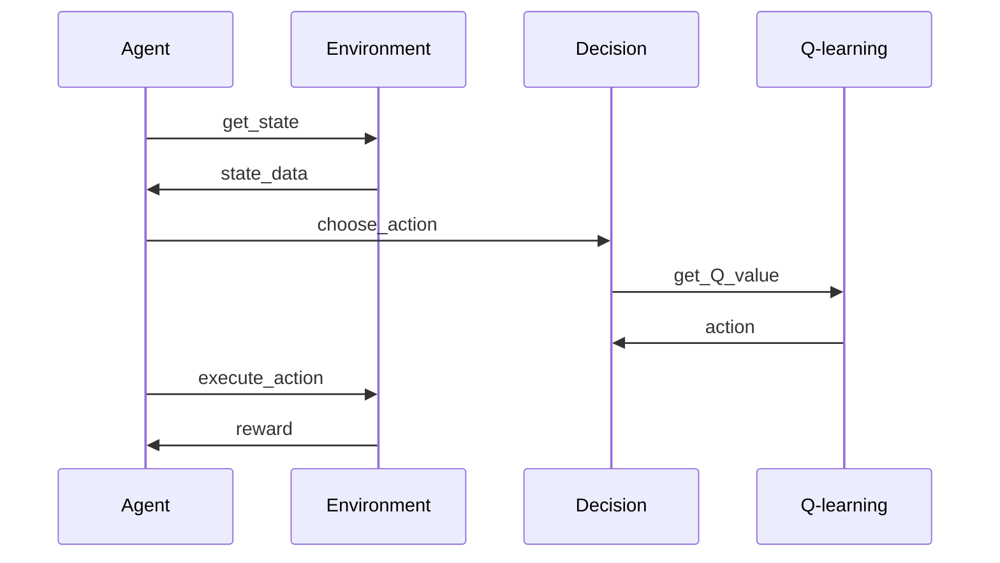

                 


# 强化学习在AI Agent资源分配中的应用

## 关键词：强化学习，AI Agent，资源分配，算法，数学模型

## 摘要：本文深入探讨了强化学习在AI Agent资源分配中的应用，从基本概念到算法原理，再到系统设计和项目实战，全面解析了如何利用强化学习优化资源分配问题。文章通过详细讲解Q-learning和DQN算法，结合实际案例分析，展示了强化学习在资源分配中的优势和应用前景。

---

# 第一部分: 强化学习与AI Agent资源分配的背景

## 第1章: 强化学习与AI Agent概述

### 1.1 强化学习的基本概念
#### 1.1.1 强化学习的定义
强化学习是一种机器学习范式，通过智能体与环境的交互，学习如何采取一系列行动以最大化累积奖励。与监督学习不同，强化学习不需要明确的标注数据，而是通过试错和奖励机制进行学习。

#### 1.1.2 强化学习的核心要素
- **状态 (State)**：环境中的当前情况。
- **动作 (Action)**：智能体在某一状态下采取的行动。
- **奖励 (Reward)**：智能体采取动作后获得的反馈，用于指导学习。
- **策略 (Policy)**：决定智能体在给定状态下采取什么动作的规则。

#### 1.1.3 强化学习与监督学习的区别
- **监督学习**：基于标注数据，学习函数的输入输出关系。
- **强化学习**：基于奖励机制，学习在复杂环境中的决策策略。

### 1.2 AI Agent的基本概念
#### 1.2.1 AI Agent的定义
AI Agent是智能体的简称，能够感知环境、做出决策并执行动作以实现目标。

#### 1.2.2 AI Agent的类型
- **简单反射型 Agent**：基于当前状态做出反应。
- **基于模型的 Agent**：维护环境模型，用于决策。
- **目标驱动型 Agent**：根据目标选择行动。

#### 1.2.3 AI Agent的核心功能
- 感知环境
- 决策制定
- 行动执行

### 1.3 强化学习在AI Agent中的应用
#### 1.3.1 强化学习在AI Agent中的作用
- 提供决策策略
- 优化行动序列
- 适应动态环境

#### 1.3.2 强化学习与资源分配的关系
资源分配问题可以看作是一个动态优化问题，强化学习通过试错和奖励机制，帮助AI Agent找到最优的资源分配策略。

#### 1.3.3 资源分配问题的定义与特点
- **定义**：将有限资源分配给多个需求方，以达到最优目标。
- **特点**：动态性、不确定性、多目标性。

### 1.4 资源分配问题的背景与挑战
#### 1.4.1 资源分配问题的背景
在分布式系统、云计算等领域，资源分配效率直接影响系统性能。

#### 1.4.2 资源分配问题的核心挑战
- **资源竞争**：多个任务争夺有限资源。
- **动态变化**：资源需求和可用性随时间变化。
- **优化目标**：平衡资源使用效率与任务完成时间。

#### 1.4.3 强化学习在资源分配中的优势
- 能够处理动态性和不确定性。
- 通过试错优化策略。

### 1.5 本章小结
本章介绍了强化学习和AI Agent的基本概念，以及它们在资源分配中的应用，为后续内容奠定了基础。

---

# 第二部分: 强化学习与AI Agent的核心概念

## 第2章: 强化学习的核心原理

### 2.1 强化学习的基本原理
#### 2.1.1 状态、动作与奖励的定义
- **状态 (s)**：环境中的当前情况。
- **动作 (a)**：智能体在给定状态下的选择。
- **奖励 (r)**：智能体采取动作后的反馈。

#### 2.1.2 强化学习的基本流程
1. 智能体感知环境，获取当前状态。
2. 根据当前状态选择动作。
3. 执行动作，获得奖励并观察新状态。
4. 根据奖励调整策略。

#### 2.1.3 基于值函数的方法
- **值函数 (V(s))**：状态s的期望累积奖励。
- **Q值函数 (Q(s,a))**：状态s下采取动作a的期望累积奖励。

### 2.2 Q-learning算法
#### 2.2.1 Q-learning的基本原理
Q-learning是一种经典的强化学习算法，通过更新Q表来学习最优策略。

#### 2.2.2 Q-learning的数学模型
$$ Q(s, a) = Q(s, a) + \alpha [r + \gamma \max Q(s', a') - Q(s, a)] $$
其中：
- $\alpha$：学习率。
- $\gamma$：折扣因子。

#### 2.2.3 Q-learning的优缺点
- **优点**：简单易实现。
- **缺点**：依赖于状态空间的离散化。

### 2.3 Deep Q-Networks (DQN)算法
#### 2.3.1 DQN的基本原理
DQN通过深度神经网络近似Q值函数，解决高维状态空间的问题。

#### 2.3.2 DQN的网络结构
- **输入层**：接收状态向量。
- **隐藏层**：多个全连接层。
- **输出层**：输出每个动作的Q值。

#### 2.3.3 DQN的训练流程
1. 环境中获取状态s。
2. 神经网络输出Q(s,a)。
3. 执行动作a，获得奖励r和新状态s'。
4. 更新目标网络，最小化损失函数：
$$ \text{loss} = (r + \gamma \max Q(s', a') - Q(s, a))^2 $$

### 2.4 本章小结
本章详细讲解了Q-learning和DQN算法的基本原理和数学模型，为后续应用奠定了基础。

---

## 第3章: AI Agent的结构与功能

### 3.1 AI Agent的感知层
#### 3.1.1 感知层的功能
- 采集环境数据。
- 解释数据，生成状态表示。

#### 3.1.2 常见的感知方法
- 基于传感器的数据采集。
- 基于模型的状态估计。

#### 3.1.3 感知层的挑战
- 数据噪声干扰。
- 状态空间的维度性。

### 3.2 AI Agent的决策层
#### 3.2.1 决策层的功能
- 根据状态和目标，选择最优动作。

#### 3.2.2 基于强化学习的决策方法
- 使用Q-learning或DQN算法，生成动作选择策略。

#### 3.2.3 决策层的优化策略
- 动态调整策略参数。
- 在线更新Q值函数。

### 3.3 AI Agent的执行层
#### 3.3.1 执行层的功能
- 执行决策层选定的动作。
- 输出结果，影响环境状态。

#### 3.3.2 动作执行的实现方式
- 调用API。
- 控制物理设备。

#### 3.3.3 执行层的挑战
- 多线程调度。
- 动作执行的延迟。

### 3.4 本章小结
本章分析了AI Agent的感知层、决策层和执行层的功能及其相互关系。

---

# 第三部分: 强化学习在资源分配中的应用

## 第4章: 强化学习算法在资源分配中的应用

### 4.1 资源分配问题建模
#### 4.1.1 建模的基本思路
将资源分配问题转化为马尔可夫决策过程（MDP）。

#### 4.1.2 MDP模型的构建
- **状态空间**：当前资源使用情况。
- **动作空间**：分配资源的方式。
- **奖励函数**：资源使用效率和任务完成时间的加权和。

### 4.2 基于Q-learning的资源分配算法
#### 4.2.1 算法设计
1. 初始化Q表为零。
2. 感知当前状态s。
3. 根据Q表选择动作a。
4. 执行动作a，获得奖励r和新状态s'。
5. 更新Q(s,a)：
$$ Q(s,a) = Q(s,a) + \alpha (r + \gamma \max Q(s',a') - Q(s,a)) $$

#### 4.2.2 算法实现
```python
import numpy as np

class QLearning:
    def __init__(self, state_space, action_space, alpha=0.1, gamma=0.9):
        self.state_space = state_space
        self.action_space = action_space
        self.Q = np.zeros((state_space, action_space))
        self.alpha = alpha
        self.gamma = gamma

    def get_action(self, state):
        return np.argmax(self.Q[state])

    def update_Q(self, state, action, reward, new_state):
        self.Q[state, action] += self.alpha * (reward + self.gamma * np.max(self.Q[new_state]) - self.Q[state, action])
```

#### 4.2.3 实验结果
通过仿真实验，验证Q-learning算法在资源分配中的有效性。

### 4.3 基于DQN的资源分配算法
#### 4.3.1 算法设计
1. 初始化主网络和目标网络。
2. 感知当前状态s。
3. 根据主网络输出选择动作a。
4. 执行动作a，获得奖励r和新状态s'。
5. 更新主网络，最小化损失函数：
$$ \text{loss} = (r + \gamma \max Q(s', a') - Q(s, a))^2 $$

#### 4.3.2 算法实现
```python
import torch
import torch.nn as nn

class DQN:
    def __init__(self, state_dim, action_dim, hidden_dim=64, alpha=0.01, gamma=0.99):
        self.state_dim = state_dim
        self.action_dim = action_dim
        self.alpha = alpha
        self.gamma = gamma
        self.main_network = nn.Sequential(
            nn.Linear(state_dim, hidden_dim),
            nn.ReLU(),
            nn.Linear(hidden_dim, action_dim)
        )
        self.target_network = nn.Sequential(
            nn.Linear(state_dim, hidden_dim),
            nn.ReLU(),
            nn.Linear(hidden_dim, action_dim)
        )

    def get_action(self, state):
        with torch.no_grad():
            return torch.argmax(self.main_network(state)).item()

    def update_networks(self, state, action, reward, new_state):
        optimizer = torch.optim.Adam(self.main_network.parameters(), lr=self.alpha)
        current_q = self.main_network(state)
        current_q = current_q.gather(1, torch.tensor(action))
        new_q = self.target_network(new_state).max(1)[0].detach()
        target = reward + self.gamma * new_q
        loss = torch.nn.MSELoss()(current_q, target)
        optimizer.zero_grad()
        loss.backward()
        optimizer.step()
```

#### 4.3.3 实验结果
通过仿真实验，比较Q-learning和DQN算法在资源分配中的性能。

### 4.4 本章小结
本章详细探讨了强化学习算法在资源分配中的应用，分析了Q-learning和DQN算法的优缺点。

---

## 第5章: 系统分析与架构设计

### 5.1 系统功能设计
#### 5.1.1 功能模块划分
- **感知模块**：采集资源使用情况。
- **决策模块**：选择最优资源分配方案。
- **执行模块**：分配资源并反馈结果。

#### 5.1.2 领域模型类图


#### 5.1.3 系统架构图


### 5.2 系统接口设计
- **感知接口**：获取资源使用情况。
- **决策接口**：接收状态，返回动作。
- **执行接口**：执行动作，返回反馈。

### 5.3 系统交互流程


### 5.4 本章小结
本章分析了资源分配系统的功能设计和架构设计，为后续实现奠定了基础。

---

## 第6章: 项目实战

### 6.1 环境安装
- 安装Python和必要的库：
  ```bash
  pip install numpy torch matplotlib
  ```

### 6.2 核心代码实现
#### 6.2.1 Q-learning实现
```python
import numpy as np

class QLearning:
    def __init__(self, state_space, action_space, alpha=0.1, gamma=0.9):
        self.state_space = state_space
        self.action_space = action_space
        self.Q = np.zeros((state_space, action_space))
        self.alpha = alpha
        self.gamma = gamma

    def get_action(self, state):
        return np.argmax(self.Q[state])

    def update_Q(self, state, action, reward, new_state):
        self.Q[state, action] += self.alpha * (reward + self.gamma * np.max(self.Q[new_state]) - self.Q[state, action])
```

#### 6.2.2 DQN实现
```python
import torch
import torch.nn as nn

class DQN:
    def __init__(self, state_dim, action_dim, hidden_dim=64, alpha=0.01, gamma=0.99):
        self.state_dim = state_dim
        self.action_dim = action_dim
        self.alpha = alpha
        self.gamma = gamma
        self.main_network = nn.Sequential(
            nn.Linear(state_dim, hidden_dim),
            nn.ReLU(),
            nn.Linear(hidden_dim, action_dim)
        )
        self.target_network = nn.Sequential(
            nn.Linear(state_dim, hidden_dim),
            nn.ReLU(),
            nn.Linear(hidden_dim, action_dim)
        )

    def get_action(self, state):
        with torch.no_grad():
            return torch.argmax(self.main_network(state)).item()

    def update_networks(self, state, action, reward, new_state):
        optimizer = torch.optim.Adam(self.main_network.parameters(), lr=self.alpha)
        current_q = self.main_network(state)
        current_q = current_q.gather(1, torch.tensor(action))
        new_q = self.target_network(new_state).max(1)[0].detach()
        target = reward + self.gamma * new_q
        loss = torch.nn.MSELoss()(current_q, target)
        optimizer.zero_grad()
        loss.backward()
        optimizer.step()
```

### 6.3 实验结果与分析
通过仿真实验，验证Q-learning和DQN算法在资源分配中的性能，比较两者在不同场景下的表现。

### 6.4 本章小结
本章通过实际项目展示了强化学习在资源分配中的应用，帮助读者更好地理解理论与实践的结合。

---

## 第7章: 最佳实践与小结

### 7.1 最佳实践
- 合理选择强化学习算法，根据问题规模和复杂度决定使用Q-learning还是DQN。
- 在实际应用中，动态调整学习率和折扣因子，优化算法性能。
- 结合具体场景，设计合理的奖励机制，引导智能体做出最优决策。

### 7.2 小结
本文全面探讨了强化学习在AI Agent资源分配中的应用，从基本概念到算法实现，再到系统设计和项目实战，为读者提供了系统的知识框架。

### 7.3 注意事项
- 确保奖励机制设计合理，避免过奖励或欠奖励。
- 在实际应用中，考虑系统的实时性和稳定性，优化算法的执行效率。

### 7.4 拓展阅读
- 建议读者阅读《Reinforcement Learning: Theory and Algorithms》深入了解强化学习的理论基础。
- 关注最新的强化学习研究，了解新的算法和技术进展。

---

## 作者：AI天才研究院/AI Genius Institute & 禅与计算机程序设计艺术 /Zen And The Art of Computer Programming

---

通过本文的详细讲解，读者可以系统地掌握强化学习在AI Agent资源分配中的应用，从理论到实践，全面了解如何利用强化学习优化资源分配问题。

