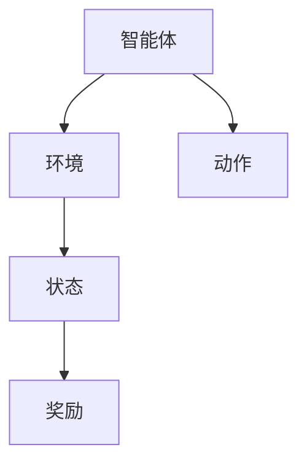
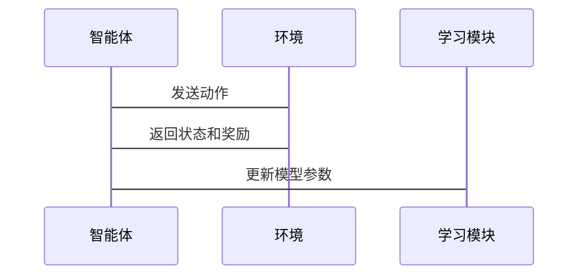

                 


# 强化学习在AI Agent长期规划优化中的应用

> 关键词：强化学习，AI Agent，长期规划，马尔可夫决策过程，贝尔曼方程，Q-learning，Deep Q-Networks（DQN）

> 摘要：本文详细探讨了强化学习在AI Agent长期规划优化中的应用。通过分析强化学习的基本概念、核心算法、数学模型以及系统架构，本文为读者提供了从理论到实践的全面指南。文章内容包括强化学习与AI Agent的背景介绍、核心算法的原理与对比、数学模型的详细推导、系统设计的架构图解，以及项目实战中的代码实现与案例分析。通过本文，读者将能够深入理解强化学习在AI Agent中的重要作用，并掌握如何将其应用于实际场景中。

---

# 第1章: 强化学习与AI Agent概述

## 1.1 强化学习的基本概念

### 1.1.1 强化学习的定义
强化学习是一种机器学习范式，通过智能体与环境的交互，逐步学习策略以最大化累积奖励。与监督学习不同，强化学习依赖于实时反馈（奖励或惩罚）来调整行为，而非依赖于标记的训练数据。

### 1.1.2 强化学习的核心要素
1. **智能体（Agent）**：决策的主体，能够感知环境并采取行动。
2. **环境（Environment）**：智能体所处的外部世界，能够提供反馈。
3. **状态（State）**：环境在某一时刻的描述。
4. **动作（Action）**：智能体在某一状态下做出的选择。
5. **奖励（Reward）**：环境对智能体行为的反馈，用于指导学习。

### 1.1.3 强化学习与监督学习的区别
- **监督学习**：基于标记的训练数据进行学习，目标是预测正确的输出。
- **强化学习**：基于与环境的交互，通过奖励信号优化策略。

## 1.2 AI Agent的定义与类型

### 1.2.1 AI Agent的定义
AI Agent是能够感知环境、自主决策并采取行动的智能实体，广泛应用于自动驾驶、机器人控制、游戏AI等领域。

### 1.2.2 AI Agent的类型
1. **基于模型的Agent**：能够建模环境并基于模型进行决策。
2. **基于经验的Agent**：依赖历史经验进行决策，不依赖环境模型。
3. **完全理性Agent**：在有限时间内找到最优策略。
4. **部分理性Agent**：在有限时间内找到近似最优策略。

### 1.2.3 AI Agent的应用场景
- **自动驾驶**：路径规划与避障。
- **游戏AI**：策略优化与博弈。
- **机器人控制**：运动规划与任务执行。

## 1.3 长期规划优化的背景与意义

### 1.3.1 长期规划优化的定义
长期规划优化是指智能体在复杂环境中，通过多步决策实现长期目标的优化过程。

### 1.3.2 长期规划优化的重要性
- **复杂环境**：需要考虑多步决策和全局优化。
- **动态变化**：环境状态可能随时间变化，需要动态调整策略。
- **目标实现**：通过长期规划确保智能体能够实现复杂目标。

### 1.3.3 强化学习在长期规划中的作用
- **策略优化**：强化学习通过奖励机制优化智能体的决策策略。
- **经验复用**：通过经验 replay 提高学习效率。
- **动态适应**：根据环境反馈动态调整策略。

## 1.4 本章小结
本章介绍了强化学习的基本概念、AI Agent的定义与类型，以及长期规划优化的背景与意义。通过这些内容，读者可以理解强化学习在AI Agent中的重要性，以及长期规划优化的核心价值。

---

# 第2章: 强化学习的核心算法

## 2.1 Q-learning算法

### 2.1.1 Q-learning的基本原理
Q-learning是一种基于价值的强化学习算法，通过学习状态-动作对的Q值来优化决策。

### 2.1.2 Q-learning的优缺点
- **优点**：简单易实现，适用于离线学习。
- **缺点**：收敛速度慢，难以处理高维状态空间。

### 2.1.3 Q-learning的数学推导
状态-动作值函数的更新公式：
$$ Q(s, a) \leftarrow Q(s, a) + \alpha \left[ r + \gamma \max_{a'} Q(s', a') - Q(s, a) \right] $$

---

## 2.2 Deep Q-Networks (DQN)

### 2.2.1 DQN的基本原理
DQN通过深度神经网络近似Q值函数，能够处理高维状态空间和动作空间。

### 2.2.2 DQN的网络结构
- **输入层**：接收环境状态。
- **隐藏层**：进行特征提取。
- **输出层**：输出各动作的Q值。

### 2.2.3 DQN的实际应用
在Atari游戏中的应用展示了DQN的强大能力。

---

## 2.3 策略梯度方法

### 2.3.1 策略梯度的基本原理
策略梯度直接优化策略，通过梯度上升最大化累积奖励。

### 2.3.2 策略梯度的优缺点
- **优点**：直接优化策略，收敛速度快。
- **缺点**：计算复杂度较高。

### 2.3.3 策略梯度的数学推导
策略梯度的优化目标为：
$$ \theta \leftarrow \theta + \alpha \nabla_\theta J(\theta) $$

---

## 2.4 强化学习算法的对比分析

### 2.4.1 各种算法的对比表格
| 算法 | 输入 | 输出 | 优缺点 |
|------|------|------|--------|
| Q-learning | 状态-动作 | Q值 | 简单但收敛慢 |
| DQN | 状态 | Q值 | 处理高维状态 |
| 策略梯度 | 状态 | 动作 | 直接优化策略 |

### 2.4.2 算法选择的注意事项
- 算法选择应考虑问题规模、环境复杂度以及计算资源。

## 2.5 本章小结
本章介绍了强化学习的核心算法，包括Q-learning、DQN和策略梯度方法，分析了它们的优缺点及应用场景。

---

# 第3章: 强化学习的数学模型

## 3.1 马尔可夫决策过程（MDP）

### 3.1.1 MDP的定义
MDP是一种数学模型，描述智能体在环境中的决策过程。

### 3.1.2 MDP的状态转移概率
状态转移概率矩阵描述了从一个状态到另一个状态的概率。

### 3.1.3 MDP的最优价值函数
最优价值函数表示在给定策略下的最大累积奖励。

---

## 3.2 贝尔曼方程

### 3.2.1 贝尔曼方程的定义
贝尔曼方程描述了状态值函数与后续状态值函数的关系。

### 3.2.2 贝尔曼方程的解法
通过动态规划或迭代方法求解贝尔曼方程。

### 3.2.3 贝尔曼方程的数学表达
$$ v_{\pi}(s) = \mathbb{E}[r + \gamma v_{\pi}(s')] $$

---

## 3.3 Q-learning的数学推导

### 3.3.1 Q值的更新公式
$$ Q(s, a) \leftarrow Q(s, a) + \alpha (r + \gamma \max Q(s', a') - Q(s, a)) $$

---

## 3.4 策略梯度的数学推导

### 3.4.1 策略梯度的目标函数
$$ J(\theta) = \mathbb{E}[R] $$

### 3.4.2 梯度计算
$$ \nabla J(\theta) = \mathbb{E}[\nabla \log \pi(a|s) \cdot Q(s, a)] $$

---

## 3.5 本章小结
本章详细推导了强化学习的数学模型，包括MDP、贝尔曼方程、Q-learning和策略梯度的数学表达。

---

# 第4章: 系统分析与架构设计

## 4.1 系统架构设计

### 4.1.1 系统架构图


### 4.1.2 功能模块
- **感知模块**：接收环境状态。
- **决策模块**：基于策略生成动作。
- **学习模块**：更新模型参数。

### 4.1.3 接口设计
- **输入接口**：接收环境状态和奖励。
- **输出接口**：输出动作和更新后的模型参数。

---

## 4.2 系统交互流程

### 4.2.1 交互流程图


---

## 4.3 本章小结
本章分析了系统的架构设计与交互流程，为强化学习在AI Agent中的实现提供了参考。

---

# 第5章: 项目实战

## 5.1 环境配置

### 5.1.1 环境安装
安装必要的库：
```bash
pip install gym numpy tensorflow
```

---

## 5.2 系统核心实现

### 5.2.1 Q-learning实现
```python
import numpy as np

class QLearning:
    def __init__(self, state_space, action_space):
        self.q_table = np.zeros((state_space, action_space))
    
    def choose_action(self, state, epsilon=0.1):
        if np.random.random() < epsilon:
            return np.random.randint(action_space)
        return np.argmax(self.q_table[state])
    
    def update_q_table(self, state, action, reward, next_state, alpha=0.1, gamma=0.9):
        self.q_table[state, action] += alpha * (reward + gamma * np.max(self.q_table[next_state]) - self.q_table[state, action])
```

---

## 5.3 案例分析

### 5.3.1 简单迷宫导航
设计一个迷宫导航问题，智能体通过学习找到最优路径。

---

## 5.4 项目总结
通过项目实战，读者可以掌握强化学习算法的实现与应用。

---

# 第6章: 最佳实践与注意事项

## 6.1 最佳实践 tips
- **算法选择**：根据问题规模选择合适算法。
- **超参数调优**：合理设置学习率、折扣因子等参数。
- **环境设计**：确保环境能够提供有效的反馈。

## 6.2 小结
强化学习在AI Agent中的应用前景广阔，但仍需在实际应用中不断探索与优化。

## 6.3 注意事项
- **计算资源**：强化学习需要大量计算资源。
- **数据质量**：环境反馈的质量直接影响学习效果。
- **算法收敛**：确保算法能够收敛到最优策略。

## 6.4 拓展阅读
推荐阅读《Reinforcement Learning: Theory and Algorithms》深入理解强化学习理论。

---

# 作者

作者：AI天才研究院/AI Genius Institute & 禅与计算机程序设计艺术 /Zen And The Art of Computer Programming

---

通过本文，读者可以系统地了解强化学习在AI Agent长期规划优化中的应用，并掌握从理论到实践的全过程。

