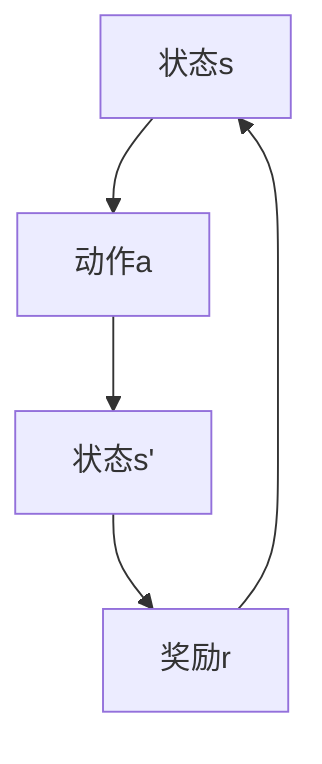

                 


# 强化学习驱动的AI Agent自主探索与学习

## 关键词
强化学习、AI Agent、自主探索、深度强化学习、多智能体学习

## 摘要
本文系统地探讨了强化学习驱动的AI Agent自主探索与学习的关键技术。首先，介绍了强化学习和AI Agent的基本概念及其在自主探索中的应用。接着，深入分析了强化学习的理论基础，包括马尔可夫决策过程（MDP）、Q-learning算法、深度强化学习（DQN）和Actor-Critic方法，并通过数学公式和算法流程图详细讲解了这些方法的原理和实现。随后，讨论了AI Agent的自主探索机制，包括好奇心驱动的探索方法，并通过mermaid图展示了探索与利用的平衡策略。最后，结合实际应用场景，分析了多智能体强化学习的系统架构和通信机制，探讨了实际应用中的挑战，并通过项目实战展示了如何实现一个基于强化学习的AI Agent。

---

# 第1章 强化学习与AI Agent概述

## 1.1 强化学习的基本概念

### 1.1.1 强化学习的定义
强化学习是一种机器学习范式，通过智能体与环境的交互，学习如何通过执行动作来最大化累积奖励。与监督学习和无监督学习不同，强化学习强调智能体的自主决策能力。

### 1.1.2 AI Agent的基本概念
AI Agent是指具有自主决策能力的智能体，能够感知环境并采取行动以实现目标。AI Agent的核心在于其决策机制，而强化学习为其提供了有效的决策策略。

### 1.1.3 强化学习与AI Agent的关系
强化学习为AI Agent提供了学习和优化决策策略的方法，而AI Agent则为强化学习提供了一个实现平台。两者相互依存，共同推动智能体的自主探索与学习。

## 1.2 强化学习的核心概念

### 1.2.1 状态、动作、奖励的定义
- **状态（State）**：智能体所处环境的当前情况。
- **动作（Action）**：智能体在某一状态下选择的行为。
- **奖励（Reward）**：智能体执行动作后所获得的反馈，用于评估动作的好坏。

### 1.2.2 Q值函数与策略的对比
- **Q值函数**：表示在状态s下采取动作a后所能获得的最大预期奖励。
- **策略**：描述智能体在不同状态下选择动作的概率分布。

### 1.2.3 探索与利用的平衡
智能体需要在探索新动作和利用已知好动作之间找到平衡，以避免陷入局部最优。

## 1.3 强化学习的应用场景

### 1.3.1 游戏AI
强化学习在游戏AI中的应用最为广泛，如AlphaGo和Dota AI。

### 1.3.2 机器人控制
通过强化学习，机器人可以学会在复杂环境中自主导航和操作。

### 1.3.3 自动驾驶
强化学习在自动驾驶中的应用，如路径规划和决策控制。

---

# 第2章 强化学习的理论基础

## 2.1 马尔可夫决策过程（MDP）

### 2.1.1 状态空间
智能体可能遇到的所有状态的集合。

### 2.1.2 动作空间
智能体在每个状态下可能执行的所有动作的集合。

### 2.1.3 奖励函数
定义智能体在执行某个动作后所获得的奖励。

### 2.1.4 转移概率
描述从当前状态执行某个动作后转移到下一个状态的概率。

## 2.2 Q-learning算法

### 2.2.1 Q值更新公式
$$ Q(s,a) = (1-\alpha)Q(s,a) + \alpha (r + \gamma \max Q(s',a')) $$

### 2.2.2 Q-learning流程图


### 2.2.3 Python代码示例
```python
import numpy as np

class QLearning:
    def __init__(self, state_space, action_space, gamma=0.99, alpha=0.1):
        self.state_space = state_space
        self.action_space = action_space
        self.gamma = gamma
        self.alpha = alpha
        self.q_table = np.zeros((state_space, action_space))

    def choose_action(self, state, epsilon=0.1):
        if np.random.random() < epsilon:
            return np.random.randint(self.action_space)
        else:
            return np.argmax(self.q_table[state])

    def update_q(self, state, action, reward, next_state):
        self.q_table[state, action] = self.q_table[state, action] * (1 - self.alpha) + \
                                        self.alpha * (reward + self.gamma * np.max(self.q_table[next_state]))
```

## 2.3 深度强化学习

### 2.3.1 DQN算法
DQN通过神经网络近似Q值函数，解决高维状态空间的问题。

### 2.3.2 神经网络在强化学习中的应用
神经网络用于逼近Q值函数或策略，实现端到端的强化学习。

---

# 第3章 AI Agent的自主探索机制

## 3.1 探索策略

### 3.1.1 贪婪策略
完全依赖已有知识选择最优动作。

### 3.1.2 随机策略
随机选择动作，避免陷入局部最优。

### 3.1.3 温度参数调节
通过温度参数平衡探索与利用。

## 3.2 好奇心驱动的探索

### 3.2.1 知识表示方法
使用神经网络表示知识。

### 3.2.2 好奇心驱动的奖励机制
根据知识的新颖性给予奖励。

### 3.2.3 探索与利用的平衡
通过奖励机制动态调整探索与利用的比例。

---

# 第4章 多智能体强化学习

## 4.1 多智能体系统概述

### 4.1.1 多智能体系统的定义
由多个智能体组成的系统，智能体之间可以协作或竞争。

### 4.1.2 多智能体与单智能体的区别
多智能体系统中，智能体需要协调动作，实现共同目标。

## 4.2 多智能体强化学习算法

### 4.2.1 单一智能体算法的扩展
将单智能体算法扩展到多智能体场景。

### 4.2.2 基于通信的多智能体学习
智能体之间通过通信共享信息。

### 4.2.3 基于价值的多智能体学习
通过价值函数协调智能体动作。

---

# 第5章 强化学习驱动的AI Agent

## 5.1 系统架构设计

### 5.1.1 领域模型
用mermaid图展示系统功能模块。

### 5.1.2 系统架构图
展示系统的整体架构和模块关系。

## 5.2 项目实战

### 5.2.1 环境安装
安装必要的库，如TensorFlow、Keras、OpenAI Gym。

### 5.2.2 核心实现代码
实现强化学习算法的核心部分，如神经网络训练和策略选择。

### 5.2.3 案例分析
分析实际案例，如机器人导航或游戏AI。

---

# 第6章 应用挑战与未来方向

## 6.1 应用挑战

### 6.1.1 安全性
防止恶意攻击和滥用。

### 6.1.2 鲁棒性
提高系统的健壮性，应对不确定性。

### 6.1.3 伦理问题
确保AI Agent的行为符合伦理规范。

## 6.2 未来方向

### 6.2.1 更复杂的任务
探索更复杂的自主探索任务。

### 6.2.2 新的算法
研究更高效的强化学习算法。

### 6.2.3 多模态学习
结合多种模态信息，提升智能体的感知能力。

---

# 小结

本文全面探讨了强化学习驱动的AI Agent自主探索与学习的关键技术，从理论基础到实际应用，详细讲解了每个环节的核心内容。通过项目实战和案例分析，展示了强化学习在实际中的应用价值。未来，随着算法的不断进步和硬件性能的提升，AI Agent将具备更强的自主探索能力，推动人工智能技术的发展。

---

作者：AI天才研究院 & 禅与计算机程序设计艺术

