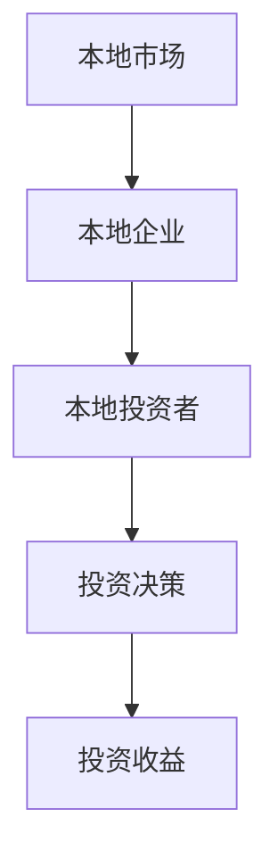
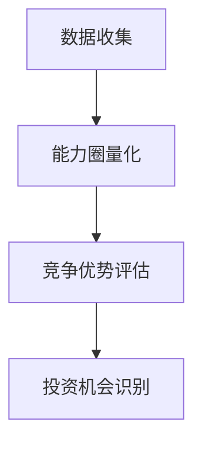
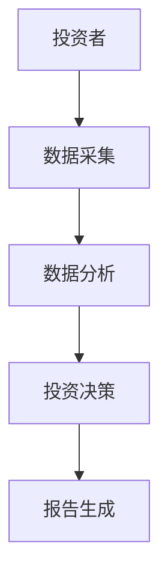

                 


# 彼得·林奇的本地投资优势：投资你所了解的

## 关键词：彼得·林奇、本地投资、投资策略、投资优势、投资理念

## 摘要：  
本文深入探讨了彼得·林奇提出的“本地投资优势”这一投资理念，分析了其核心概念、理论基础、算法原理以及实际应用。文章从背景介绍、核心概念、算法原理、系统架构、项目实战等多个方面展开，结合实际案例和数学模型，详细阐述了如何利用本地投资优势进行有效的投资决策。通过本文的学习，读者将能够更好地理解“投资于自己了解的领域”的深刻含义，并掌握如何在实际投资中应用这一理念。

---

## 第一部分: 本地投资优势的核心概念与背景

## 第1章: 本地投资优势的背景介绍

### 1.1 本地投资优势的定义与特点

#### 1.1.1 本地投资优势的核心概念  
本地投资优势是指投资者在熟悉的本地市场中，由于对市场环境、企业经营状况以及行业动态的深入了解，从而能够更准确地识别投资机会和风险的一种投资优势。  

#### 1.1.2 本地投资与全球化投资的对比  
| 对比维度          | 本地投资                | 全球化投资              |
|-------------------|-------------------------|--------------------------|
| 投资范围          | 本地市场                | 全球市场                |
| 信息获取难度      | 较低（熟悉本地市场）    | 较高（不熟悉海外市场）  |
| 风险可控性        | 较高（了解本地风险）    | 较低（不了解海外风险）  |
| 投资门槛          | 较低（本地信息易获取）  | 较高（需要更多资源）    |

#### 1.1.3 本地投资优势的边界与外延  
本地投资优势的边界在于投资者的认知范围和能力圈。投资者只能在自己熟悉且理解的领域中获得优势，超出这个范围，本地投资优势将不再存在。  

---

### 1.2 投资者认知局限性与本地优势

#### 1.2.1 投资者的认知范围与能力圈  
投资者的认知范围是有限的，通常只能在自己熟悉的企业、行业或市场中做出明智的决策。超出这个范围的投资往往会导致失败。  

#### 1.2.2 本地市场信息的可获得性  
本地市场的信息通常更容易获取，投资者可以通过实地调研、行业报告等方式深入了解市场动态。  

#### 1.2.3 本地市场波动性与投资机会  
本地市场通常波动性较低，且投资者更容易捕捉到市场中的投资机会。  

---

### 1.3 本地投资优势的理论基础

#### 1.3.1 彼得·林奇的投资理念概述  
彼得·林奇强调，成功的投资需要基于对企业的深入了解，而本地市场为企业提供了更好的研究条件。  

#### 1.3.2 本地投资优势的经济学解释  
本地投资优势可以通过信息优势和交易成本优势来解释。投资者在本地市场中更容易获得信息，且交易成本较低。  

#### 1.3.3 本地市场与企业基本面分析  
本地市场的企业基本面分析包括对企业财务状况、行业地位、管理团队等方面的研究。  

---

## 第2章: 本地投资优势的核心概念与联系

### 2.1 核心概念的原理分析

#### 2.1.1 本地市场信息优势的来源  
本地市场的信息优势来源于投资者对市场环境的熟悉程度。  

#### 2.1.2 本地企业竞争优势的识别  
通过对企业盈利能力、市场地位、竞争优势等方面的分析，投资者可以识别出具有竞争优势的企业。  

#### 2.1.3 本地投资风险的可控性  
由于投资者对本地市场的熟悉，投资风险更加可控。  

---

### 2.2 核心概念的对比分析

#### 2.2.1 本地投资与全球化投资的对比  
本地投资注重深度分析，而全球化投资注重广度覆盖。  

#### 2.2.2 不同市场环境下本地投资优势的差异  
在不同的市场环境下，本地投资优势的表现可能有所不同。  

#### 2.2.3 本地投资与分散投资的权衡  
本地投资集中于熟悉的领域，而分散投资则追求风险的分散。  

---

### 2.3 实体关系图与流程图

#### 2.3.1 本地投资优势的ER实体关系图  


---

## 第三部分: 算法原理与技术实现

## 第3章: 本地投资优势的算法原理

### 3.1 本地投资优势的量化方法

#### 3.1.1 投资者能力圈的量化  
通过对企业基本面的评分系统，量化投资者的能力圈。  

#### 3.1.2 本地市场的评分系统  
设计一个评分系统，对本地市场的投资机会进行量化评估。  

#### 3.1.3 本地企业竞争优势的评分模型  
构建一个数学模型，对本地企业的竞争优势进行评分。  

---

### 3.2 投资机会识别算法

#### 3.2.1 算法流程  
1. 收集本地市场数据  
2. 量化投资者能力圈  
3. 评估本地企业的竞争优势  
4. 识别投资机会  

#### 3.2.2 算法实现  


#### 3.2.3 数学模型与公式  
投资机会的评分公式为：  
$$ \text{评分} = \sum_{i=1}^{n} w_i \cdot x_i $$  
其中，$w_i$ 是权重，$x_i$ 是各项指标的得分。  

---

### 3.3 算法实现与优化

#### 3.3.1 投资机会识别的Python代码实现  
```python
def calculate_opportunity_score(firm_data, weights):
    return sum(w * d for w, d in zip(weights, firm_data))

# 示例数据
firm_data = [8, 6, 7]
weights = [0.5, 0.3, 0.2]

score = calculate_opportunity_score(firm_data, weights)
print(f"投资机会评分：{score}")
```

#### 3.3.2 算法优化与改进  
通过动态调整权重和引入更多指标，优化投资机会识别算法。  

---

## 第四部分: 系统架构与项目实战

## 第4章: 本地投资优势的系统架构设计

### 4.1 系统功能设计

#### 4.1.1 领域模型设计  


#### 4.1.2 系统功能模块  
1. 数据采集模块  
2. 数据分析模块  
3. 投资决策模块  
4. 报告生成模块  

---

### 4.2 系统架构设计

#### 4.2.1 系统架构图  


#### 4.2.2 系统接口设计  
1. 数据接口  
2. 分析接口  
3. 决策接口  

---

### 4.3 项目实战

#### 4.3.1 环境安装与配置  
安装必要的Python库，如Pandas、NumPy等。  

#### 4.3.2 核心代码实现  
```python
import pandas as pd

# 示例数据
data = {
    '企业名称': ['A', 'B', 'C'],
    '财务数据': [80, 70, 60],
    '竞争优势': [90, 80, 70]
}

df = pd.DataFrame(data)
print(df)
```

#### 4.3.3 实际案例分析  
以本地零售业为例，分析企业的财务数据和竞争优势，评估投资机会。  

---

## 第五部分: 总结与最佳实践

## 第5章: 总结与最佳实践

### 5.1 投资策略总结

#### 5.1.1 本地投资的核心策略  
坚持投资于自己熟悉的企业和行业，避免盲目投资。  

#### 5.1.2 投资组合优化  
通过分散投资降低风险，同时集中投资于优势领域。  

---

### 5.2 最佳实践 Tips

#### 5.2.1 定期复盘  
定期回顾投资组合的表现，及时调整投资策略。  

#### 5.2.2 持续学习  
不断学习新的投资知识，扩大自己的能力圈。  

#### 5.2.3 风险控制  
设置止损点，避免重大损失。  

---

## 作者：AI天才研究院/AI Genius Institute & 禅与计算机程序设计艺术 /Zen And The Art of Computer Programming

---

通过本文的详细分析，读者可以深入了解彼得·林奇的本地投资优势理念，并掌握如何在实际投资中应用这一策略。希望本文能为投资者提供有价值的参考和启发。

