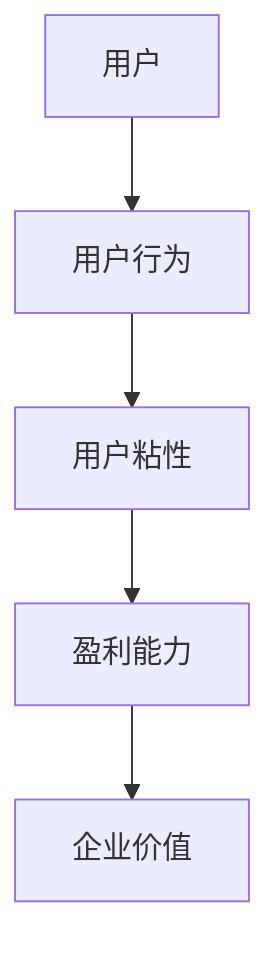
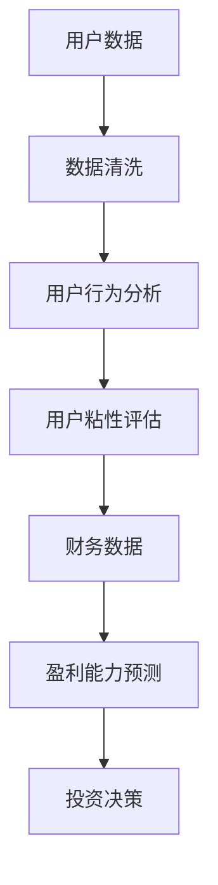
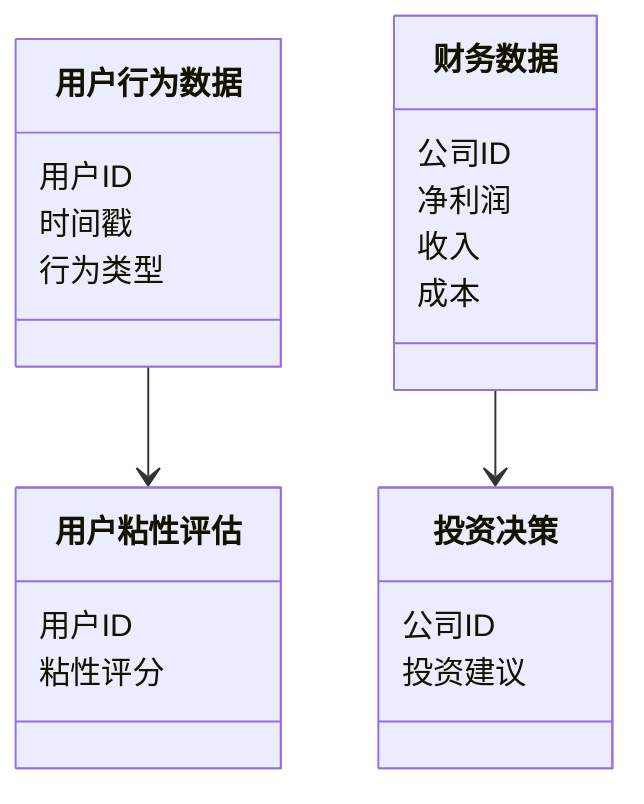
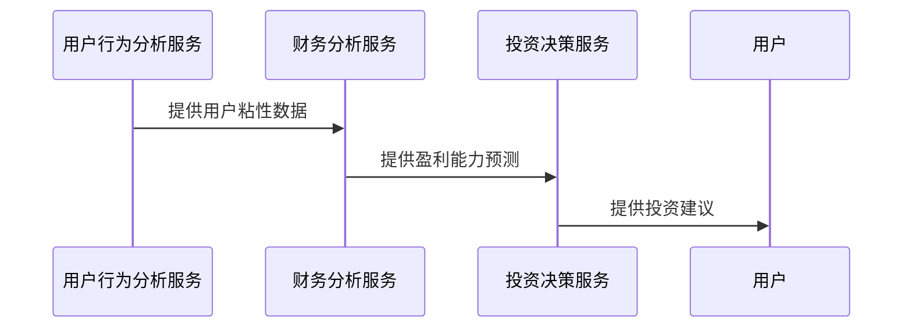

                 


# 彼得林奇如何分析公司的用户粘性与盈利能力的长期关系

**关键词**：用户粘性、盈利能力、彼得·林奇、投资策略、长期关系

**摘要**：本文探讨了彼得·林奇如何分析公司用户粘性与盈利能力的长期关系。通过定义用户粘性和盈利能力的核心概念，分析它们之间的动态关系，并结合彼得·林奇的投资策略，构建数学模型和系统架构，最后通过实际案例验证分析过程。文章详细解释了如何通过技术手段量化用户粘性对盈利能力的影响，并提供了最佳实践建议。

---

## 第一部分：背景介绍

### 第1章：用户粘性与盈利能力的核心概念

#### 1.1 问题背景

- **用户粘性的定义与重要性**：用户粘性是指用户对公司产品或服务的依赖程度，通常通过用户留存率、复购率等指标衡量。高用户粘性意味着用户更可能长期使用公司的产品或服务，从而提高公司的市场占有率和盈利能力。

- **盈利能力的定义与衡量指标**：盈利能力是指公司在一定时期内赚取的利润，常用净利润率、ROE（净资产收益率）等指标衡量。

- **用户粘性与盈利能力的关系**：用户粘性是影响盈利能力的关键因素。高用户粘性通常意味着公司能够稳定获取收入，从而提高盈利能力。

#### 1.2 问题描述

- **用户粘性对长期盈利能力的影响**：用户粘性直接影响公司的收入和市场份额，从而影响盈利能力。高用户粘性能够降低客户获取成本，提高客户生命周期价值。

- **彼得·林奇投资策略的核心逻辑**：彼得·林奇是一位著名的投资经理，他注重分析公司的基本面，包括用户粘性、市场地位、财务状况等。他认为，具有强大用户粘性的公司更有可能实现长期盈利。

- **企业如何通过用户粘性提升盈利能力**：企业可以通过提高用户粘性来增加客户忠诚度，从而提高复购率和客单价，进而提升盈利能力。

#### 1.3 问题解决

- **用户粘性的关键驱动因素**：包括产品价值、用户体验、品牌忠诚度等。公司需要通过优化产品和服务来提高用户粘性。

- **盈利能力的长期驱动因素**：包括成本控制、收入增长、市场扩展等。公司需要通过提高效率和市场占有率来实现长期盈利。

- **彼得·林奇方法论的核心步骤**：包括基本面分析、公司估值、长期投资策略等。

#### 1.4 边界与外延

- **用户粘性与盈利能力的边界条件**：用户粘性不能单独决定盈利能力，还需要考虑行业竞争、宏观经济环境等因素。

- **盈利能力的短期波动与长期趋势**：盈利能力可能受到短期市场波动的影响，但长期趋势主要由公司的基本面决定。

- **用户粘性与盈利能力的外部影响因素**：包括政策变化、技术进步、消费者偏好变化等。

#### 1.5 概念结构与核心要素

- **用户粘性与盈利能力的关系模型**：构建一个用户粘性与盈利能力的关系模型，展示两者之间的相互作用。

- **核心要素对比表格**：

| 属性        | 用户粘性                  | 盈利能力                  |
|-------------|--------------------------|---------------------------|
| 定义        | 用户对产品或服务的依赖程度 | 公司在一定时期内赚取的利润 |
| 衡量指标    | 用户留存率、复购率        | 净利润率、ROE              |
| 影响因素    | 产品价值、用户体验        | 收入增长、成本控制          |
| 长期影响    | 提高市场占有率            | 提升企业价值                |

- **ER实体关系图架构（Mermaid流程图）**：



---

## 第二部分：核心概念与联系

### 第2章：用户粘性与盈利能力的核心原理

#### 2.1 核心概念原理

- **用户粘性的形成机制**：用户粘性由用户对产品的满意度、依赖性和品牌忠诚度决定。公司通过提供高质量的产品和服务，可以提高用户粘性。

- **盈利能力的来源与结构**：盈利能力来源于收入减去成本和费用。公司通过提高收入和降低成本来提高盈利能力。

- **两者关系的动态演变**：用户粘性与盈利能力之间存在正相关关系。高用户粘性能够稳定收入，从而提高盈利能力。然而，盈利能力的提升也可能进一步增强用户粘性，形成良性循环。

#### 2.2 核心属性对比表格

| 属性        | 用户粘性                  | 盈利能力                  |
|-------------|--------------------------|---------------------------|
| 定义        | 用户对产品或服务的依赖程度 | 公司在一定时期内赚取的利润 |
| 衡量指标    | 用户留存率、复购率        | 净利润率、ROE              |
| 影响因素    | 产品价值、用户体验        | 收入增长、成本控制          |
| 长期影响    | 提高市场占有率            | 提升企业价值                |

---

## 第三部分：算法原理讲解

### 第3章：彼得·林奇分析方法的算法原理

#### 3.1 算法原理

- **数据分析方法**：通过收集和分析用户行为数据，识别用户粘性的关键驱动因素。

- **用户行为分析**：通过用户留存率、复购率等指标，评估用户粘性。

- **盈利能力预测模型**：基于用户粘性和其他财务指标，构建盈利能力预测模型。

#### 3.2 算法流程图（Mermaid）



#### 3.3 算法实现代码

```python
import pandas as pd
import numpy as np

# 数据清洗
data = pd.read_csv('user_data.csv')
data_clean = data.dropna()

# 用户行为分析
user_behavior = data_clean.groupby('user_id')['action'].count()

# 用户粘性评估
user_stickiness = data_clean.groupby('user_id')['action'].apply(lambda x: (x > 0).sum() / len(x))

# 财务数据
financials = pd.read_csv('financial_data.csv')

# 盈利能力预测
model = linear_model.LinearRegression()
model.fit(user_stickiness.values.reshape(-1, 1), financials['net_profit'].values)
predicted_profitability = model.predict(user_stickiness.values.reshape(-1, 1))
```

#### 3.4 数学模型与公式

- **用户粘性与盈利能力的关系模型**：

$$ \text{Profitability} = \beta_0 + \beta_1 \times \text{User Stickiness} + \epsilon $$

其中，$\beta_0$ 是截距，$\beta_1$ 是用户粘性的回归系数，$\epsilon$ 是误差项。

- **回归分析**：

$$ \text{Net Profit} = \alpha \times \text{User Stickiness} + \beta \times \text{Revenue} + \gamma \times \text{Cost} + \delta $$

---

## 第四部分：系统分析与架构设计方案

### 第4章：系统分析与架构设计

#### 4.1 问题场景介绍

- **用户粘性与盈利能力分析系统**：设计一个系统，能够实时分析用户粘性和盈利能力，并提供投资建议。

#### 4.2 系统功能设计（领域模型Mermaid类图）



#### 4.3 系统架构设计（Mermaid架构图）

```mermaid
container 用户粘性与盈利能力分析系统 {
    service 用户行为分析服务 {
        + 用户行为数据清洗
        + 用户粘性计算
    }
    service 财务分析服务 {
        + 净利润预测
        + 盈利能力评估
    }
    service 投资决策服务 {
        + 投资建议生成
    }
}
```

#### 4.4 系统接口设计

- **输入接口**：用户行为数据和财务数据的输入接口。

- **输出接口**：投资建议和分析结果的输出接口。

#### 4.5 系统交互（Mermaid序列图）



---

## 第五部分：项目实战

### 第5章：项目实战

#### 5.1 环境安装

- 安装必要的Python库，如Pandas、NumPy、Scikit-learn。

#### 5.2 核心代码实现

```python
import pandas as pd
import numpy as np
from sklearn.linear_model import LinearRegression

# 数据加载与清洗
data = pd.read_csv('user_data.csv')
data_clean = data.dropna()

# 用户粘性计算
user_stickiness = data_clean.groupby('user_id')['action'].apply(lambda x: (x > 0).sum() / len(x))

# 盈利能力预测
model = LinearRegression()
model.fit(user_stickiness.values.reshape(-1, 1), data_clean['net_profit'].values)
predicted_profitability = model.predict(user_stickiness.values.reshape(-1, 1))

# 投资决策
investment_decision = (predicted_profitability > data_clean['net_profit'].mean()).astype(int)
```

#### 5.3 代码解读与分析

- **数据清洗**：删除缺失值，确保数据质量。

- **用户粘性计算**：计算每个用户的粘性评分，反映用户对产品或服务的依赖程度。

- **盈利能力预测**：使用线性回归模型，基于用户粘性预测公司的盈利能力。

- **投资决策**：根据预测的盈利能力，生成投资建议。

#### 5.4 实际案例分析

- **案例分析**：以某公司为例，分析其用户粘性和盈利能力的关系，验证模型的准确性。

#### 5.5 项目小结

- **总结经验**：通过项目实战，验证了用户粘性对盈利能力的影响，并展示了如何通过技术手段量化这种影响。

---

## 第六部分：最佳实践

### 第6章：最佳实践

#### 6.1 小结

- **用户粘性与盈利能力的关系**：用户粘性是影响公司盈利能力的关键因素，高用户粘性能够稳定收入，提高盈利能力。

#### 6.2 注意事项

- **数据质量**：确保数据准确性和完整性，避免偏差。

- **模型选择**：根据具体情况选择合适的分析模型，确保分析结果的准确性。

#### 6.3 拓展阅读

- **推荐书籍**：彼得·林奇的《投资最重要的事情》。

---

**作者：AI天才研究院/AI Genius Institute & 禅与计算机程序设计艺术 /Zen And The Art of Computer Programming**

