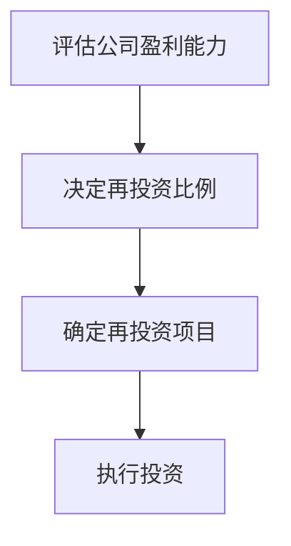
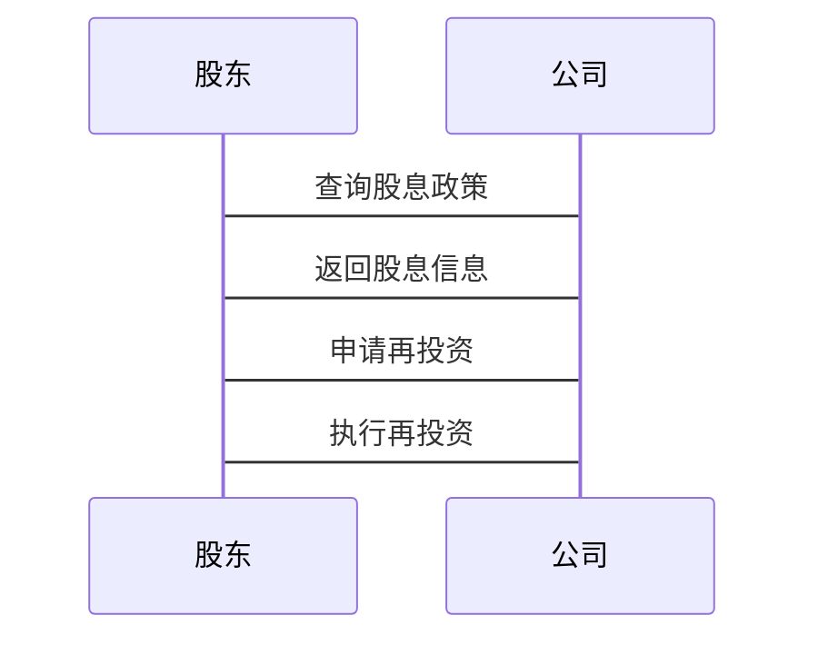

                 


# 彼得林奇如何看待公司的股息政策与再投资平衡

## 关键词：彼得·林奇、股息政策、再投资、股息支付率、股息收益率、投资策略

## 摘要：本文探讨了彼得·林奇对股息政策与再投资策略的见解，分析了两者之间的平衡点，结合数学模型和实际案例，提供了详细的分析和建议。

---

## 第1章：股息政策与再投资的背景介绍

### 1.1 股息政策的核心概念

#### 1.1.1 股息政策的定义
股息政策是指公司董事会决定如何分配利润给股东的策略，通常包括股息支付率、股息收益率等指标。

#### 1.1.2 股息政策的类型
- 固定股息政策
- 剩余股息政策
- 稳定股息增长政策

#### 1.1.3 股息政策的优缺点对比

| 优点             | 缺点             |
|------------------|------------------|
| 吸引投资者        | 可能限制公司发展 |
| 提高股东满意度    | 增加财务压力      |

### 1.2 再投资策略的核心概念

#### 1.2.1 再投资策略的定义
再投资策略是指公司将部分利润用于扩展业务，例如研发、并购或偿还债务。

#### 1.2.2 再投资策略的类型
- 内部再投资
- 外部再投资

#### 1.2.3 再投资策略的优缺点对比

| 优点             | 缺点             |
|------------------|------------------|
| 促进公司增长      | 增加财务风险      |
| 提高市场竞争力    | 可能影响股东回报 |

### 1.3 股息政策与再投资策略的联系与区别

| 联系               | 区别               |
|--------------------|--------------------|
| 都涉及利润分配      | 股息政策关注股东回报，再投资关注公司增长 |

---

## 第2章：彼得·林奇的股息政策与再投资策略分析

### 2.1 彼得·林奇的投资理念

#### 2.1.1 彼得·林奇的投资哲学
彼得·林奇强调基本面分析，认为公司基本面是投资的关键。

#### 2.1.2 彼得·林奇对股息政策的看法
他倾向于选择股息稳定增长的公司，认为这反映公司的财务健康。

#### 2.1.3 彼得·林奇对再投资策略的看法
他支持公司合理再投资，以维持增长，同时保持股息支付。

### 2.2 彼得·林奇的股息政策分析

#### 2.2.1 股息支付率的计算公式
$$ \text{股息支付率} = \frac{\text{股息支付额}}{\text{净利润}} $$

#### 2.2.2 股息收益率的计算公式
$$ \text{股息收益率} = \frac{\text{每股股息}}{\text{股价}} $$

### 2.3 彼得·林奇的再投资策略分析

#### 2.3.1 再投资的定义与目标
再投资旨在通过利润再投入，促进公司增长。

#### 2.3.2 再投资的决策模型
使用Mermaid图展示再投资决策流程：



#### 2.3.3 再投资的风险与收益平衡

| 风险               | 收益               |
|--------------------|--------------------|
| 资金流动性下降      | 促进公司增长      |

---

## 第3章：股息政策与再投资策略的数学模型与公式

### 3.1 股息政策的数学模型

#### 3.1.1 股息支付率的数学公式
$$ \text{股息支付率} = \frac{\text{股息支付额}}{\text{净利润}} $$

#### 3.1.2 股息收益率的数学公式
$$ \text{股息收益率} = \frac{\text{每股股息}}{\text{股价}} $$

### 3.2 再投资策略的数学模型

#### 3.2.1 再投资回报率的计算公式
$$ \text{再投资回报率} = \frac{\text{再投资收益}}{\text{再投资额}} $$

#### 3.2.2 再投资与股息政策的平衡公式
$$ \text{股息支付率} + \text{再投资回报率} = \text{总收益分配率} $$

---

## 第4章：系统分析与架构设计方案

### 4.1 问题场景介绍
分析一家公司如何平衡股息政策和再投资策略，以实现股东回报和公司增长的双重目标。

### 4.2 系统功能设计

#### 4.2.1 领域模型（Mermaid类图）


#### 4.2.2 系统架构设计（Mermaid架构图）
```mermaid
container 股票市场
    component 股东
    component 公司
    component 股息分配系统
```

#### 4.2.3 系统接口设计
- 股东查询股息信息接口
- 公司提交再投资计划接口

#### 4.2.4 系统交互设计（Mermaid序列图）


---

## 第5章：项目实战

### 5.1 环境安装
安装必要的数据分析工具，如Python和Pandas。

### 5.2 系统核心实现源代码

#### 5.2.1 计算股息支付率的代码
```python
def calculate_dividend_payout_ratio(dividends, net_profit):
    return dividends / net_profit
```

#### 5.2.2 计算股息收益率的代码
```python
def calculate_dividend_yield(dividends_per_share, stock_price):
    return dividends_per_share / stock_price
```

### 5.3 代码应用解读与分析
以苹果公司为例，计算其股息支付率和收益率，分析其股息政策和再投资策略。

### 5.4 实际案例分析和详细讲解剖析
展示苹果公司的股息政策和再投资策略，说明如何平衡两者。

### 5.5 项目小结
总结案例分析，强调平衡股息政策和再投资策略的重要性。

---

## 第6章：最佳实践 tips

### 6.1 投资策略建议
- 分散投资，降低风险
- 关注公司基本面，选择优质股

### 6.2 风险管理建议
- 设置止损点，控制风险
- 定期评估投资组合

### 6.3 长期视角的重要性
- 长期投资，避免短期波动影响决策

### 6.4 持续学习的重要性
- 关注市场动态，学习新的投资理念

## 小结
本文详细分析了彼得·林奇对股息政策和再投资策略的见解，结合数学模型和实际案例，提供了详细的分析和建议。

## 注意事项
投资有风险，读者需根据自身情况谨慎决策。

## 拓展阅读
- 《彼得·林奇的成功投资》
- 《股息投资策略》

作者：AI天才研究院 & 禅与计算机程序设计艺术

