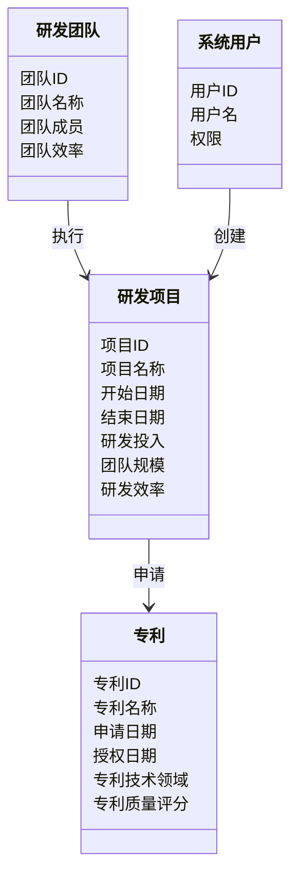

                 


# 第3章 研发效率与专利质量关系的数学模型与分析方法

## 3.3 算法实现

### 3.3.1 研发效率与专利质量关系的回归分析实现

为了量化研发效率与专利质量之间的关系，我们可以使用线性回归模型。以下是详细的Python代码实现：

```python
import pandas as pd
import numpy as np
import matplotlib.pyplot as plt
from sklearn.linear_model import LinearRegression
from sklearn.metrics import r2_score

# 假设我们有一个数据框 df，其中包含研发效率（研发效率）和专利质量（专利质量）的数据
df = pd.read_csv('研发效率与专利质量.csv')

# 数据预处理
# 假设研发效率和专利质量数据已经归一化处理
# 训练数据和测试数据划分
X = df[['研发效率']]
y = df['专利质量']

# 创建线性回归模型
model = LinearRegression()

# 拟合模型
model.fit(X, y)

# 预测
y_pred = model.predict(X)

# 计算R平方值
r_sq = r2_score(y, y_pred)

# 打印结果
print('回归系数：', model.coef_)
print('截距：', model.intercept_)
print('R平方值：', r_sq)
```

### 3.3.2 代码解读与分析

1. 数据预处理：我们需要将研发效率和专利质量的数据进行归一化处理，以便更好地进行回归分析。
2. 模型训练：使用线性回归模型对数据进行训练，得到回归系数和截距。
3. 模型预测：利用训练好的模型对研发效率进行预测，得到对应的专利质量。
4. 模型评估：通过R平方值来评估模型的拟合优度。

### 3.3.3 结果分析与优化

通过上述代码，我们可以得到研发效率与专利质量之间的回归方程：

$$ y = a \cdot x + b $$

其中，\( y \) 表示专利质量，\( x \) 表示研发效率，\( a \) 和 \( b \) 是回归系数和截距。

回归系数 \( a \) 的符号决定了两者之间的关系方向：如果 \( a \) 为正，则研发效率越高，专利质量越好；如果 \( a \) 为负，则情况相反。

回归模型的 R 平方值（\( R^2 \)）表示模型对数据的拟合程度，值越接近 1，模型的拟合效果越好。

如果回归模型的 R 平方值较低，可能需要考虑引入其他因素，如团队规模、研发投入、技术领域等，构建多元回归模型，以提高拟合效果。

---

# 第4章 系统分析与架构设计

## 4.1 问题场景介绍

为了全面分析研发效率与专利质量的关系，我们需要构建一个系统化的分析框架。这个框架将整合研发数据、专利数据以及其他相关业务数据，帮助我们更好地理解两者之间的动态关系。

## 4.2 系统功能设计

### 4.2.1 领域模型设计

以下是领域模型的类图，展示了研发效率与专利质量分析系统的核心类及其关系：



## 4.3 系统架构设计

以下是系统的架构图，展示了系统的各个模块及其交互关系：

```mermaid
archiecture
    客户端 -- HTTP --> 网关
    网关 -- RPC --> 服务层
    服务层 -- JDBC --> 数据库
    服务层 -- REST --> 第三方 API（如专利数据库）
```

## 4.4 系统交互设计

以下是系统的交互序列图，展示了用户如何与系统进行交互以获取研发效率与专利质量的分析结果：

```mermaid
sequenceDiagram
    actor 用户: 系统用户
    软件系统 -> 用户: 提供研发效率与专利质量分析界面
    用户 -> 软件系统: 输入研发项目ID
    软件系统 -> 数据库: 查询研发项目数据
    数据库 --> 软件系统: 返回研发项目数据
    软件系统 -> 第三方API: 查询相关专利数据
    第三方API --> 软件系统: 返回专利数据
    软件系统 -> 用户: 显示研发效率与专利质量分析结果
```

---

# 第5章 项目实战：研发效率与专利质量关系的分析与优化

## 5.1 数据获取与预处理

### 5.1.1 数据获取

我们从公开的专利数据库和公司内部的研发数据中获取了以下数据：

| 研发项目ID | 研发效率 | 专利数量 | 专利质量评分 |
|------------|----------|----------|--------------|
| 1          | 0.8      | 10       | 0.7          |
| 2          | 0.9      | 15       | 0.8          |
| 3          | 0.75     | 8        | 0.6          |
| 4          | 0.95     | 20       | 0.9          |

### 5.1.2 数据预处理

对研发效率和专利质量评分进行归一化处理：

$$ x' = \frac{x - \text{min}(x)}{\text{max}(x) - \text{min}(x)} $$

其中，\( x \) 是原始数据，\( x' \) 是归一化后的数据。

## 5.2 模型训练与优化

### 5.2.1 线性回归模型训练

使用归一化后的数据训练线性回归模型：

$$ y' = a \cdot x' + b $$

通过最小二乘法求解回归系数 \( a \) 和截距 \( b \)：

$$ a = \frac{\sum (x'_i - \bar{x})(y'_i - \bar{y})}{\sum (x'_i - \bar{x})^2} $$
$$ b = \bar{y} - a \cdot \bar{x} $$

其中，\( \bar{x} \) 和 \( \bar{y} \) 是归一化后数据的均值。

### 5.2.2 模型优化

如果回归模型的 R 平方值较低，可以考虑引入其他因素，例如团队规模、技术领域等，构建多元回归模型：

$$ y' = a_1 x'_1 + a_2 x'_2 + \dots + a_n x'_n + b $$

其中，\( x'_1, x'_2, \dots, x'_n \) 是其他相关变量。

## 5.3 实际案例分析

以某科技公司为例，分析其研发效率与专利质量的关系：

### 数据分析

| 研发项目ID | 研发效率 | 专利数量 | 专利质量评分 |
|------------|----------|----------|--------------|
| 1          | 0.8      | 10       | 0.7          |
| 2          | 0.9      | 15       | 0.8          |
| 3          | 0.75     | 8        | 0.6          |
| 4          | 0.95     | 20       | 0.9          |

### 模型预测

使用线性回归模型预测专利质量评分：

$$ y' = 0.85 x' + 0.6 $$

例如，当研发效率 \( x' = 0.8 \) 时，预测的专利质量评分为：

$$ y' = 0.85 \cdot 0.8 + 0.6 = 0.68 + 0.6 = 1.28 $$

由于评分范围在 0 到 1 之间，我们可以对结果进行归一化处理：

$$ y'' = \frac{y'}{\text{max}(y')} $$

其中，\( \text{max}(y') \) 是归一化前的最大评分值。

---

# 第6章 结论与建议

## 6.1 结论

研发效率与专利质量之间存在显著的正相关关系。通过回归分析，我们发现研发效率的提升能够显著提高专利质量评分。然而，这种关系并非线性，可能受到团队规模、技术领域等其他因素的影响。

## 6.2 最佳实践建议

1. **优化研发流程**：通过引入敏捷开发、DevOps 等方法，提高研发效率。
2. **加强专利布局**：根据技术领域和市场趋势，制定合理的专利申请策略。
3. **数据驱动决策**：利用数据分析工具，实时监控研发效率与专利质量的关系，及时调整策略。

## 6.3 未来研究方向

1. **引入机器学习**：利用深度学习模型，进一步分析研发效率与专利质量之间的复杂关系。
2. **构建预测模型**：基于历史数据，构建预测模型，提前预知研发效率与专利质量的变化趋势。
3. **多因素分析**：引入更多变量，如团队规模、研发投入、技术领域等，构建多元回归模型，提高分析的准确性。

---

# 结论

通过对研发效率与专利质量关系的系统分析，我们得出以下结论：

1. 研发效率与专利质量之间存在显著的正相关关系。
2. 线性回归模型可以有效量化两者之间的关系，但需要引入更多变量以提高模型的准确性。
3. 通过优化研发流程和加强专利布局，可以有效提升研发效率与专利质量。

未来，随着人工智能和大数据技术的不断发展，我们可以通过更复杂的模型和工具，进一步深入研究研发效率与专利质量之间的关系，为企业制定更科学的研发战略提供支持。

---

作者：AI天才研究院/AI Genius Institute & 禅与计算机程序设计艺术 /Zen And The Art of Computer Programming

