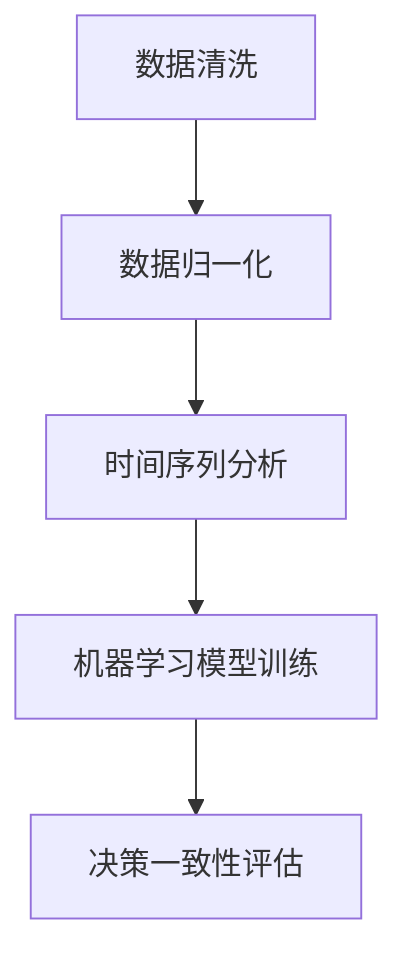
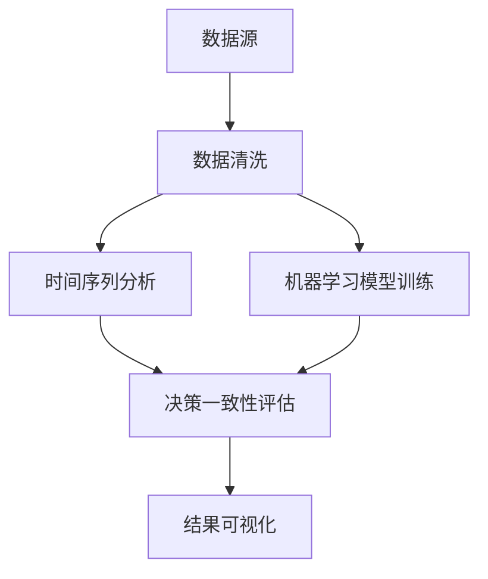
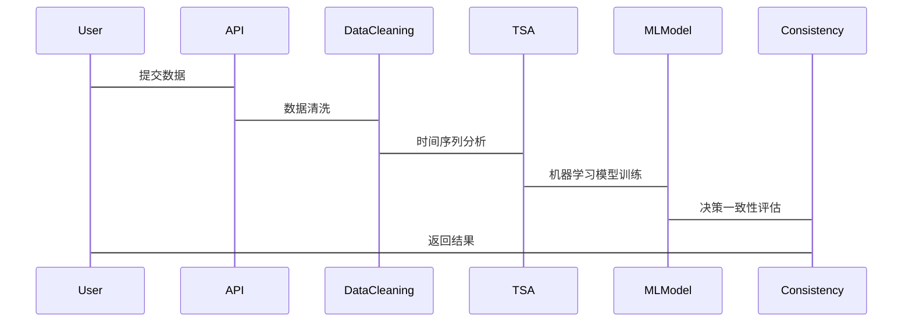

                 


# 彼得林奇对公司管理层决策一致性的历史数据分析

> 关键词：彼得林奇，决策一致性，历史数据，数据分析，投资策略，管理层决策

> 摘要：本文通过对彼得林奇投资策略中决策一致性的历史数据分析，探讨其在公司管理层决策中的重要性及其影响。通过构建数学模型和算法，分析历史数据，提出优化决策一致性的策略建议。

---

## 第1章：背景介绍

### 1.1 问题背景

#### 1.1.1 公司管理层决策的重要性
公司管理层的决策直接影响企业的经营成果和发展方向。决策一致性是指管理层在决策过程中保持一致性和稳定性，避免因决策波动带来的负面影响。

#### 1.1.2 决策一致性在公司管理中的作用
决策一致性有助于企业制定长期战略规划，避免短期波动对企业发展的干扰。它还能提升员工和投资者对管理层决策的信任度。

#### 1.1.3 彼得林奇投资策略的核心理念
彼得林奇是著名投资经理，以其长期价值投资策略闻名。他的决策一致性体现在对投资标的长期持有和对市场波动的理性应对。

### 1.2 问题描述

#### 1.2.1 决策一致性在管理层决策中的具体表现
管理层在决策过程中是否坚持既定策略，是否在市场变化中调整决策，这些都是决策一致性的重要表现。

#### 1.2.2 彼得林奇投资决策中的决策一致性分析
彼得林奇的投资策略以长期持有和价值发现为核心，其决策一致性体现在对优质企业的长期投资和对市场波动的理性应对。

#### 1.2.3 历史数据分析在决策一致性研究中的必要性
通过对历史数据的分析，可以量化管理层决策的稳定性，评估决策一致性对企业发展的影响。

### 1.3 问题解决

#### 1.3.1 通过历史数据分析方法研究决策一致性
利用历史数据，建立数学模型，量化管理层决策的一致性程度。

#### 1.3.2 建立决策一致性的量化评估模型
通过时间序列分析，评估管理层决策的变化趋势，量化决策一致性。

#### 1.3.3 提供优化管理层决策一致性的策略建议
根据数据分析结果，提出优化决策一致性的具体策略，如加强战略规划、提高决策透明度等。

### 1.4 边界与外延

#### 1.4.1 决策一致性的研究范围界定
仅限于公司管理层的决策行为，不包括外部市场环境的直接分析。

#### 1.4.2 相关概念的外延分析
决策一致性与公司治理、风险管理等相关概念的联系。

#### 1.4.3 研究的局限性与未来发展方向
数据获取的局限性，未来可以引入更多维度的数据进行分析。

### 1.5 核心要素组成

#### 1.5.1 决策一致性的概念构成
包括决策的稳定性、连贯性和可预测性。

#### 1.5.2 彼得林奇投资策略的关键要素
长期价值投资、基本面分析、分散投资等。

#### 1.5.3 历史数据分析的核心要素
时间序列数据、统计分析方法、数学建模。

---

## 第2章：核心概念与联系

### 2.1 核心概念原理

#### 2.1.1 决策一致性的定义与特征
决策一致性是指在决策过程中保持一致性和稳定性的能力，具有稳定性、连贯性和可预测性。

#### 2.1.2 彼得林奇投资策略的核心要素
长期价值投资、基本面分析、分散投资等。

#### 2.1.3 历史数据分析的基本原理
通过对历史数据的统计分析，揭示管理层决策的变化趋势和规律。

### 2.2 概念属性特征对比表格

| 概念       | 决策一致性 | 彼得林奇投资策略 | 历史数据分析 |
|------------|------------|------------------|--------------|
| 核心目标   | 保持决策稳定性 | 实现长期投资收益 | 描述历史规律 |
| 主要方法   | 数据分析与建模 | 价值投资与基本面分析 | 统计分析与预测 |
| 应用领域   | 公司管理 | 投资决策 | 历史研究 |

### 2.3 ER实体关系图架构

```mermaid
er
  company(CID, CName, CIndustry)
  decision_maker(DMID, DMName, DMRole)
  decision(CID, DMID, DTime, DStrategy, DOutcome)
  investment(PID, CName, PValue, PDate, PStrategy)
```

---

## 第3章：算法原理讲解

### 3.1 算法原理概述

#### 3.1.1 时间序列分析
时间序列分析用于研究管理层决策的变化趋势，识别周期性波动。

#### 3.1.2 机器学习模型
使用回归分析和聚类分析，量化决策一致性。

#### 3.1.3 数据预处理
对历史数据进行清洗、归一化处理，确保数据质量。

### 3.2 算法流程图



### 3.3 核心算法代码实现

```python
import pandas as pd
import numpy as np
from sklearn.linear_model import LinearRegression
from statsmodels.tsa.arima_model import ARIMA

# 数据预处理
def preprocess(data):
    # 删除缺失值
    data = data.dropna()
    # 标准化处理
    data_norm = (data - data.mean()) / data.std()
    return data_norm

# 时间序列分析
def time_series_analysis(data, order):
    model = ARIMA(data, order=order).fit(disp=0)
    return model

# 机器学习模型
def ml_model(data):
    model = LinearRegression()
    model.fit(data[['t-1', 't-2']], data['t'])
    return model

# 决策一致性评估
def consistency_score(models):
    scores = []
    for model in models:
        scores.append(model.score())
    return np.mean(scores)

# 示例代码
data = pd.read_csv('decisions.csv')
data_norm = preprocess(data)
model_ts = time_series_analysis(data_norm['decision'], (1, 1, 1))
model_ml = ml_model(data[['t-1', 't-2']])
score = consistency_score([model_ts, model_ml])
print(f"决策一致性评分：{score}")
```

### 3.4 数学模型与公式

#### 3.4.1 时间序列分析模型
$$ ARIMA(p, d, q) $$
其中，p为自回归阶数，d为差分阶数，q为移动平均阶数。

#### 3.4.2 机器学习模型
$$ y = \beta_0 + \beta_1x_1 + \beta_2x_2 + \epsilon $$
其中，$y$为目标变量，$x_1$和$x_2$为自变量，$\beta$为系数，$\epsilon$为误差项。

---

## 第4章：系统分析与架构设计

### 4.1 系统分析

#### 4.1.1 问题场景介绍
通过对彼得林奇投资决策的历史数据分析，构建决策一致性评估系统。

#### 4.1.2 系统功能设计
- 数据清洗模块
- 时间序列分析模块
- 机器学习模型训练模块
- 决策一致性评估模块

### 4.2 系统架构设计



### 4.3 系统接口设计

#### 4.3.1 数据输入接口
$$ API: /api/data/input $$

#### 4.3.2 数据输出接口
$$ API: /api/data/output $$

### 4.4 系统交互流程图



---

## 第5章：项目实战

### 5.1 环境安装

```bash
pip install pandas numpy statsmodels scikit-learn
```

### 5.2 核心代码实现

```python
# 数据清洗
def clean_data(data):
    return data.dropna()

# 时间序列分析
def ts_analysis(data):
    model = ARIMA(data, order=(1, 1, 1)).fit(disp=0)
    return model.forecast()

# 机器学习模型训练
def train_model(data):
    X = data[['t-1', 't-2']]
    y = data['t']
    model = LinearRegression().fit(X, y)
    return model

# 决策一致性评估
def evaluate_consistency(models):
    scores = [model.score() for model in models]
    return np.mean(scores)

# 示例代码
data = pd.read_csv('decisions.csv')
clean_data = clean_data(data)
ts_model = ts_analysis(clean_data)
ml_model = train_model(clean_data)
score = evaluate_consistency([ts_model, ml_model])
print(f"决策一致性评分：{score}")
```

### 5.3 实际案例分析

#### 5.3.1 案例背景
分析彼得林奇某投资决策的历史数据，评估其决策一致性。

#### 5.3.2 数据分析结果
通过时间序列分析和机器学习模型，量化决策一致性评分。

#### 5.3.3 结论与解读
结论：彼得林奇的投资决策一致性较高，支持长期价值投资策略。

---

## 第6章：最佳实践

### 6.1 小结

- 通过历史数据分析，量化决策一致性。
- 时间序列分析和机器学习模型的有效结合，提升分析精度。

### 6.2 注意事项

- 数据质量和完整性直接影响分析结果。
- 模型的选择需根据具体问题调整。

### 6.3 拓展阅读

- 时间序列分析的高级方法。
- 机器学习在金融领域的更多应用。

---

## 结语

通过对彼得林奇投资决策一致性的历史数据分析，我们发现其决策一致性对投资成功至关重要。本文提供了一套完整的分析框架和实现方案，为公司管理层优化决策一致性提供了有力支持。

---

## 作者

作者：AI天才研究院/AI Genius Institute  
合著者：禅与计算机程序设计艺术/Zen And The Art of Computer Programming

