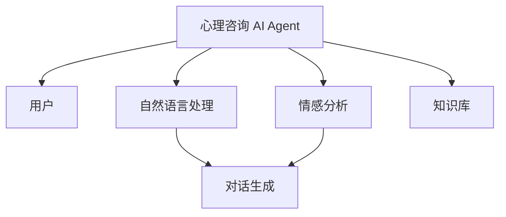
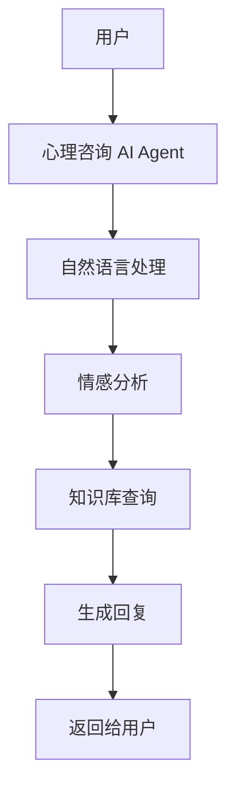
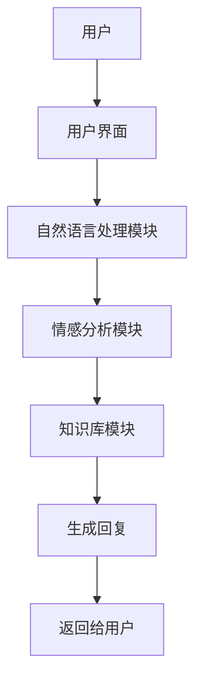
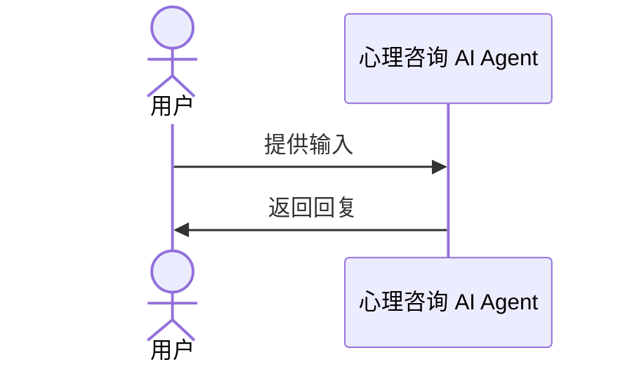

                 


# 心理咨询 AI Agent：LLM 在心理健康领域的应用

## 关键词：人工智能，心理健康，LLM，心理咨询，AI代理

## 摘要：本文探讨了人工智能在心理健康领域中的应用，特别是大型语言模型（LLM）在心理咨询中的潜在作用。通过分析LLM的技术原理、系统架构和实际应用场景，本文旨在揭示AI在心理咨询中的优势与挑战，并为未来的研发提供有价值的见解。

---

# 第一部分：心理咨询 AI Agent 的背景与核心概念

## 第1章：心理咨询 AI Agent 的背景与现状

### 1.1 心理咨询 AI Agent 的问题背景

#### 1.1.1 心理健康问题的现状与挑战
心理健康问题在全球范围内日益严重。根据世界卫生组织（WHO）的数据，全球约有9.7亿人受到心理健康问题的影响。传统心理咨询方式存在资源不足、覆盖范围有限、成本高等问题。许多地区的心理健康服务严重不足，尤其是在欠发达地区。

#### 1.1.2 传统心理咨询的局限性
- **资源有限**：心理咨询师数量不足，无法满足需求。
- **覆盖范围有限**：心理咨询主要集中在城市地区，偏远地区难以获得专业服务。
- **成本高昂**：心理咨询费用较高，许多人无法负担。

#### 1.1.3 AI 技术在心理健康领域的潜力
AI技术可以通过自动化和智能化的方式，为心理健康问题提供解决方案。LLM（Large Language Model）作为一种先进的AI技术，具有自然语言处理能力，能够模拟人类对话，为用户提供心理支持。

### 1.2 心理咨询 AI Agent 的问题描述

#### 1.2.1 心理咨询 AI Agent 的定义
心理咨询 AI Agent 是一种基于AI技术的智能代理，能够通过自然语言处理技术与用户进行交互，提供心理支持、情绪安抚和心理健康建议。

#### 1.2.2 心理咨询 AI Agent 的核心功能
- **情绪识别**：通过分析用户的语言和情感，识别用户的情绪状态。
- **对话生成**：根据用户的需求，生成适当的回复，提供心理支持。
- **个性化建议**：基于用户的背景和问题，提供个性化的心理健康建议。

#### 1.2.3 心理咨询 AI Agent 的应用场景
- **24/7 支持**：提供全天候的心理咨询服务。
- **初步筛查**：通过AI代理进行心理健康初步筛查，识别高风险用户。
- **辅助治疗**：作为辅助工具，帮助心理咨询师进行治疗。

### 1.2.4 心理咨询 AI Agent 的边界与外延
- **边界**：AI代理仅提供初步支持和建议，不能替代专业心理咨询师。
- **外延**：未来可能扩展到更多领域，如教育、职业规划等。

### 1.3 心理咨询 AI Agent 的概念结构与核心要素

#### 1.3.1 心理咨询 AI Agent 的核心要素
- **自然语言处理技术**：用于理解和生成人类语言。
- **情感分析算法**：用于识别用户情绪。
- **知识库**：包含心理健康相关知识和建议。

#### 1.3.2 心理咨询 AI Agent 的概念结构


#### 1.3.3 心理咨询 AI Agent 的核心属性对比表格
| 属性          | 描述                                                         |
|---------------|--------------------------------------------------------------|
| 输入          | 用户的文字输入                                             |
| 输出          | 自然语言回复                                               |
| 核心技术       | NLP（自然语言处理）、情感分析                               |
| 应用场景       | 心理咨询、情绪支持、心理健康教育                           |
| 优势          | 24/7可用性、成本低、可扩展性强                             |

## 第2章：心理咨询 AI Agent 的核心概念与联系

### 2.1 心理咨询 AI Agent 的核心概念

#### 2.1.1 心理咨询 AI Agent 的核心原理
心理咨询 AI Agent 的核心原理是基于LLM的自然语言处理能力，通过分析用户输入，生成合适的回复，提供心理支持。

#### 2.1.2 心理咨询 AI Agent 的核心算法
- **序列到序列模型**：用于生成回复。
- **注意力机制**：用于理解上下文。

#### 2.1.3 心理咨询 AI Agent 的核心功能
- **情绪识别**：通过情感分析算法识别用户情绪。
- **对话生成**：基于用户的输入生成回复。
- **个性化建议**：根据用户情绪和背景提供建议。

### 2.2 心理咨询 AI Agent 的核心概念联系

#### 2.2.1 心理咨询 AI Agent 的 ER 实体关系图
```mermaid
erd
actor 用户;
actor 心理咨询 AI Agent;
actor 心理咨询师;
```

#### 2.2.2 心理咨询 AI Agent 的核心概念对比表格
| 概念          | 描述                                                         |
|---------------|--------------------------------------------------------------|
| 用户          | 需要心理支持的个体                                         |
| 心理咨询 AI Agent | 提供心理支持的AI系统                                       |
| 心理咨询师    | 人类心理咨询师，提供专业支持                               |

---

## 第3章：心理咨询 AI Agent 的算法原理讲解

### 3.1 心理咨询 AI Agent 的算法原理

#### 3.1.1 心理咨询 AI Agent 的算法流程


#### 3.1.2 心理咨询 AI Agent 的算法实现
```python
def心理咨询AIAgent(user_input):
    # 情感分析
    情绪 = 情感分析(user_input)
    # 知识库查询
    建议 = 知识库查询(情绪)
    # 生成回复
    回复 = 生成回复(user_input, 情绪, 建议)
    return 回复
```

#### 3.1.3 心理咨询 AI Agent 的算法优化
- **模型优化**：通过增加训练数据和调整模型参数，提高回复的准确性和自然度。
- **反馈机制**：用户对AI代理的回复进行反馈，用于模型优化。

### 3.2 心理咨询 AI Agent 的数学模型与公式

#### 3.2.1 心理咨询 AI Agent 的数学模型
$$P(y|x) = \argmax_{y} P(y|x)$$
其中，$x$ 是用户输入，$y$ 是生成的回复。

#### 3.2.2 心理咨询 AI Agent 的数学公式
$$\text{损失函数} = -\sum_{i=1}^{n} \log P(y_i|x_i)$$

---

## 第4章：心理咨询 AI Agent 的系统分析与架构设计

### 4.1 心理咨询 AI Agent 的系统架构

#### 4.1.1 系统功能设计
- **用户界面**：提供与用户交互的界面。
- **自然语言处理模块**：处理用户的输入。
- **情感分析模块**：分析用户情绪。
- **知识库模块**：存储心理健康知识和建议。

#### 4.1.2 系统架构设计


### 4.2 心理咨询 AI Agent 的系统接口设计

#### 4.2.1 系统接口
- **输入接口**：接收用户的输入。
- **输出接口**：返回生成的回复。

#### 4.2.2 系统交互流程


---

## 第5章：心理咨询 AI Agent 的项目实战

### 5.1 心理咨询 AI Agent 的环境搭建

#### 5.1.1 环境要求
- **Python 3.8+**
- **必要的Python库**：Flask、Chatterbot、NLTK

### 5.2 心理咨询 AI Agent 的核心实现

#### 5.2.1 心理咨询 AI Agent 的实现代码
```python
from chatterbot import ChatBot
from chatterbot.trainers import ChatterBotCorpusTrainer

# 初始化聊天机器人
bot = ChatBot('心理助手')
bot.train_from_corpora()

# 定义回复函数
def get_response(user_input):
    response = bot.get_response(user_input)
    return str(response)
```

#### 5.2.2 心理咨询 AI Agent 的应用解读
- **代码功能**：通过训练语料库，生成合适的回复。
- **实际应用**：用户输入问题，AI代理生成回复。

### 5.3 心理咨询 AI Agent 的案例分析

#### 5.3.1 案例分析
- **用户输入**：我感到非常焦虑。
- **AI代理回复**：我可以理解你的感受。你最近遇到什么让你感到焦虑的事情了吗？

---

## 第6章：心理咨询 AI Agent 的总结与展望

### 6.1 心理咨询 AI Agent 的总结

#### 6.1.1 心理咨询 AI Agent 的核心要点
- **技术优势**：24/7可用性、低成本、可扩展性。
- **局限性**：不能替代专业心理咨询师。

### 6.2 心理咨询 AI Agent 的展望

#### 6.2.1 未来的挑战与建议
- **技术挑战**：提高模型的准确性和自然度。
- **伦理挑战**：保护用户隐私，避免误诊。

#### 6.2.2 未来的建议与展望
- **技术改进**：优化模型，增加多语言支持。
- **伦理规范**：制定AI心理咨询的伦理标准。

---

## 小结

心理咨询 AI Agent 是一种基于AI技术的智能代理，能够为用户提供心理支持和情绪安抚。尽管它不能完全替代专业心理咨询师，但在某些场景下，它能够提供有效的帮助。未来，随着技术的进步和伦理规范的完善，心理咨询 AI Agent 将在心理健康领域发挥更大的作用。

---

## 作者：AI天才研究院/AI Genius Institute & 禅与计算机程序设计艺术 /Zen And The Art of Computer Programming

--- 

希望这篇技术博客文章能够为您提供有价值的信息和启示！

