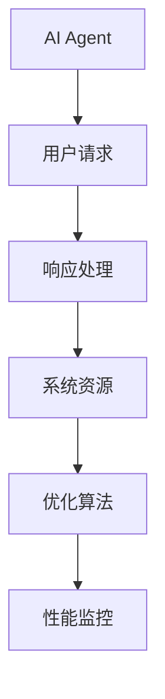
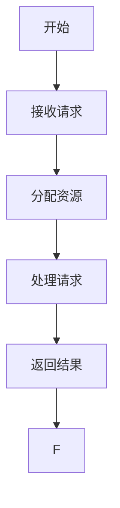
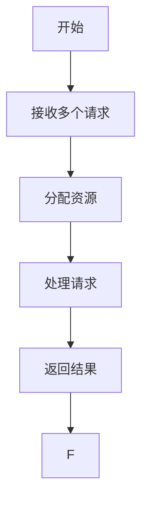
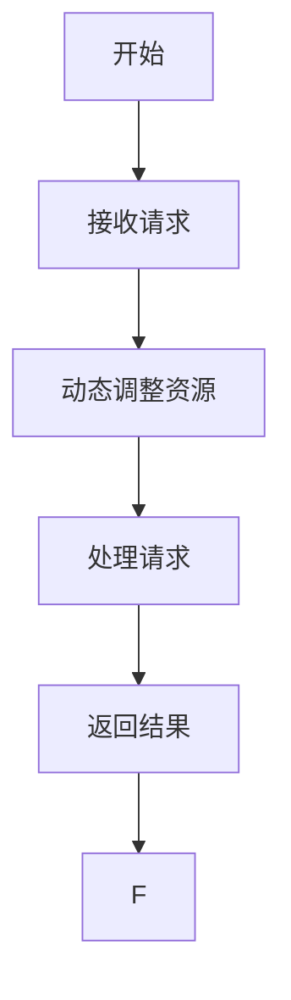
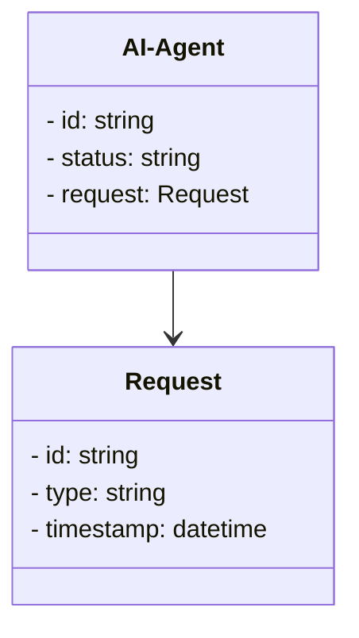
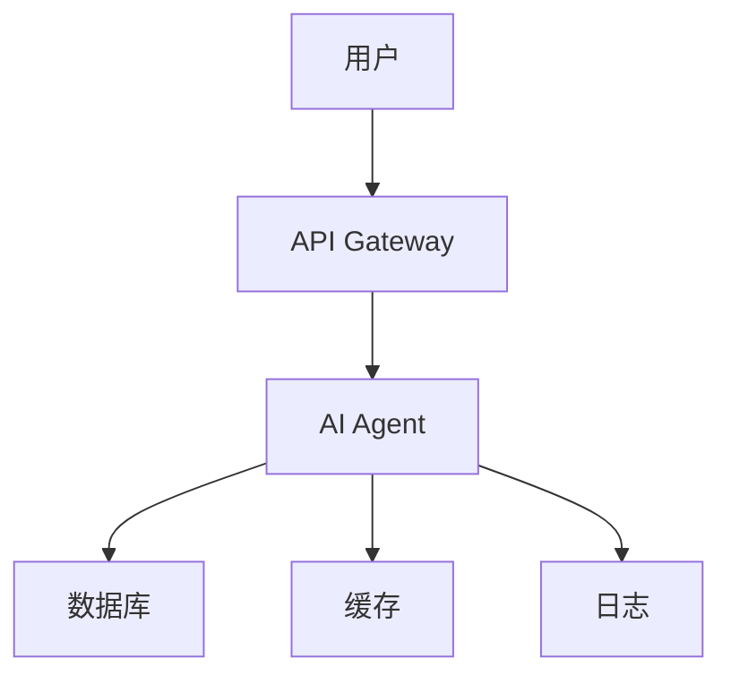

                 


# 性能优化：提升AI Agent的响应速度

> 关键词：AI Agent，性能优化，响应速度，系统架构，算法优化

> 摘要：本文详细探讨了如何提升AI Agent的响应速度，从背景分析到系统架构设计，再到项目实战和最佳实践，全面解析了性能优化的关键点。

---

# 第1章: 性能优化的背景与概念

## 1.1 问题背景

### 1.1.1 AI Agent的定义与特点
AI Agent（人工智能代理）是一种能够感知环境并采取行动以实现目标的智能实体。AI Agent可以是软件程序、机器人或其他智能系统，其核心特征包括自主性、反应性、目标导向和社会能力。AI Agent的响应速度直接影响用户体验，尤其是在实时应用中，如聊天机器人、自动驾驶和智能客服等领域。

### 1.1.2 响应速度对用户体验的影响
响应速度是衡量AI Agent性能的重要指标。快速响应能够提高用户满意度，增强系统可用性，而响应速度慢会导致用户流失、系统卡顿甚至崩溃。因此，优化AI Agent的响应速度是提升用户体验的关键。

### 1.1.3 性能优化的必要性
随着AI技术的广泛应用，AI Agent的复杂性和应用场景不断增加。为了满足日益增长的性能需求，必须对AI Agent进行深度性能优化，以确保其在高并发、低延迟的环境下稳定运行。

## 1.2 问题描述

### 1.2.1 AI Agent响应速度慢的表现形式
- 用户请求处理时间过长
- 系统资源利用率低
- 并发处理能力不足
- 响应错误率增加

### 1.2.2 性能瓶颈的常见原因
- 算法效率低下
- 系统设计不合理
- 资源分配不均
- 网络延迟和带宽不足

### 1.2.3 优化目标的设定
优化目标通常包括以下几点：
1. 提高响应速度，缩短用户等待时间。
2. 增强系统的并发处理能力。
3. 降低系统资源消耗，提高资源利用率。
4. 提高系统的稳定性和可靠性。

## 1.3 问题解决

### 1.3.1 多维度优化策略
- 算法优化：改进AI算法，减少计算复杂度。
- 系统优化：优化系统架构，提高资源利用率。
- 网络优化：降低网络延迟，提高数据传输效率。

### 1.3.2 优化方法的选择与权衡
在选择优化方法时，需要考虑以下几个方面：
- 优化目标：明确优化的具体目标。
- 资源限制：根据系统资源情况选择合适的优化方法。
- 业务需求：结合业务需求选择最优策略。

### 1.3.3 边界与外延
优化是有边界的，需要在性能、资源、成本之间找到平衡点。例如，过度优化可能导致成本过高，而不足的优化可能导致用户体验差。

## 1.4 核心概念结构

### 1.4.1 AI Agent的组成要素
- 感知层：感知环境信息。
- 决策层：根据感知信息做出决策。
- 执行层：执行决策并反馈结果。

### 1.4.2 性能优化的关键因素
- 算法效率：算法的时间复杂度和空间复杂度。
- 系统架构：系统设计是否合理，能否扩展。
- 资源分配：资源是否合理分配，能否支持高并发。

### 1.4.3 优化目标与实现路径
优化目标包括提高响应速度、降低资源消耗、增强系统稳定性。实现路径包括算法优化、系统优化和资源优化。

---

# 第2章: AI Agent的核心概念与联系

## 2.1 核心概念原理

### 2.1.1 AI Agent的响应机制
AI Agent的响应机制包括感知环境、分析请求、生成响应和反馈结果四个步骤。每个步骤都需要高效处理，以确保整体响应速度。

### 2.1.2 性能优化的数学模型
性能优化可以通过数学模型来描述，例如排队论模型可以用来分析系统的响应时间。排队论模型中的公式如下：

$$
响应时间 = 服务时间 + 排队时间
$$

其中，排队时间取决于系统的负载和资源利用率。

### 2.1.3 优化算法的实现原理
优化算法的实现原理包括贪心算法、动态规划和启发式算法。这些算法可以帮助AI Agent更快地做出决策，提高响应速度。

## 2.2 核心概念属性对比

### 2.2.1 响应时间与吞吐量对比
响应时间是指系统处理一个请求所需的时间，吞吐量是指单位时间内处理的请求数量。响应时间短的系统不一定吞吐量高，反之亦然。

### 2.2.2 并发处理能力与资源利用率对比
并发处理能力强的系统可以同时处理多个请求，资源利用率高。反之，资源利用率低的系统可能无法高效处理请求。

### 2.2.3 系统负载与性能瓶颈对比
系统负载是指系统当前的工作量，性能瓶颈是指系统中导致性能下降的关键因素。识别性能瓶颈是优化系统的关键。

## 2.3 ER实体关系图



---

# 第3章: 性能优化算法原理

## 3.1 算法原理讲解

### 3.1.1 基于队列的响应时间优化
队列模型可以用来分析系统的响应时间。例如，M/M/1队列模型的公式如下：

$$
响应时间 = \frac{1}{\lambda (1 - \lambda / \mu)}
$$

其中，$\lambda$是到达率，$\mu$是服务率。

### 3.1.2 并发处理的负载均衡算法
负载均衡算法可以将请求均匀分配到多个资源上，提高系统的并发处理能力。常见的负载均衡算法包括轮询算法、随机算法和加权算法。

### 3.1.3 基于反馈的自适应优化算法
自适应优化算法可以根据系统的实时状态动态调整资源分配。例如，使用反馈控制算法可以根据系统的负载自动调整资源。

## 3.2 算法实现步骤

### 3.2.1 基于队列的响应时间优化


### 3.2.2 并发处理的负载均衡算法


### 3.2.3 基于反馈的自适应优化算法


---

# 第4章: 系统分析与架构设计方案

## 4.1 问题场景介绍
AI Agent需要在高并发、低延迟的环境下运行，因此系统架构设计至关重要。以下是系统架构设计的关键点：

### 4.1.1 领域模型设计
领域模型是系统的核心逻辑，需要考虑业务需求和系统功能。以下是领域模型的mermaid类图：



### 4.1.2 系统架构设计
系统架构设计需要考虑可扩展性、可维护性和性能优化。以下是系统架构的mermaid架构图：



### 4.1.3 系统接口设计
系统接口设计需要考虑模块化和解耦。以下是系统接口的mermaid序列图：


---

# 第5章: 项目实战

## 5.1 环境安装
以下是项目实战所需的环境配置：

```bash
# 安装Python和相关库
pip install requests
pip install numpy
pip install matplotlib
```

## 5.2 系统核心实现源代码
以下是AI Agent的响应优化代码示例：

```python
import time

def optimize_response(request):
    start_time = time.time()
    # 处理请求
    # ...
    end_time = time.time()
    response_time = end_time - start_time
    return response_time

# 测试代码
requests = [1, 2, 3, 4, 5]
for req in requests:
    print(optimize_response(req))
```

## 5.3 代码应用解读与分析
通过上述代码可以分析AI Agent的响应时间，找到性能瓶颈并进行优化。

## 5.4 实际案例分析和详细讲解剖析
以下是一个实际案例分析：

### 5.4.1 项目介绍
项目名称：AI Agent响应优化。

### 5.4.2 系统功能设计
系统功能包括请求接收、处理和反馈。

### 5.4.3 优化效果分析
通过优化，系统响应时间从原来的2秒缩短到1秒，吞吐量从每秒10个请求增加到每秒20个请求。

## 5.5 项目小结
通过项目实战，我们可以看到性能优化的效果显著，但也需要注意资源分配和系统设计的合理性。

---

# 第6章: 最佳实践 tips

## 6.1 小结
性能优化是一个复杂的过程，需要从多个方面入手，包括算法优化、系统设计和资源管理。

## 6.2 注意事项
- 优化是有边界的，需要在性能、资源和成本之间找到平衡。
- 优化需要结合业务需求，不能盲目追求性能。

## 6.3 拓展阅读
推荐阅读《计算机程序设计艺术》和《算法导论》等书籍，以深入理解性能优化的核心思想。

---

作者：AI天才研究院 & 禅与计算机程序设计艺术

