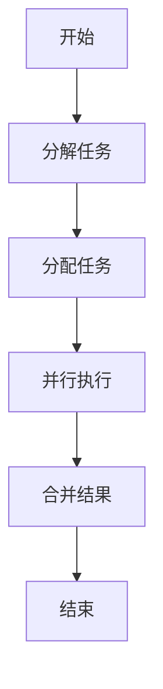
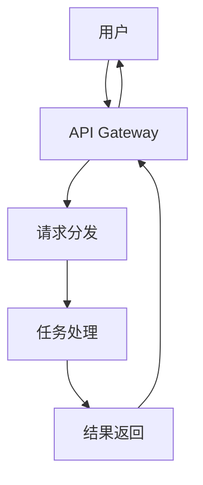

                 


# 性能优化：提高AI Agent的响应速度

> 关键词：性能优化，AI Agent，响应速度，算法优化，系统架构，并行计算

> 摘要：本文将深入探讨如何提高AI Agent的响应速度，从基础概念到算法优化，再到系统架构设计，结合实际案例分析，为读者提供一套系统化的性能优化方案。通过本文，读者将能够理解AI Agent性能优化的核心原理，并掌握实际应用中的优化技巧。

---

## 第1章: AI Agent与性能优化概述

### 1.1 AI Agent的基本概念

#### 1.1.1 AI Agent的定义与类型

AI Agent（人工智能代理）是指能够感知环境并采取行动以实现目标的智能实体。AI Agent可以是软件程序、机器人或其他智能系统，其核心目标是通过自主决策和行动来完成特定任务。

AI Agent可以分为以下几种类型：

- **反应式AI Agent**：基于当前感知做出实时反应，适用于需要快速响应的场景。
- **认知式AI Agent**：具备推理、规划和学习能力，能够处理复杂任务。
- **混合式AI Agent**：结合反应式和认知式的特点，适用于复杂动态环境。

#### 1.1.2 AI Agent的核心功能与特点

AI Agent的核心功能包括：

- **感知环境**：通过传感器或其他输入方式获取环境信息。
- **决策与推理**：基于感知信息进行分析和决策。
- **执行动作**：根据决策结果执行实际操作。
- **学习与适应**：通过经验改进性能。

AI Agent的特点包括：

- **自主性**：能够在没有外部干预的情况下自主运行。
- **反应性**：能够实时感知并快速响应。
- **智能性**：具备一定的推理和学习能力。

#### 1.1.3 性能优化在AI Agent中的重要性

性能优化是提升AI Agent响应速度和效率的关键。在实际应用中，AI Agent需要处理大量数据并快速做出决策，性能优化能够显著提升用户体验和系统效率。

---

### 1.2 性能优化的基本概念

#### 1.2.1 性能优化的定义

性能优化是指通过技术手段减少资源消耗、提高系统效率的过程。在AI Agent中，性能优化主要关注响应速度、资源利用率和处理效率的提升。

#### 1.2.2 响应速度的衡量标准

响应速度是衡量AI Agent性能的重要指标，通常包括以下方面：

- **响应时间**：从用户发起请求到系统返回结果的时间。
- **吞吐量**：单位时间内处理的请求数量。
- **延迟**：系统处理请求的延迟时间。

#### 1.2.3 性能优化的目标与边界

性能优化的目标是通过技术手段提升系统性能，但需在合理范围内进行优化，避免过度优化导致资源浪费。优化的边界包括：

- **资源限制**：在现有硬件资源条件下进行优化。
- **业务需求**：根据实际业务需求确定优化目标。
- **用户体验**：优化需以提升用户体验为核心。

---

### 1.3 AI Agent性能优化的背景与挑战

#### 1.3.1 当前AI Agent的应用场景

AI Agent广泛应用于以下场景：

- **智能客服**：通过自然语言处理技术为用户提供服务。
- **自动驾驶**：实时感知环境并做出驾驶决策。
- **智能家居**：通过物联网技术实现设备联动。

#### 1.3.2 性能优化的必要性

随着AI Agent应用的普及，性能优化的必要性日益凸显。快速响应是提升用户体验的关键，而复杂的计算任务可能导致系统性能下降。

#### 1.3.3 常见的性能瓶颈与挑战

AI Agent性能优化面临的挑战包括：

- **计算资源限制**：计算任务复杂度高，资源消耗大。
- **数据处理延迟**：大量数据处理导致响应速度下降。
- **算法效率**：算法复杂度过高影响性能。

---

## 第2章: AI Agent性能优化的核心概念

### 2.1 性能优化的核心原理

#### 2.1.1 计算效率的提升方法

提升计算效率的方法包括：

- **并行计算**：将任务分解为多个子任务，同时执行以提高效率。
- **缓存优化**：通过缓存减少重复计算。
- **算法优化**：选择复杂度更低的算法。

#### 2.1.2 数据处理的优化策略

数据处理优化策略包括：

- **数据压缩**：减少数据传输和存储的体积。
- **数据分区**：将数据分片处理，提高并行效率。
- **增量处理**：仅处理变化部分，减少计算量。

#### 2.1.3 并行与异步处理机制

并行与异步处理是提升性能的重要手段：

- **并行处理**：利用多核处理器同时执行多个任务。
- **异步处理**：通过非阻塞方式处理请求，提高系统吞吐量。

---

### 2.2 核心概念对比表

| 概念 | 描述 | 示例 |
|------|------|------|
| 响应时间 | 系统处理请求所需的时间 | API调用时间 |
| 并行处理 | 多个任务同时执行 | 多线程处理 |
| 异步处理 | 任务非阻塞执行 | 非阻塞网络请求 |

---

### 2.3 ER实体关系图

```mermaid
er
actor(AI Agent)
  name:名称
  action:操作
  response:响应
```

---

### 2.4 算法优化代码实现

以下是一个简单的并行计算示例：

```python
import concurrent.futures

def compute(n):
    return n * n

numbers = [1, 2, 3, 4, 5]

with concurrent.futures.ThreadPoolExecutor() as executor:
    futures = [executor.submit(compute, num) for num in numbers]
    results = [future.result() for future in concurrent.futures.wait(futures)]
    print(results)
```

---

## 第3章: AI Agent性能优化的算法原理

### 3.1 基础算法优化

#### 3.1.1 算法复杂度分析

算法复杂度分析是优化算法的基础。常见的复杂度包括：

- **时间复杂度**：$T(n) = O(n \log n)$
- **空间复杂度**：$S(n) = O(n)$

#### 3.1.2 算法优化策略

优化策略包括：

- **选择复杂度更低的算法**：例如，使用二分查找代替线性查找。
- **减少不必要的计算**：例如，提前终止不必要的循环。

---

### 3.2 并行与分布式计算

#### 3.2.1 并行计算流程图



#### 3.2.2 分布式计算的实现

分布式计算通过将任务分配到多个节点上执行，提升计算能力。例如：

```python
import concurrent.futures

def distributed_compute(task):
    return task ** 2

tasks = [1, 2, 3, 4, 5]

with concurrent.futures.ProcessPoolExecutor() as executor:
    futures = [executor.submit(distributed_compute, task) for task in tasks]
    results = [future.result() for future in concurrent.futures.wait(futures)]
    print(results)
```

---

## 第4章: 系统架构设计与优化

### 4.1 系统分析与设计

#### 4.1.1 问题场景介绍

假设我们有一个AI Agent用于实时处理用户查询，系统需要快速响应并返回结果。常见问题是处理大量请求导致响应时间增加。

#### 4.1.2 系统功能设计

系统功能包括：

- **用户请求接收**：通过API接收用户请求。
- **任务处理**：解析请求并执行相应的操作。
- **结果返回**：将处理结果返回给用户。

---

### 4.2 系统架构设计

#### 4.2.1 系统架构图



#### 4.2.2 系统优化策略

优化策略包括：

- **负载均衡**：通过负载均衡分发请求，避免单点过载。
- **缓存机制**：缓存常用数据，减少重复计算。

---

## 第5章: 项目实战

### 5.1 环境搭建

#### 5.1.1 安装依赖

```bash
pip install concurrent.futures
```

---

### 5.2 核心实现

#### 5.2.1 并行处理代码

```python
import concurrent.futures

def process_request(request):
    # 处理请求的逻辑
    return f"Response: {request}"

requests = ["Search", "Calculate", "Predict"]

with concurrent.futures.ThreadPoolExecutor() as executor:
    futures = {executor.submit(process_request, request): request for request in requests}
    for future in concurrent.futures.as_completed(futures):
        print(future.result())
```

---

### 5.3 案例分析

#### 5.3.1 原始实现

```python
def process_request(request):
    # 模拟处理逻辑
    import time
    time.sleep(1)
    return f"Response: {request}"

requests = ["Search", "Calculate", "Predict"]

for request in requests:
    print(process_request(request))
```

#### 5.3.2 并行优化后实现

```python
import concurrent.futures

def process_request(request):
    # 模拟处理逻辑
    import time
    time.sleep(1)
    return f"Response: {request}"

requests = ["Search", "Calculate", "Predict"]

with concurrent.futures.ThreadPoolExecutor() as executor:
    futures = [executor.submit(process_request, request) for request in requests]
    for future in concurrent.futures.wait(futures):
        print(future.result())
```

---

## 第6章: 总结与展望

### 6.1 总结

本文详细探讨了如何提高AI Agent的响应速度，从基础概念到算法优化，再到系统架构设计，结合实际案例分析，为读者提供了一套系统化的性能优化方案。

### 6.2 展望

未来，随着AI技术的不断发展，AI Agent的性能优化将更加重要。我们需要继续探索新的优化方法和技术，以应对更复杂的挑战。

---

## 作者信息

作者：AI天才研究院/AI Genius Institute & 禅与计算机程序设计艺术 /Zen And The Art of Computer Programming

---

以上是《性能优化：提高AI Agent的响应速度》的技术博客文章的完整内容，涵盖从基础概念到实际应用的各个方面，帮助读者系统性地理解并掌握AI Agent性能优化的核心技术和实践方法。

