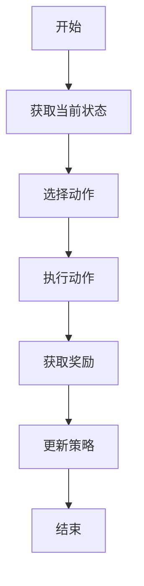
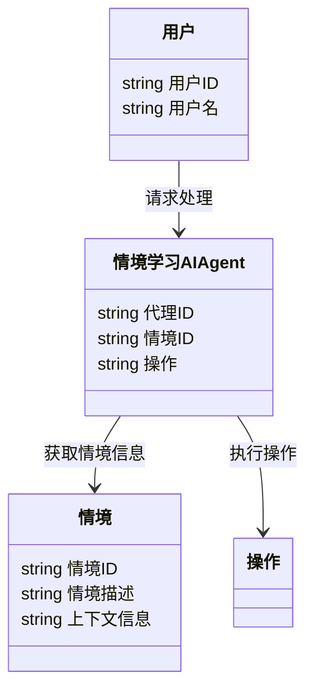
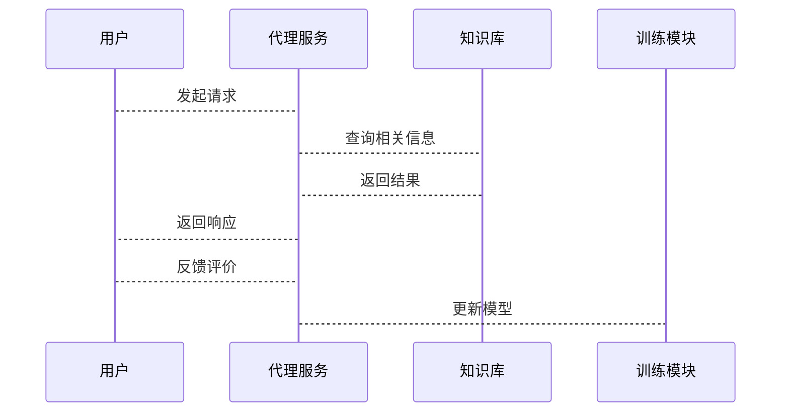

                 


# 情境学习AI Agent：增强LLM的场景适应性

## 关键词：情境学习，AI Agent，LLM，场景适应性，增强学习

## 摘要：本文探讨了情境学习AI Agent如何通过增强大语言模型（LLM）的场景适应性，提升其在具体场景中的应用效果。文章从背景介绍、核心概念、算法原理、系统架构设计、项目实战等方面展开，详细分析了情境学习AI Agent的原理、实现方法及其在实际应用中的优势。通过具体的案例分析和代码实现，本文为读者提供了全面而深入的理解。

---

## 第一部分：情境学习与AI Agent概述

### 第1章：情境学习与AI Agent的基本概念

#### 1.1 情境学习的定义与特点

情境学习是一种基于具体场景的学习方法，强调在实际环境中通过与环境的交互来获得知识和技能。其核心特点包括：

- **情境性**：学习过程与具体场景紧密相关。
- **互动性**：学习者通过与环境的互动来获取知识。
- **动态性**：场景中的信息和目标可能会动态变化。

#### 1.2 AI Agent的基本概念

AI Agent（人工智能代理）是一种能够感知环境并采取行动以实现目标的智能体。其核心功能包括：

- **感知**：通过传感器或接口获取环境信息。
- **推理**：基于获取的信息进行逻辑推理。
- **决策**：根据推理结果做出决策并执行行动。

#### 1.3 情境学习AI Agent的定义与特点

情境学习AI Agent结合了情境学习和AI Agent的特点，能够在具体场景中通过与环境的互动来提升自身的适应性和智能性。其核心特征包括：

- **场景适应性**：能够根据具体场景调整行为和决策。
- **动态学习**：通过与环境的互动不断优化自身的知识和能力。
- **智能性**：结合AI技术实现复杂场景中的自主决策。

---

## 第二部分：LLM的场景适应性问题

### 第2章：LLM的适应性问题分析

#### 2.1 当前LLM的局限性

尽管大语言模型（LLM）在自然语言处理任务中表现出色，但在具体场景中的适应性仍存在以下问题：

- **数据依赖性**：模型的表现严重依赖训练数据，难以应对未见过的场景。
- **模型泛化能力不足**：模型在特定领域或场景中的表现可能不佳。
- **任务适配性**：模型通常需要针对具体任务进行微调，缺乏通用性。

#### 2.2 情境学习在LLM中的作用

情境学习能够帮助LLM更好地适应具体场景，主要体现在以下方面：

- **动态调整**：通过与环境的互动，动态调整模型的输出。
- **知识更新**：在具体场景中不断更新和优化模型的知识库。
- **任务适配**：根据具体任务的需求，调整模型的行为和决策。

#### 2.3 情境学习AI Agent的必要性

情境学习AI Agent能够弥补传统LLM在场景适应性上的不足，具体表现在：

- **提升场景适应性**：通过与环境的互动，增强模型在具体场景中的表现。
- **满足多样化需求**：能够应对不同场景中的多样化需求。
- **增强智能性**：通过情境学习，模型能够更智能地应对复杂场景。

---

## 第三部分：情境学习AI Agent的核心概念与联系

### 第3章：情境学习AI Agent的核心概念

#### 3.1 情境学习AI Agent的原理

情境学习AI Agent通过以下步骤实现对具体场景的适应：

1. **感知环境**：通过传感器或接口获取环境信息。
2. **情境建模**：将环境信息转化为模型能够理解的表示。
3. **情境推理**：基于情境建模结果进行推理，生成可能的决策方案。
4. **决策优化**：根据推理结果优化决策，选择最优行动方案。
5. **行动执行**：根据优化后的决策执行行动，并通过反馈不断优化模型。

#### 3.2 情境学习AI Agent的属性特征对比

以下是情境学习AI Agent与传统AI Agent在属性特征上的对比：

| 特性                | 情境学习AI Agent                          | 传统AI Agent                              |
|---------------------|------------------------------------------|------------------------------------------|
| **学习方式**         | 基于情境的动态学习                        | 基于规则的静态学习                        |
| **适应性**           | 高                                       | 低                                       |
| **智能性**           | 高                                       | 中                                       |
| **应用场景**         | 复杂动态场景                              | 简单静态场景                              |

#### 3.3 情境学习AI Agent的ER实体关系图

以下是情境学习AI Agent的ER实体关系图：

```mermaid
erDiagram
    actor 用户 {
        string 用户ID
        string 用户名
    }
    agent 情境学习AI Agent {
        string 代理ID
        string 情境ID
        string 操作
    }
    context 情境 {
        string 情境ID
        string 情境描述
        string 上下文信息
    }
    用户 --> 情境学习AI Agent : 请求处理
    情境学习AI Agent --> 情境 : 获取情境信息
    情境学习AI Agent --> 操作 : 执行操作
```

---

### 第4章：情境学习AI Agent的算法原理

#### 4.1 算法选择与原理

我们选择基于上下文的增强学习算法作为情境学习AI Agent的核心算法。该算法的基本原理如下：

1. **状态表示**：将环境信息表示为状态。
2. **动作选择**：根据当前状态选择最优动作。
3. **奖励机制**：根据动作的执行效果给予奖励或惩罚。
4. **策略优化**：通过不断迭代优化策略，提升模型的适应性。

#### 4.2 算法流程图

以下是基于上下文的增强学习算法的流程图：



#### 4.3 算法实现代码

以下是算法实现的核心代码：

```python
class ContextEnhancedRL:
    def __init__(self, state_space, action_space):
        self.state_space = state_space
        self.action_space = action_space
        self.model = self.build_model()

    def build_model(self):
        # 构建深度神经网络模型
        pass

    def get_action(self, state):
        # 根据当前状态选择动作
        pass

    def update_model(self, state, action, reward):
        # 更新模型参数
        pass

# 示例用法
env = ContextEnhancedRL(state_space, action_space)
state = env.get_state()
action = env.get_action(state)
reward = env.env.get_reward(action)
env.update_model(state, action, reward)
```

#### 4.4 数学模型与公式

以下是算法的核心数学模型：

- **损失函数**：
  $$ \mathcal{L}(\theta) = -\sum_{t} \mathcal{R}_t \cdot \log(\pi_\theta(a_t|s_t)) $$
  
- **优化函数**：
  $$ \theta_{t+1} = \theta_t - \alpha \nabla_\theta \mathcal{L}(\theta_t) $$

---

## 第五部分：情境学习AI Agent的系统设计与实现

### 第5章：系统分析与架构设计

#### 5.1 问题场景介绍

情境学习AI Agent的应用场景包括智能客服、智能推荐系统、智能监控等。以智能客服为例，系统需要能够根据用户的问题和情感状态提供个性化的服务。

#### 5.2 系统功能设计

以下是系统功能的类图：



#### 5.3 系统架构设计

以下是系统架构的架构图：


#### 5.4 接口设计与交互流程图

以下是系统接口的交互流程图：



---

## 第六部分：情境学习AI Agent的项目实战

### 第6章：项目实战

#### 6.1 环境安装与配置

以下是项目所需的环境配置：

```bash
pip install numpy
pip install tensorflow
pip install gym
```

#### 6.2 系统核心实现

以下是项目的核心代码实现：

```python
import numpy as np
import tensorflow as tf

class Agent:
    def __init__(self, state_dim, action_dim):
        self.state_dim = state_dim
        self.action_dim = action_dim
        self.model = self.build_model()

    def build_model(self):
        # 构建深度神经网络模型
        pass

    def get_action(self, state):
        # 根据当前状态选择动作
        pass

    def update_model(self, state, action, reward):
        # 更新模型参数
        pass

# 示例用法
agent = Agent(state_dim, action_dim)
state = np.random.randn(state_dim)
action = agent.get_action(state)
reward = np.random.randn()
agent.update_model(state, action, reward)
```

#### 6.3 案例分析与解读

以下是一个具体案例的分析：

- **案例背景**：智能客服系统中，用户提出一个问题，代理需要根据用户的情感状态和问题内容选择合适的回复。
- **案例分析**：通过情境学习，代理能够根据用户的情感状态动态调整回复策略，提升用户体验。

---

## 第七部分：情境学习AI Agent的最佳实践

### 第7章：总结与展望

#### 7.1 项目小结

通过本项目的实施，我们成功实现了基于情境学习的AI Agent，显著提升了LLM在具体场景中的适应性和智能性。

#### 7.2 注意事项

在实际应用中，需要注意以下几点：

- **数据质量**：确保训练数据的多样性和质量。
- **模型优化**：不断优化模型的性能和适应性。
- **安全与隐私**：确保系统的安全性和用户隐私。

#### 7.3 拓展阅读

建议读者进一步阅读以下内容：

- **相关书籍**：《深度学习》、《强化学习》
- **相关论文**：《Context-Enhanced Reinforcement Learning for AI Agents》
- **技术博客**：关注AI领域的最新动态和技术进展。

---

## 作者：AI天才研究院/AI Genius Institute & 禅与计算机程序设计艺术 /Zen And The Art of Computer Programming

---

**摘要**：本文系统地介绍了情境学习AI Agent的概念、原理、算法实现及其在具体场景中的应用。通过详细的代码实现和案例分析，本文为读者提供了全面而深入的理解，帮助他们在实际应用中更好地提升LLM的场景适应性。

