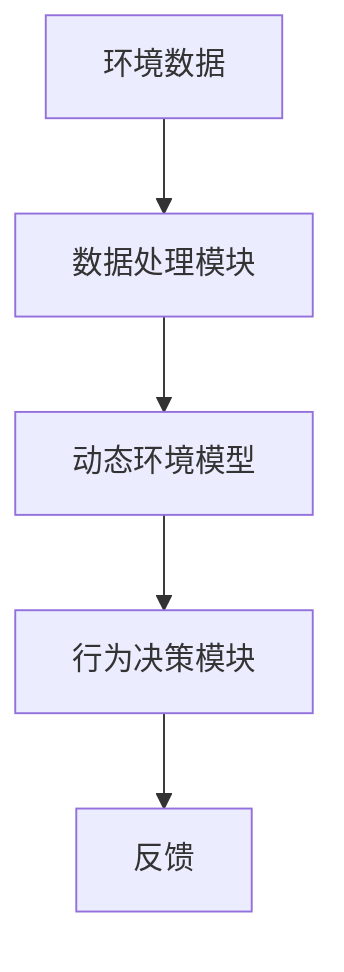
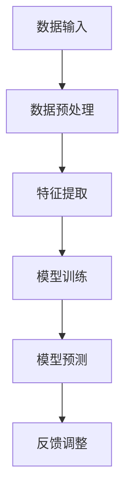
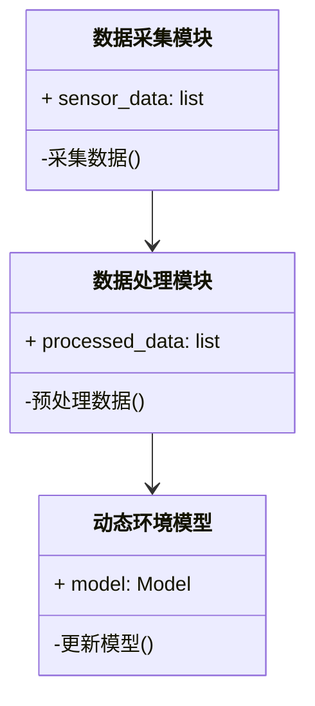
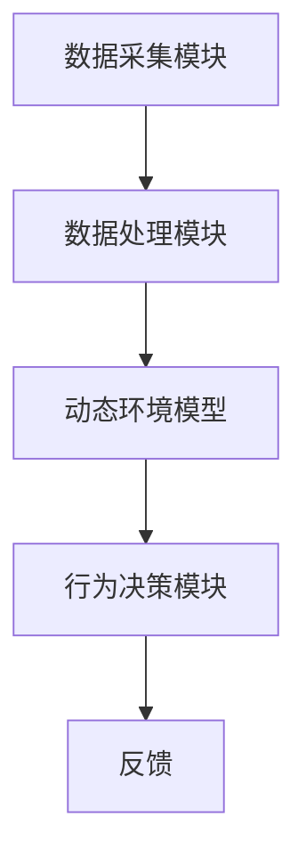
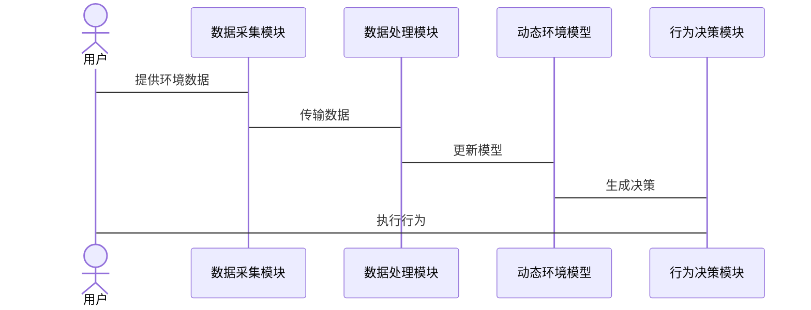

                 


# 情境感知AI Agent：增强LLM的环境适应能力

---

## 关键词  
情境感知、AI Agent、LLM、环境适应、多模态数据、实时反馈、动态建模  

---

## 摘要  
随着人工智能技术的快速发展，大语言模型（LLM）在各种应用场景中展现出强大的能力。然而，LLM在实际应用中往往面临环境适应性不足的问题。为了增强LLM的环境适应能力，情境感知AI Agent应运而生。本文从背景、原理、算法、系统架构、项目实战等多个方面详细探讨情境感知AI Agent的核心技术，分析其在实际应用中的优势，并结合具体案例，展示如何通过多模态数据处理、动态环境建模和实时反馈机制来提升LLM的环境适应能力。  

---

## 第一部分：背景与概念

### 第1章：情境感知AI Agent概述

#### 1.1 问题背景  
- 当前LLM在环境适应性方面存在局限性：  
  - 无法实时感知和理解动态变化的环境。  
  - 缺乏对多模态数据（如图像、语音、传感器数据）的处理能力。  
  - 无法根据环境反馈实时调整行为策略。  

#### 1.2 核心概念  
- **情境感知AI Agent**：通过多模态数据处理、动态环境建模和实时反馈机制，增强LLM的环境适应能力的智能体。  
- **多模态数据处理**：整合文本、图像、语音等多种数据源，提供更全面的环境理解。  
- **动态环境建模**：基于实时数据，构建动态环境模型，捕捉环境变化。  
- **实时反馈机制**：通过传感器或用户反馈实时调整行为策略。  

#### 1.3 技术特点  
| 特性 | 描述 |  
|------|------|  
| 多模态数据处理 | 支持文本、图像、语音等多种数据类型，提升环境理解能力。 |  
| 动态环境建模 | 实时更新环境模型，适应快速变化的环境。 |  
| 实时反馈机制 | 根据环境反馈动态调整行为，增强交互性。 |  

#### 1.4 应用场景  
- 智能家居：根据环境变化自动调节设备状态。  
- 智能客服：结合用户情绪和环境信息提供更精准的服务。  
- 智能驾驶：实时感知交通环境，辅助决策。  

#### 1.5 边界与外延  
- **边界**：专注于LLM的环境适应能力，不涉及底层硬件设计。  
- **外延**：可扩展至更多智能系统，如机器人、无人机等。  

---

## 第二部分：核心原理与算法

### 第2章：核心原理  

#### 2.1 数据处理  
- **多模态数据融合**：将文本、图像、语音等数据进行融合，提升环境理解能力。  
- **数据预处理**：清洗、归一化、特征提取。  

#### 2.2 动态环境建模  
- **模型构建**：基于多模态数据构建动态环境模型。  
- **模型更新**：实时更新模型，适应环境变化。  

#### 2.3 实时反馈机制  
- **反馈采集**：通过传感器或用户输入获取反馈。  
- **行为调整**：根据反馈动态调整行为策略。  

#### 2.4 对比分析  
| 对比项 | 情境感知AI Agent | 传统LLM |  
|--------|-------------------|----------|  
| 环境适应能力 | 强 | 弱 |  
| 数据处理能力 | 多模态 | 单模态 |  
| 实时性 | 高 | 低 |  

#### 2.5 ER实体关系图  


### 第3章：算法原理  

#### 3.1 算法流程  


#### 3.2 数据预处理  
```python
def preprocess_data(data):
    # 数据清洗
    cleaned_data = data.dropna()
    # 数据归一化
    normalized_data = (cleaned_data - cleaned_data.mean()) / cleaned_data.std()
    return normalized_data
```

#### 3.3 特征提取  
```python
import numpy as np

def extract_features(data):
    # 提取文本特征
    text_features = model.encode(data['text'])
    # 提取图像特征
    image_features = model.extract_features(data['image'])
    return np.concatenate([text_features, image_features], axis=1)
```

#### 3.4 模型训练  
- **损失函数**：  
  $$ L = \frac{1}{N}\sum_{i=1}^{N}(y_i - \hat{y}_i)^2 $$
- **优化器**：Adam优化器，学习率 $$ \alpha = 0.001 $$  

#### 3.5 优化策略  
- 使用动态权重分配，根据环境变化调整模型参数。  

#### 3.6 代码示例  
```python
def train_model(features, labels):
    model.compile(optimizer='adam', loss='mse')
    history = model.fit(features, labels, epochs=100, batch_size=32)
    return history
```

---

## 第三部分：系统分析与架构设计

### 第4章：系统架构  

#### 4.1 问题场景  
- 设备需要根据环境变化自动调整工作状态。  

#### 4.2 系统功能设计  
- 数据采集模块：收集多模态数据。  
- 数据处理模块：预处理和特征提取。  
- 模型训练模块：构建动态环境模型。  
- 行为决策模块：根据模型输出调整行为。  

#### 4.3 领域模型类图  


#### 4.4 系统架构图  


#### 4.5 接口设计  
- 数据采集模块提供API接口：`get_sensor_data()`  
- 行为决策模块提供API接口：`make_decision()`  

#### 4.6 交互流程图  


---

## 第四部分：项目实战

### 第5章：项目实战  

#### 5.1 环境安装  
- 安装Python和相关库：`pip install numpy pandas tensorflow keras`  

#### 5.2 核心代码实现  
```python
import numpy as np
import tensorflow as tf

class SituationAwareAgent:
    def __init__(self):
        self.model = self.build_model()
    
    def build_model(self):
        model = tf.keras.Sequential([
            tf.keras.layers.Dense(64, activation='relu'),
            tf.keras.layers.Dense(1)
        ])
        return model
    
    def preprocess_data(self, data):
        # 数据清洗和归一化
        cleaned_data = data.dropna()
        normalized_data = (cleaned_data - cleaned_data.mean()) / cleaned_data.std()
        return normalized_data
    
    def extract_features(self, data):
        # 提取文本和图像特征
        text_features = model.encode(data['text'])
        image_features = model.extract_features(data['image'])
        return np.concatenate([text_features, image_features], axis=1)
    
    def train(self, features, labels):
        self.model.compile(optimizer='adam', loss='mse')
        self.model.fit(features, labels, epochs=100, batch_size=32)
    
    def make_decision(self, input_data):
        processed_data = self.preprocess_data(input_data)
        features = self.extract_features(processed_data)
        prediction = self.model.predict(features)
        return prediction
```

#### 5.3 代码解读  
- `SituationAwareAgent`类：管理整个AI Agent的流程。  
- `preprocess_data`：数据预处理方法。  
- `extract_features`：特征提取方法。  
- `train`：模型训练方法。  
- `make_decision`：根据输入数据生成决策。  

#### 5.4 实际案例分析  
假设我们开发一个智能家居系统，AI Agent可以根据室内温度、湿度和用户行为动态调整空调工作状态。  

#### 5.5 项目小结  
通过该项目，我们验证了情境感知AI Agent在实际应用中的可行性，展示了如何通过多模态数据处理和动态环境建模提升LLM的环境适应能力。  

---

## 第五部分：总结与展望

### 第6章：总结与展望  

#### 6.1 小结  
情境感知AI Agent通过多模态数据处理、动态环境建模和实时反馈机制，显著提升了LLM的环境适应能力。  

#### 6.2 注意事项  
- 数据隐私问题需要高度重视。  
- 系统实时性要求较高，需优化处理流程。  

#### 6.3 拓展阅读  
- 推荐阅读《深度学习》（Ian Goodfellow著），了解深度学习的基本原理。  
- 推荐阅读《强化学习》（Richard S. Sutton著），了解强化学习在动态环境中的应用。  

---

## 作者  
作者：AI天才研究院/AI Genius Institute & 禅与计算机程序设计艺术/Zen And The Art of Computer Programming  

--- 

通过以上思考和结构化的内容，我们可以清晰地构建出一篇关于情境感知AI Agent如何增强LLM环境适应能力的高质量技术博客文章。

