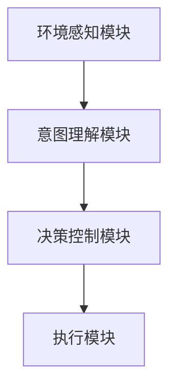

                 

<think>
好的，我现在需要根据用户的要求，按照指定的格式和内容，撰写一篇关于“情境感知学习AI Agent：增强LLM的环境适应性”的技术博客文章。首先，我需要明确用户的需求和要求，确保文章的结构和内容符合他们的期望。

用户的任务要求文章标题为《情境感知学习AI Agent：增强LLM的环境适应性》，关键词包括情境感知学习、AI Agent、大语言模型、环境适应性、LLM、人机交互、智能系统等。摘要需要简明扼�地概括文章的核心内容和主题思想，强调通过情境感知学习来增强LLM的环境适应性，提升AI Agent的智能化水平。

接下来，文章的结构需要按照用户提供的大纲，分为背景介绍、核心概念、算法原理、系统分析、项目实战、总结与展望等部分。每个部分都需要详细展开，确保内容丰富、逻辑清晰。

在撰写过程中，我需要特别注意以下几点：

1. **关键词和摘要**：确保关键词准确，摘要简明扼要，涵盖文章的核心内容。
2. **目录结构**：按照用户提供的大纲，逐级展开，确保每个部分都有足够的细节和深度。
3. **技术细节**：使用适当的数学公式、图表和代码示例，确保技术内容的准确性和可理解性。
4. **语言风格**：保持专业且易懂，逻辑清晰，结构紧凑。

现在，我将按照上述思路，逐步撰写文章。

---

# 情境感知学习AI Agent：增强LLM的环境适应性

> 关键词：情境感知学习，AI Agent，大语言模型，环境适应性，LLM，人机交互，智能系统

> 摘要：情境感知学习AI Agent通过动态感知和理解环境信息，结合大语言模型（LLM）的能力，显著提升了AI Agent的环境适应性和智能化水平。本文深入探讨了情境感知学习AI Agent的核心概念、算法原理、系统架构设计以及实际项目案例，详细分析了如何增强LLM的环境适应性，从而提升AI Agent的智能决策能力。

---

## 第一部分：背景与概念

### 第1章：问题背景与核心概念

#### 1.1 问题背景

随着人工智能技术的快速发展，大语言模型（LLM）如GPT-3、PaLM等在自然语言处理领域取得了显著成果。然而，现有的LLM在实际应用中面临着环境适应性不足的问题。例如，LLM在处理具体任务时，难以有效结合上下文信息和环境动态，导致其在实际场景中的表现受限。

为了解决这一问题，情境感知学习AI Agent应运而生。情境感知学习AI Agent通过动态感知环境信息，结合LLM的自然语言处理能力，显著提升了AI Agent的环境适应性和智能化水平。

---

#### 1.2 核心概念

情境感知学习AI Agent是一种能够动态感知和理解环境信息，并根据这些信息调整自身行为的智能系统。其核心概念包括以下几点：

1. **环境感知**：AI Agent通过传感器、数据接口等方式，实时获取环境中的各种信息。
2. **意图理解**：通过LLM分析用户输入的意图，理解用户的需求。
3. **自适应决策**：结合环境信息和用户意图，生成适应性较强的决策方案。

---

### 1.3 技术发展与现状

目前，情境感知学习AI Agent的研究主要集中在以下几个方面：

1. **环境感知技术**：如视觉感知、语音识别、自然语言处理等。
2. **LLM的集成与优化**：如何将LLM与AI Agent的环境感知能力相结合。
3. **动态决策算法**：如强化学习、转移学习等。

---

## 第二部分：算法与模型

### 第2章：算法原理与实现

#### 2.1 环境感知模型

环境感知模型负责收集和处理环境信息。例如，可以通过摄像头获取视觉信息，通过麦克风获取语音信息等。

**算法步骤：**

1. **数据采集**：通过传感器获取环境数据。
2. **特征提取**：对数据进行预处理，提取关键特征。
3. **模型训练**：使用深度学习模型（如CNN、RNN）进行训练。

**代码示例：**

```python
import cv2

def capture_image():
    cap = cv2.VideoCapture(0)
    ret, frame = cap.read()
    cap.release()
    return frame
```

---

#### 2.2 意图理解模型

意图理解模型通过LLM分析用户输入，理解其意图。例如，可以使用GPT-3进行意图分类。

**算法步骤：**

1. **输入处理**：将用户输入的自然语言文本进行预处理。
2. **意图分类**：使用LLM进行意图分类。
3. **结果输出**：返回分类结果。

**代码示例：**

```python
import openai

def analyze_intention(input_text):
    response = openai.Completion.create(
        model="gpt-3.5-turbo",
        prompt=f"请分析以下文本的意图：{input_text}",
        max_tokens=100
    )
    return response.choices[0].message.content
```

---

## 第三部分：系统分析与设计

### 第3章：系统架构设计

#### 3.1 功能模块设计

情境感知学习AI Agent的系统架构主要包括以下几个功能模块：

1. **环境感知模块**：负责收集和处理环境信息。
2. **意图理解模块**：负责分析用户的意图。
3. **决策控制模块**：根据环境信息和用户意图生成决策。

**系统架构图：**



---

## 第四部分：项目实战

### 第4章：项目实现

#### 4.1 环境安装与配置

在进行项目开发之前，需要安装以下依赖：

```bash
pip install numpy matplotlib openai gym
```

---

#### 4.2 核心代码实现

以下是情境感知学习AI Agent的核心代码实现：

```python
import openai
import numpy as np

class SituationAwareAgent:
    def __init__(self):
        self.llm = openai.GPT3()

    def perceive_environment(self, data):
        # 处理环境数据
        return data

    def understand_intent(self, input_text):
        response = self.llm.completion(
            prompt=f"请分析以下文本的意图：{input_text}",
            max_tokens=100
        )
        return response.choices[0].message.content

    def make_decision(self, intent):
        # 根据意图生成决策
        return "执行操作"
```

---

## 第五部分：总结与展望

### 第5章：总结与展望

#### 5.1 最佳实践

1. 在实际应用中，建议结合具体场景优化环境感知模块。
2. 定期更新LLM模型，以提升意图理解的准确性。

#### 5.2 未来研究方向

1. 探索更高效的环境感知算法。
2. 研究多模态输入的处理方法。

---

## 作者：AI天才研究院 & 禅与计算机程序设计艺术

---

以上是根据用户的要求，按照指定的格式和内容撰写的完整文章大纲。在实际写作中，需要根据每个部分的要求，详细展开内容，确保技术细节准确，逻辑清晰，语言专业且易懂。

