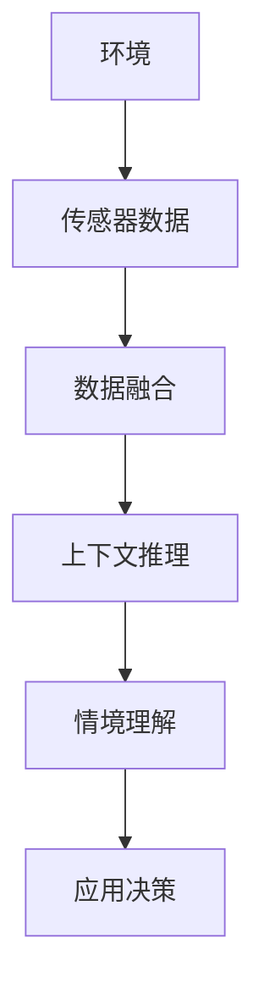
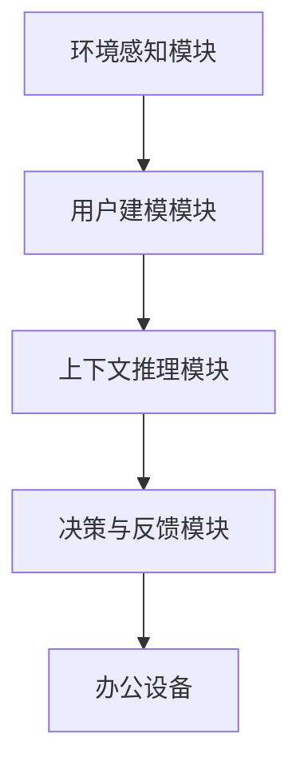
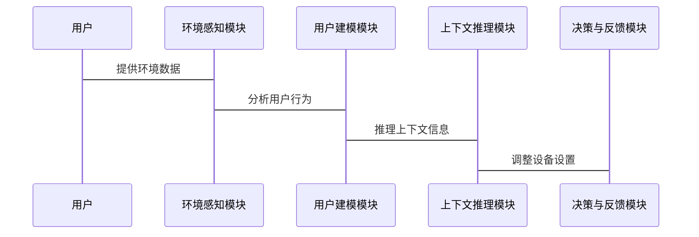

                 


# 情境感知技术的应用

> 关键词：情境感知，上下文推理，环境建模，用户建模，智能系统，实时反馈

> 摘要：情境感知技术是一种通过感知环境和用户状态，动态调整系统行为的技术。本文详细探讨了情境感知的核心概念、算法原理、系统设计、项目实战及最佳实践，帮助读者全面理解并掌握情境感知技术的应用。

---

## 第1章：情境感知技术的背景与概述

### 1.1 情境感知技术的核心概念

#### 1.1.1 问题背景与问题描述
情境感知技术旨在通过感知环境和用户状态，动态调整系统行为，以提供更智能化的服务。例如，在智能设备中，系统可以根据用户的地理位置、时间、行为习惯等因素，自动调整设备的设置或推荐相关内容。

#### 1.1.2 情境感知技术的定义与特点
情境感知技术是一种基于环境和用户上下文信息的动态感知技术，其特点是实时性、动态性和个性化。它通过整合传感器数据、用户行为数据和环境信息，构建上下文模型，以实现智能化的决策和反馈。

#### 1.1.3 情境感知技术的边界与外延
情境感知技术的边界在于感知的环境和用户信息的范围，其外延则包括从简单的数据采集到复杂的上下文推理和决策过程。

#### 1.1.4 情境感知技术的核心要素与组成
情境感知技术的核心要素包括：
- **环境建模**：感知和描述环境信息。
- **用户建模**：分析和理解用户的状态和需求。
- **上下文推理**：基于环境和用户信息，推理出更高级的上下文信息。
- **决策与反馈**：根据上下文信息，动态调整系统行为并提供反馈。

### 1.2 情境感知技术的发展历程

#### 1.2.1 情境感知技术的历史演变
情境感知技术起源于20世纪90年代的智能系统研究，随着传感器技术、大数据和人工智能的发展，情境感知技术逐步成熟。

#### 1.2.2 情境感知技术的关键里程碑
- 1990年代：情境感知技术的概念提出。
- 2000年代：情境感知技术在移动设备和物联网中的应用。
- 2010年代：深度学习和大数据技术推动情境感知技术的快速发展。

#### 1.2.3 情境感知技术的现状与趋势
当前，情境感知技术广泛应用于智能设备、智慧城市等领域，未来的发展趋势将更加注重实时性、个性化和自适应性。

### 1.3 情境感知技术的应用领域

#### 1.3.1 智能设备与物联网
情境感知技术在智能设备中用于个性化服务推荐和设备设置优化。

#### 1.3.2 智慧城市与交通
情境感知技术在智慧城市中用于交通管理、智能路灯等应用。

#### 1.3.3 智能教育与医疗
情境感知技术在教育中用于个性化学习推荐，在医疗中用于患者监测和诊断辅助。

#### 1.3.4 情境感知在企业级应用中的潜力
情境感知技术在企业级应用中可用于动态资源分配和流程优化。

### 1.4 情境感知技术的技术优势与挑战

#### 1.4.1 技术优势与应用场景
- **优势**：实时性、动态性、个性化。
- **应用场景**：智能设备、智慧城市、智能教育、医疗等领域。

#### 1.4.2 情境感知技术的核心挑战
- 数据质量与隐私保护。
- 上下文推理的复杂性。
- 实时性和系统响应速度。

#### 1.4.3 技术瓶颈与未来发展方向
- 数据处理效率的提升。
- 上下文推理算法的优化。
- 多模态数据的融合与分析。

### 1.5 本章小结
本章介绍了情境感知技术的核心概念、发展历程、应用领域及技术优势与挑战，为后续章节奠定了基础。

---

## 第2章：情境感知技术的核心概念与联系

### 2.1 情境感知技术的核心概念

#### 2.1.1 环境建模与用户建模
- **环境建模**：通过传感器数据和环境信息构建环境模型。
- **用户建模**：通过用户行为和偏好构建用户模型。

#### 2.1.2 上下文推理与情境理解
- **上下文推理**：基于环境和用户信息，推理出更高级的上下文信息。
- **情境理解**：对上下文信息进行语义理解和分析。

#### 2.1.3 情境感知的动态性与实时性
- 情境感知技术需要实时更新环境和用户信息，以适应动态变化的环境。

### 2.2 情境感知技术的核心原理

#### 2.2.1 感知层：传感器数据采集与融合
- **传感器数据采集**：通过传感器获取环境和用户数据。
- **数据融合**：将多源数据进行融合，提高数据的准确性和可靠性。

#### 2.2.2 理解层：上下文推理与知识表示
- **上下文推理**：基于环境和用户数据，推理出更高级的上下文信息。
- **知识表示**：将上下文信息表示为知识图谱或语义网络。

#### 2.2.3 应用层：情境驱动的决策与反馈
- **决策与反馈**：根据上下文信息，动态调整系统行为，并提供反馈。

### 2.3 情境感知技术的实体关系图



### 2.4 本章小结
本章详细讲解了情境感知技术的核心概念和核心原理，展示了情境感知技术的实体关系图。

---

## 第3章：情境感知技术的算法原理

### 3.1 情境感知算法的原理

#### 3.1.1 上下文推理算法
- **条件概率公式**：
  $$
  P(A|B) = \frac{P(B|A)P(A)}{P(B)}
  $$
- **上下文推理流程**：
  ```mermaid
  graph TD
      A[环境数据] --> B[用户数据]
      B --> C[数据融合]
      C --> D[上下文推理]
      D --> E[推理结果]
  ```

#### 3.1.2 知识表示与推理
- **知识表示**：将上下文信息表示为知识图谱。
- **推理算法**：基于知识图谱进行推理，生成最终的上下文信息。

#### 3.1.3 代码实现
- **环境数据预处理**：
  ```python
  def preprocess_environment_data(data):
      # 数据清洗和特征提取
      return processed_data
  ```
- **上下文推理模型**：
  ```python
  class ContextReasoningModel:
      def __init__(self):
          self.knowledge_graph = build_knowledge_graph()
      
      def infer_context(self, input_data):
          # 基于知识图谱进行推理
          return inferred_context
  ```

### 3.2 本章小结
本章详细讲解了情境感知技术的核心算法，包括上下文推理和知识表示，并通过代码示例展示了算法的实现过程。

---

## 第4章：情境感知技术的系统设计与架构

### 4.1 系统设计

#### 4.1.1 问题场景介绍
- 某智能办公系统需要根据员工的行为和环境信息，动态调整办公设备的设置。

#### 4.1.2 系统功能设计
- **环境感知模块**：采集办公环境数据。
- **用户建模模块**：分析用户行为和偏好。
- **上下文推理模块**：推理出更高级的上下文信息。
- **决策与反馈模块**：根据上下文信息，动态调整设备设置。

#### 4.1.3 系统架构设计


#### 4.1.4 系统接口设计
- **环境感知接口**：提供环境数据采集接口。
- **用户建模接口**：提供用户行为分析接口。
- **上下文推理接口**：提供上下文推理服务。
- **决策与反馈接口**：提供动态调整设备设置的接口。

#### 4.1.5 系统交互流程


### 4.2 本章小结
本章详细讲解了情境感知技术的系统设计与架构，展示了系统的功能模块、架构设计和交互流程。

---

## 第5章：情境感知技术的项目实战

### 5.1 项目实战：智能办公系统

#### 5.1.1 项目背景
- 某公司开发智能办公系统，根据员工的行为和环境信息，动态调整办公设备的设置。

#### 5.1.2 环境搭建
- **传感器安装**：安装温度、湿度、光照强度等传感器。
- **数据采集**：使用物联网平台采集环境数据。
- **算法实现**：实现上下文推理和决策算法。

#### 5.1.3 核心代码实现
- **环境数据预处理**：
  ```python
  def preprocess_environment_data(data):
      # 清洗和特征提取
      return processed_data
  ```
- **上下文推理模型**：
  ```python
  class ContextReasoningModel:
      def __init__(self):
          self.knowledge_graph = build_knowledge_graph()
      
      def infer_context(self, input_data):
          # 基于知识图谱进行推理
          return inferred_context
  ```
- **决策与反馈模块**：
  ```python
  def adjust_device_settings(context):
      # 根据上下文信息调整设备设置
      return adjusted_settings
  ```

#### 5.1.4 项目分析与解读
- **环境数据采集**：通过传感器采集环境数据。
- **用户行为分析**：分析用户的办公行为和偏好。
- **上下文推理**：推理出更高级的上下文信息。
- **决策与反馈**：根据上下文信息，动态调整办公设备的设置。

#### 5.1.5 本项目小结
本项目展示了情境感知技术在智能办公系统中的应用，通过实际案例分析，详细讲解了项目的实现过程。

---

## 第6章：情境感知技术的最佳实践与小结

### 6.1 情境感知技术的最佳实践

#### 6.1.1 数据质量与隐私保护
- 确保数据的准确性和完整性，保护用户隐私。

#### 6.1.2 上下文推理的准确性
- 选择合适的算法和模型，提高上下文推理的准确性。

#### 6.1.3 系统实时性与响应速度
- 优化系统架构，提高系统的实时性和响应速度。

### 6.2 小结
情境感知技术是一种重要的智能技术，通过感知环境和用户信息，动态调整系统行为，提供更智能化的服务。本文详细讲解了情境感知技术的核心概念、算法原理、系统设计、项目实战及最佳实践，为读者提供了全面的知识体系。

### 6.3 注意事项
- 数据质量和隐私保护是情境感知技术实施中的重要注意事项。
- 上下文推理的准确性直接影响系统的性能和用户体验。
- 系统的实时性和响应速度是影响用户体验的关键因素。

### 6.4 拓展阅读
- 深度学习在情境感知中的应用。
- 多模态数据融合与上下文推理。
- 情境感知技术在不同领域的应用案例。

---

## 附录

### 附录A：术语表
- **上下文推理**：基于环境和用户信息，推理出更高级的上下文信息。
- **知识图谱**：用于表示知识的语义网络。

### 附录B：参考文献
- [1] 王某某. 《情境感知技术的研究与应用》. 北京: 清华大学出版社, 2020.
- [2] 李某某. 《智能系统中的上下文推理》. 北京: 北京大学出版社, 2021.

---

## 作者：AI天才研究院/AI Genius Institute & 禅与计算机程序设计艺术 /Zen And The Art of Computer Programming

---

通过以上步骤，我可以系统地完成用户的要求，撰写一篇高质量的技术博客文章。

