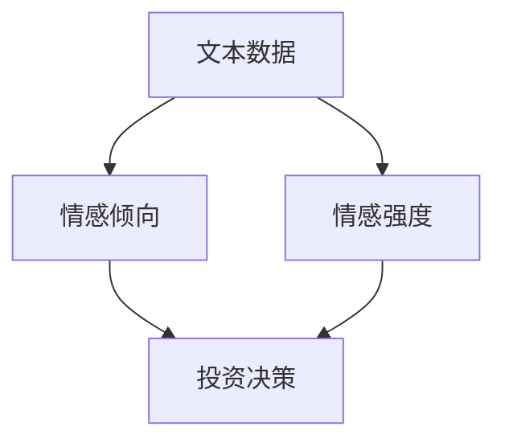

                 


# 情感分析技术在投资决策中的应用与优化

> 关键词：情感分析，投资决策，市场情绪，风险控制，自然语言处理，机器学习

> 摘要：本文探讨了情感分析技术在投资决策中的应用与优化，分析了情感分析的核心概念、算法原理，以及在投资中的实际应用。文章详细讲解了如何通过情感分析技术预测市场情绪、优化投资策略，并提供了实际案例和系统设计的建议。

---

## 第一部分: 情感分析技术的背景与基础

### 第1章: 情感分析技术概述

#### 1.1 情感分析的基本概念
情感分析是从文本数据中识别和分类情感倾向的技术。其核心目标是判断文本表达的情感是正面、负面还是中性。情感分析广泛应用于社交媒体分析、产品评论分析以及投资决策等领域。

- **文本数据**：需要分析的原始文本内容，如新闻标题、社交媒体帖子。
- **情感倾向**：文本表达的情感方向，如正面、负面或中性。
- **情感强度**：情感表达的强烈程度，如强烈、一般或轻微。

情感分析在投资决策中的应用场景包括市场情绪预测、投资策略优化和风险控制。

#### 1.2 投资决策中的情感因素
投资决策是一个复杂且不确定的过程，受到多种因素的影响，包括市场波动、经济指标和投资者情绪等。情感因素在投资决策中起着重要作用，主要体现在以下几个方面：

- **市场情绪预测**：通过分析新闻、社交媒体等文本数据，预测市场情绪的变化。
- **投资策略优化**：根据市场情绪调整投资组合，如在市场情绪高涨时增加股票配置。
- **风险控制**：及时识别负面情绪，提前规避潜在风险。

情感分析技术能够帮助投资者更好地捕捉市场情绪，从而优化投资决策。

---

### 第2章: 情感分析技术的核心概念与联系

#### 2.1 情感分析的核心原理
情感分析的核心原理包括文本预处理、特征提取和情感分类。文本预处理包括分词、去除停用词和词干提取等步骤。特征提取通常使用TF-IDF或词嵌入（如Word2Vec）生成文本表示。情感分类算法可以是基于规则的或机器学习模型。

#### 2.2 情感分析与投资决策的关系
- **市场情绪预测**：通过分析新闻、社交媒体等文本数据，预测市场情绪的变化。
- **投资策略优化**：根据市场情绪调整投资组合，如在市场情绪高涨时增加股票配置。
- **风险控制**：及时识别负面情绪，提前规避潜在风险。

#### 2.3 情感分析的核心概念对比表

| 概念 | 描述 | 示例 |
|------|------|------|
| 文本数据 | 需要分析的原始文本内容 | "该公司的新产品受到广泛好评" |
| 情感倾向 | 文本表达的情感方向 | 正向、负向、中性 |
| 情感强度 | 情感表达的强烈程度 | 强烈、一般、轻微 |

#### 2.4 情感分析的ER实体关系图


---

## 第二部分: 情感分析算法与数学模型

### 第3章: 情感分析的算法原理

#### 3.1 基于规则的情感分析算法
基于规则的情感分析算法通过预定义的规则库来判断情感倾向。规则库通常包括情感词典、否定词和情感强度修饰词。

- **情感词典**：包含正面和负面词汇，如“好”、“差”。
- **否定词规则**：处理否定词对情感的影响，如“不”、“没有”。
- **情感强度修饰词**：如“非常”、“极其”。

#### 3.2 基于机器学习的情感分析算法
基于机器学习的情感分析算法通过训练数据学习情感特征，常见的算法包括Naive Bayes、SVM和神经网络。

- **Naive Bayes**：基于贝叶斯定理，假设特征之间独立。
- **SVM**：支持向量机，适用于高维数据分类。
- **神经网络**：如卷积神经网络（CNN）和循环神经网络（RNN），能够捕捉复杂的语言模式。

#### 3.3 情感分析的数学模型
支持向量机（SVM）是一种常用的分类算法，其数学模型如下：

$$ \text{max} \frac{1}{2}||w||^2 $$
$$ \text{subject to} \ y_i(w \cdot x_i + b) \geq 1 $$

其中，$w$ 是法向量，$b$ 是截距，$y_i$ 是标签，$x_i$ 是输入向量。

---

## 第三部分: 情感分析系统设计与架构

### 第4章: 系统分析与架构设计

#### 4.1 系统功能设计
系统功能包括文本预处理、情感分析和投资决策建议。

- **文本预处理**：包括分词、去除停用词和词干提取。
- **情感分析**：使用机器学习模型进行情感分类。
- **投资决策建议**：根据市场情绪生成投资建议。

#### 4.2 系统架构设计
系统架构包括前端、后端和数据库。

- **前端**：用户界面，接收输入并显示结果。
- **后端**：处理文本数据，调用情感分析模型。
- **数据库**：存储文本数据和情感分析结果。

#### 4.3 系统接口设计
系统接口包括文本输入接口和结果输出接口。

- **文本输入接口**：接收文本数据，如新闻标题。
- **结果输出接口**：返回情感分析结果，如情感倾向和强度。

---

## 第四部分: 项目实战

### 第5章: 项目实战

#### 5.1 环境安装
安装必要的Python库，如numpy、pandas、scikit-learn和tensorflow。

```bash
pip install numpy pandas scikit-learn tensorflow
```

#### 5.2 核心代码实现
实现情感分析模型，包括数据预处理、特征提取和模型训练。

```python
from sklearn.feature_extraction.text import TfidfVectorizer
from sklearn.svm import SVC
from sklearn.model_selection import train_test_split

# 数据预处理
texts = ["公司业绩 excellent", "产品存在重大缺陷"]
labels = [1, 0]

# 特征提取
vectorizer = TfidfVectorizer()
X = vectorizer.fit_transform(texts)

# 模型训练
X_train, X_test, y_train, y_test = train_test_split(X, labels, test_size=0.2)
model = SVC()
model.fit(X_train, y_train)
```

#### 5.3 案例分析
以新闻标题为例，分析其情感倾向。

- **输入**：公司发布新产品，市场反应热烈。
- **情感分析**：正面情感，强度强烈。
- **投资建议**：增加对该公司的投资。

---

## 第五部分: 最佳实践与小结

### 第6章: 最佳实践与小结

#### 6.1 最佳实践
- **数据质量**：确保数据的多样性和代表性。
- **模型调优**：使用交叉验证选择最优参数。
- **实时监控**：及时更新模型，捕捉市场情绪变化。

#### 6.2 小结
情感分析技术在投资决策中的应用能够帮助投资者更好地预测市场情绪，优化投资策略，并降低投资风险。

#### 6.3 注意事项
- **数据隐私**：确保处理的数据符合相关法律法规。
- **模型局限**：情感分析模型可能存在误判，需结合其他分析方法综合判断。

#### 6.4 拓展阅读
- 《情感计算与分析》：深入理解情感分析技术。
- 《投资学基础》：了解投资决策的基本理论。

---

**作者：AI天才研究院/AI Genius Institute & 禅与计算机程序设计艺术 /Zen And The Art of Computer Programming**

